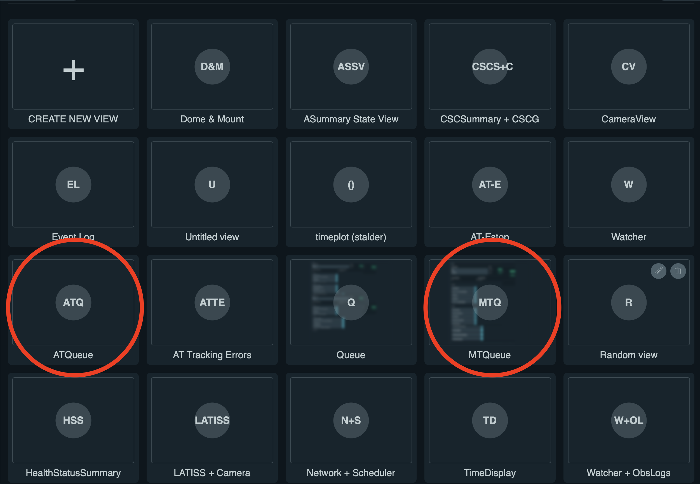
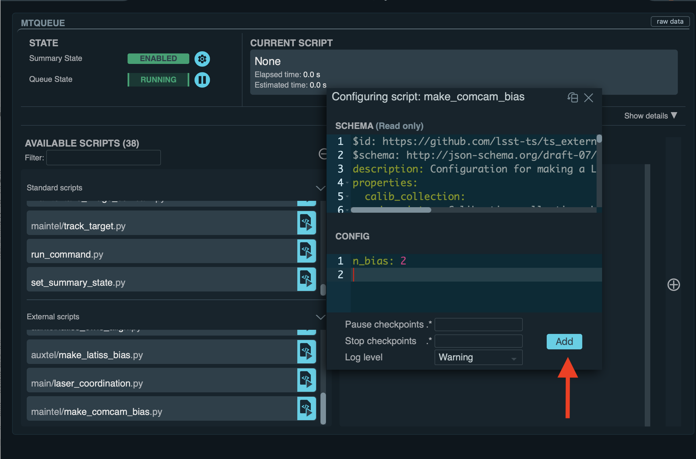

.. |author| replace:: *TDB*
.. If there are no contributors, write "none" between the asterisks. Do not remove the substitution.
.. |contributors| replace:: *none*

.. _AuxTel-Daytime-Operations-Prepare-ATCS-For-Flat-Fields:

############################
Prepare ATCS For Flat Fields
############################

Overview
========

This procedure prepares the telescope and dome to take flat fields, pointing the telescope to the dome flat screen.

.. NOTE::
   Only run the: auxtel/prepare_for/flats.py script if you have sufficient time to vent the telescope afterwards. It will leave the telescope and dome in position to start taking afternoon calibrations. This is telescope az = 205.7 deg. el = 39. deg. dome az = 20.0 deg.

Prerequisites
=============
Be sure you have run previously the following procedure in the :ref:`daytime checkout <AT-Daytime-Checkout-Daytime-Checkout>` in ATQueue-love:

     LOVE interface with the "ATQueue" panel.

     LOVE interface with the **AVAILABLE SCRIPTS** list.

    

Post-Condition
==============
Telescope is ready to :ref:`take calibrations <LATISS-Combined-Calibrations-Procedure-LATISS-Combined-Calibrations-Generation-Procedure>`.

NOTE: make sure M3 is pointing to LATISS on nasmyth 2, mirror cover are is opened and the telescope is in position, as a final check.

Procedure Steps
===============

Using the ``LOVE AT QUEUE``, run the standard script ``auxtel/prepare_for/flat.py``

No configuration is needed.

.. figure:: ../_static/love_prepare_for_flat.png
     :name: my-figure
      
     LOVE interface with the ``auxtel/prepare_for/flat.py`` script.

  

This script performs:

- Turn off ATAOS correction.
- Put mirror back on the hard points.
- Shut off the valves so we can test the pneumatics.
- Open mirror covers and vents. Telescope moves to EL 70 deg. before opening the cover.
- Put ATDomeTrajectory in disabled to prevent it from synchronizing with the telescope motion. 
- Telescope to flat-field position.
- Dome to flat-field position.
- ATDome trajectory in enabled state. 

Make sure M3 is pointing to LATISS on nasmyth 2, mirror cover are is opened and the telescope is in position, as a final check.

* Telescope azimuth flat position = 188.7 deg.
* Telescope elevation flat position = 39.0 deg.
* Dome azimuth flat position = 3.0 deg.

.. figure:: ../_static/love-dome-mount.png
     :name: telescope&dome position

     LOVE interface showing telescope and dome position for flats.

This procedure was last modified on |today|.