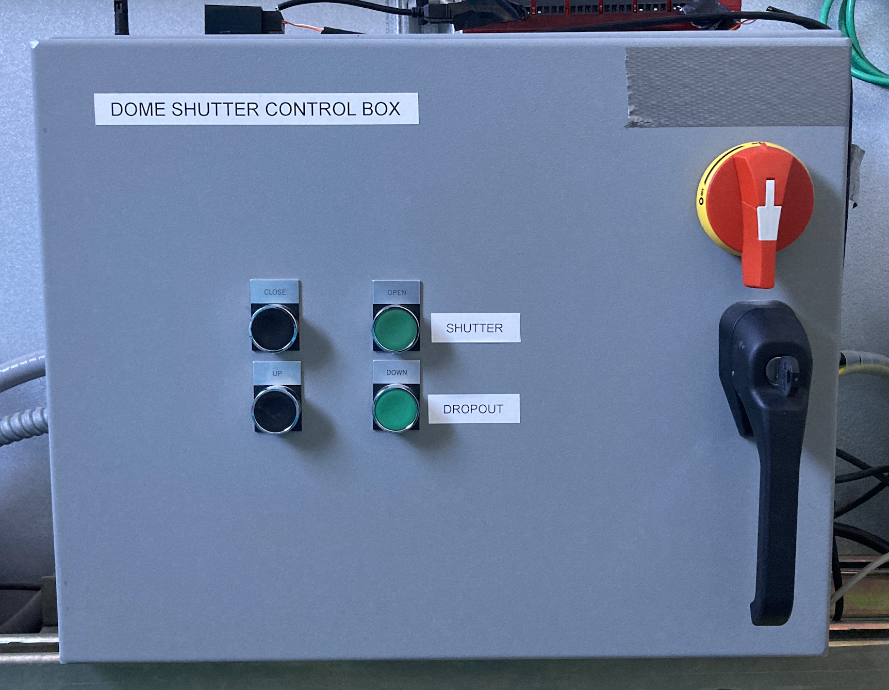
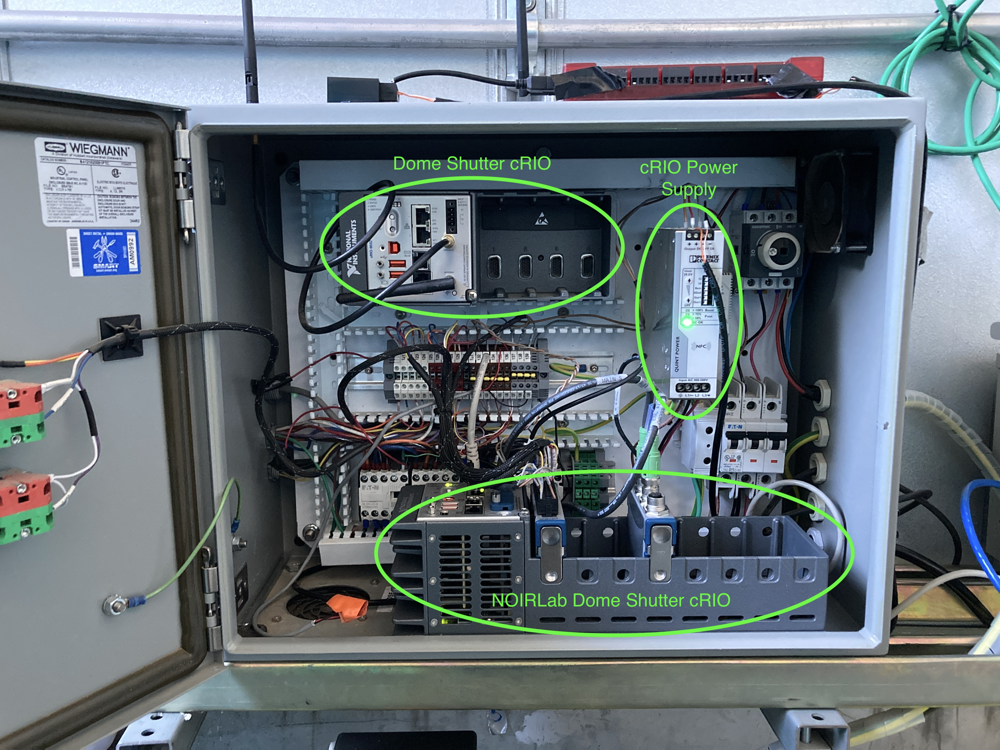

.. This is a template for an informative/general use document. 

.. Review the README in this document's directory on instructions to contribute.
.. Static objects, such as figures, should be stored in the _static directory. Review the _static/README in this procedure's directory on instructions to contribute.
.. Do not remove the comments that describe each section. They are included to provide guidance to contributors.
.. Do not remove other content provided in the templates, such as a section. Instead, comment out the content and include comments to explain the situation. For example:
	- If a section within the template is not needed, comment out the section title and label reference. Include a comment explaining why this is not required.
    - If a file cannot include a title (surrounded by ampersands (#)), comment out the title from the template and include a comment explaining why this is implemented (in addition to applying the ``title`` directive).

.. Include one Primary Author and list of Contributors (comma separated) between the asterisks (*):
.. |author| replace:: *Manuel Gomez*
.. If there are no contributors, write "none" between the asterisks. Do not remove the substitution.
.. |contributors| replace:: *Ioana Sotuela*, *Gonzalo Aravena*

.. This is the label that can be used as for cross referencing this procedure.
.. Recommended format is "Directory Name"-"Title Name"  -- Spaces should be replaced by hyphens.
.. _Cabinet-Content-Diagrams:
.. Each section should includes a label for cross referencing to a given area.
.. Recommended format for all labels is "Title Name"-"Section Name" -- Spaces should be replaced by hyphens.
.. To reference a label that isn't associated with an reST object such as a title or figure, you must include the link an explicit title using the syntax :ref:`link text <label-name>`.
.. An error will alert you of identical labels during the build process.

#########################
Cabinet Content Diagrams
#########################

.. _Cabinet-Content-Diagrams-Overview:

Overview
========

This document contains the diagrams for all the cabinets in the Auxiliary Telescope (AuxTel), as of August 2024.

1st Floor
==========

.. _Cabinet-Content-Diagrams-AT-Control-Cabinet:

AT Main Control Cabinet
-------------------

    
    AT Main Control Cabinet
 

.. figure:: ./_static/IMG_4238.JPG
    :name: ATmain_cabinetIN
    :scale: 20 %
    
    Inner AT Main Control Cabinet

.. _Cabinet-Content-Diagrams-AT-Camera-Electronics-and-Sensor-Readout-Cabinet:

AT Camera Electronics and Sensor Readout Cabinet
-------------------------------------------------

    AT Camera Electronics and Sensor Readout Cabinet

    Inner AT Camera Electronics and Sensor Readout Cabinet

.. _Cabinet-Content-Diagrams-Spectrograph-Power-Switch:

Spectrograph Power Switch
-------------------------

.. figure:: ./_static/PowerSwitch.png
    :name: ATSpectrograph
    :scale: 20 %

    Spectrograph Power Switch Cabinet

    Inner Spectrograph Power Switch Cabinet

.. _Cabinet-Content-Diagrams-Dome-Main-Control-Box:

Dome Main Control Box
---------------------

.. figure:: ./_static/DomeCB.png
    :name: ATDomeCB
    :scale: 20 %

    Dome Main Control Box

    Inner Dome Main Control Box

.. _Cabinet-Content-Diagrams-Dome-VFD:

Dome VFD
--------

    Dome VFD Cabinet

    Inner Dome VFD Cabinet

2nd Floor
==========

.. _Cabinet-Content-Diagrams-Dome-Shutter-Control-Box:

Dome Shutter Control Box
------------------------

    Dome Shutter Control Box

    Inner Dome Shutter Control Box

.. _Cabinet-Content-Diagrams-Illumination-System:

Illumination System
--------------------

.. figure:: ./_static/Illumination.png
    :name: Illumination
    :scale: 25 %

    Illumination System Cabinet

    Inner Illumination System Cabinet

This procedure was last modified on |today|.