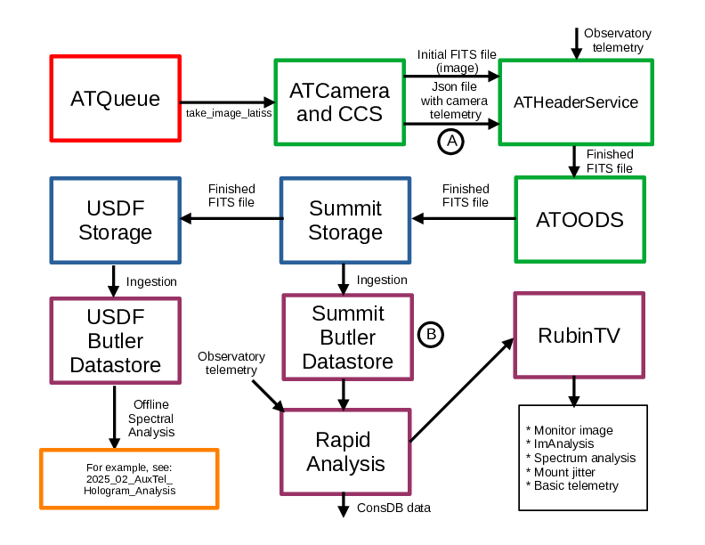

.. This is a template for an informative/general use document. 

.. Review the README in this document's directory on instructions to contribute.
.. Static objects, such as figures, should be stored in the _static directory. Review the _static/README in this procedure's directory on instructions to contribute.
.. Do not remove the comments that describe each section. They are included to provide guidance to contributors.
.. Do not remove other content provided in the templates, such as a section. Instead, comment out the content and include comments to explain the situation. For example:
	- If a section within the template is not needed, comment out the section title and label reference. Include a comment explaining why this is not required.
    - If a file cannot include a title (surrounded by ampersands (#)), comment out the title from the template and include a comment explaining why this is implemented (in addition to applying the ``title`` directive).

.. Include one Primary Author and list of Contributors (comma separated) between the asterisks (*):
.. |author| replace:: *Craig Lage*
.. If there are no contributors, write "none" between the asterisks. Do not remove the substitution.
.. |contributors| replace:: *Ioana Sotuela*, *Gonzalo Aravena*

.. This is the label that can be used as for cross referencing this procedure.
.. Recommended format is "Directory Name"-"Title Name"  -- Spaces should be replaced by hyphens.
.. _AuxTel-Image-Processing:
.. Each section should includes a label for cross referencing to a given area.
.. Recommended format for all labels is "Title Name"-"Section Name" -- Spaces should be replaced by hyphens.
.. To reference a label that isn't associated with an reST object such as a title or figure, you must include the link an explicit title using the syntax :ref:`link text <label-name>`.
.. An error will alert you of identical labels during the build process.

#########################
AuxTel Image Processing
#########################

.. _AuxTel-Image-Processing-Overview:

Overview
========

The image processing of Rubin Observatory images is highly complex.  This document is intended to give a high level
overview for users of the Auxiliary Telescope so they can understand the basic steps and assist with troubleshooting.

Overview of the main image processing steps
=============================================

    
    Block diagram of the image processing steps.

This figure shows the path of images taken by the Auxiliary telescope.  After being commanded by the script queue,
the CCS code under the control of ATCamera takes the requested image.  The CCS code writes a FITS file (which contains the image data)
and a json file which contains the camera related data for the FITS header.  These two files are then passed to
ATHeaderService, which places the data from the json file, as well as observatory data, into the FITS header of the final FITS file.
The ATOODS CSC then places this FITS file in a storage location at the summit.  These FITS files are only stored at the summit
for about 1 month, after which they are deleted.  A separate piece of code also copies this FITS file to a permanent storage
location at USDF (the US Data Facility, in California).  At both locations, these FITS files are "ingested", which means they
are read into a piece of code called the Butler, which makes it possible to quickly access the data you want from the huge amount 
of data that will eventually be stored.

For quick feedback to the summit, a set of Rapid Analysis code performs operations on the images before displaying them in RubinTV.  The most important operation is ISR (Instrument Signature Removal).  This removes deficiencies in the raw image and generates an image that more accurately reflects the sky.  The Monitor image in RubinTV has been thru ISR.  The ISR process is quite complex, and more detail of the ISR is available in this pdf file :download:`pdf  <doc/ISR_Explanation_Eli_July_2024.pdf>`  The Rapid Analysis also performs some quick, very basic analysis of the spectrum which is displayed in RubinTV.  RubinTV also displays mount errors that occur and in the tables it displays the "Mount motion image degradation" in arcseconds.

The team analyzing the AuxTel spectra is in France.  They perform offline analysis of the images.  An example of their analysis is shown in this pdf file :download:`pdf  <doc/2025_02_AuxTel_hologram_analysis.pdf>`

Troubleshooting image analysis problems.
=============================================

There are two ways to check the image processing when problems occur.  At point A in the block diagram, the images
are stored at ``auxtel-fp01.cp.lsst.org:/data/ats/ccs-ipa``.  It is possible to log into auxtel-fp01 and verify that the files are being
written there, as below.  You should see a directory for the current day (like the below 20250401).  In that directory, there should be a directory for each exposure.  If they are not there, that indicates a problem with ATCamera or with CCS.  This is not usually a problem, but if you find the images are not there, contact a camera expert like Tony Johnson or put a note in #auxtel-computing.

::

     ssh <your login>@auxtel-fp01.cp.lsst.org
     cd /data/ats/ccs-ipa
     ls
     cd <20250401>
     ls

A more common problem is that images are failing to ingest.  This can happen for a number of reasons,
like a problem with ATOODS or ATHeaderService, or the ingest code is failing.
RubinTV uses the ingested data, so if the images fail to
ingest at the summit, they will not display in RubinTV.  At point B in the block diagram, we can check whether
the images have been ingested. Below is a code snippet to run on the summit-rsp.
The output will only display ingested images.  If the images have not ingested, contact an expert like Michael Reuter.

To use the summit RSP, do the following:

::

   (1) Access the summit-rsp with Nublado
       (see https://obs-ops.lsst.io/Observing-Interface-Setup/getting-started-nublado.html)
   (2) Create a new jupyter notebook, paste in the snippet below and run it.

::

     import lsst.summit.utils.butlerUtils as butlerUtils
     butler = butlerUtils.makeDefaultButler("LATISS")
     dayObs = 20250319
     exposureList = []
     for record in butler.registry.queryDimensionRecords("exposure", where="exposure.day_obs=%d"%dayObs):
         exposureList.append([record.id, record])
     exposureList.sort(key=lambda x: x[0])
     for [id,record] in exposureList:
         print(f"{record.id}\t{record.observation_type}\t{record.exposure_time}\t{record.physical_filter}")

