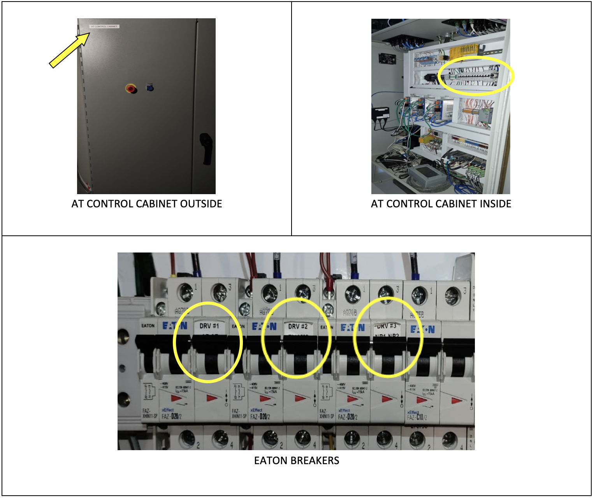

.. This is a template for operational procedures. Each procedure will have its own sub-directory. This comment may be deleted when the template is copied to the destination.

.. Review the README in this procedure's directory on instructions to contribute.
.. Static objects, such as figures, should be stored in the _static directory. Review the _static/README in this procedure's directory on instructions to contribute.
.. Do not remove the comments that describe each section. They are included to provide guidance to contributors.
.. Do not remove other content provided in the templates, such as a section. Instead, comment out the content and include comments to explain the situation. For example:
	- If a section within the template is not needed, comment out the section title and label reference. Include a comment explaining why this is not required.
    - If a file cannot include a title (surrounded by ampersands (#)), comment out the title from the template and include a comment explaining why this is implemented (in addition to applying the ``title`` directive).

.. Include one Primary Author and list of Contributors (comma separated) between the asterisks (*):
.. |author| replace:: *Alysha Shugart*
.. If there are no contributors, write "none" between the asterisks. Do not remove the substitution.
.. |contributors| replace:: *Safety Team*

.. This is the label that can be used as for cross referencing this procedure.
.. Recommended format is "Directory Name"-"Title Name"  -- Spaces should be replaced by hyphens.
.. _Auxiliary-Telescope-AuxTel-LOTO-procedure:
.. Each section should includes a label for cross referencing to a given area.
.. Recommended format for all labels is "Title Name"-"Section Name" -- Spaces should be replaced by hyphens.
.. To reference a label that isn't associated with an reST object such as a title or figure, you must include the link an explicit title using the syntax :ref:`link text <label-name>`.
.. An error will alert you of identical labels during the build process.

#####################
AuxTel LOTO Procedure
#####################

.. _AuxTel-LOTO-procedure-Overview:

Overview
========

.. This section should provide a brief, top-level description of the procedure's purpose and utilization. Consider including the expected user and when the procedure will be performed.

AuxTel must be under LOTO (lock-out tag-out) any time physical work is undertaken on the mount or the dome. 
When working with environmental sensors, on the truss, mirrors, or anywhere in the dome where unexpected movement could cause a safety hazard, the telescope must be locked out. 
Trained summit support staff may use this procedure if they meet all of the precondition requirements. 

.. _AuxTel-LOTO-procedure-Precondition:

Precondition
============

.. This section should provide simple overview of preconditions before executing the procedure; for example, state of equipment, telescope or seeing conditions or notifications prior to execution.
.. It is preferred to include them as a bulleted or enumerated list.
.. If there is a different procedure that is critical before execution, carefully consider if it should be linked within this section or as part of the Procedure section below (or both).

Before putting the AuxTel under LOTO, you must have completed the :ref:`LOTO safety training <Daytime-Operations-Safety-Control-Safety-Systems-LOTO>` 
and familiarized yourself with the Control Safety Systems document on that same page. 
You should have your own unique lock and key with your information identified, and this work must be 
coordinated with the day crew. 

- The telescope must be parked in a safe position, and all CSCs in STANDBY. 

    - If the ATDome is needed while the AuxTel is under LOTO, this must be verified with the safety team and day crew.

    .. warning::
        The ATDome can still be controlled or moved even if this LOTO procedure is complete. 
        The ATDome needs to be locked out separately if any electronics work will be undertaken or work is done on the dome drive.

- The work should be scheduled in the `SUMMIT JIRA calendar <https://jira.lsstcorp.org/secure/DoItBetterCalendar.jspa>`__ and day crew as well as nighttime support should be aware of the plan. 

.. _AuxTel-LOTO-procedure-Post-Condition:

Post-Condition
==============

.. This section should provide a simple overview of conditions or results after executing the procedure; for example, state of equipment or resulting data products.
.. It is preferred to include them as a bulleted or enumerated list.
.. Please provide screenshots of the software status or relevant display windows to confirm.
.. Do not include actions in this section. Any action by the user should be included in the end of the Procedure section below. For example: Do not include "Verify the telescope azimuth is 0 degrees with the appropriate command." Instead, include this statement as the final step of the procedure, and include "Telescope is at 0 degrees." in the Post-condition section.

The drives are powered off and the AuxTel Control cabinet is locked from the outside. 
The AuxTel is under LOTO and is not able to move by any controls.

.. _AuxTel-LOTO-procedure-Procedure-Steps:

Procedure Steps
===============

.. This section should include the procedure. There is no strict formatting or structure required for procedures. It is left to the authors to decide which format and structure is most relevant.
.. In the case of more complicated procedures, more sophisticated methodologies may be appropriate, such as multiple section headings or a list of linked procedures to be performed in the specified order.
.. For highly complicated procedures, consider breaking them into separate procedure. Some options are a high-level procedure with links, separating into smaller procedures or utilizing the reST ``include`` directive <https://docutils.sourceforge.io/docs/ref/rst/directives.html#include>.

To put the AuxTel under LOTO, follow these steps:

#. Post in the Slack channels `#summit-announce <https://lsstc.slack.com/archives/C01P41NUR1R>`__ and `#summit-auxtel <https://lsstc.slack.com/archives/C01K4M6R4AH>`__ that you are going to put AuxTel under LOTO. 

#. Announce your intentions on the radio (channel 3).

#. Verify that no one is working in the dome, on the ground or second floors. 

#. Identify the AT Control cabinet that you need to lock out, shown in the figure. 

    AT Control cabinet, inside, and EATON brakers.

#. Inside the AT Control cabinet, identify the three (3) EATON breakers also shown in the figure, tagged from left to right. 

   a. DRV #1 AZ AZ - The two drives for Azimuth motion.

   b. DRV #2 EL M3 - The drives for elevation and tertiary mirror motion.

   c. DRV #3 NR1 NR2 - Motors for the Nasmyth rotators 1 and 2. 

#. Switch off all three breakers by flipping the switch down. 

#. Close the cabinet, and secure your lock and tag in the loop underneath the cabinet door handle. 

#. Verify that the AuxTel will not move intentionally by sending a command with the Engineering User Interface (EUI) on the machine located on the first floor. 

    Or, simply verify that the EUI screen shows that the telescope E-STOP is engaged as seen in the figure below.

    .. figure:: ./_static/eui-estop-display.png
        :name: eui-estop-display

        The AuxTel EUI shows that the E-STOP is applied. 

#. AuxTel is under LOTO, and work may begin. 

.. _AuxTel-LOTO-procedure-Troubleshooting:

Troubleshooting
===============

.. This section should include troubleshooting information. Information in this section should be strictly related to this procedure.

.. If there is no content for this section, remove the indentation on the following line instead of deleting this sub-section.

No troubleshooting information is applicable to this procedure.
In the IMPOSSIBLE event that the telescope moves after turning off all three breakers, stop work immediately and notify the day crew, including Jacques Sebag, Mario Rivera, and the electronics team. 

This procedure was last modified |today|.
