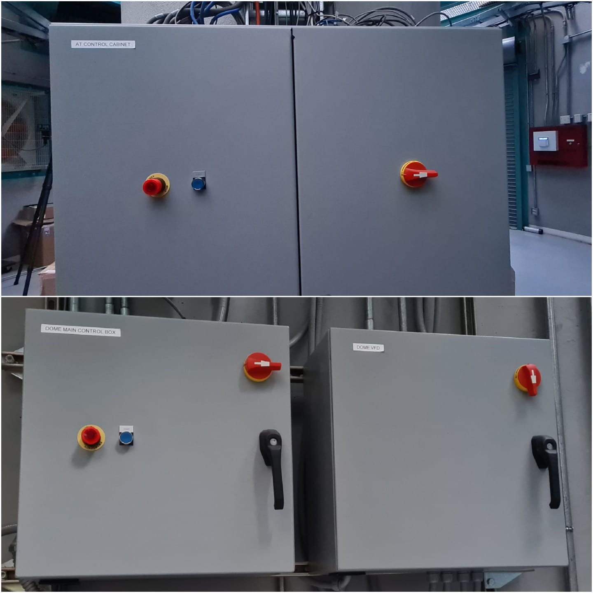
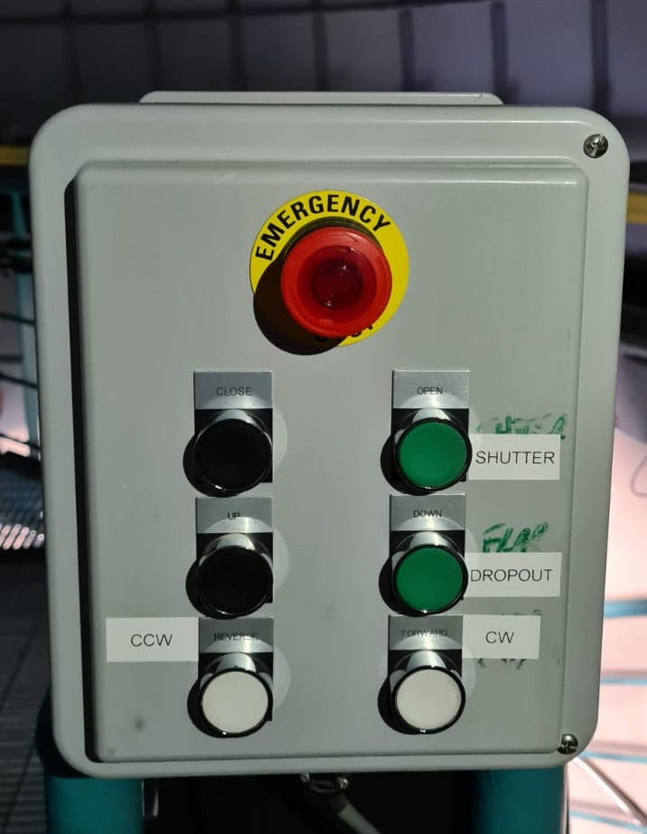
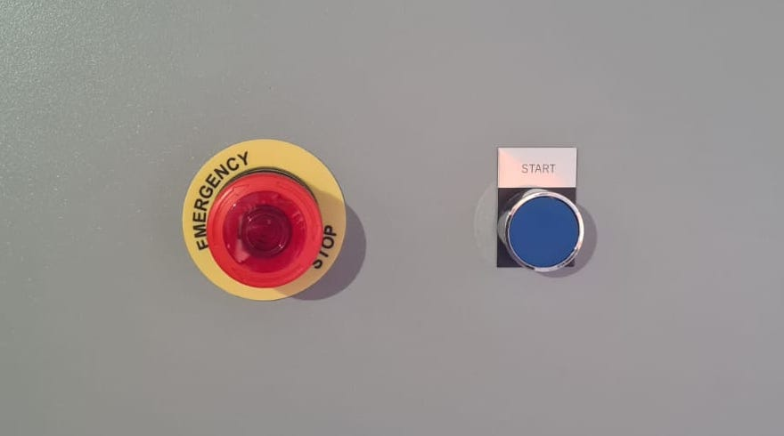
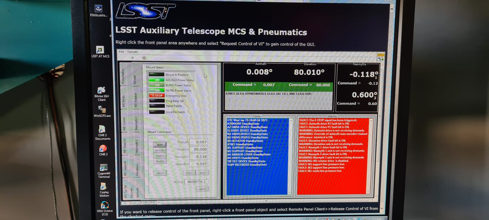
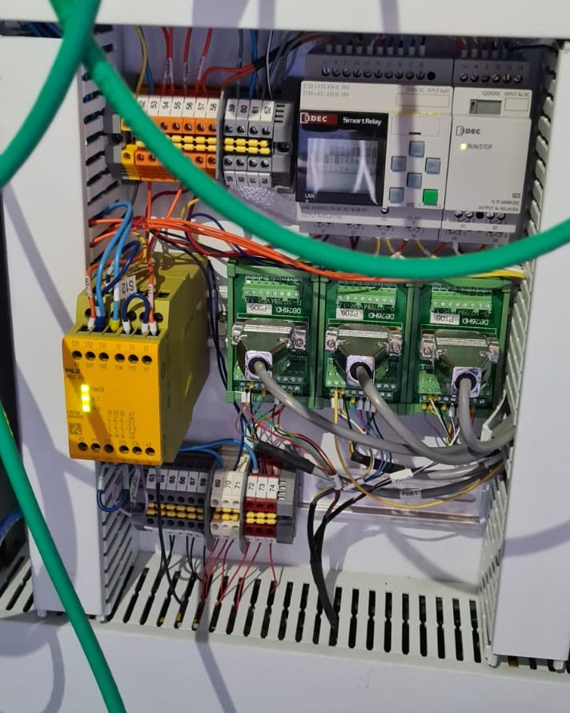

.. |author| replace:: *David Sanmartim*
.. If there are no contributors, write "none" between the asterisks. Do not remove the substitution.
.. |contributors| replace:: *none*

.. _AuxTel-Non-Standard-Procedures-E-Stop-Procedure:

####################
E-Stop Procedure
####################

.. _E-Stop-Procedure-Overview:

Overview
========

The emergency stop procedure plays a crucial role in ensuring the safety of Rubin Observatory. 
It is typically used in emergency situations or as a safety measure. 
It works by cutting off the electrical power to the various components of the telescope, 
including the mount and dome, which stops them from being moved either by software commands or manually.

The emergency stop can be triggered by users in certain circumstances, but it can also be activated automatically in the event of strong earthquakes 
(currently not implemented), as well as in response to safety interlocks and software-based emergencies. 
While the primary objective of the emergency E-stop procedure is to provide a quick and reliable means of halting the movement of the telescope and dome to avoid accidents and injuries, 
it also serves the purpose of safeguarding the system.

Below you will find a brief overview of the emergency stop procedure, covering:

- :ref:`The location of the relevant switches, <E-Stop-Procedure-Where-to-Find-E-stop-Switches>`
- :ref:`How to engage/release the emergency stop, and <E-Stop-Procedure-How-Engage-Disengage-E-stop-System>`
- :ref:`How to determine its current status <E-Stop-Procedure-Verifying-Status-E-stop-System>`.
  

.. _E-Stop-Procedure-Where-to-Find-E-stop-Switches:

Where to Find the E-stop Switches
=================================

The emergency stop system in the Auxiliary Telescope can be triggered from three different locations. 
One is located in the main ``AT Control Cabinet`` on the first floor just in from of the working desktops. 
A second one is located in the ``Dome Control Box`` between vent gates #3 and #4, also in the first floor. 
Both systems can be used to either engage and/or disengage the emergency stop.

    The E-stop systems located in the first floor.

Additionally, a third emergency stop button is available upstairs in the control box used for manual movement of the dome components, 
as illustrated in the accompanying figure. 
It is worth noting, however, that this control box can only be used to initiate the emergency stop and cannot be used to release it, 
as it does not have a ``Start`` button on it.

    E-stop switches located upstairs.

In the future, a physical emergency stop button will also be added to the Control Room. 
For now, the emergency E-stop system available there will only work for the main telescope components.
The only way to activate the E-stop system for the Auxiliary Telescope is by doing it physically on site itself.

.. note:: 
    The system is smart enough to allow an independent operation, meaning that you can disengage the emergency stop from any location, 
    regardless of where it was initially triggered. 
    When the emergency stop is activated, it will cut power to the telescope and dome drives, 
    but it will not affect the functionality of instruments, communication, and calibration systems. 
    It means you can continue taking images (e.g. LATISS + Calibration System) even if the emergency stop system has been activated.

.. _E-Stop-Procedure-How-Engage-Disengage-E-stop-System:

How to Engage/Disengage the E-stop System
=========================================

**Engaging** the emergency stop system is a straightforward process that is both efficient and reliable. 
To trigger it, simply **push the big red button**. 
This will be enough to stop halt the telescope and avoid it from accidental/unexpected movements.
To **release it**, simply **turn** the big red E-stop button **clockwise** a quarter or so and then **push the blue Start** button.

    ``Emergency Stop`` and ``Start`` buttons.

.. _E-Stop-Procedure-Verifying-Status-E-stop-System:

Verifying the Status of the E-stop System 
=========================================

In order to **verify** that the emergency stop system was properly engaged, you just have to look at the computer located on the first floor of the AuxTel building. 
If the emergency stop was correctly triggered, you will see under the Mount status tab that its indicator will light up red, as depicted in the accompanying figure. 
Conversely, when the emergency stop is released, the red light will be turned off, indicating that the system has been successfully restarted.
From that point onwards, the telescope will be released to move, either local or remotely, meaning it is ready for normal operation.

    E-stop status indicator. If a red light is turned on in the ``Emergency Stop`` indicator,
    the E-stop has been activated correctly.

    The Pilz controller inside the ``AT Control Cabinet`` located in the first floor. 
    If the E-stop was properly deactivated, all three lights will be brightly illuminated.

If you open the ``AT Control Cabinet``, you may see what is shown in the figure above. 
The three LEDs brightly illuminated are indicating that the E-stop system is released and that the AuxTel telescope can be moved.

.. important:: 
    In case of failures, you should contact an electronics technician to recover the E-stop system. Do not try to fix it by yourself.

.. _E-Stop-Procedure-Contact-Personnel:

Contact Personnel
=================

This procedure was last modified |today|.