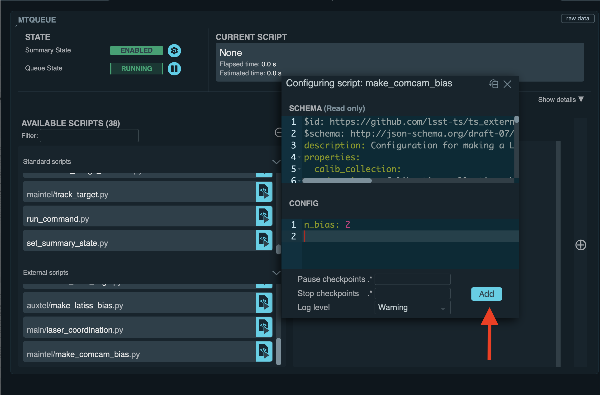

.. |author| replace:: *Andrés A. Plazas Malagón*
.. If there are no contributors, write "none" between the asterisks. Do not remove the substitution.
.. |contributors| replace:: *none*

.. _AuxTel-Daytime-Operations-LATISS-Combined-Calibrations-Generation-Procedure:

#################################################
LATISS Combined Calibrations Generation Procedure
#################################################

.. _Latiss-Combined-Calibrations-Procedure-Overview:

Overview
========

This page assumes the reader is familiar with the content explained in the Daytime Calibrations section: 

- :ref:`Introduction to the combined calibrations generation procedure <Introduction-Combined-Calibrations-Generation-index>` 

.. _Latiss-Combined-Calibrations-Procedure-Post-Conditions:

Post-Condition
==============

- Individual calibration images will be taken and verified using the `cp_verify`_ framework.
- If ``generate_calibrations`` is ``True``, a (daily) combined calibration image per detector will be certified in a `butler`_ ``CALIBRATION`` `collection`_.

.. _cp_verify: https://github.com/lsst/cp_verify
.. _butler: https://pipelines.lsst.io/v/daily/modules/lsst.daf.butler/index.html
.. _collection: https://pipelines.lsst.io/v/daily/modules/lsst.daf.butler/organizing.html

.. _Latiss-Combined-Calibrations-Procedure-Steps:

Procedure Steps
===============

Once you are logged into LOVE, click on the ``ATQueue`` panel, as circled on the left side of the figure below (for reference, ``MTQueue`` to launch ``LSSTComCam`` scripts is circled on the right):

.. figure:: ./_static/love-mtqueue-atqueue-panel.png
    :name: ATQueue-love

    Screenshot of LOVE interface with the ``ATQueue`` panel.

Load the Script
---------------

After clicking on the ``ATQueue`` panel, search for the script ``auxtel/make_latiss_calibrations.py`` under ``AVAILABLE SCRIPTS`` on the left, as shown in the figure below:

    Screenshot of LOVE interface with the ``AVAILABLE SCRIPTS`` list.
      
Load the script by clicking on the button in front of the name of the script that has a triangle.

Enter configuration parameters
------------------------------

After loading the script, a window that contains two sections, ``SCHEMA`` (top) and ``CONFIG`` (bottom), will appear.
The former will show the available configuration options (and the default values of some of them) that should be entered in the latter. The configuration options are as follows:

- ``script_mode``: Currently, the script can be run  in three modes, in which  it  will  produce only biases (``BIAS``), biases and darks (``BIAS_DARK``), or biases, darks, and flats (``BIAS_DARK_FLAT``).
  Default: ``BIAS_DARK_FLAT``
- ``n_bias``: Number of biases to take.
  Default: ``20``.
- ``n_discard_bias``: Additional number of bias images to take and discard before starting the sequence.
  Default: ``1``.
- ``n_dark``: Number of darks to take.
  Default: ``22``.
- ``n_discard_dark``: Additional number of dark images to take and discard before starting the sequence.
  Default: ``1``.
- ``exp_times_dark``: The exposure time of each dark image (sec). If a single value, then the same exposure time is used for each exposure.  This default set of exposure times allows for one discarded dark plus four darks to use at 5s (to match with the previous defaults), two darks at 15s (to allow the linearity of the dark signal to be monitored), and sixteen darks at 30s (to provide darks that directly match the default observation exposure time).
  Default: ``[5, 5, 5, 5, 5, 15, 15, 30, 30, 30, 30, 30, 30, 30, 30, 30, 30, 30, 30, 30, 30, 30, 30]``.
- ``n_flat``:  Number of flats to take.
  Default: ``20``.
- ``n_discard_flat``: Additional number of flat images to take and discard before starting the sequence.
  Default: ``1``.
- ``exp_times_flat``: The exposure time of each flat image (sec). If a single value, then the same exposure time is used for each exposure. If ``do_ptc`` is ``True``, the exposure times should form an adecuate secuence of flat pairs, each pair with the same exposure time. If ``do_gain_from_flat_pairs`` is ``True``, at least two flats with the same exposure time should be taken.
  Default: ``5``.
- ``filter``: Filter name or ID; if omitted the filter is not changed.
  Default: ``null``.
- ``grating``: Grating name; if omitted the grating is not changed.
  Default: ``null``.
- ``detectors``: Detector IDs that will be pased to the pipeline tasks, given as an array of integers, e.g., ``[0,1,2,3]``. The default value is an empty array, which will translate in using all the detectors (a single detector for LATISS).
  Default: ``[]``
- ``do_verify``: Should the combined calibrations be verified? (c.f., ``cp_verify``).
  Default:  ``True``.
- ``generate_calibrations``: Should the combined calibrations be generated from the images taken and used as references for image verification? ("internal verification"). If ``False`` and and ``do_verify`` is ``True``, pre-existing calibrations will be used as reference for verification ("external verification"), and they should be provided in the input collections for the verification pipetasks.
  Default: ``False``.
- ``config_options_bias``: Options to be passed to the command-line bias pipetask. They will overwrite the values in ``cpBias.yaml``.
  Default: ``-c isr:doDefect=False``.
- ``config_options_dark``: Options to be passed to the command-line dark pipetask. They will overwrite the values in ``cpDark.yaml``.
  Default: ``-c isr:doDefect=False``.
- ``config_options_flat``: Options to be passed to the command-line flat pipetask. They will overwrite the values in ``cpFlat.yaml``.
  Default: ``-c isr:doDefect=False``.
- ``do_defects``: Should defects be built using darks and flats?. ``script_mode`` must be ``BIAS_DARK_FLAT``.
  Default: ``False``
- ``config_options_defects``: Options to be passed to the command-line defects pipetask. They will overwrite the values in ``findDefects.yaml``.
  Default: ``-c isr:doDefect=False``.
- ``do_ptc``: Should a Photon Transfer Curve be constructed from the flats taken? ``script_mode`` must be ``BIAS_DARK_FLAT``.
  Default: ``False``.
- ``config_options_ptc``: Options to be passed to the command-line PTC pipetask. They will overwrite the values in ``cpPtc.yaml``.
  Default: ``-c isr:doCrosstalk=False``.
- ``do_gain_from_flat_pairs``: Should the gain be estimated from each pair of flats taken at the same exposure time? Runs the ``cpPtc.yaml#generateGainFromFlatPair`` pipeline. Since this pipeline is a subset of the PTC pipeline, you can use use the ``config_options_ptc`` parameter to pass options to the ``ISR`` (Instrument Signature Removal) and ``cpExtract`` tasks which form this pipeline.
  If ``True``, the script mode should be ``BIAS_DARK_FLAT``.
  Default: ``True``.
- ``input_collections_bias``: List of additional (the ``OCPS`` already adds ``LATISS/raw/all`` as a default) comma-separated input collections for the bias pipetask. The pipetask is called via the ``OCPS`` after enabling it with the ``LATISS`` configuration.
  Default: ``LATISS/calib``.
- ``input_collections_verify_bias``: Additional comma-separated input collections to pass to the verify (bias) pipetask.
  Default: ``LATISS/calib``.
- ``input_collections_dark``: Additional comma-separarted input collections to pass to the dark pipetask.
  Default: ``LATISS/calib``.
- ``input_collections_verify_dark``: Additional comma-separated input collections to pass to the verify (dark) pipetask.
  Default: ``LATISS/calib``.
- ``input_collections_flat``: Additional comma-separated input collections to pass to the flat pipetask.
  Default: ``LATISS/calib``.
- ``input_collections_verify_flat``: Additional comma-separated input collections to pass to the verify (flat) pipetask.
  Default: ``LATISS/calib``.
- ``input_collections_defects``: Additional comma-separated input collections to pass to the defects pipetask.
  Default: ``LATISS/calib``.
- ``input_collections_ptc``: Additional comma-separated input collections to pass to the Photon Transfer Curve pipetask.
  Default: ``LATISS/calib``.
- ``calib_collection``: ``CALIBRATION`` collection where the calibrations will be certified into, for example, ``LATISS/calib/u/plazas/YYYYMMMDD.test`` or ``LATISS/calib/daily``.
  Default: ``LATISS/calib/daily``.
- ``repo``: Butler repository.
  Default: ``/repo/LATISS``.
- ``n_processes``: Number of processes that the pipetasks will use.
  Default: ``8``.
- ``certify_calib_begin_date``: The beginning date for the validity range of the certified calibration, for example, ``2021-07-15``.
  Default: ``1950-01-01``.
- ``certify_calib_end_date``: The end date for the validity range of the certified calibration, for example, ``2021-07-16``.
  Default: ``2050-01-01``.
- ``oods_timeout``: Timeout value, in seconds, for the Observatory Operations Data Service (``OODS``).
  Default: ``120``.

Configuration examples
----------------------

Daily Default
^^^^^^^^^^^^^

**Preferred daily script mode to be run**: if no configuration parameters are passed to LOVE and the default parameters are used, the script will take 21 biases, 23 darks at 5 seconds (5 exposures), 15 seconds (2 exposures), and 30 seconds (16 exposures), and finally 21 flats of 5 seconds each one.
In each case, the first image will be discarded. New combined calibrations will not be generated, and verification of the images taken will be performed using the existing combined calibrations in the ``LATISS/calib`` collection (i.e., the script will do ``external verification``).
In this case, no defects will be made.
Following DMTN-222, a gain estimate will be produced from each of the 10 flat pairs taken.
**Users should adjust parameters when needed, for example, the exposure times or the number of exposures taken**.

If the exposure times need to change, it can be done as follows:

.. code-block:: yaml
    
    exp_times_dark: 20
    exp_times_flats: 30

Changing the exposure times and the number of exposures
^^^^^^^^^^^^^^^^^^^^^^^^^^^^^^^^^^^^^^^^^^^^^^^^^^^^^^^

If both the number of exposures and exposure times need to change, it can be done like this:

.. code-block:: yaml

    n_bias: 30
    n_dark: 5
    exp_times_dark: [5, 10, 15, 20, 25]
    n_flat: 10
    exp_times_flat: [5, 10, 15, 20, 25, 30, 35, 40, 45, 50]

Example of a configuration file for ``internal_verification``.
^^^^^^^^^^^^^^^^^^^^^^^^^^^^^^^^^^^^^^^^^^^^^^^^^^^^^^^^^^^^^^

Note that the newly-generated combined calibrations
will be certified in the ``calib_collection`` collection, so this parameter must be specified, and new validity ranges should be provided (spanning one day for daily calibrations).
The name of the collection needs to be changed if the script needs to be run again (or the validity range), as it is not possible to certify the same type of calibration in the same collection with the same validity range:

.. code-block:: yaml

    generate_calibrations: True
    calibration_collection: LATISS/calib/daily/calib.2022NOV04.1
    certify_calib_begin_date: "2022-11-04"
    certify_calib_begin_date: "2022-11-05"

Including a Photon Transfer Curve (PTC)
^^^^^^^^^^^^^^^^^^^^^^^^^^^^^^^^^^^^^^^

In the following example, a new set of calibrations is generated, including a PTC (note that the exposure times need to be given by pairs and the total length must correspond to ``n_flat``) and defects.
If the individual images taken pass verification using as reference the newly generated combined bias, dark, and flat, the combined calibrations will be certified in the ``calib_collection`` collection with the validity range given by ``certify_calib_begin_date`` and ``certify_calib_end_date``.
There is the option to take flats with a particular filter and grating (the appropiate names/ID should be replaced in ``${FILTER_NAME_OR_ID}`` and ``${GRATING_NAME_OR_ID}`` below):

.. code-block:: yaml

    script_mode: BIAS_DARK_FLAT
    n_flat: 14
    exp_times_flat: [5, 5, 10, 10, 15, 15, 20, 20, 25, 25, 30, 30, 35, 35]
    filter: ${FILTER_NAME_OR_ID}
    grating: ${GRATING_NAME_OR_ID}
    generate_calibrations=True
    calib_collection: "LATISS/calib/daily/calibs.2022NOV04.1"
    certify_calib_begin_date: "2022-11-04"
    certify_calib_end_date: "2022-11-05"
    do_defects: True
    do_ptc: True

Another example including PTC and defects generation
^^^^^^^^^^^^^^^^^^^^^^^^^^^^^^^^^^^^^^^^^^^^^^^^^^^^

Another example set of configuration parameters is as follows:

.. code-block:: yaml

    n_bias: 6
    n_dark: 6
    exp_times_dark: [5, 5, 5, 10, 15, 20]
    n_flat: 14
    exp_times_flat: [0.1, 0.1, 0.35, 0.35, 0.6, 0.6, 0.8, 0.8, 1.0, 1.0, 1.35, 1.35, 1.6, 1.6]
    calib_collection: "LATISS/calib/u/plazas/daily.2021SEP13.test1"
    do_verify: True
    input_collections_verify_bias: "u/czw/DM-28920/calib.20210720,LATISS/calib"
    input_collections_verify_dark: "u/czw/DM-28920/calib.20210720,LATISS/calib"
    input_collections_verify_flat: "u/czw/DM-28920/calib.20210720,LATISS/calib"
    certify_calib_begin_date: "2021-07-15"
    certify_calib_end_date: "2021-07-17"
    script_mode: BIAS_DARK_FLAT
    do_defects: True
    do_ptc: True

Notes:

- The ``detectors`` parameters was omitted, therefore, by default, the single LATISS detector will be passed to the LSST Science Pipelines pipetasks. 
- The ``generate_calibrations`` parameters was omitted, and therefore combined calibrations will not be generated from the individual images taken (biases, darks, and flats since ``script_mode`` is ``BIAS_DARK_FLAT``), as its default value is ``False``. Pipetasks that require combined calibrations to run will search for them in their input collections. For example, since ``do_verify`` is ``True``, the bias, dark, and flat verification tasks will look for combined reference calibrations in their input collections, given by the ``input_collections_verify_bias``, ``input_collections_verify_dark``, and ``input_collections_verify_flat`` parameters. Since the collection ``u/czw/DM-28920/calib.20210720`` is located before the standard collection ``LATISS/calib`` in these parameters, the verification tasks will look there first. On the other hand, since ``do_ptc`` is ``True`` and ``input_collections_ptc`` is omitted, the PTC task will look for combined calibrations (e.g., bias, dark) in the standard calibration collection ``LATISS/calib``, which is the default for this parameter.
- Sometimes running the PTC can take a long time. In order to obtain a quick estimation for the gain (and monitor, for example, its stability with time), the parameter ``do_gain_from_flat_pairs`` can be set to ``True``. In that case, only one pair of flats is required, so the parameter ``exp_times_flat`` could be set to, e.g., ``[1.2, 1.2]``. However, the task will estimate a gain for every flat pair that has been taken (``LOVE`` will report the values per exposure pair per detector per amplifier). For example, if ``exp_times_flat`` is  ``[0.1, 0.1, 0.35, 0.35, 0.6, 0.6, 1, 1.5, 1.7, 2.1, 2.3]``, gains will be estimated from the first three flat pairs.
- See `DMTN-222`_ for a discussion on calibration generation, verification, acceptance, and certfication, including suggested naming conventions for parameters such as ``calib_collection``.

.. _DMTN-222: https://dmtn-222.lsst.io/

Launch the script
-----------------

When the configuration options have been entered and the script is ready to be launched, click on the ``ADD`` button in the lower right of the screen (refer to image above).

Accessing the calibrations
--------------------------

If ``generate_calibrations`` is ``True``, the certified combined calibrations will be available via the collection specified by the **calib_collection** parameter.
They could be retrieved from a notebook for manipulation and visualization:

.. code-block:: python
    
    import lsst.daf.butler as dB

    butler = dB.Butler("/repo/LATISS", collections=["LATISS/calib/daily.2021SEP13.test1"])
    detector = 0
    exposure = [bias1ID, bias2ID] # e.g., [2021071500001, 2021071500002]
    
    # For detector "0":
    bias = butler.get('bias', detector=detector, exposure=exposure[0], instrument='LATISS')
    dark = butler.get('dark', detector=detector, exposure=exposure[0], instrument='LATISS')
    flat = butler.get('flat', detector=detector, exposure=exposure[0], instrument='LATISS')
    defects = butler.get('defects', detector=detector, exposure=exposure[0], instrument='LATISS')
    ptc = butler.get('ptc', detector=detector, exposure=exposure[0], instrument='LATISS')

If ``do_gain_from_flat_pair`` is ``True``, the estimated gains (as well as the measured empirical readout noise from the overscan during Instrument Signature Removal) can be found by requesting the ``cpPtcExtract`` data structure.
In this case, the exposure ID should be one of the two flats used to estimate the gain:

.. code-block:: python

    cpCovs = butler.get('cpPtcExtract', detector=detector[0], exposure=flat1ID, instrument='LATISS')
    gain_values = cpCov.gain
    noise_values = cpCov.noise

The gain estimated in this way (from single pairs of flats) is an approximation that is likely to be more accurate at lower fluxes.
This method has the advantage that it allows to obtain a quick estimate of the gain without having to take multiple flat pairs to construct a full PTC and to fit a model to it.

In addition, the statistics produced by the verification step can be analized by running the Jupyter notebooks in the ``examples`` folder in ``cp_verify``.
As it is shown in these notebooks, useful statistics and information about the results of the ``cp_verify`` tests can be retrieved from the butler via (using flat verification as an example):

.. code-block:: python

    runStats = butler.get('verifyFlatStats', instrument='LATISS')
    runDetStats = butler.get('verifyFlatDetStats', instrument='LATISS', detector=0, exposure=flatExposureID)

The images processed by ``cp_verify`` can also be retrieved for visual inspection:

.. code-block:: python

    import lsst.afw.display as afwDisplay
    afwDisplay.setDefaultBackend("matplotlib")

    imProc = butler.get('verifyFlatProc', detector=0, exposure=flatExposureID, instrument='LATISS')
    calibArray = imProc.getImage().getArray()
    # Get simple stats
    q25, q50, q75 = np.percentile(calibArray.flatten(), [25, 50, 75])
    sigma = 0.74 * (q75 - q25)
    display = afwDisplay.Display(dims=(1000, 1000))
    display.scale('asinh', 'zscale')
    display.scale('linear', (q50 - 3.0 * sigma), (q50 + 3.0* sigma), "")
    display.mtv(imProc)

DMTN-222 recomends taking 20 individual images for each calibration type.
The following example failed verification because only 3 images of each type were taken:

.. code-block:: yaml
    
    script_mode: BIAS_DARK
    n_bias: 3
    n_dark: 3
    exp_times_dark: 15 
    calib_collection: "LATISS/calib/u/plazas/daily.2022SEP29.2"  
    generate_calibrations: True 
    do_verify: True 
    certify_calib_begin_date: "1980-01-01" 
    certify_calib_end_date: "2051-12-31" 

This failed verification, in particular, the ``NOISE`` test, likely because of using only 3 images to build the combined images.
The script, at the end, printed in the LOVE output interface:

.. code-block:: yaml
   
    BIAS calibration failed verification and will not be certified.

Because we are generating combined calibrations, and because we need a certified bias to make a combined dark, the script stopped at this point, as we can't continue.
In addition, the script issued a ``WARNING`` in the ``LOVE`` interface. The warning tells us the exposures that have tests that failed, the tests which failed, and the amps with tests that failed, per exposure and test type. In the end, we also get the generation and verification collection.
All this information is useful to follow up: look at the images, make plots and tables in a notebook (using copies of the notebooks that can be currently found in the ``examples`` of ``cp_verify``), etc.
The observer or user will find this info in LOVE as the script runs.
The warning, in this case, is as follows:

.. code-block:: yaml
    
    Script WARNING: Exposures with verification tests that failed:
        2022092900001  2022092900002  2022092900003  
        Number of tests that failed per test type:
            Exposure ID: 2022092900001
                 CR_NOISE: 8
                 NOISE: 16
                 MEAN: 5
            Exposure ID: 2022092900002
                 NOISE: 16
                 CR_NOISE: 1
            Exposure ID: 2022092900003
                 NOISE: 16
                 CR_NOISE: 1
        Test types that failed verification per exposure,
        detector, and amplifier:
            Exposure ID: 2022092900001
                RXX_S00 C00 CR_NOISE
                RXX_S00 C00 NOISE
                RXX_S00 C01 CR_NOISE
                RXX_S00 C01 MEAN
                RXX_S00 C01 NOISE
                RXX_S00 C02 NOISE
                RXX_S00 C03 NOISE
                RXX_S00 C04 CR_NOISE
                RXX_S00 C04 MEAN
                RXX_S00 C04 NOISE
                RXX_S00 C05 CR_NOISE
                RXX_S00 C05 MEAN
                RXX_S00 C05 NOISE
                RXX_S00 C06 NOISE
                RXX_S00 C07 NOISE
                RXX_S00 C10 CR_NOISE
                RXX_S00 C10 NOISE
                RXX_S00 C11 CR_NOISE
                RXX_S00 C11 MEAN
                RXX_S00 C11 NOISE
                RXX_S00 C12 NOISE
                RXX_S00 C13 NOISE
                RXX_S00 C14 CR_NOISE
                RXX_S00 C14 NOISE
                RXX_S00 C15 CR_NOISE
                RXX_S00 C15 MEAN
                RXX_S00 C15 NOISE
                RXX_S00 C16 NOISE
                RXX_S00 C17 NOISE
            Exposure ID: 2022092900002
                RXX_S00 C00 NOISE
                RXX_S00 C01 NOISE
                RXX_S00 C02 NOISE
                RXX_S00 C03 NOISE
                RXX_S00 C04 NOISE
                RXX_S00 C05 CR_NOISE
                RXX_S00 C05 NOISE
                RXX_S00 C06 NOISE
                RXX_S00 C07 NOISE
                RXX_S00 C10 NOISE
                RXX_S00 C11 NOISE
                RXX_S00 C12 NOISE
                RXX_S00 C13 NOISE
                RXX_S00 C14 NOISE
                RXX_S00 C15 NOISE
                RXX_S00 C16 NOISE
                RXX_S00 C17 NOISE
            Exposure ID: 2022092900003
                RXX_S00 C00 NOISE
                RXX_S00 C01 NOISE
                RXX_S00 C02 NOISE
                RXX_S00 C03 NOISE
                RXX_S00 C04 NOISE
                RXX_S00 C05 CR_NOISE
                RXX_S00 C05 NOISE
                RXX_S00 C06 NOISE
                RXX_S00 C07 NOISE
                RXX_S00 C10 NOISE
                RXX_S00 C11 NOISE
                RXX_S00 C12 NOISE
                RXX_S00 C13 NOISE
                RXX_S00 C14 NOISE
                RXX_S00 C15 NOISE
                RXX_S00 C16 NOISE
                RXX_S00 C17 NOISE
           Threshold values:
               Acceptable maximum number of failures per detector per test type: 8
               This value is controlled by the configuration parameter: 'number_verification_tests_threshold_<IMGTYPE>'
               Acceptable maximum number of failed detectors: 1
               Acceptable maximum number of failed tests per exposure: 8
               Acceptable maximum number of failed exposures: 3
               Final number of exposures that failed verification: 3
        Verification failure criterium: if, for at least une type of test,
        the majority of tests fail in the majority of detectors and the
        the majority of exposures, verification will fail and the calibration
        will not be certified. In terms of the threshold values, this amounts for the condition that
        the final number of exposures that failed verification is greater than
        or equal to the acceptable maximum number of failed exposures. 
        
        
        Generation collection: u/ocps/329cb5f2f9ab4e1ebacf1577435d2eed 
        Verification collection: u/ocps/5579591802f0470e88b7cdf6add8e1bf

Trying again with 20 images per calibration type, the majority of verification tests pass in this case. The warning message displayed on the LOVE output will be as follows: 

.. code-block:: yaml

    Script WARNING: BIAS calibration passed the overall verification  criteria and will be certified, but the are tests that did not pass: 
    BIAS calibration passed the overall verification  criteria and will be certified, but the are tests that did not pass: 
    Script WARNING: Exposures with verification tests that failed:
    2022092900004  
    Number of tests that failed per test type:
       Exposure ID: 2022092900004
           CR_NOISE: 6
           MEAN: 4
    Test types that failed verification per exposure,
    detector, and amplifier:
        Exposure ID: 2022092900004
            RXX_S00 C01 CR_NOISE
            RXX_S00 C01 MEAN
            RXX_S00 C04 CR_NOISE
            RXX_S00 C04 MEAN
            RXX_S00 C05 CR_NOISE
            RXX_S00 C11 CR_NOISE
            RXX_S00 C11 MEAN
            RXX_S00 C13 CR_NOISE
            RXX_S00 C14 CR_NOISE
            RXX_S00 C14 MEAN
        Exposure ID: 2022092900005
    No failures in 'verify_stats' for this exposure. 
        Exposure ID: 2022092900006
    No failures in 'verify_stats' for this exposure. 
        Exposure ID: 2022092900007
    No failures in 'verify_stats' for this exposure. 
        Exposure ID: 2022092900008
    No failures in 'verify_stats' for this exposure. 
        Exposure ID: 2022092900009
    No failures in 'verify_stats' for this exposure. 
        Exposure ID: 2022092900010
    No failures in 'verify_stats' for this exposure. 
        Exposure ID: 2022092900011
    No failures in 'verify_stats' for this exposure. 
        Exposure ID: 2022092900012
    No failures in 'verify_stats' for this exposure. 
        Exposure ID: 2022092900013
    No failures in 'verify_stats' for this exposure. 
        Exposure ID: 2022092900014
    No failures in 'verify_stats' for this exposure. 
        Exposure ID: 2022092900015
    No failures in 'verify_stats' for this exposure. 
        Exposure ID: 2022092900016
    No failures in 'verify_stats' for this exposure. 
        Exposure ID: 2022092900017
    No failures in 'verify_stats' for this exposure. 
        Exposure ID: 2022092900018
    No failures in 'verify_stats' for this exposure. 
        Exposure ID: 2022092900019
    No failures in 'verify_stats' for this exposure. 
        Exposure ID: 2022092900020
    No failures in 'verify_stats' for this exposure. 
        Exposure ID: 2022092900021
    No failures in 'verify_stats' for this exposure. 
        Exposure ID: 2022092900022
    No failures in 'verify_stats' for this exposure. 
        Exposure ID: 2022092900023
    No failures in 'verify_stats' for this exposure. 
        Threshold values:
            Acceptable maximum number of failures per detector per test type: 8
            This value is controlled by the configuration parameter: 'number_verification_tests_threshold_<IMGTYPE>'
            Acceptable maximum number of failed detectors: 1
            Acceptable maximum number of failed tests per exposure: 8
            Acceptable maximum number of failed exposures: 11
            Final number of exposures that failed verification: 0
    Verification failure criterium: if, for at least une type of test,
    the majority of tests fail in the majority of detectors and the
    the majority of exposures, verification will fail and the calibration
    will not be certified. In terms of the threshold values, this amounts for the condition that
    the final number of exposures that failed verification is greater than
    or equal to the acceptable maximum number of failed exposures. 
        
    Generation collection: u/ocps/def62fc0cc6645d089edee4eb797e3f1 
    Verification collection: u/ocps/85f23b5af0ba44cf967f183c59b1073e

If we take the generation and verificaton collections at the end of the message above, we can make a copy of the bias verification notebook in ``examples`` of ``cp_verify`` and get a table with a summary of the results from running ``cp_verify``:

    Screenshot of summary table for cp_verify results (bias).

We can see an example of failed verification tests by using images taken on September 27, 2022.
In this case, "external verification" was used (i.e., ``generate_calibrations`` was set to ``False`` and the reference combined calibrations used were the ones in ``LATISS/calib`` since no other input collections were specified).
As mentioned before, external calibration is currently the default, per DMTN-222.
In order to make the ``cp_verify`` summary table, we use the following verification collections (note that we don't have generation collections in this case, as "external verification" was used and there were not newly generated combined calibrations):

.. code-block:: yaml
    
    Verification collections:
        flat: a8382fe83cd24376afe0e3c1a03892c0
        dark: c60a2bf9b07a49c19b22fd641f558f65
        bias: 71a65a29339140c5917e296b0b05f312

In this case, the script informed that many exposures had too many tests that failed, so the overall verification process failed.
It could be due to the fact that a new LATISS sequencer file was used.
Using the verification collections from above in copies of the ``cpVerify`` notebooks, we can get summary tables that confirm that verification did not pass:

    Screenshot of summary table for cp_verify results (bias).

    Screenshot of summary table for cp_verify results (dark).

    Screenshot of summary table for cp_verify results (flat).

Troubleshooting
===============

After checking the configuration options and the ``LOVE`` error messages, the file ``/scratch/uws/${jobId}/outs/ocps.log`` will contain additional technical information on which pipetask failed, if any.
``{jobId}`` is returned by the OCPS and can be retrieved from the ``LOVE`` output messages.

This procedure was last modified on |today|.
