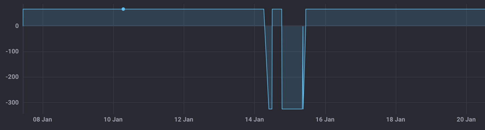

.. This is a template for operational procedures. Each procedure will have its own sub-directory. This comment may be deleted when the template is copied to the destination.

.. Review the README in this procedure's directory on instructions to contribute.
.. Static objects, such as figures, should be stored in the _static directory. Review the _static/README in this procedure's directory on instructions to contribute.
.. Do not remove the comments that describe each section. They are included to provide guidance to contributors.
.. Do not remove other content provided in the templates, such as a section. Instead, comment out the content and include comments to explain the situation. For example:
	- If a section within the template is not needed, comment out the section title and label reference. Include a comment explaining why this is not required.
    - If a file cannot include a title (surrounded by ampersands (#)), comment out the title from the template and include a comment explaining why this is implemented (in addition to applying the ``title`` directive).

.. Include one Primary Author and list of Contributors (comma separated) between the asterisks (*):
.. |author| replace:: *Kris Mortensen*
.. If there are no contributors, write "none" between the asterisks. Do not remove the substitution.
.. |contributors| replace:: *Erik Dennihy, Jacqueline Seron, Paulo Lago*

.. This is the label that can be used as for cross referencing this procedure.
.. Recommended format is "Directory Name"-"Title Name"  -- Spaces should be replaced by hyphens.
.. _Monitoring-LATISS-Disperser-Wheel-Position:
.. Each section should includes a label for cross referencing to a given area.
.. Recommended format for all labels is "Title Name"-"Section Name" -- Spaces should be replaced by hyphens.
.. To reference a label that isn't associated with an reST object such as a title or figure, you must include the link an explicit title using the syntax :ref:`link text <label-name>`.
.. An error will alert you of identical labels during the build process.

##########################################
Monitoring LATISS Disperser Wheel Position
##########################################

.. _Monitoring-LATISS-Disperser-Wheel-Position-Overview:

Overview
========

.. This section should provide a brief, top-level description of the procedure's purpose and utilization. Consider including the expected user and when the procedure will be performed.

When night observing with AuxTel, it is important to check that the grating linear stage in properly aligned 
to allow proper dispersion of the diffraction orders across the CCD. This check is especially critical if the 
ATSpectrograph cRIO has been reset recently as the reset may result in mechanism timeouts or miscommunication. 
During normal operations, the position of the disperser wheel can be monitored with telemetry from Chronograph or LOVE. 
However, when the cRIO is reset and the linear stage is in the forward position, it is possible that the reported position 
may not be reliable. Therefore, it is important to validate the position of the linear grating stage independently from the telemetry.

.. _Monitoring-LATISS-Disperser-Wheel-Position-Precondition:

Precondition
============

.. This section should provide simple overview of preconditions before executing the procedure; for example, state of equipment, telescope or seeing conditions or notifications prior to execution.
.. It is preferred to include them as a bulleted or enumerated list.
.. If there is a different procedure that is critical before execution, carefully consider if it should be linked within this section or as part of the Procedure section below (or both).

- The telescope is currently on-sky and running the scheduler.

- The linear stage position telemetry displayed abnormal values some time within the past 24 hours.
  For example, a reported position of -324mm may occur when there is a reset (see :ref:`Fig 1 <figure-cRIO-Reset>`).

  - The allowed range of measured positions of the disperser wheel is 0-67mm (software limit set at 67.5mm).

.. admonition:: Important!
  :class: attention

  If there has been a recent cRIO reset within the past 1-2 weeks, this procedure should be performed as 
  a consistent nighttime routine.

.. _figure-cRIO-Reset:

    
    Fig 1: Example plot of cRIO reset (Jan 14th - Jan 16th)

- The position of the disperser wheel can be monitored using the following code on `Chronograph <https://summit-lsp.lsst.codes/chronograf/landing>`_:
  
.. code-block:: sql
    :caption: Chronograph - Linear Stage Position

    SELECT "position" 
    FROM "efd"."autogen"."lsst.sal.ATSpectrograph.logevent_reportedLinearStagePosition"
    WHERE time > :dashboardTime: 
    AND time < :upperDashboardTime:
      
.. _Monitoring-LATISS-Disperser-Wheel-Position-Post-Condition:

Post-Condition
==============

.. This section should provide a simple overview of conditions or results after executing the procedure; for example, state of equipment or resulting data products.
.. It is preferred to include them as a bulleted or enumerated list.
.. Please provide screenshots of the software status or relevant display windows to confirm.
.. Do not include actions in this section. Any action by the user should be included in the end of the Procedure section below. For example: Do not include "Verify the telescope azimuth is 0 degrees with the appropriate command." Instead, include this statement as the final step of the procedure, and include "Telescope is at 0 degrees." in the Post-condition section.

- The disperser wheel is (re)aligned to its nominal position of 67mm.
- The CCD disperser coverage has increased, resulting in a higher resolution of the AuxTel spectral data.

.. _Monitoring-LATISS-Disperser-Wheel-Position-Procedure-Steps:

Procedure Steps
===============

1. Access RubinTV and navigate to the AuxTel image display page.

2. At the beginning of night observations, select the spectrum from a sequence number with the following characteristics:

.. admonition:: Sequence Number Characteristics
  :class: hint

  * **Image Type:** science

  * **Filter:** empty
  
  * **Grating/Disperser:** holo4_003

3. Locate the large atmospheric absorption line due to oxygen (:math:`\lambda = 762 \, \text{nm}`, see :ref:`Fig 2 <figure-Linear-Stage-Positions>`).
   
4. Estimate the distance in pixels from the beginning of the spectrum to the peak of the absorption line. 
   Label this value :math:`D(O_2)`.

5. Compare the estimated value with the expected value :math:`\boxed{D(O_2) \sim 1200 \pm 100 \, \text{pixels.}}`

.. _figure-Linear-Stage-Positions:

.. list-table:: Fig 2: Spectra of incorrect (left) and correct (right) alignment of the disperser wheel.
   :width: 100%
   :class: borderless

   * - 
      .. image:: _static/LATISS_BadLinearStagePos.png
          :width: 100%
         
     - 
      .. image:: _static/LATISS_GoodLinearStagePos.png
          :width: 100%

.. note::
    The oxygen absorption line is always visible, but may be difficult to locate for certain spectra. 
    Make sure to verify noticeable absorption profile characteristics (line width, depth, etc.) is present 
    in the **1D spectrum** (:ref:`Fig 2 <figure-Linear-Stage-Positions>` bottom panels). If it is too difficult to identify the line in both spectra then try 
    another sequence.

.. _Monitoring-LATISS-Disperser-Wheel-Position-Troubleshooting:

Troubleshooting
===============

.. This section should include troubleshooting information. Information in this section should be strictly related to this procedure.

.. If there is no content for this section, remove the indentation on the following line instead of deleting this sub-section.

     No troubleshooting information is applicable to this procedure.

- If the distance is smaller than expected (see :ref:`Fig 2 <figure-Linear-Stage-Positions>`), rerun ``latiss_checkout.py`` in the ScriptQueue. 
  This script will automatically attempt to reposition the grating stage.
   
- Once the script has finished running, verify again that the spectrograph is properly positioned.

  - | If the issue has not been resolved, proceed to the instructions on 
    | :ref:`ATSpectrograph Recovery <LATISS-Troubleshooting-ATspectrograph-Recovery>`. 