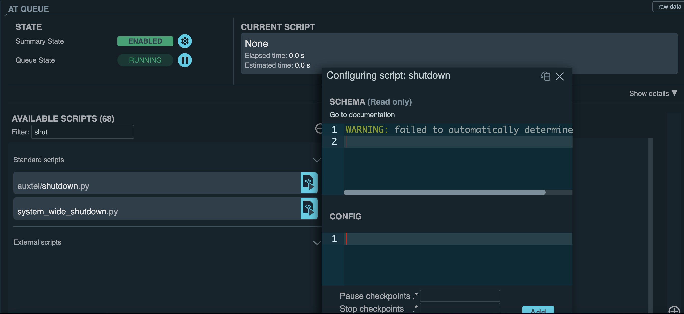

.. |author| replace:: *Yijung Kang*
.. If there are no contributors, write "none" between the asterisks. Do not remove the substitution.
.. |contributors| replace:: *Alysha Shugart, Karla Aubel*

.. _AuxTel-Nighttime-Operations-Shutdown:

########
Shutdown
########

.. _Shutdown-the-Telescope-Overview:

Overview
========
Auxtel might need to be shutdown for a few reasons:
* End of night
* bad weather (see :ref:`AuxTel Weather Constraints <Observing-Constraints-AuxTel-Weather-Constraints>`)
* restart of cRIOs (see e.g. :ref:`ATDome Lost Communication with the Top-End <Top-Comm-Error-Procedure>`)
* unresponsive axes
* other reasons

For the end-of-night shutdown, ATTCS and LATISS CSCs should be set to ``STANDBY``. Telescope and dome should be parked. 
The parking position for AuxTel is El = 80 deg, Az = 0.0 deg, rot = 0.0 deg. 
For the dome, the parking position is at Az = 285.0 deg with closed dome slit shutter. 
See the following :ref:`procedures steps <Park-the-Telescope-Procedure-Steps>` for the shutdown procuder.

If the shutdown is temporary during the night, and observation is to be resumed, follow the :ref:`resume from temporary shutdown <Resume-from-Temporary-Shutdown>` section.

.. _Shutdown-the-Telescope-Precondition:

Precondition
==============

Stopping Scheduler
------------------

The Scheduler automatically adds new targets to the queue until the start of nautical morning twilight.
If there are no targets, the Scheduler will stop adding new ones.
If you need to stop the Scheduler manually, you can use the :file:`auxtel/scheduler/stop.py` script from ATScriptQueue without any additional configuration.

See more detailed descriptions on :ref:`stopping the scheduler <scheduler-night-time-operation-troubleshooting-stopping-the-scheduler>`.

.. _Shutdown-the-Telescope-Post-Conditions:

Post-Condition
==============

* Status of Telescope and Dome 
  
   .. image:: ./_static/ATDome_park.png
      :name: Auxiliary Telescope and Dome at the shutdown position

      Auxiliary Telescope and Dome at the shutdown position

* Status of Mirrors and Mirror Covers

   .. image:: ./_static/AT_LightPath.png
    :scale: 50 %

    Auxiliary Mirror Covers at the shutdown position

* Status of CSC components of ATTCS and LATISS

   .. image:: ./_static/CSC.png

.. _Park-the-Telescope-Procedure-Steps:

Procedure Steps
===============

Shutdown AuxTel
---------------

After stopping scheduler, you can shutdown AuxTel using :file:`auxtel/shutdown.py` script from ATQueue. 
without any configurations as below. 

This script performs the following steps:

#. Closing the M1 cover: 
   First, it disables ATAOS corrections. Then, it closes the M1 cover and vent gates.  
   If mirror is opened, :file:`auxtel/shutdown.py` script will not able to close the dome slit. 

#. Closing the Dome Shutter:
   It closes the dome shutter if it is opened. 
   If the dropout door is open, you can close manually via button at the AuxTel or with :file:`auxtel/atdome/close_dropout_door.py` script without configuration. 
    
#. Parking the Dome:
   The parking position is Az = 285.0 deg. Then, the dome following is disabled after parking. 

#. Parking the Telescope:
   The parking position is El = 80 deg, Az = 0.0 deg, rot = 0.0 deg for AuxTel telescope.
   Tracking will be stopped.  

#. Putting ATTCS CSCs in STANDBY:
   The AT CSC components ``ATMCS``, ``ATPtg``, ``ATDome``, ``ATDomeTrajectory``, ``ATAOS``, ``ATPneumatics``, ``ATHexapod``  will transition to ``STANDBY``. 

   After parking and shutdown for Auxillary Telescope are completed, you can check the status of dome and telescope on LOVE. 

#. Send LATISS to ``STANDBY``:
   After parking the AuxTel and taking daytime calibration, the LATISS CSCs are still in ``ENABLED`` state.
   Run :file:`auxtel/standby_latiss.py` on ATQueue to transition all CSCs for LATISS (``ATCamera``, ``ATOODS``, ``ATHeaderService``, ``ATSpectrograph``) to ``STANDBY``.
 

Ending the Night
----------------

During the shutting down procedures, you can check and complete all logging and administrative tasks including:

* Finish filling out the night log, including time loss, weather loss, and gathering fault reports for the night.
* Send the summary and night log link to rubinobs-nightlog mailing list (rubin-night-log [at] lists.lsst.org). 
* Leave the summary of the night on channel #summit-auxtel.

Closing the Vent Gate
---------------------

This step can be proceed any point of the previous shutdown steps, but it is recommended to do it on the way down to the hotel at the end of the night.  
  
Go up to the AuxTel and 

* Turn off extraction fan. 
* Close all vent gates using the remote controller.
* Make sure the dome shutter is closed, and the AuxTel and dome are on the parking position. Building should be sealed. 

.. _Resume-from-Temporary-Shutdown:
.. admonition:: Important!
  :class: attention
Auxtel loses pointing correction and focus information after a standard shutdown. 
In the case when observation is to be resumed after a shutdown, the following two steps need to be executed in order:
# :ref:`Reset pointing accuracy of AuxTel <AuxTel-Lost-Pointing-Accuracy-Procedure-Overview>`
# :ref:`Run the wavefront estimation (WEP) script for re-focusing <Image-out-of-focus-Procedure-Overview>`

See also :ref:`Center, absorb pointing offsets, mirror alignment and focus <AuxTel-Non-Standard-Operations-Center-Focus>`.

Contingency
===========
In the event that this standard dome and telescope closure procedure fails, 
and an emergency shutdown is required, refer to the :ref:`emergency dome closure instructions <AuxTel-Non-Standard-Operations-AuxTel-Emergency-Shutdown>`.

This procedure was last modified on |today|.
