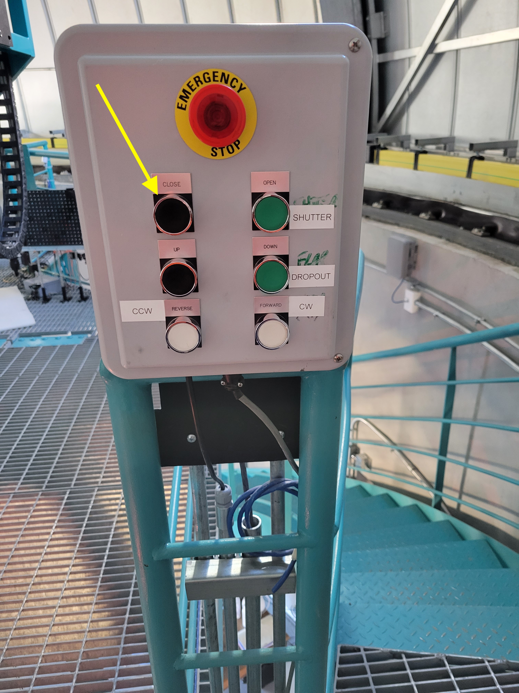
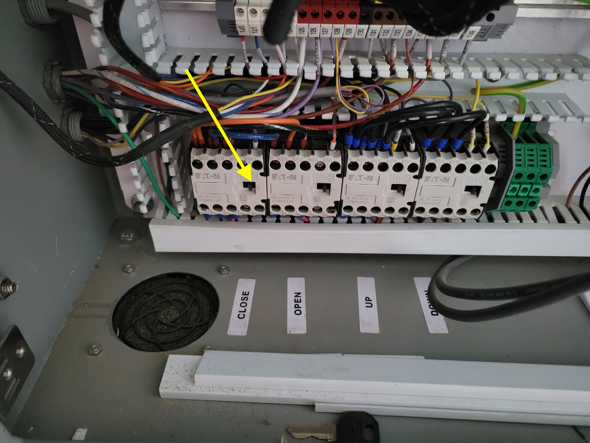
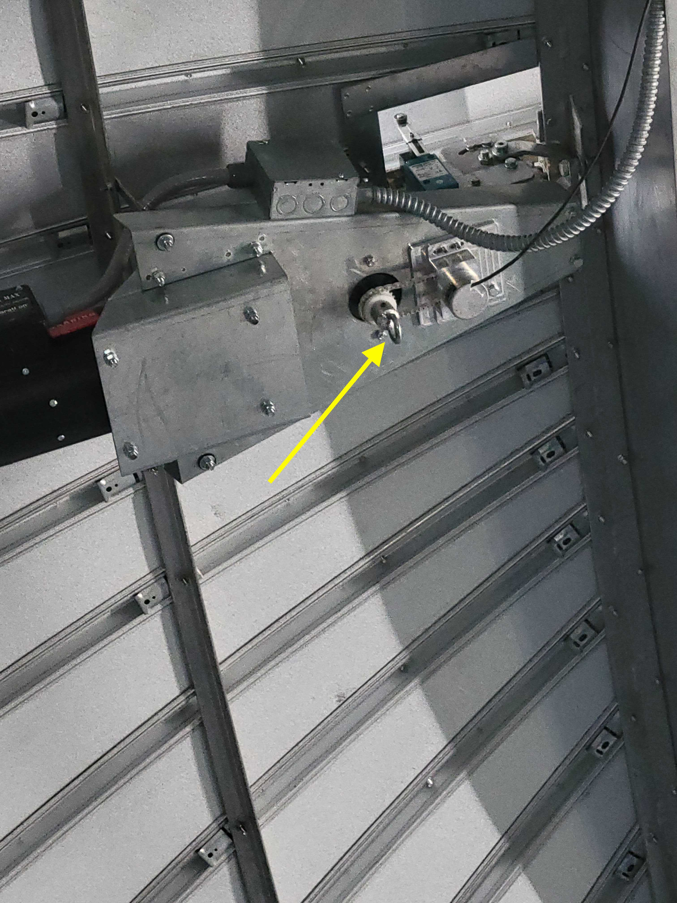
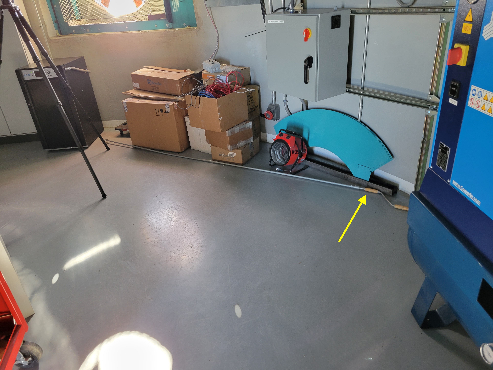

.. This is a template for troubleshooting when some part of the observatory enters an abnormal state. This comment may be deleted when the template is copied to the destination.

.. Review the README in this procedure's directory on instructions to contribute.
.. Static objects, such as figures, should be stored in the _static directory. Review the _static/README in this procedure's directory on instructions to contribute.
.. Do not remove the comments that describe each section. They are included to provide guidance to contributors.
.. Do not remove other content provided in the templates, such as a section. Instead, comment out the content and include comments to explain the situation. For example:
	- If a section within the template is not needed, comment out the section title and label reference. Include a comment explaining why this is not required.
    - If a file cannot include a title (surrounded by ampersands (#)), comment out the title from the template and include a comment explaining why this is implemented (in addition to applying the ``title`` directive).

.. Include one Primary Author and list of Contributors (comma separated) between the asterisks (*):
.. |author| replace:: *Craig Lage*
.. If there are no contributors, write "none" between the asterisks. Do not remove the substitution.
.. |contributors| replace:: *Karla Aubel*

.. This is the label that can be used as for cross referencing this procedure.
.. Recommended format is "Directory Name"-"Title Name"  -- Spaces should be replaced by hyphens.
.. _AuxTel-ATCS-ATDome-Shutter-Fails-to-Close:
.. Each section should includes a label for cross referencing to a given area.
.. Recommended format for all labels is "Title Name"-"Section Name" -- Spaces should be replaced by hyphens.
.. To reference a label that isn't associated with an reST object such as a title or figure, you must include the link an explicit title using the syntax :ref:`link text <label-name>`.
.. An error will alert you of identical labels during the build process.

#############################
ATDome Shutter Fails to Close
#############################

.. _ATDome-Shutter-Fails-To-Close: 

Overview
========

This page describes the procedures to follow if the software fails to close the AT dome shutter. In the LOVE display can be seen *Dome not in position* in yellow letters:

.. _ATDome-Shutter-Fails-To-Close-The-Dome-shutter-never-reach-the-closed-status:

Error diagnosis
===============

The Dome shutter never reach the closed status.

.. _ATDome-Shutter-Fails-To-Close:

Procedure Steps
===============

.. todo::
   Make sure everything is in a safe or idle state before troubleshooting. Describe relevant safety steps if necessary.

.. This section should include the procedure. There is no strict formatting or structure required for procedures. It is left to the authors to decide which format and structure is most relevant.
.. In the case of more complicated procedures, more sophisticated methodologies may be appropriate, such as multiple section headings or a list of linked procedures to be performed in the specified order.
.. For highly complicated procedures, consider breaking them into separate procedure. Some options are a high-level procedure with links, separating into smaller procedures or utilizing the reST ``include`` directive <https://docutils.sourceforge.io/docs/ref/rst/directives.html#include>.

#. 1  

Go up to the AuxTel dome.  Locate the control box at the top of the stairs. The top black button should close the shutter:

#. 2

If this fails, locate the cRIO box, which rotates with the AuxTel dome.  It looks like this:

 
 
 .. image:: _static/cRIO_box.jpeg

Inside this box is a series of switches:

Sliding the switch labeled "CLOSE" to the left  (yellow arrow) should close the shutter.  
This must be done with EXTREME CAUTION.  This is a low-level control switch and there are no limit switches or fail-safes. 
You can easily overdrive the shutter until it bangs into the lower shutter.  You can also damage the drive.  
If you do this, it is best to stop the shutter 1 cm or so before it is fully closed to prevent this type of damage.

#. 3

The steps above should close the shutter if there is power. As a last resort, for example if power has been lost, the shutter can be closed manually. 
There is a crank on the first floor which fits into a ring at the top of the dome (see pictures below). 
With these you can close the shutter manually.  Note that this is a tedious procedure that might take hours.

  
    

Post-Condition
==============

- The Dome Shutter should be closed.

.. _Title-of-Troubleshooting-Procedure-Contingency:

Contingency
===========

If the procedure was not successful, report the issue in **#summit-auxtel** channel and/or **#summit-announce** and/or activate the :ref:`Out of hours support <Safety-out-of-hours-support>`.