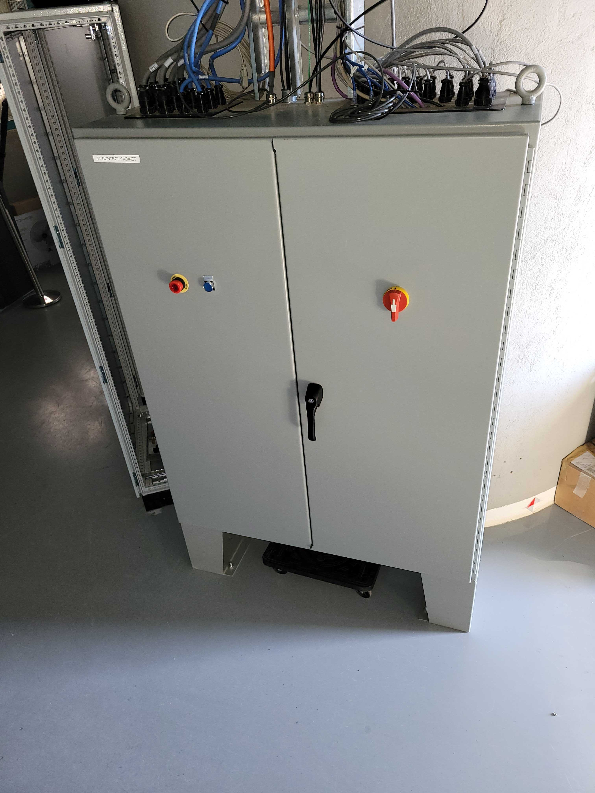

.. This is a template for troubleshooting when some part of the observatory enters an abnormal state. This comment may be deleted when the template is copied to the destination.

.. Review the README in this procedure's directory on instructions to contribute.
.. Static objects, such as figures, should be stored in the _static directory. Review the _static/README in this procedure's directory on instructions to contribute.
.. Do not remove the comments that describe each section. They are included to provide guidance to contributors.
.. Do not remove other content provided in the templates, such as a section. Instead, comment out the content and include comments to explain the situation. For example:
	- If a section within the template is not needed, comment out the section title and label reference. Include a comment explaining why this is not required.
    - If a file cannot include a title (surrounded by ampersands (#)), comment out the title from the template and include a comment explaining why this is implemented (in addition to applying the ``title`` directive).

.. Include one Primary Author and list of Contributors (comma separated) between the asterisks (*):
.. |author| replace:: *Ioana Sotuela*
.. If there are no contributors, write "none" between the asterisks. Do not remove the substitution.
.. |contributors| replace:: *Gonzalo Aravena*

.. This is the label that can be used as for cross referencing this procedure.
.. Recommended format is "Directory Name"-"Title Name"  -- Spaces should be replaced by hyphens.
.. _ATHexapod-fails-to-enable-with-the-rest-of-ATCS:
.. Each section should includes a label for cross referencing to a given area.
.. Recommended format for all labels is "Title Name"-"Section Name" -- Spaces should be replaced by hyphens.
.. To reference a label that isn't associated with an reST object such as a title or figure, you must include the link an explicit title using the syntax :ref:`link text <label-name>`.
.. An error will alert you of identical labels during the build process.

###############################################
ATHexapod fails to enable with the rest of ATCS
###############################################

.. _ATHexapod-fails-to-enable-with-the-rest-of-ATCS-Overview:

Overview
========

When attempting to enable ATCS from the *LOVE/ATScriptQueue* with the script :file:`auxtel/enable_atcs.py`, ATHexapod fails to transition to enable.

.. _ATHexapod-fails-to-enable-with-the-rest-of-ATCS-Diagnosis:

Error diagnosis
===============

1. ATHexapod fails to enable with the rest of the ATCS with the SAL script :file:`auxtel/enable_atcs.py`. The error received is:

.. code-block:: text
  :caption: ATHexapod Error Message when transitioning from ``STANDBY`` to ``ENABLE``

  Callback <bound method BaseCsc.do_start of <lsst.ts.ATHexapod.csc.ATHexapodCSC object at 0x7f27708ecf10>> failed with data=private_revCode: aaf328f3,
  private_sndStamp: 1692729552.0401282, private_rcvStamp: 1692729552.0401914, private_seqNum: 1839321525, private_identity: Script:201665,
  private_origin: 14887, configurationOverride: Traceback (most recent call last):  File "/opt/lsst/software/stack/miniconda/lib/python3.10/site-packages/lsst/ts/salobj/topics/controller_command.py", 
  line 232, in _run_callback    ack = await result  # type: ignore  File "/opt/lsst/software/stack/miniconda/lib/python3.10/site-packages/lsst/ts/salobj/base_csc.py", 
  line 518, in do_start    await self._do_change_state(data, "start", [State.STANDBY], State.DISABLED)  File "/opt/lsst/software/stack/miniconda/lib/python3.10/site-packages/lsst/ts/salobj/base_csc.py", 
  line 830, in _do_change_state    await getattr(self, f"end_{cmd_name}")(data)  File "/opt/lsst/software/stack/miniconda/lib/python3.10/site-packages/lsst/ts/ATHexapod/csc.py", 
  line 206, in end_start    raise e  File "/opt/lsst/software/stack/miniconda/lib/python3.10/site-packages/lsst/ts/ATHexapod/csc.py", 
  line 202, in end_start    await self.controller.connect() File "/opt/lsst/software/stack/miniconda/lib/python3.10/site-packages/lsst/ts/ATHexapod/controller.py", 
  line 97, in connect    self.reader, self.writer = await asyncio.wait_for(  File "/opt/lsst/software/stack/miniconda/lib/python3.10/asyncio/tasks.py", 
  line 445, in wait_for    return fut.result()  File "/opt/lsst/software/stack/miniconda/lib/python3.10/asyncio/streams.py", 
  line 48, in open_connection    transport, _ = await loop.create_connection(  File "/opt/lsst/software/stack/miniconda/lib/python3.10/asyncio/base_events.py", 
  line 1076, in create_connection    raise exceptions[0]  File "/opt/lsst/software/stack/miniconda/lib/python3.10/asyncio/base_events.py", 
  line 1060, in create_connection    sock = await self._connect_sock(  File "/opt/lsst/software/stack/miniconda/lib/python3.10/asyncio/base_events.py", 
  line 969, in _connect_sock    await self.sock_connect(sock, address)  File "/opt/lsst/software/stack/miniconda/lib/python3.10/asyncio/selector_events.py", 
  line 501, in sock_connect    return await fut  File "/opt/lsst/software/stack/miniconda/lib/python3.10/asyncio/selector_events.py", 
  line 541, in _sock_connect_cb    raise OSError(err, f'Connect call failed {address}')OSError: [Errno 113] Connect call failed ('139.229.170.48', 50000)

2. Trying to ping the controller at `athexapod.cp.lsst.org <athexapod.cp.lsst.org>`__ results in no response.

.. _ATHexapod-fails-to-enable-with-the-rest-of-ATCS-Procedure-Steps:

Procedure Steps
===============

The connection to the ATHexapod can be recovered by manually rebooting the ATHexapod controller box located in the Main ATCS cabinet in the pier of the AuxTel dome.

       Main ATCS Cabinet.

.. _ATHexapod-fails-to-enable-with-the-rest-of-ATCS-Procedure-Critical-Step-1:

1. Announce in the slack channel `#summit-anounce <https://app.slack.com/client/T06D204F2/C01P41NUR1R>`__ that you are going to the AuxTel building to reboot the ATHexapod Controller.
   
2. On the first level, or pier of the AuxTel dome, open the Main ATCS cabinet and press the off button at the C-887 Hexapod Controller, that's located at the bottom of the cabinet.

   .. list-table::
      :widths: 50 50
      :header-rows: 0

      * - .. figure:: ./_static/main_cabinet_inside.png
              :name: Main2
              :scale: 17 %

              Main ATCS Cabinet.

        - .. figure:: ./_static/ATHexapod_Controller.jpg
              :name: ATHexapodCtrl
              :scale: 11 %

              ATHexapod Controller.
   

3. Wait for 3 minutes.
4. Turn the controller on again.
5. The ATHexapod CSC should be now in ``STANDBY``. Transition the ATHexapod from the *LOVE/ASummaryState View* ``STANDBY`` → ``START`` → ``ENABLE``, or alternative, you could run the :file:`auxtel/enable_atcs.py` again. ATCS should be ready now to begin operations.
6. Fill the ticket `OBS-243 - ATHexapod not enabling with the rest of ATCS <https://rubinobs.atlassian.net/browse/OBS-243>`__ with as much information you have regarding the state of the system, such as procedures or maintenance done prior to this failure (e-stop, mirror CO2 cleaning, power outage, LOTO, etc)

.. _Title-of-Troubleshooting-Procedure-Post-Condition:

Post-Condition
==============

- The ATHexapod CSC is successfully enabled and is now in the ``ENABLE`` state
- The ATCS system is fully operational and ready to proceed with observations or further procedures.

.. _Title-of-Troubleshooting-Procedure-Contingency:

Contingency
===========

If the procedure was not successful, report the issue in `#summit-auxtel <https://app.slack.com/client/T06D204F2/C01K4M6R4AH>`__ and/or activate the :ref:`Out of hours support <Safety-out-of-hours-support>`.

