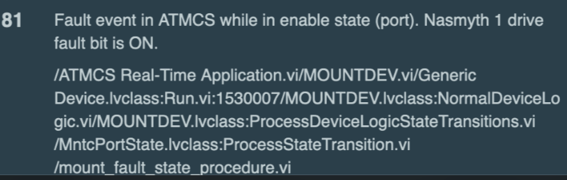

.. Include one Primary Author and list of Contributors (comma separated) between the asterisks (*):
.. |author| replace:: *I. Sotuela*
.. If there are no contributors, write "none" between the asterisks. Do not remove the substitution.
.. |contributors| replace:: *P. Venegas, K. Pena*

.. This is the label that can be used as for cross referencing this procedure.
.. Recommended format is "Directory Name"-"Title Name"  -- Spaces should be replaced by hyphens.
.. _ATCS-Troubleshooting-AuxTel-Mount-Control-System-Fails-to-Enable:
.. Each section should includes a label for cross referencing to a given area.
.. Recommended format for all labels is "Title Name"-"Section Name" -- Spaces should be replaced by hyphens.
.. To reference a label that isn't associated with an reST object such as a title or figure, you must include the link an explicit title using the syntax :ref:`link text <label-name>`.
.. An error will alert you of identical labels during the build process.

###############################################################
AuxTel Mount Control System Fails to Enable / E-Stop is Engaged
###############################################################

.. _AuxTel-Mount-Control-System-Fails-to-Enable-Procedure-Overview:

Overview
========

When attempting to enable *ATCS* from the *ATScriptQueue* with the script :file:`auxtel/enable_atcs.py`, 
*ATMCS* goes into ``FAULT`` failing to transition to ``ENABLED``.

.. _AuxTel-Mount-Control-System-Fails-to-Enable-Procedure-Error-Diagnosis:

Error diagnosis
===============

*ATMCS* goes to ``FAULT`` and does not enable with the rest of *ATCS* when running the SAL script :file:`auxtel/enable_atcs.py`.

.. code-block:: text 
   :caption: Traceback for :file:`auxtel/enable_atcs.py` 

   Fault event in ATMCS while in enable state (port). 
   Nasmyth 1 drive fault bit is ON.

   
   Full traceback error received in LOVE

.. _ATCS-Troubleshooting-AuxTel-Mount-Control-System-Fails-to-Enable-Procedure-Procedure-Steps:

Procedure Steps
===============

First step is to check if the **E-stop** is engaged. 
If it is engaged, release it using the procedure linked in step 2 and attempt to enable *ATCS* again.

#. The only way to **check if the E-stop is engaged** is from the *ATMCS EUI*. 
   The *ATMCS EUI* can be opened from a remote desktop connection or from the control computer at the first floor of the AuxTel dome.  
   More detailed instruction in the :ref:`access ATMCS EUI procedure <AuxTel-Non-Standard-Operations-AuxTel-EUI-Access>`.

    .. figure:: /AuxTel/Non-Standard-Operations/_static/EUI-ATMCS.png
       :name: ATMCS EUI
      
       ATMCS EUI

#. Open the *LSST Auxiliary Telescope MCS & Pneumatics* window and under *Mount* tab, 
   the **Emergency Stop** indicator will be red and reading **E-stop**, if the **E-stop** is engaged.

    .. figure:: /AuxTel/Non-Standard-Operations/ATCS/_static/eui-estop-display.png
       :name: E-Stop indicator

       Emergency Stop indicator

#. **Proceed to release the E-stop** following the instructions in :ref:`E-Stop disengage procedure <AuxTel-Non-Standard-Procedures-E-Stop-Procedure>`.

#. **Confirm it is released**, and re-run SAL script :file:`auxtel/enable_atcs.py` from LOVE.