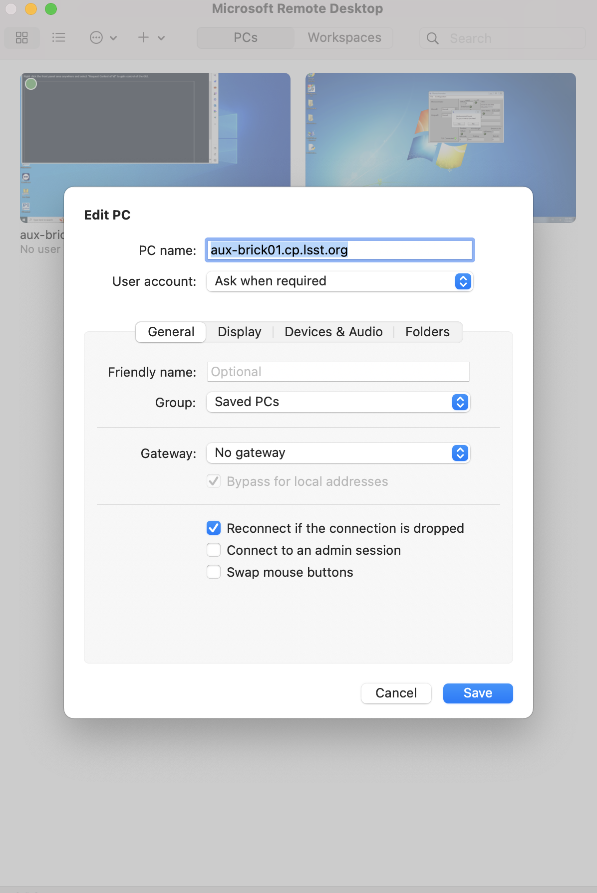
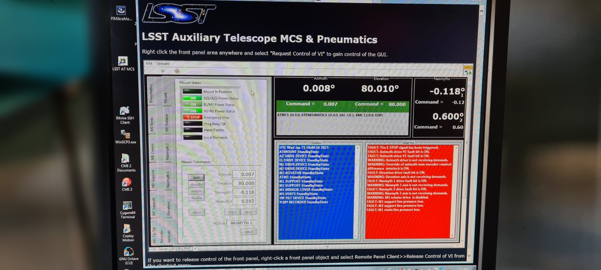

.. Include one Primary Author and list of Contributors (comma separated) between the asterisks (*):
.. |author| replace:: *Paulina-Venegas-S.*
.. If there are no contributors, write "none" between the asterisks. Do not remove the substitution.
.. |contributors| replace:: *Karla-Aubel*, *Ioana-Soutela*

.. This is the label that can be used as for cross referencing this procedure.
.. Recommended format is "Directory Name"-"Title Name"  -- Spaces should be replaced by hyphens.
.. _AuxTel-Mount-Control-System-Fails-to-Enable:
.. Each section should includes a label for cross referencing to a given area.
.. Recommended format for all labels is "Title Name"-"Section Name" -- Spaces should be replaced by hyphens.
.. To reference a label that isn't associated with an reST object such as a title or figure, you must include the link an explicit title using the syntax :ref:`link text <label-name>`.
.. An error will alert you of identical labels during the build process.

###############################################################
AuxTel Mount Control System Fails to Enable / E-Stop is Engaged
###############################################################

.. _AuxTel-Mount-Control-System-Fails-to-Enable-Procedure-Overview:

Overview
========

When attempting to enable ATCS from the ATScriptQueue with the script **auxtel/enable_atcs.py**, ATMCS fails to transition to enable.

.. _AuxTel-Mount-Control-System-Fails-to-Enable-Procedure-Error-Diagnosis:

Error diagnosis
===============

ATMCS fails to enable with the rest of the ATCS with the SAL script **auxtel/enable_atcs.py**.

.. error::

    Fault event in ATMCS while in enable state (port). Nasmyth 1 drive fault bit is ON

.. _AuxTel-Mount-Control-System-Fails-to-Enable-Procedure-Procedure-Steps:

Procedure Steps
===============

First step is to check if e-stop is enabled. If it is, release it using the provided procedure in step 2 and attempt to enable again.

1. The only way to check if the e-stop is engaged is from the ATMCS EUI.  Either in the computer that can be found on top of a table on the dome pier, or via a remote Microsoft Desktop connection with **aux-brick01.cp.lsst.org** (user and password are in the AuxTel 1Password Vault). 

..

2. Open the LSST Auxiliary Telescope MCS & Pneumatics window and under mount tab, the Emergency Stop indicator will be red and reading e-stop if's engaged.

..

3. Proceed to release the e-stop following the instructions in :ref:`E-Stop-Procedure <E-Stop-Procedure-Overview>`.

4. Confirm it's released, and re-run **auxtel/enable_atcs.py** from LOVE.