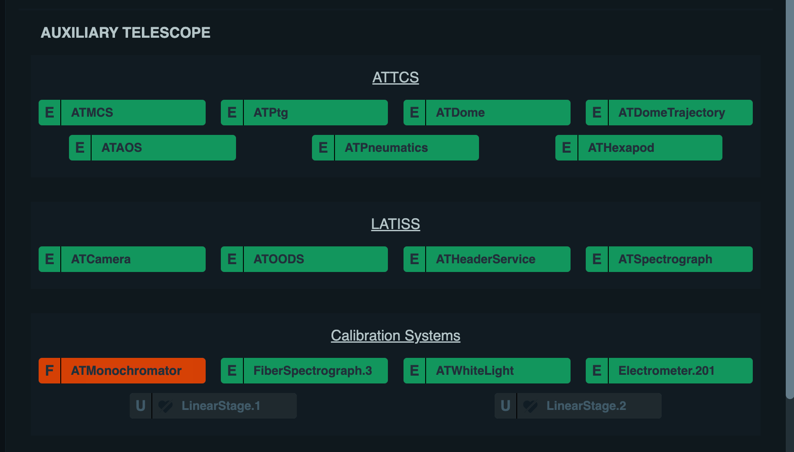
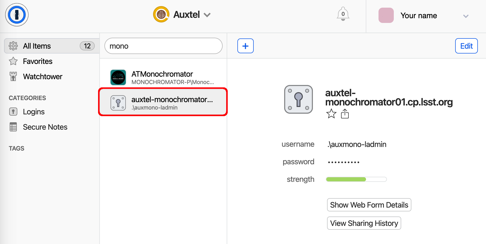
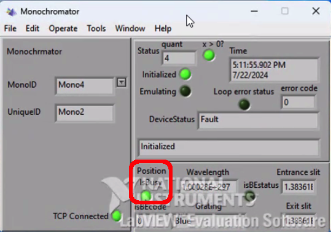
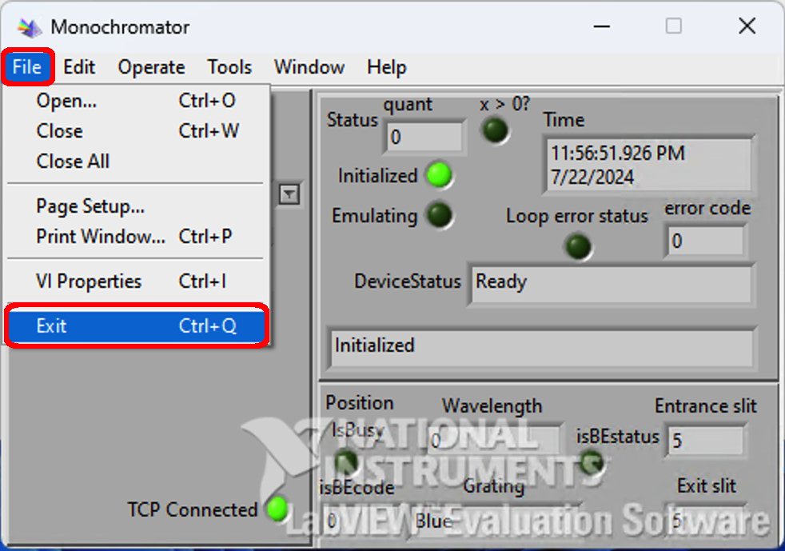
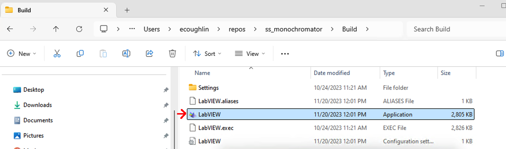
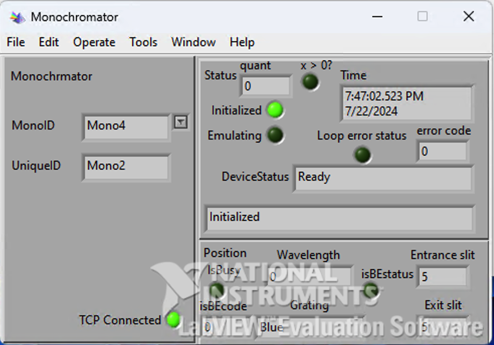
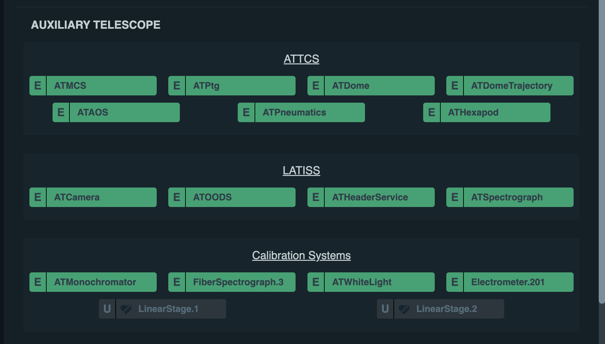

.. This is a template for troubleshooting when some part of the observatory enters an abnormal state. This comment may be deleted when the template is copied to the destination.

.. Review the README in this procedure's directory on instructions to contribute.
.. Static objects, such as figures, should be stored in the _static directory. Review the _static/README in this procedure's directory on instructions to contribute.
.. Do not remove the comments that describe each section. They are included to provide guidance to contributors.
.. Do not remove other content provided in the templates, such as a section. Instead, comment out the content and include comments to explain the situation. For example:
	- If a section within the template is not needed, comment out the section title and label reference. Include a comment explaining why this is not required.
    - If a file cannot include a title (surrounded by ampersands (#)), comment out the title from the template and include a comment explaining why this is implemented (in addition to applying the ``title`` directive).

.. Include one Primary Author and list of Contributors (comma separated) between the asterisks (*):
.. |author| replace:: *Jacqueline Seron*
.. If there are no contributors, write "none" between the asterisks. Do not remove the substitution.
.. |contributors| replace:: *Kris Mortensen, Parker Fagrelius*

.. This is the label that can be used as for cross referencing this procedure.
.. Recommended format is "Directory Name"-"Title Name"  -- Spaces should be replaced by hyphens.
.. _ATMonochromator-Fault:
.. Each section should includes a label for cross referencing to a given area.
.. Recommended format for all labels is "Title Name"-"Section Name" -- Spaces should be replaced by hyphens.
.. To reference a label that isn't associated with an reST object such as a title or figure, you must include the link an explicit title using the syntax :ref:`link text <label-name>`.
.. An error will alert you of identical labels during the build process.

#####################
ATMonochromator Fault
#####################

.. _ATMonochromator-Fault-Overview:

Overview
========

.. In one or two sentences, explain when this troubleshooting procedure needs to be used. Describe the symptoms that the user sees to use this procedure. 

This document outlines roughly the procedure to recover the ATMonochromator from a ``FAULT`` state. 
Sometimes the CSC will show ATMonochromator is ``ENABLED``, but if the log says it is not connected then 
the following steps should be followed to recover communication.

.. _ATMonochromator-Fault-Error-Diagnosis:

Error Diagnosis
===============

.. This section should provide simple overview of known or suspected causes for the error.
.. It is preferred to include them as a bulleted or enumerated list.
.. Post screenshots of the error state or relevant tracebacks.

.. _1Password: https://lsstit.1password.com/signin

.. _AuxTel EUI access: https://obs-ops.lsst.io/AuxTel/Non-Standard-Operations/EUI-Access/EUI-Access.html

1. You’ll notice that the ATMonochromator CSC status is in the ``FAULT`` state.

2. Using Microsoft Remote Desktop, access the PC *auxtel-monochromator01.cp.lsst.org* with the `1Password`_ credentials.

   a. To add it you can follow instructions from `AuxTel EUI access`_ replacing the PC name.

   b. There are two monochromator machines available in 1Password make sure you choose the correct one.

3. Check the Monochromator Labview application. Even if you see all LEDs green there may still be a problem.

   a. If :guilabel:`TCP Connected` shows an error you will need assistance (see :ref:`ATMonochromator-Fault-Contingency`).

   b. If there is a problem with the **controller**, like the system is indicating that it's busy, that means it's stuck 
      (:guilabel:`IsBusy` light will be on).

.. _ATMonochromator-Fault-Procedure-Steps:

Procedure Steps
===============

.. _#summit-auxtel: https://rubin-obs.slack.com/archives/C07Q45NUK4P

In case the problem is directly due to the controller itself, you will need to re-start the Labview application.

1. Exit the application by clicking :guilabel:`File` :math:`\Rightarrow` :guilabel:`Exit` (or press :kbd:`Ctrl+Q`).

2. Reopen the application.

   a. Select the folder :guilabel:`Build`.

   b. Click on :guilabel:`Labview`.

3. Verify the status of the controller (:guilabel:`IsBusy` light is turned off).

4. Enable ATMonochromator via the CSC.

   a. If the system is ``OFFLINE``, and you cannot transition to ``ENABLE``, ask for assistance on `#summit-auxtel`_.

.. _ATMonochromator-Fault-Post-Condition:

Post-Condition
==============

- Monochromator is enabled.

.. _ATMonochromator-Fault-Contingency:

Contingency
===========

If the procedure was not successful, report the issue in `#summit-auxtel`_ and/or activate the :ref:`Out of hours support <Safety-out-of-hours-support>`.