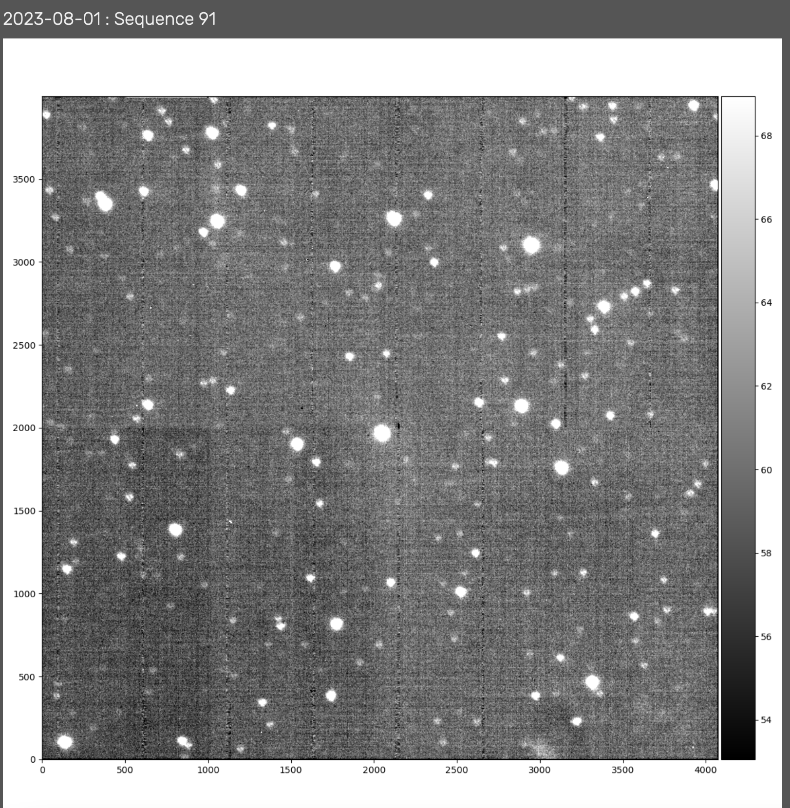
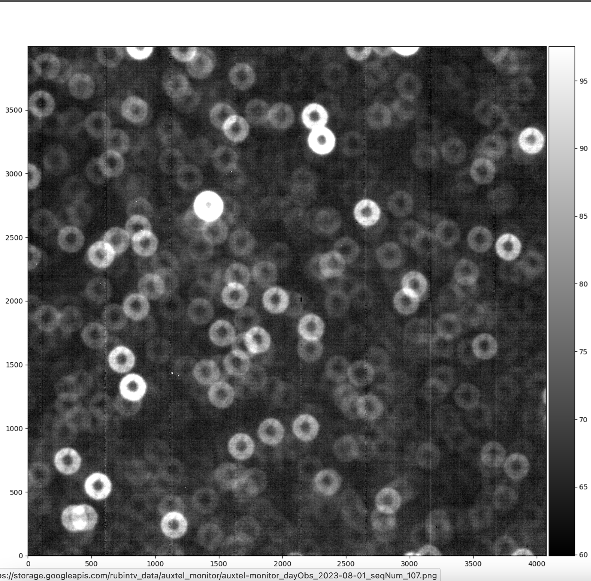

.. This is a template for Image out of focus when some part of the observatory enters an abnormal state. This comment may be deleted when the template is copied to the destination.

.. Review the README in this procedure's directory on instructions to contribute.
.. Static objects, such as figures, should be stored in the _static directory. Review the _static/README in this procedure's directory on instructions to contribute.
.. Do not remove the comments that describe each section. They are included to provide guidance to contributors.
.. Do not remove other content provided in the templates, such as a section. Instead, comment out the content and include comments to explain the situation. For example:
	- If a section within the template is not needed, comment out the section title and label reference. Include a comment explaining why this is not required.
    - If a file cannot include a title (surrounded by ampersands (#)), comment out the title from the template and include a comment explaining why this is implemented (in addition to applying the ``title`` directive).

.. Include one Primary Author and list of Contributors (comma separated) between the asterisks (*):
.. |author| replace:: *I. Sotuela*
.. If there are no contributors, write "none" between the asterisks. Do not remove the substitution.
.. |contributors| replace:: *Carlos Morales, Karla Aubel, Erik Dennihy*

.. This is the label that can be used as for cross referencing this procedure.
.. Recommended format is "Directory Name"-"Title Name"  -- Spaces should be replaced by hyphens.
.. _AuxTel-AuxTel-Troubleshooting-General-Troubleshooting-AuxTel-Image-out-of-focus-Procedure:
.. Each section should includes a label for cross referencing to a given area.
.. Recommended format for all labels is "Title Name"-"Section Name" -- Spaces should be replaced by hyphens.
.. To reference a label that isn't associated with an reST object such as a title or figure, you must include the link an explicit title using the syntax :ref:`link text <label-name>`.
.. An error will alert you of identical labels during the build process.

#########################
AuxTel Image out of focus
#########################

.. _Image-out-of-focus-Procedure-Overview:

Overview
========

This procedure should be used when images appear out of focus due to a *WEP failure* or other related issues. 
Users will notice images ranging from slightly out of focus to large donut appearances when *ATHexapod* offsets are not correctly applied.

.. _AuxTel-Image-out-of-focus-Procedure-Error-Diagnosis:

Error diagnosis
===============

- The focus script :file:`auxtel/latiss_wep_align.py` might fail, leaving the system out of focus.
- These out of focus images might vary from slightly out of focus image when the LATISS WEP align script took the system out of focus,
  to complete out-of-focus images that can appear as large donuts when *ATHexapod* offsets are left in intra or extra focus positions due to a script failure.

  

    Slightly out-of-focus image.

    Extreme out-of-focus image.

.. _AuxTel-Image-out-of-focus-Procedure-Procedure-Steps:

Procedure Steps
===============

#. Pause LOVE *ATQueue*.

.. Add link below to ScriptQueue document once ready. 

#. Clear all *ATAOS* offsets for the x, y, and z axes. Load and run the standard script :file:`auxtel/offset_ataos.py` **moving the script up in the queue** with the following configuration:
    
     .. code-block:: python
        :caption: :file:`auxtel/offset_ataos.py`

        reset_offsets: all

#. Run the :file:`auxtel/latiss_wep_align.py` external script with the configuration below to find a new target in the area of the sky of your choice. Replace `az` and `el`.

     .. code-block:: python
        :caption: :file:`auxtel/latiss_wep_align.py`

        find_target:
           az: 135
           el: 40
           mag_limit: 8.0

#. Keep playing the rest of the scripts in the queue, ensuring the system is now in focus.

#. Complete the procedure by verifying the system is in focus.

.. _AuxTel-Image-out-of-focus-Procedure-Post-Condition:

Post-Condition
==============

- System is back in focus.

.. _AuxTel-Image-out-of-focus-Procedure-Contingency:

Contingency
===========

If the procedure was not successful, report the issue immediately in the `#summit-auxtel <https://lsstc.slack.com/archives/C01K4M6R4AH>`__ channel.

#. If step 2 doesn't work and you see a large number in the *ATAOS offsets values* at the *AuxTel Monitor* LOVE dashboard, it is because offsets had been wrongly accumulated. 
  
   Restart *ATAOS*: Cycle *ATAOS* CSC to ``STANDBY`` and back to ``ENABLED`` state. 

#. If *ATAOS* was restarted, corrections need to be re-enabled. 

   Use :file:`run_command.py` with the following configuration to re-enable *ATAOS* corrections. 

     .. code-block:: text
        :caption: :file:`run_command.py` to enable AOS corrections

        component: ATAOS
        cmd: enableCorrection
        parameters:
           hexapod: true
           m1: true
           atspectrograph: true
