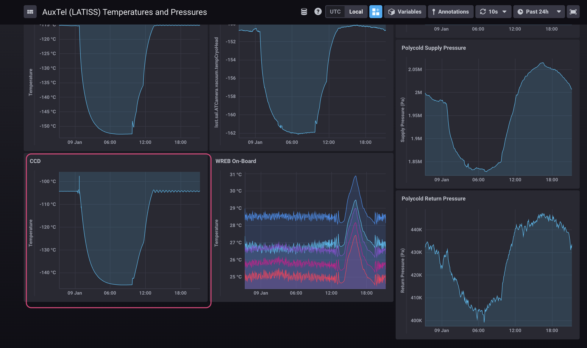
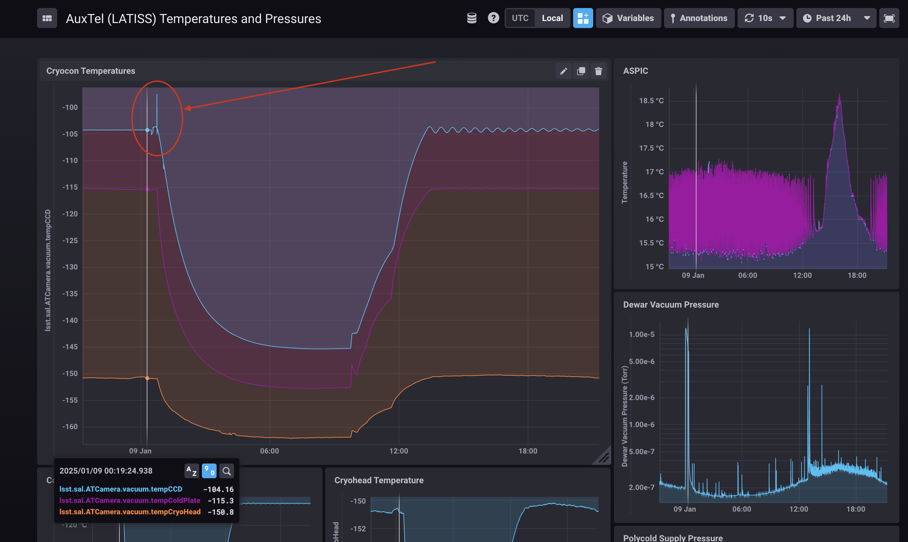

.. This is a template for troubleshooting when some part of the observatory enters an abnormal state. This comment may be deleted when the template is copied to the destination.

.. Review the README in this procedure's directory on instructions to contribute.
.. Static objects, such as figures, should be stored in the _static directory. Review the _static/README in this procedure's directory on instructions to contribute.
.. Do not remove the comments that describe each section. They are included to provide guidance to contributors.
.. Do not remove other content provided in the templates, such as a section. Instead, comment out the content and include comments to explain the situation. For example:
	- If a section within the template is not needed, comment out the section title and label reference. Include a comment explaining why this is not required.
    - If a file cannot include a title (surrounded by ampersands (#)), comment out the title from the template and include a comment explaining why this is implemented (in addition to applying the ``title`` directive).

.. Include one Primary Author and list of Contributors (comma separated) between the asterisks (*):
.. |author| replace:: *Kshitija Kelkar*
.. If there are no contributors, write "none" between the asterisks. Do not remove the substitution.
.. |contributors| replace:: *Gonzalo Aravena, Kris Mortensen*

.. This is the label that can be used as for cross referencing this procedure.
.. Recommended format is "Directory Name"-"Title Name"  -- Spaces should be replaced by hyphens.
.. _LATISS-Troubleshooting-ATDewar-Overcooling:
.. Each section should includes a label for cross referencing to a given area.
.. Recommended format for all labels is "Title Name"-"Section Name" -- Spaces should be replaced by hyphens.
.. To reference a label that isn't associated with an reST object such as a title or figure, you must include the link an explicit title using the syntax :ref:`link text <label-name>`.
.. An error will alert you of identical labels during the build process.

###########################################
ATDewar Alarm - LATISS CCD overcooling
###########################################

.. _ATDewar-Overcooling-Overview:

Overview
========

LATISS CCD operates at a temperature of -104°C, maintained by a continuous temperature closed-loop cryo cooling system. 
On rare occasions, the CRYO cooling system may shutdown unexpectedly with no clear cause. 
If this happens, the CCD can continue cooling down uncontrollably, potentially reaching temperatures much lower than intended, which may lead to performance issues. 
If the system shuts down, it is essential to verify temperature readings and inspect for any active critical alarm in the dewar. 
This document provides the diagnostic steps to identify a sudden shut down and procedures to troubleshoot. 
For more information about LATISS and the CRYO cooling system specifications and operations, please refer to `LSST Atmospheric Transmission and Slitless Spectrograph (LATISS) Instrument Handbook <https://tstn-006.lsst.io/>`__ .

.. _ATDewar-Overcooling-Error-Diagnosis:

Error diagnosis
===============

Regular monitoring of the LATISS CCD temperatures is essential, specially during observations. 
The `AuxTel (LATISS) Temperatures and Pressures <https://summit-lsp.lsst.codes/chronograf/sources/1/dashboards/14?refresh=10s&lower=now%28%29%20-%2024h>`__ dashboard in Chronograph provides these temperature readings.  
Signs of a cryo cooling system shutdown include:

- Sudden drops in CCD temperature beyond the operational setpoint (-104°C), such as a decrease of more than 2°C within a minute.
  

    chronograph LATISS dashboard

- Also an unexpected shutdown of the cryo cooling system is often marked by a sudden spike in cryo temperatures.

    chronograph LATISS dashboard

- An ATDewar watcher alarm should prompt:

.. code-block:: text
  :caption: Traceback Error

   CCD temperature <temp> < -107 C

.. _ATDewar-Overcooling-Procedure-Steps:

Procedure Steps
===============

As soon as you see this decreasing in temperatures, it is crucial to go to the AuxTel telescope and reset the `Cryocon 24C <https://tstn-006.lsst.io/#cryogenic-control>`__ device by following the next steps:

#. Go to AuxTel telescope, always following the :ref:`Safe entry to AuxTel <Safe-entry-to-AuxTel-Overview>` guide.

#. Open the :ref:`AT Camera Electronics and Sensor Readout Cabinet  <Cabinet-Content-Diagrams-AT-Camera-Electronics-and-Sensor-Readout-Cabinet>`.

#. Look for the UNIT 2 (Cryocon 24C). The blue control light must be turned off, and an "Overtemp" error may appear under the temperature readings.

#. Press the :guilabel:`Control` button, this will clear the error and restore control mode.

   .. figure:: ./_static/Cryocon24C.png
       :name: cryocon24
       :scale: 50 %

       Cryocon 24C

#. Wait until the blue light turns on.

#. Check if temperatures start to increase again, if not, press the :guilabel:`Control` button once again.

   .. note:: 
       Restarting the cryo cooling system may require multiple attempts before the closed-loop stabilizes. In some cases, the loop button may turn blue, and the temperature may begin to rise, only to drop again shortly after. If this occurs, repeat the restart process until the system maintains a stable temperature.  

#. Confirm that the CRYO system stabilized at the desired temperature (-104°C). You may need to wait 30 to 45 minutes to ensure the system is stabilized.

.. _ATDewar-Overcooling-Post-Condition:

Post-Condition
==============

•	Cryo system is operational and CCD temperature is maintaining -104°C.
•	No new error messages or alarms are prompted in the LATISS telemetry.

.. _ATDewar-Overcooling-Contingency:

Contingency
===========

If the procedure was not successful, report the issue in `#summit-auxtel <https://app.slack.com/client/T06D204F2/C01K4M6R4AH>`__ and/or activate the :ref:`Out of hours support <Safety-out-of-hours-support>`.
