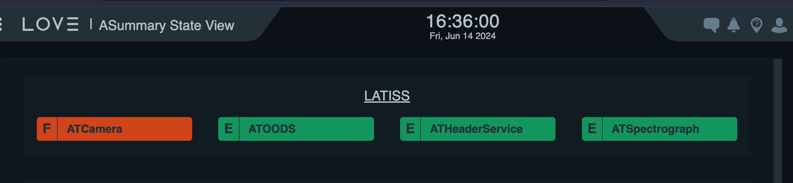
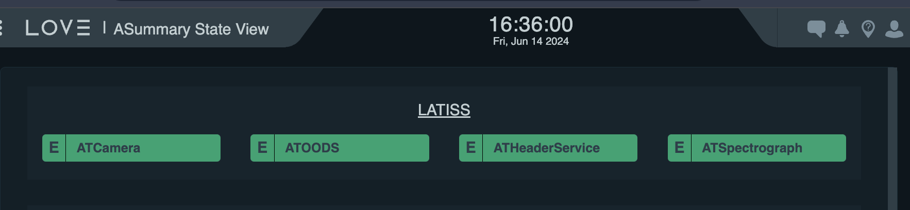

.. This is a template for troubleshooting when some part of the observatory enters an abnormal state. This comment may be deleted when the template is copied to the destination.

.. Review the README in this procedure's directory on instructions to contribute.
.. Static objects, such as figures, should be stored in the _static directory. Review the _static/README in this procedure's directory on instructions to contribute.
.. Do not remove the comments that describe each section. They are included to provide guidance to contributors.
.. Do not remove other content provided in the templates, such as a section. Instead, comment out the content and include comments to explain the situation. For example:
	- If a section within the template is not needed, comment out the section title and label reference. Include a comment explaining why this is not required.
    - If a file cannot include a title (surrounded by ampersands (#)), comment out the title from the template and include a comment explaining why this is implemented (in addition to applying the ``title`` directive).

.. Include one Primary Author and list of Contributors (comma separated) between the asterisks (*):
.. |author| replace:: *Tony Johnson*
.. If there are no contributors, write "none" between the asterisks. Do not remove the substitution.
.. |contributors| replace::     *Erik Dennihy, Jacqueline Seron, Karla Pena*
  
.. This is the label that can be used as for cross referencing this procedure.
.. Recommended format is "Directory Name"-"Title Name"  -- Spaces should be replaced by hyphens.
.. _LATISS-Troubleshooting-ATcamera-recovery:

.. Each section should includes a label for cross referencing to a given area.
.. Recommended format for all labels is "Title Name"-"Section Name" -- Spaces should be replaced by hyphens.
.. To reference a label that isn't associated with an reST object such as a title or figure, you must include the link an explicit title using the syntax :ref:`link text <label-name>`.
.. An error will alert you of identical labels during the build process.

#########################
AT camera recovery 
#########################

.. _ATcamera-recovery-Overview:

Overview
========

.. In one or two sentences, explain when this troubleshooting procedure needs to be used. Describe the symptoms that the user sees to use this procedure. 

This procedure describes the steps to recover the ATCamera from a ``FAULT`` state. 
A fault occurs whenever a parameter, such as temperature, voltage, current, etc., 
surpasses a specified limit (note that there is typically a warning before a hard error occurs). 
A fault can also be triggered by an unexpected failure during camera operation. 

This document outlines the general recovery procedure, including diagnosing the issue, 
fixing it, and restoring the camera to ``ENABLED`` state.

This article was triggered by `OBS-97`_, when the camera experienced a timeout from REB IN PROGRESS on February 28, 2023.
However, these instructions are applicable to a broader range of incidents beyond this specific case.

.. _OBS-97: https://rubinobs.atlassian.net/browse/OBS-97

.. Following note was below in the original page https://confluence.lsstcorp.org/display/OOD/ATCamera+Recovering+from+Fault+state

.. note::
    The instructions below assume:

    #. The ability to login to the AuxTel CCS computers.
    
    #. Some familiarity with basic CCS commands/functionality.
    
..    CCS: Camera Control System. 

 ..   We need a separate document to provide this background information since it will need to be referred to from multiple places.

.. _ATcamera-recovery-Error-Diagnosis:

Error diagnosis
===============

.. This section should provide simple overview of known or suspected causes for the error.
.. It is preferred to include them as a bulleted or enumerated list.
.. Post screenshots of the error state or relevant tracebacks.

- ATCamera goes to ``FAULT`` state.

   LATISS state view, ATCamera in ``FAULT`` state

.. admonition:: Important

    * The CCS commands included in this procedure have not yet been verified to solve this failure. 

    * All CCS commands have the prompt `ccs>` 

.. the note above was added to be able to copy the commands without ccs. BUT UNCERTAIN WHETHER IF IT'S CORRECT OR NEEDED.

**Track down a CCS problem** using the **ccs-shell** command line tool. Note that you can also use the *ccs-console* graphical interface.

#. Access to the LATISS CSC:

   .. prompt:: bash

      ssh auxtel-mcm.cp.lsst.org
      ccs-shell

#. Identify which **CCS subsystem triggered** the problem. 

   .. prompt:: bash

      ats-mcm getRaisedAlertSummary

#. Review the **raised alerts and/or log files**, 

   .. code-block:: bash

      ats-fp getRaisedAlertSummary

#. **Determine** if this was a transitory problem which can be documented (via JIRA ticket) and reset, or something which requires a camera expert to diagnose. 

.. _ATcamera-recovery-Procedure-Steps:

Procedure Steps
================
 
#. **Clear the raised alerts** in both the CCS subsystem which triggered the problem, and the Master Control Module (MCM) which tracks the overall camera state.

   .. code-block:: bash

      ats-fp clearAllAlerts
      ats-fp getRaisedAlertSummary
      ats-mcm clearAllAlerts
      ats-mcm getRaisedAlertSummary

#. **Clear the fault** in the ocs-bridge, 

   .. code-block:: bash

      ats-ocs-bridge clearFault

#. Switch it back to the ``OFFLINE_AVAILABLE`` mode.

   .. code-block:: bash

      ats-ocs-bridge setAvailable

#. Transition the **camera to full-integrated functionality** to the OCS.

   .. code-block:: bash

      enterControl

        
#. Change the camera state to ``ENABLED``.   

.. note sure about 'Transition the camera to full-integrated functionality to the OCS' point. Is from the link to camera operations manual.

.. note:: 
    * When you switch the camera state to ``OFFLINE_AVAILABLE`` from the CCS control console, control is handed over to the OCS. From the OCS, you can proceed to transition the camera to full-integrated functionality or the CCS can regain control. For more details, refer to section 7.1 of the `Camera Operations Manual`_.

    * It is important you create a **OBS ticket**, so we can track how often specific problems occur, and whether software or hardware changes are needed to prevent future occurrences.    

.. _`Camera Operations Manual`: https://docushare.lsstcorp.org/docushare/dsweb/Get/LCA-282/LCA-282-B-DRAFT7-(CameraOperationsManual).pdf

.. _ATcamera-recovery-Post-Condition:

Post-Condition
==============

.. This section should provide a simple overview of conditions or results after executing the procedure; for example, state of equipment or resulting data products.
.. It is preferred to include them as a bulleted or enumerated list.
.. Please provide screenshots of the software status or relevant display windows to confirm.
.. Do not include actions in this section. Any action by the user should be included in the end of the Procedure section below. For example: Do not include "Verify the telescope azimuth is 0 degrees with the appropriate command." Instead, include this statement as the final step of the procedure, and include "Telescope is at 0 degrees." in the Post-condition section.

- AT Camera is set to the ``ENABLED`` state .

   
   LATISS state view, ATCamera in ``ENABLED`` state

.. _ATcamera-recovery-Contingency:

Contingency
===========

If the procedure was not successful, report the issue in `#summit_auxtel`_ and/or activate the :ref:`Out of hours support <Safety-out-of-hours-support>`.

.. _#summit_auxtel: https://lsstc.slack.com/archives/C01K4M6R4AH

