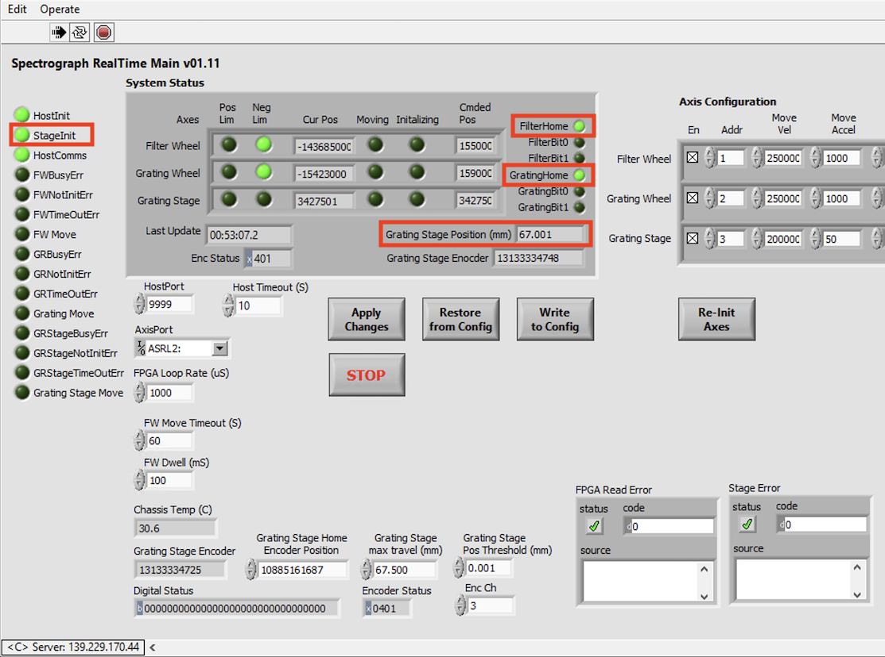

.. This is a template for troubleshooting when some part of the observatory enters an abnormal state. This comment may be deleted when the template is copied to the destination.

.. Review the README in this procedure's directory on instructions to contribute.
.. Static objects, such as figures, should be stored in the _static directory. Review the _static/README in this procedure's directory on instructions to contribute.
.. Do not remove the comments that describe each section. They are included to provide guidance to contributors.
.. Do not remove other content provided in the templates, such as a section. Instead, comment out the content and include comments to explain the situation. For example:
	- If a section within the template is not needed, comment out the section title and label reference. Include a comment explaining why this is not required.
    - If a file cannot include a title (surrounded by ampersands (#)), comment out the title from the template and include a comment explaining why this is implemented (in addition to applying the ``title`` directive).

.. Include one Primary Author and list of Contributors (comma separated) between the asterisks (*):
.. |author| replace:: *Yijung Kang*
.. If there are no contributors, write "none" between the asterisks. Do not remove the substitution.
.. |contributors| replace:: *Erik Dennihy, Jacqueline Seron, Manuel Gomez, Kristopher Mortensen*

.. This is the label that can be used as for cross referencing this procedure.
.. Recommended format is "Directory Name"-"Title Name"  -- Spaces should be replaced by hyphens.
.. _LATISS-Troubleshooting-ATspectrograph-Recovery:
.. Each section should includes a label for cross referencing to a given area.
.. Recommended format for all labels is "Title Name"-"Section Name" -- Spaces should be replaced by hyphens.
.. To reference a label that isn't associated with an reST object such as a title or figure, you must include the link an explicit title using the syntax :ref:`link text <label-name>`.
.. An error will alert you of identical labels during the build process.

####################################################################################################
ATSpectrograph Recovery
####################################################################################################

.. _ATspectrograph-Recovery-Overview:

Overview
========

This procedure outlines the steps to recover the ATSpectrograph when it fails during script execution. 
These issues typically arise after a reset in the ATSpectrograph cRIO, or while enabling the ATSpectrograph CSC. 
Potential root causes of the failure might include mechanism timeouts, miscommunication, and a range of other contributing factors. 

.. admonition:: Some relevant notes:

    * LATISS has three moving mechanisms, apart from the Bonn shutter: filter wheel, grating wheel and grating linear stage.

    * In this document the grating linear stage will be also named as linear stage or grating stage.

    * The most frequent position during operations is close to 67 mm. 
      This position is set every time the script :file:`auxtel/standard_scripts/daytime_checkout/latiss_checkout.py` is run. 
      **If by any reason the grating stage is moved to a different position during daytime, please do not forget to run the script afterwards**.

     You can find more information on the ATSpectrograph in the `LSST Auxiliary Telescope Spectrograph AS_BUILT`_ document.

.. _`LSST Auxiliary Telescope Spectrograph AS_BUILT`: https://docushare.lsstcorp.org/docushare/dsweb/Get/Document-30997/LSST%20AT%20Spectrograph%20AS_BUILT%20Documentation%20(1).docx 

.. _ATspectrograph-Recovery-LinearStage:

Part A: Linear Stage Recovery
=============================

.. _ATspectrograph-Recovery-LinearStage-Error:

Error Diagnosis
---------------

There are a few different common error modes which can result in an ATSpectrograph failure. 
If the ATSpectrograph goes in fault state and cannot be re-enabled, it is likely that you will need to follow this procedure to recover. 

Some examples include:

* You get a timeout error related to the self.latiss.setup_instrument method when running a script like :file:`auxtel/standard_scripts/daytime_checkout/latiss_checkout.py` or another. Check the error message (similar to the :ref:`error message <error-message-latiss-checkout>` shown below). 

* There is an error with the linear stage position while enabling the ATSpectrograph CSC, such as the :ref:`error message <error-message-stage-enabling>` shown below.

.. _`OBS-272`: https://rubinobs.atlassian.net/browse/OBS-272

.. _error-message-latiss-checkout:
.. code-block:: text
    :caption: Error message after timeout

    2023/11/03 17:17:52 TAIError in runTraceback (most recent call last):
    
    File "/opt/lsst/software/stack/conda/envs/lsst-scipipe-7.0.1/lib/python3.11/asyncio/tasks.py", line 500, in wait_for return fut.result() ^^^^^^^^^^^^
    File "/opt/lsst/software/stack/conda/envs/lsst-scipipe-7.0.1/lib/python3.11/site-packages/lsst/ts/salobj/topics/remote_command.py",
    line 239, in _get_next_ackcmd await self._next_ack_event.wait()
    
    File "/opt/lsst/software/stack/conda/envs/lsst-scipipe-7.0.1/lib/python3.11/asyncio/locks.py",
    
    line 213, in wait await fut asyncio.exceptions.CancelledError The above exception was the direct cause of the following
    exception: Traceback (most recent call last): File "/opt/lsst/software/stack/conda/envs/lsst-scipipe-7.0.1/lib/python3.11/site-packages/lsst/ts/salobj/topics/remote_command.py", line 189, in next_ackcmd ackcmd = await self._wait_task
    
    ^^^^^^^^^^^^^^^^^^^^^
    File "/opt/lsst/software/stack/conda/envs/lsst-scipipe-7.0.1/lib/python3.11/site-packages/lsst/ts/salobj/topics/remote_command.py",
 
    line 214, in _basic_next_ackcmd ackcmd = await asyncio.wait_for
    ( ^^^^^^^^^^^^^^^^^^^^^^^ File "/opt/lsst/software/stack/conda/envs/lsst-scipipe-7.0.1/lib/python3.11/asyncio/tasks.py", line 502,
    in wait_for raise exceptions.TimeoutError() from exc TimeoutError During handling of the above exception, another exception occurred:
    Traceback (most recent call last): File "/opt/lsst/software/stack/conda/envs/lsst-scipipe-7.0.1/lib/python3.11/site-packages/lsst/ts/salobj/base_script.py",
    line 603, in do_run await self._run_task File "/net/obs-env/auto_base_packages/ts_standardscripts/python/lsst/ts/standardscripts/auxtel/daytime_checkout/latiss_checkout.py", line 110, in run await self.latiss.setup_instrument( File "/net/obs-env/auto_base_packages/ts_observatory_control/python/lsst/ts/observatory/control/auxtel/latiss.py", line 176, in setup_instrument await self.setup_atspec( File "/net/obs-env/auto_base_packages/ts_observatory_control/python/lsst/ts/observatory/control/auxtel/latiss.py", line 242, in setup_atspec await asyncio.gather(*setup_coroutines) File "/opt/lsst/software/stack/conda/envs/lsst-scipipe-7.0.1/lib/python3.11/site-packages/lsst/ts/salobj/topics/remote_command.py", line 416, in set_start return await self.start(timeout=timeout, wait_done=wait_done) ^^^^^^^^^^^^^^^^^^^^^^^^^^^^^^^^^^^^^^^^^^^^^^^^^^^^^^ File "/opt/lsst/software/stack/conda/envs/lsst-scipipe-7.0.1/lib/python3.11/site-packages/lsst/ts/salobj/topics/remote_command.py", line 487, in start return await cmd_info.next_ackcmd(timeout=timeout)
 
 
    ^^^^^^^^^^^^^^^^^^^^^^^^^^^^^^^^^^^^^^^^^^^
    File "/opt/lsst/software/stack/conda/envs/lsst-scipipe-7.0.1/lib/python3.11/site-packages/lsst/ts/salobj/topics/remote_command.py",
    line 205,
    in next_ackcmd raise base.AckTimeoutError( lsst.ts.salobj.base.AckTimeoutError: msg='Timed out waiting for command acknowledgement',
    ackcmd=(ackcmd private_seqNum=1137560160, ack=<SalRetCode.CMD_NOACK: -301>, error=0, result='No command acknowledgement seen')

.. _error-message-stage-enabling:
.. code-block:: text
    :caption: Error message while enabling ATSpectrograph CSC

    2025/01/28 17:40:46 TAI
    Cannot get information from model for linear stage.
    Traceback (most recent call last):
    File "/opt/lsst/software/stack/miniconda/lib/python3.11/site-packages/lsst/ts/atspectrograph/atspec_csc.py", line 234, in end_enable
    state = await self.model.query_gs_status(self.want_connection)
    ^^^^^^^^^^^^^^^^^^^^^^^^^^^^^^^^^^^^^^^^^^^^^^^^^^^^^^
    File "/opt/lsst/software/stack/miniconda/lib/python3.11/site-packages/lsst/ts/atspectrograph/model.py", line 306, in query_gs_status
    ret_val = await self.run_command("?LSS\r\n", want_connection=want_connection)
    ^^^^^^^^^^^^^^^^^^^^^^^^^^^^^^^^^^^^^^^^^^^^^^^^^^^^^^^^^^^^^^^^^^^
    File "/opt/lsst/software/stack/miniconda/lib/python3.11/site-packages/lsst/ts/atspectrograph/model.py", line 577, in run_command
    raise e
    File "/opt/lsst/software/stack/miniconda/lib/python3.11/site-packages/lsst/ts/atspectrograph/model.py", line 571, in run_command
    read_bytes = await asyncio.wait_for(
    ^^^^^^^^^^^^^^^^^^^^^^^
    File "/opt/lsst/software/stack/miniconda/lib/python3.11/asyncio/tasks.py", line 489, in wait_for
    return fut.result()
    ^^^^^^^^^^^^
    File "/opt/lsst/software/stack/miniconda/lib/python3.11/asyncio/streams.py", line 655, in readuntil
    raise exceptions.IncompleteReadError(chunk, None)
    asyncio.exceptions.IncompleteReadError: 1 bytes read on a total of undefined expected bytes

.. _ATspectrograph-Recovery-LinearStage-Procedure:

Procedure Steps
---------------

.. warning::
   
   The procedure will require the user to open the AuxTel EUI, to use telnet commands to directly command the ATSpectrograph cRIO, and to use the script queue.
   Exercise these steps with **extreme caution**.

A healthy status in ATSpectrograph will look as the following screenshot, in which the linear stage, grating and filter wheels are homed/initialized, and the linear stage position is 67mm.

.. _SpectrographEUI:

    ATSpectrograph EUI healthy status

After a fault in the ATSpectrograh, you may see that one of the status lights on the left-hand side of the EUI is red, such as the FWTimeOutErr light indicating that the filter wheel did not reach it's commanded position.

To recover the ATSpectrograph we need to clear these faults and ensure the stages are in their correct state and position as shown in the screenshot above:

#. Open the ATSpectrograph EUI, :ref:`connecting to AuxTel EUI desktop computer <AuxTel-Non-Standard-Operations-AuxTel-EUI-Access>` ACE spectrograph (*139.229.170.44:8000/Spectrograph.html*).

#. The first thing to try, if the fault is due to a timeout error or one of the status lights on the left-hand side of the EUI is illuminated red, is to click the :guilabel:`Re-init Axes` button on the EUI. 
   If the fault is cleared and the status lights are returned to normal, the axes are homed/initialized, and the linear stage position is 67mm, you can re-enable the ATSpectrograph CSC and continue observing, skipping the rest of the procedure.

#. If you were unable to clear the fault with the Re-init axes button, a restart of the cRIO will be required. 
   Before restarting, check the grating stage position in the EUI. 
   To ensure it initializes properly after the reboot, we will need to move the linear stage to its home position before rebooting the cRIO using telnet commands. 
   If the cRIO is rebooted without first homing the stage, it can lose its position and show an incorrect position, often -324mm which is well beyond its operational range.  

   .. figure:: ./_static/EUI-1reboot.png
      :width: 500px
           
      ATSpectrograph EUI with bad linear stage position.

4.  Use telnet commands to move the linear stage to its negative limit:

    a. Check ATSpectrograph CSC is in ``STANDBY`` Status.
    #. Open a terminal on your local machine. If the cRIO was recently rebooted, make sure that at least 60 seconds have passed since the cRIO EUI is accesible to give the application time to complete its setup.
    #. Execute the command :file:`telnet auxtel-latiss-crio.cp.lsst.org 9999` to connect directly to the cRIO. 
    #. Note that the port you are using needs to remain clear in order for the cRIO to connect to the CSC, so the EUI is setup to boot users from this port after 5 seconds if no commands are sent.
       **You may need to reconnect via telnet several times during this process if you get booted**. 
    #. Execute :file:`!LSI`. This command will move the linear stage to its negative limit.
    #. Execute :file:`!LSL`. This command will display the status of the limit switches of the linear stage. 
       It should return a :guilabel:`-` sign, indicating that the linear stage reached the negative limit and the switch is pressed.
    #. In the :ref:`EUI <SpectrographEUI>`, the green indicator for the grating stage negative limit should have been activated.
    #. The position of the linear stage may still read -324mm after this move has been commanded, and that is okay. 
       To recover the position of the linear stage, we now need to reboot the cRIO. 

5.  With the linear stage in its negative limit position, power cycle the ATSpectrograph cRIO:

    a. Check ATSpectrograph CSC is in ``STANDBY`` Status.
    #. Connect to *http://aux-pdu-spectrograph.cp.lsst.org/* (only accessible from the summit).
    #. Log in with the username and password available in the AuxTel 1Password AuxTel vault.
    #. For **outlet 2** (power and cRIO) click :guilabel:`Off`, wait 10 seconds, and then click :guilabel:`On`. 

    .. figure:: ./_static/power-cycle-ATSpec.png
       :width: 500px
      
       PDU webpage to power On/Off ATSpectrograph.

6. When the cRIO is rebooted, it might take a few minutes to see the EUI again in the webpage. 
   If the EUI does not come up on its own after 10 minutes, then a second cRIO reboot is necessary.
        
7. Once the EUI is accessible, the mechanisms should be homed/initialized, the negative limit green indicator should be active for the three mechanisms, and the linear stage position should be close to 0mm.
   
   .. figure:: ./_static/EUI-2reboot.png
      :width: 500px
           
      ATSpectrograph EUI after successful reboot.

8. At this point, you can re-enable the ATSpectrograph CSC. 

9. Finally, in order ensure everything is working and the linear stage is in the correct position, execute the :file:`auxtel/daytime_checkout/latiss_checkout.py` script. 
   If it finishes without error, check again on the EUI that the linear stage position is 67mm. 

.. _ATspectrograph-Recovery-FilterGratingWheels:

Part B: Re-Initialize Filter and Grating Wheels
===============================================

.. _ATspectrograph-Recovery-FilterGratingWheels-Error:

Error Diagnosis
---------------

Re-initializing the filter and grating wheels is a procedure that is sometimes necessary when recovering the ATSpectrograph system, 
particularly after the motor control sequence has been interrupted or lost its positional reference. It is crucial to stop and perform a 
thorough diagnosis to determine the underlying cause before proceeding. The first step is always to diagnose whether a re-initialization 
is truly required.

If an initialization is required, the ATSpectrograph will **not display** ``FilterHome`` and/or ``GratingHome`` as enabled (green), and instead 
will produce a red ``FWNotInitErr`` and/or ``GRNotInitErr`` (as seen in the :ref:`ATSpectrograph EUI <SpectrographEUI>` above).

.. admonition:: Do Not Attempt Multiple Initializations!
   :class: error
   
   | It is *not recommended* to repeat the initialization process multiple times if the first attempt fails. 
     The root cause of the failure may be due to hardware issues, and repeating the indexing procedure can potentially worsen the problem. 
   
   | Therefore, if an initial attempt to re-initialize is unsuccessful, **submit a ticket** right away and **alert the day crew**. 
   

.. _ATspectrograph-Recovery-FilterGratingWheels-Procedure:

Procedure Steps
---------------

.. warning::
   
   The procedure will require the user to open the AuxTel EUI, to use telnet commands to directly command the ATSpectrograph cRIO, and to use the script queue.
   Exercise these steps with **extreme caution**.

1.  Open the ATSpectrograph EUI, :ref:`connecting to AuxTel EUI desktop computer <AuxTel-Non-Standard-Operations-AuxTel-EUI-Access>` ACE spectrograph (*139.229.170.44:8000/Spectrograph.html*).

2.  The first thing to try, if the fault is due to a timeout error or one of the status lights on the left-hand side of the EUI is illuminated red, is to click the :guilabel:`Re-init Axes` button on the EUI. 
    If the fault is cleared and the status lights are returned to normal, the axes are homed/initialized, and the linear stage position is 67mm, you can re-enable the ATSpectrograph CSC and continue observing, skipping the rest of the procedure.
      
    .. note:: 
      
      If the :guilabel:`Re-init Axes` is **not working**, continue with the rest of this procedure.

3.  Use telnet commands to move the linear stage to its negative limit:

    a. Check ATSpectrograph CSC is in ``STANDBY`` Status.
    #. Open a terminal on your local machine. If the cRIO was recently rebooted, make sure that at least 60 seconds have passed since the cRIO EUI is accesible to give the application time to complete its setup.
    #. Execute the command :file:`telnet auxtel-latiss-crio.cp.lsst.org 9999` to connect directly to the cRIO. 
    #. Note that the port you are using needs to remain clear in order for the cRIO to connect to the CSC, so the EUI is setup to boot users from this port after 5 seconds if no commands are sent.
       **You may need to reconnect via telnet several times during this process if you get booted**. 
    #. Execute the commands :file:`?FWS` and :file:`?GRS`. These commands will display the current filter wheel and grating wheel statuses, respectively.
       
       - Each command will return an array of three characters: ``X # Y``:

       +---------------------------------+----------------------------+--------------------------+
       | ``X``: Current State            | ``#``: Current Position    | ``Y``: Error Code        |
       +=================================+============================+==========================+
       || ``I`` - Initializing/Homing    || 0                         || ``N`` - None            |
       || ``M`` - Moving                 || 1                         || ``B`` - Busy            |
       || ``S`` - Stationary/Not Moving  || 2                         || ``I`` - Not Initialized |
       || ``X`` - Not at Filter Position || 3                         || ``T`` - Move Timed Out  |
       +---------------------------------+----------------------------+--------------------------+

    #. If either of the error codes report  **Not Initialized**, then the filter and/or grating wheel needs to be initialized:
       
       - Initialize Filter Wheel :math:`\rightarrow` ``!FWS``
       - Initialize Grating Wheel :math:`\rightarrow` ``!GRS``

    #. Check the statuses again to verify that the filter and gratings wheels are initialized.

       .. figure:: ./_static/ATSpectrograph_FilterGratingStatus.png
         :width: 500px
         
         Filter and Grating Status - Initialized
  
4. At this point, you can re-enable the ATSpectrograph CSC. 

5. Finally, in order ensure everything is working and the linear stage is in the correct position, execute the :file:`auxtel/daytime_checkout/latiss_checkout.py` script. 
   If it finishes without error, check again on the EUI that the Filter and Grating Wheels are homed and there are no errors. 

.. _ATspectrograph-Recovery-Post-Condition:

Post-Condition
==============

.. This section should provide a simple overview of conditions or results after executing the procedure; for example, state of equipment or resulting data products.
.. It is preferred to include them as a bulleted or enumerated list.
.. Please provide screenshots of the software status or relevant display windows to confirm.
.. Do not include actions in this section. Any action by the user should be included in the end of the Procedure section below. For example: Do not include "Verify the telescope azimuth is 0 degrees with the appropriate command." Instead, include this statement as the final step of the procedure, and include "Telescope is at 0 degrees." in the Post-condition section.

- Errors should have been cleared from the EUI.
- The grating linear stage should have been set to 67mm.
- Both the filter and grating wheels are initialized.
- All mechanisms are homed, and LATISS is ready for operations.

.. _ATspectrograph-failed-Contingency:

Contingency
===========

If the procedure was not successful, report the issue in `#summit_auxtel`_ and/or activate the :ref:`Out of hours support <Safety-out-of-hours-support>`.

.. _#summit_auxtel: https://lsstc.slack.com/archives/C01K4M6R4AH

