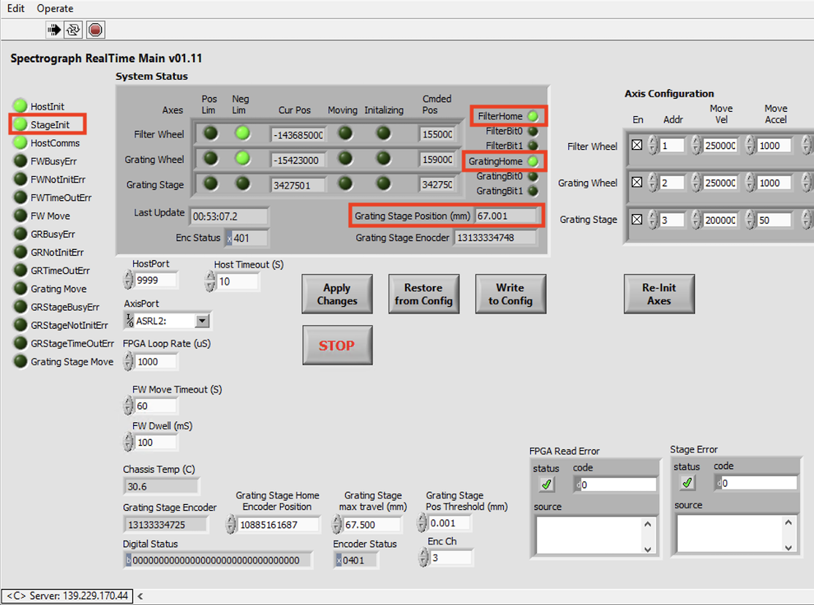

.. This is a template for troubleshooting when some part of the observatory enters an abnormal state. This comment may be deleted when the template is copied to the destination.

.. Review the README in this procedure's directory on instructions to contribute.
.. Static objects, such as figures, should be stored in the _static directory. Review the _static/README in this procedure's directory on instructions to contribute.
.. Do not remove the comments that describe each section. They are included to provide guidance to contributors.
.. Do not remove other content provided in the templates, such as a section. Instead, comment out the content and include comments to explain the situation. For example:
	- If a section within the template is not needed, comment out the section title and label reference. Include a comment explaining why this is not required.
    - If a file cannot include a title (surrounded by ampersands (#)), comment out the title from the template and include a comment explaining why this is implemented (in addition to applying the ``title`` directive).

.. Include one Primary Author and list of Contributors (comma separated) between the asterisks (*):
.. |author| replace:: *Yijung Kang*
.. If there are no contributors, write "none" between the asterisks. Do not remove the substitution.
.. |contributors| replace:: *Erik Dennihy, Jacqueline Seron, Manuel Gomez*

.. This is the label that can be used as for cross referencing this procedure.
.. Recommended format is "Directory Name"-"Title Name"  -- Spaces should be replaced by hyphens.
.. _LATISS-Troubleshooting-ATspectrograph-failed:
.. Each section should includes a label for cross referencing to a given area.
.. Recommended format for all labels is "Title Name"-"Section Name" -- Spaces should be replaced by hyphens.
.. To reference a label that isn't associated with an reST object such as a title or figure, you must include the link an explicit title using the syntax :ref:`link text <label-name>`.
.. An error will alert you of identical labels during the build process.

####################################################################################################
ATSpectrograph Recovery
####################################################################################################

.. _ATspectrograph-Recovery-Overview:

Overview
========

.. In one or two sentences, explain when this troubleshooting procedure needs to be used. Describe the symptoms that the user sees to use this procedure. 

.. what the doc covers
.. what happens, symptom
.. why it happens
.. when it happens

This procedure outlines the steps to recover the ATSpectrograph when it fails during script execution. These issues typically arise after a reset in the ATSpectrograph cRIO, or while enabling the ATSpectrograph CSC. Potential root causes of the failure might include mechanism timeouts, miscommunication, and a range of other contributing factors

.. python/lsst/ts/standardscripts/data/scripts/auxtel/daytime_checkout/latiss_checkout.py

.. Some needed context

.. admonition:: Some relevant notes:

    * LATISS has three moving mechanisms, apart from the Bonn shutter: filter wheel, grating wheel and grating linear stage.

    * In this document the grating linear stage will be also named as linear stage or grating stage.

    * The grating stage position ranges between 67 mm and 140 mm from the rotator flange. The hard limit is 65 mm.

    * The most frequent position during operations is close to 67 mm. This position is set every time the script :file:`auxtel/standard_scripts/daytime_checkout/latiss_checkout.py` is run. **If by any reason the grating stage is moved to a different position during daytime, please do not forget to run the script afterwards**.

     You can find more information on the ATSpectrograph in the `LSST Auxiliary Telescope Spectrograph AS_BUILT`_ document.

.. _`LSST Auxiliary Telescope Spectrograph AS_BUILT`: https://docushare.lsstcorp.org/docushare/dsweb/Get/Document-30997/LSST%20AT%20Spectrograph%20AS_BUILT%20Documentation%20(1).docx 

.. _ATspectrograph-Recovery-Error-Diagnosis:

Error diagnosis
===============

.. This section should provide simple overview of known or suspected causes for the error.
.. It is preferred to include them as a bulleted or enumerated list.
.. Post screenshots of the error state or relevant tracebacks.

* You get a timeout error after running a script like :file:`auxtel/standard_scripts/daytime_checkout/latiss_checkout.py` or another. Check the error message (similar to the :ref:`error message <error-message-latiss-checkout>` shown below). 

* There is an error with the linear stage while enabling the ATSpectrograph CSC, such as the :ref:`error message <error-message-stage-enabling>` shown below.

* There is a difference between the **grating stage position** shown in the EUI and the nominal position (approximately 67 mm). You can find the ``Grating Stage position (mm)`` field in the ACE spectrograph tab, shown in the :ref:`step 2.5 <SpectrographEUI>` image. This means the **grating stage encoder was not correctly initialized**, so the read encoder position is not the real physical value, causing the next move command to fail. This issue first occurred on February 23, 2023. The stage position read 324 mm after a reset, and afterwards a move command to +67 mm failed with a timeout (`OBS-272`_).

.. _`OBS-272`: https://rubinobs.atlassian.net/browse/OBS-272

.. _error-message-latiss-checkout:
.. code-block:: text
    :caption: Error message after timeout

    2023/11/03 17:17:52 TAIError in runTraceback (most recent call last):
    
    File "/opt/lsst/software/stack/conda/envs/lsst-scipipe-7.0.1/lib/python3.11/asyncio/tasks.py", line 500, in wait_for return fut.result() ^^^^^^^^^^^^
    File "/opt/lsst/software/stack/conda/envs/lsst-scipipe-7.0.1/lib/python3.11/site-packages/lsst/ts/salobj/topics/remote_command.py",
    line 239, in _get_next_ackcmd await self._next_ack_event.wait()
    
    File "/opt/lsst/software/stack/conda/envs/lsst-scipipe-7.0.1/lib/python3.11/asyncio/locks.py",
    
    line 213, in wait await fut asyncio.exceptions.CancelledError The above exception was the direct cause of the following
    exception: Traceback (most recent call last): File "/opt/lsst/software/stack/conda/envs/lsst-scipipe-7.0.1/lib/python3.11/site-packages/lsst/ts/salobj/topics/remote_command.py", line 189, in next_ackcmd ackcmd = await self._wait_task
    
    ^^^^^^^^^^^^^^^^^^^^^
    File "/opt/lsst/software/stack/conda/envs/lsst-scipipe-7.0.1/lib/python3.11/site-packages/lsst/ts/salobj/topics/remote_command.py",
 
    line 214, in _basic_next_ackcmd ackcmd = await asyncio.wait_for
    ( ^^^^^^^^^^^^^^^^^^^^^^^ File "/opt/lsst/software/stack/conda/envs/lsst-scipipe-7.0.1/lib/python3.11/asyncio/tasks.py", line 502,
    in wait_for raise exceptions.TimeoutError() from exc TimeoutError During handling of the above exception, another exception occurred:
    Traceback (most recent call last): File "/opt/lsst/software/stack/conda/envs/lsst-scipipe-7.0.1/lib/python3.11/site-packages/lsst/ts/salobj/base_script.py",
    line 603, in do_run await self._run_task File "/net/obs-env/auto_base_packages/ts_standardscripts/python/lsst/ts/standardscripts/auxtel/daytime_checkout/latiss_checkout.py", line 110, in run await self.latiss.setup_instrument( File "/net/obs-env/auto_base_packages/ts_observatory_control/python/lsst/ts/observatory/control/auxtel/latiss.py", line 176, in setup_instrument await self.setup_atspec( File "/net/obs-env/auto_base_packages/ts_observatory_control/python/lsst/ts/observatory/control/auxtel/latiss.py", line 242, in setup_atspec await asyncio.gather(*setup_coroutines) File "/opt/lsst/software/stack/conda/envs/lsst-scipipe-7.0.1/lib/python3.11/site-packages/lsst/ts/salobj/topics/remote_command.py", line 416, in set_start return await self.start(timeout=timeout, wait_done=wait_done) ^^^^^^^^^^^^^^^^^^^^^^^^^^^^^^^^^^^^^^^^^^^^^^^^^^^^^^ File "/opt/lsst/software/stack/conda/envs/lsst-scipipe-7.0.1/lib/python3.11/site-packages/lsst/ts/salobj/topics/remote_command.py", line 487, in start return await cmd_info.next_ackcmd(timeout=timeout)
 
 
    ^^^^^^^^^^^^^^^^^^^^^^^^^^^^^^^^^^^^^^^^^^^
    File "/opt/lsst/software/stack/conda/envs/lsst-scipipe-7.0.1/lib/python3.11/site-packages/lsst/ts/salobj/topics/remote_command.py",
    line 205,
    in next_ackcmd raise base.AckTimeoutError( lsst.ts.salobj.base.AckTimeoutError: msg='Timed out waiting for command acknowledgement',
    ackcmd=(ackcmd private_seqNum=1137560160, ack=<SalRetCode.CMD_NOACK: -301>, error=0, result='No command acknowledgement seen')

.. _error-message-stage-enabling:
.. code-block:: text
    :caption: Error message while enabling ATSpectrograph CSC

    2025/01/28 17:40:46 TAI
    Cannot get information from model for linear stage.
    Traceback (most recent call last):
    File "/opt/lsst/software/stack/miniconda/lib/python3.11/site-packages/lsst/ts/atspectrograph/atspec_csc.py", line 234, in end_enable
    state = await self.model.query_gs_status(self.want_connection)
    ^^^^^^^^^^^^^^^^^^^^^^^^^^^^^^^^^^^^^^^^^^^^^^^^^^^^^^
    File "/opt/lsst/software/stack/miniconda/lib/python3.11/site-packages/lsst/ts/atspectrograph/model.py", line 306, in query_gs_status
    ret_val = await self.run_command("?LSS\r\n", want_connection=want_connection)
    ^^^^^^^^^^^^^^^^^^^^^^^^^^^^^^^^^^^^^^^^^^^^^^^^^^^^^^^^^^^^^^^^^^^
    File "/opt/lsst/software/stack/miniconda/lib/python3.11/site-packages/lsst/ts/atspectrograph/model.py", line 577, in run_command
    raise e
    File "/opt/lsst/software/stack/miniconda/lib/python3.11/site-packages/lsst/ts/atspectrograph/model.py", line 571, in run_command
    read_bytes = await asyncio.wait_for(
    ^^^^^^^^^^^^^^^^^^^^^^^
    File "/opt/lsst/software/stack/miniconda/lib/python3.11/asyncio/tasks.py", line 489, in wait_for
    return fut.result()
    ^^^^^^^^^^^^
    File "/opt/lsst/software/stack/miniconda/lib/python3.11/asyncio/streams.py", line 655, in readuntil
    raise exceptions.IncompleteReadError(chunk, None)
    asyncio.exceptions.IncompleteReadError: 1 bytes read on a total of undefined expected bytes

.. _ATspectrograph-Recovery-Procedure-Steps:

Procedure Steps
===============

**The procedure will require to open the AuxTel EUI, to use telnet commands and to use the script queue.**

A healthy status in ATSpectrograph will look as the following screenshot, in which the linear stage, grating and filter wheels are homed/initialized, and the linear stage position is 67mm.

.. _SpectrographEUI:

    ATSpectrograph EUI healthy status.

To recover the ATSpectrograph:

#. Open the ATSpectrograph EUI, :ref:`connecting to AuxTel EUI desktop computer <AuxTel-Non-Standard-Operations-AuxTel-EUI-Access>` ACE spectrograph (*139.229.170.44:8000/Spectrograph.html*).

#. First thing to try is to click the :guilabel:`Re-init Axes` button on the EUI. If the fault is cleared, the axes are homed/initialized, and the linear stage position is 67mm, keep on observing and proceed with the daytime checkouts.

#. If the fault doesn't clear, power cycle the ATSpectrograph cRIO:
    a. Check ATSpectrograph CSC is in ``STANDBY`` Status.
    #. Connect to *http://aux-pdu-spectrograph.cp.lsst.org/* (only accessible from the summit).
    #. Log in with the username and password available in the AuxTel 1Password AuxTel vault.
    #. For **outlet 2** (power and cRIO) click :guilabel:`Off`, wait 10 seconds, and then click :guilabel:`On`. 

   .. figure:: ./_static/power-cycle-ATSpec.png
      :width: 500px
      
      PDU webpage to power On/Off ATSpectrograph.

#. When the cRIO is rebooted, it might take up to a minute to see the EUI again. A few times the EUI wasn't accesible at all, and a second cRIO reboot was necessary.
    
#. Check the grating stage position in the EUI. Even though it did not move during the cRIO reboot, it should be close to -324mm.
   
   .. figure:: ./_static/EUI-1reboot.png
      :width: 500px
           
      ATSpectrograph EUI after the first reboot.

#. Use telnet commands to move the linear stage to its negative limit:
    a. Open a new console. Make sure that at least 60 seconds have passed since the EUI is accesible, to give the application time to complete its setup.
    #. Execute :file:`telnet auxtel-latiss-crio.cp.lsst.org 9999`
    #. Note that the port will boot after 5 seconds if no commands are sent.
    #. Execute :file:`!LSI`. This command will move the stage to its negative limit.
    #. Execute :file:`!LSL`. This command will display the status of the limit switches of the linear stage. It should return a :guilabel:`-` sign, indicating that the stage reached the negative limit and the switch is pressed.
    #. In the :ref:`EUI <SpectrographEUI>`, the green indicator for the grating stage negative limit should have been activated.
    
#. Do a second reboot of the cRIO. Once the EUI is accessible, the mechanisms should be homed/initialized, the negative limit green indicator should be active for the three mechanisms, and the linear stage position should close to 0mm.
   
   .. figure:: ./_static/EUI-2reboot.png
      :width: 500px
           
      ATSpectrograph EUI after the second reboot.

#. At this point, execute the :file:`auxtel/standard_scripts/daytime_checkout/latiss_checkout.py` script. If it finishes without error, check that the linear stage position is 67mm. 

.. _ATspectrograph-Recovery-Post-Condition:

Post-Condition
==============

.. This section should provide a simple overview of conditions or results after executing the procedure; for example, state of equipment or resulting data products.
.. It is preferred to include them as a bulleted or enumerated list.
.. Please provide screenshots of the software status or relevant display windows to confirm.
.. Do not include actions in this section. Any action by the user should be included in the end of the Procedure section below. For example: Do not include "Verify the telescope azimuth is 0 degrees with the appropriate command." Instead, include this statement as the final step of the procedure, and include "Telescope is at 0 degrees." in the Post-condition section.

Errors should have been cleared from the EUI, and the grating linear stage should have been set to 67mm. All mechanisms are homed, and LATISS is ready for operations.

.. _ATspectrograph-failed-Contingency:

Contingency
===========

If the procedure was not successful, report the issue in `#summit_auxtel`_ and/or activate the :ref:`Out of hours support <Safety-out-of-hours-support>`.

.. _#summit_auxtel: https://lsstc.slack.com/archives/C01K4M6R4AH

