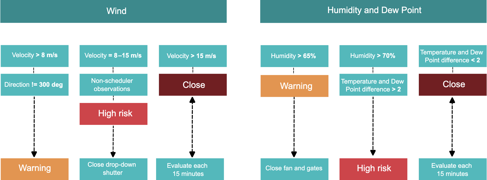
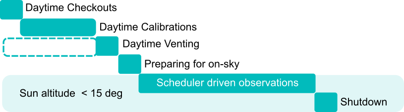

.. Review the README in this directory on instructions to contribute.
.. Static objects, such as figures, should be stored in the _static directory. Review the _static/README in this file's directory on instructions to contribute.
.. Do not remove the comments that describe each section. They are included to provide guidance to contributors.
.. Do not remove other content provided in the templates, such as a section. Instead, comment out the content and include comments to explain the situation. For example:
    - If a section within the template is not needed, comment out the section title and label reference. Do not delete the expected section title, reference or related comments provided from the template.
    - If a file cannot include a title (surrounded by ampersands (#)), comment out the title from the template and include a comment explaining why this is implemented (in addition to applying the ``title`` directive).

.. This is the label that can be used as for cross referencing this file.
.. Recommended format is "Directory Name"-"Title Name"  -- Spaces should be replaced by hyphens.
.. _AuxTel-Auxiliary-Telescope-Operations:
.. Each section should includes a label for cross referencing to a given area.
.. Recommended format for all labels is "Title Name"-"Section Name" -- Spaces should be replaced by hyphens.
.. To reference a label that isn't associated with an reST object such as a title or figure, you must include the link an explicit title using the syntax :ref:`link text <label-name>`.
.. An error will alert you of identical labels during the build process.

##############################
Auxiliary Telescope Operations
##############################

.. Place in the admonition below all important AuxTel news and announcements. 
    If note text runs over a line, make sure the lines wrap and are indented to
    the same level as the note tag. If formatting is incorrect, part of the note
    might not render.
    
    Notes can have more than one paragraph. Successive paragraphs must
    indent to the same level as the rest of the note.

.. admonition:: Auxiliary Telescope Important Announcements

   October 2024

.. This section should provide a brief, top-level description of the page.

.. _Auxiliary-Telescope-Operations-Introduction:

Introduction to the Auxiliary Telescope
=======================================
In-depth information on every component of the Auxiliary telescope can be found here:

.. toctree::
   :glob:
   :titlesonly:
  
   Components/*
   Components/*/*

.. _Auxiliary-Telescope-Weather-Constraints:

Weather Constraints
===================

Before deciding to open consult the :ref:`weather conditions and constraints <Observing-Constraints-AuxTel-Weather-Constraints>` to observe with AuxTel. For quick reference, below the current AuxTel weather constraints overview (cloud coverage not included).

.. For the left-hand side navigation menu 

.. toctree:: 
   :glob:
   :hidden:
   :titlesonly:
   :caption: Weather Constraints
   
   ../Observing-Constraints/AuxTel/index.rst

.. _Auxiliary-Telescope-Operations-Standard-Operations:

Operations
===========
AuxTel requires daytime and nighttime operations. Daytime operations focus on performance checks of the telescope mount, dome, mirror, mirror covers, and vents. AuxTel CSC, AuxTel instrument (LATISS) and, data ingestion are also inspected. Daily calibration images are collected. By default, nighttime operations are scheduler-driven.

.. toctree::
   :glob:
   :titlesonly:
   :caption: Standard Operations

   Standard-Operations/index.rst

.. _table-label:

.. table:: Informative AuxTel Telescope Standard Operations

   +--------------------------+-------+-------------------+--------------------------+
   |  Task                    | BLOCK | Data Verification |  Communications          |
   +==========================+=======+===================+==========================+
   | Daytime Checkout         | T17   | | RubinTV         | | #summit_announce       |
   |                          |       | | On-site         | |                        |
   |                          |       |                   | | Dome movement          |
   |                          |       |                   | | AuxTel movement        |
   +--------------------------+-------+-------------------+--------------------------+
   | Daytime Calibrations     | T18   | RubinTV           | | #summit_auxtel         |
   |                          |       |                   | | #summit_announce       |
   |                          |       |                   | | Dome movement          |
   |                          |       |                   | | AuxTel movement        |
   +--------------------------+-------+-------------------+--------------------------+
   | Daytime Venting          | T20   | | Chronograf      | | #summit_auxtel         |
   |                          |       | | On-site         | | #summit_announce       |
   |                          |       |                   | | Dome movement          |
   |                          |       |                   | | AuxTel movement        |
   +--------------------------+-------+-------------------+--------------------------+
   | Preparing for on-sky     | T19   | LOVE              | | #summit_auxtel         |
   |                          |       |                   | | #summit_announce       |
   +--------------------------+-------+-------------------+--------------------------+
   | Scheduler                | T19   | | RubinTV         |                          |
   |                          |       | | LOVE            |                          |
   |                          |       | | Cronograf       |                          |
   +--------------------------+-------+-------------------+--------------------------+
   | Shutdown                 |  ---  | | LOVE            | | #summit_auxtel         |
   |                          |       | | On-site         | | #summit__daytime_task  |
   +--------------------------+-------+-------------------+--------------------------+

Below an schematic view of the current default AuxTel observations workflow. 

|

.. _Auxiliary-Telescope-Operations-Non-standard-Operations:

In some occasions, AuxTel observations could require a series of engineering non-standard operations and the execution of troubleshooting procedures with associated faults:

.. Non-standard Operations
.. =======================

.. toctree::
    :glob:
    :maxdepth: 5 
    :titlesonly:
    :caption: Non-Standard Operations

    Non-Standard-Operations/index.rst

.. _Auxiliary-Telescope-Operations-Troubleshooting:
.. Troubleshooting
.. ===============

.. toctree::
    :glob:
    :maxdepth: 5 
    :titlesonly:
    :caption: Troubleshooting

    Troubleshooting/index.rst

.. _Auxiliary-Telescope-Operations-SAL-Scripts:
.. SAL Scripts
.. ===========

.. toctree::
   :glob:
   :maxdepth: 3
   :titlesonly:
   :caption: SAL Scripts

   SAL-Scripts/ATCommonSALScripts.rst
