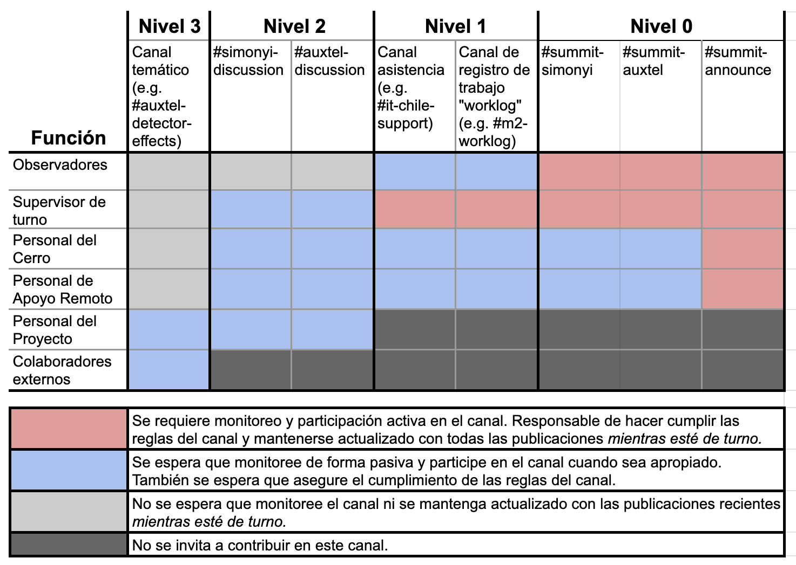

.. This is a template for operational procedures. Each procedure will have its own sub-directory. This comment may be deleted when the template is copied to the destination.

.. Review the README in this procedure's directory on instructions to contribute.
.. Static objects, such as figures, should be stored in the _static directory. Review the _static/README in this procedure's directory on instructions to contribute.
.. Do not remove the comments that describe each section. They are included to provide guidance to contributors.
.. Do not remove other content provided in the templates, such as a section. Instead, comment out the content and include comments to explain the situation. For example:
	- If a section within the template is not needed, comment out the section title and label reference. Include a comment explaining why this is not required.
    - If a file cannot include a title (surrounded by ampersands (#)), comment out the title from the template and include a comment explaining why this is implemented (in addition to applying the ``title`` directive).

.. Include one Primary Author and list of Contributors (comma separated) between the asterisks (*):
.. |author| replace:: *Patrick Ingraham*
.. If there are no contributors, write "none" between the asterisks. Do not remove the substitution.
.. |contributors| replace:: *Jacqueline Seron*, *Ioana Sotuela*

.. This is the label that can be used as for cross referencing this procedure.
.. Recommended format is "Directory Name"-"Title Name"  -- Spaces should be replaced by hyphens.
.. _Daytime-Nighttime-Slack-Channel-Communication-with-Summit-Personnel:
.. Each section should includes a label for cross referencing to a given area.
.. Recommended format for all labels is "Title Name"-"Section Name" -- Spaces should be replaced by hyphens.
.. To reference a label that isn't associated with an reST object such as a title or figure, you must include the link an explicit title using the syntax :ref:`link text <label-name>`.
.. An error will alert you of identical labels during the build process.

############################################################
Comunicaciones en Canales de Slack con el Personal del Cerro
############################################################

El espacio de Slack de Rubin Obs es utilizado por cientos de personas con distintos niveles de interés en las operaciones de la montaña. 
El objetivo de este documento es comunicar el uso aceptable del conjunto específico de canales que están enfocados en las operaciones del cerro durante el día y la noche. 
El documento también describe los canales donde se pueden realizar discusiones más informales y en donde el personal no asignado al cerro puede comunicarse con los equipos de observadores.

Este documento y los casos de uso descritos son específicos para el cerro y no incluye la cultura y el uso general de Slack. 
Para más información sobre la nomenclatura de los canales, la cultura de Slack y las pautas generales de uso consulta `DM Developer's Guide <https://developer.lsst.io/communications/slack-culture.html>`_. 

.. important::
   Tres reglas básicas para el uso - al menos lee esto: 

   1. En general, se recomienda que las personas que no están en la montaña eviten el uso de los canales de nivel 0 y 1. Sin embargo, en esta página se especifican casos excepcionales. Si no estás seguro de si debes publicar en uno de estos canales de nivel 0 ó 1, abstente de hacerlo.

   2. Los trabajos relacionados con los sistemas de la montaña deben publicarse a través de los canales públicos de comunicación, no mediante mensajes directos entre individuos.

   3. Se recomienda utilizar Zoom en lugar de Slack para apoyo extenso ó crítico en tiempo real. 

Para facilitar la presentación, se decidió clasificar a las partes interesadas según las siguientes funciones:

- **Observadores**: Los principales operadores de los sistemas del observatorio. 
  Estos son principalmente los Especialistas en Observación, pero incluyen a cualquier persona que opere activamente el/los telescopio(s).

- **Supervisor del Turno**: Responsable(s) de coordinar las observaciones durante el período de observación actual que coordinan las observaciones. 
  Su función incluye la transmisión de información entre los equipos diurnos y nocturnos (más allá de lo incluido en el informe final del día o noche), así como el brindar apoyo tanto durante la noche como durante el día. 
  También se encargan de resolver dudas, comentarios y filtrar información entre la comunidad en general y el personal del cerro. Actualmente, esta función la desempeña la(s) persona(s) con el cargo de planificador nocturno.

- **Personal del Cerro**: Estas son las personas que están trabajando activamente en el cerro. 
  Esta categoría incluye al Supervisor del triaje (futuro rol), incluso si no está físicamente en el cerro.

- **Personal de Apoyo Remoto**: Personal que asiste o realiza actividades en el cerro de manera remota (por ejemplo, desde la base o Tucson). 
  Son personas que trabajan activamente en un turno de apoyo asistencia o propietarios de un subsistema en el que estén trabajando. 

- **Personal del Proyecto**: Miembros generales del proyecto que tienen cuentas de Slack. 
  Esta es la categoría por defecto para la mayoría de los miembros del proyecto, y en general, las personas avanzan a otras categorías cuando están activamente en turno.
  
Durante el turno, las personas en cada uno de estos roles tendrán responsabilidades variables respecto a la información a la que deben prestar atención y/o responder. 
El objetivo final es facilitar una comunicación efectiva con el personal del cerro concentrando la información en lugares específicos y minimizando distracciones. 

Se reconoce que todo el personal del proyecto es capaz de aportar información útil, sin embargo, a menos que las personas estén involucradas en las tareas en curso, existe una brecha significativa de conocimiento de lo ocurre. 
Hemos desarrollado un canal de comunicación que permite a cualquier persona del proyecto dirigirse al personal clave (por ejemplo, el Planificador Nocturno o el Apoyo Remoto), quienes luego transmiten la información al personal del cerro. 
Este enfoque reduce la cantidad de comunicaciones que el personal del summit necesita monitorear durante sus turnos.  

Para comunicar mejor las expectativas para cada uno de los roles, y demostrando el flujo de información, se ha categorizado la lista de canales de Slack en Niveles.

- **Nivel 0:** Información en tiempo real que los roles designados monitorean constantemente y se espera que reaccionen de inmediato (cuando están de turno e interactuando con sistemas del cerro). 
  Responder a un mensaje puede resultar en la pérdida de tiempo de observación, lo cual es aceptable. 
  La comunicación en estos canales debe ser extremadamente concisa. 
  Se incentiv a las personas que brindan apoyo urgente a hacerlo vía Zoom; no por Slack. 
  Estos canales se distinguen por el prefijo **#summit-** . 

- **Nivel 1:**  Usado para la comunicación asíncronas sobre el estado de los sistemas del cerro. 
  Estos canales son específicos para telescopios o subsistemas, no requieren respuesta inmediata y son monitoreados pasivamente por los observadores en turno. 
  Incluyen canales con el tema "worklog" de subsistemas. 
  Se utilizan principalmente para la comunicación entre el personal del cerro y apoyo externo requerido. 
  Estos canales suelen distinguirse por el sufijo  **#-worklog** or **#-support**.

- **Nivel 2:** Canales de discusión general cuya información y/o contenido no es crítico para las operaciones nocturnas del observatorio. 
  Los supervisores del turno monitorean estos canales para transmitir cualquier información pertinente entre el apoyo externo y los equipos del cerro. 
  Estos canales tienen muchas menos restricciones sobre quién puede participar, lo que es útil para que el equipo en general contribuya con información que consideren importante para las operaciones del cerro, y que luego puede ser filtrada al equipo del cerro.
  
- **Nivel 3:** Canales no asociados directamente con las actividades actuales del cerro. 
  Son canales para trabajo colaborativo, que constituyen la gran mayoría de los canales de Slack.

  Niveles de participación esperados por parte del personal del cerro en los canales de Slack relacionados con la observación.

Para ayudar a mantener los protocolos de comunicación claros, se recomienda utilizar la función :guilabel:`Crear Sección` en Slack para organizar los canales por Nivel. 
Los siguientes son los canales recomendados que se deben incluir en cada sección:

Nivel 0
-------
- #summit-announce
- #summit-simonyi
- #summit-auxtel

Nivel 1
-------
- #xxx-worklog
- #xxx-support

Nivel 2
-------
- Preferencias del usuario

Nivel 3
-------
- Todos los demás canales

Informacion y normas para los canales mas relevantes
=====================================================

Esta sección proporciona detalles adicionales sobre el uso de cada canal. 
Se debe tener en cuenta que todos los canales requieren un monitoreo activo por parte de todos para garantizar que la conversación se mantenga alineada con el contenido esperado del canal. 
Aunque los supervisores de turno son los responsables de hacer cumplir las normas, los observadores y otros miembros también deben contribuir a mantener el orden y el respeto en las conversaciones.

#summit-announce
----------------
Este canal se utiliza para anunciar actividades que pueden afectar a otros usuarios de la cumbre, especialmente en lo que respecta a la seguridad. 
Los anuncios en este (o cualquier otro) canal *NO* otorgan el permiso necesario de los trabajadores en el terreno para determinar si es seguro realizar los trabajos.

Todas las actividades y/o pruebas en la montaña, incluyendo cualquier proceso que utilice la red, requieren **dos anuncios: uno al comenzar y otro al finalizar el trabajo**, para evitar interrupciones y/o confusiones. 
Se espera que las personas que participan en las pruebas o en el desarrollo/soporte de infraestructura estén monitoreando activamente este canal.

Debido a que el trabajo se coordina a través de múltiples canales, este canal busca limitar la necesidad de realizar anuncios en varios lugares y evitar la posibilidad de no informar accidentalmente a todas las partes interesadas.

Para actividades con un impacto sustancial, éstas se deben programar primero dentro del calendario `SUMMIT Jira calendar <https://rubinobs.atlassian.net/plugins/servlet/ac/doitbetter.calendar/calendar-page>`_ .

**Protocolo de anuncio:**

- Los anuncios son obligatorios para todo trabajo que pueda afectar la red de o la infraestructura de control del observatorio. 
  Esto incluye pruebas de hardware, actualizaciones/implementaciones de CSCs, cambios de configuración, actualizaciones de Nublado, cambios de red invasivos y cualquier actividad realizada por personal del cerro en la montaña.
- Utilice hilos de conversación siempre que sea posible para minimizar las interferencias entre conversaciones simultáneas.

**Directrices para el anuncio:**

- Publique su anuncio cuando esté listo para comenzar el trabajo. 
  Escriba concisa y precisamente.  
  Si se requiere información adicional, continúe dentro del hilo.  

  - Incluya una estimación de cuánto tiempo se usarán los sistemas.
  - Incluya los nombres de los otros canales donde se llevará a cabo la conversación sobre el trabajo (si corresponde).
  - Liste los sistemas o CSCs que planea utilizar y un breve resumen de lo que está haciendo.Include an estimate of how long the systems will be in use.
  
- Anuncie cuando se complete el trabajo. 
  Esto debe realizarse en el mismo hilo de conversación donde se anunció el trabajo. 
  En el caso de que el hilo de conversación se haya alejado del contenido actual del canal, se recomienda que marque la casilla "También enviar al grupo" cuando responda en el hilo.

- Este canal está dedicado a actividades específicas del cerro. 
  Los anuncios para las actividades en otros bancos de prueba deben realizarse en los canales específicos de esos bancos de prueba, siguiendo las mismas reglas detalladas arriba, es decir, #tucson-teststand y #base-teststand.

- Rubin es un observatorio en constante actividad, con numerosos equipos trabajando en diversas tareas. 
  El personal en el cerro nunca debe ser desalentado ni reacio a anunciar su trabajo, ya que los impactos pueden ser imprevisibles o impredecibles.

#summit-simonyi and #summit-auxtel
----------------------------------

Estos canales están dedicados a conversaciones asíncronas específicas de cada telescopio entre el equipo del cerro con el equipo que brinda asistencia remotamente. 
Son monitoreados activamente por los observadores y supervisores de turno.

Algunos ejemplos de contenido admitido:

- Discusión de fallas que ya se han recuperado. Por ejemplo, "Se experimentó un problema con el obturador nuevamente, se informó en OBS-12345".
  
- Anuncios como "Las calibraciones se completaron en los filtros XYZ" para aquellas personas que puedan estar interesadas pero no sigan #summit-announce.
  
- Anuncios sobre el estado futuro del sistema. Por ejemplo, "Se espera que el TMA esté fuera de servicio la noche del miércoles".
  
- Aunque no es obligatorio, algunos observadores utilizan estos canales para proporcionar actualizaciones periódicas del estado durante la noche.

#simonyi-discussion and #auxtel-discussion
------------------------------------------

Estos canales también son específicos de cada telescopio, pero están dedicados a la comunicación entre especialistas que proporcionan asistencia externa, como el procesamiento y el análisis de datos en tiempo real. 
Los expertos externos no están directamente involucrados en las actividades en la montaña y a menudo no están al tanto del estado inmediato del observatorio.

Estos canales son monitoreados pasivamente por los supervisores de turno, quienes pueden elevar preocupaciones/problemas cuando sea necesario. Los observadores a menudo participan también, pero no es obligatorio. En ningún momento se debe mencionar directamente a los observadores en turno (@name). Si es necesario, contacte al supervisor de turno y él o ella llevará el problema a los canal(es) de comunicación en tiempo real cuando sea apropiado.

Ejemplos de contenidos:

- La PSF se ve distorsionada
  
- Discusiones sobre artefactos del detector y su posible efecto en las observaciones.
  
- Sugerencias de mejoras en la observación
 
- Mejoras y/o características curiosas de RubinTV
  
- Nuevas características en el comportamiento del sistema (por ejemplo, vibraciones en la montura)
  
Pautas para la creación y nomenclatura de canales 
=======================================================

El sistema de niveles reserva ciertos prefijos/sufijos para clasificar los canales de comunicación según su uso esperado. 
Al crear un nuevo canal de Slack para el uso en el observatorio, no se deben utilizar estos prefijos reservados a menos que se tenga la certeza de que el nuevo canal pertenecerá al nivel en cuestión. 
Por lo tanto, se reservan los siguientes prefijos para cada nivel:

Nivel 0: #summit-

Nivel 1: #-worklog y #-support

Las directrices para los canales de nivel 2 y nivel 3 son menos restrictivas, pero se deben seguir algunas convenciones: Los canales de nivel 2 se benefician de tener prefijos con nombres de subsistemas (por ejemplo, #simonyi-, #comcam-) o nombres de equipos (#dm-, \#sitcom-, \#ts-). 
Ésta, sin embargo, no es una regla estricta.

This procedure was last modified |today|.
