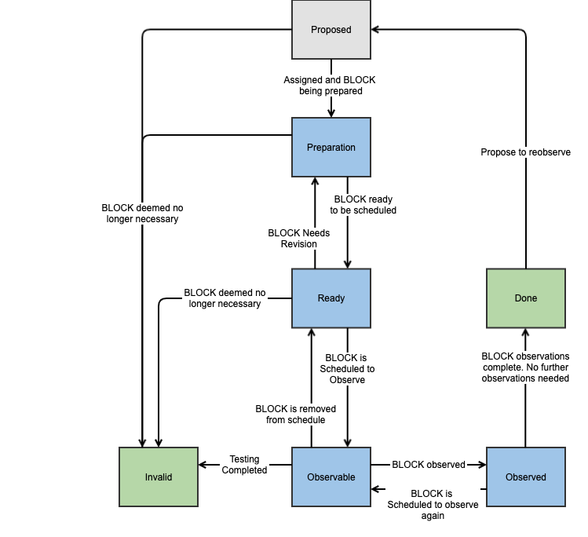

.. This is a template for operational procedures. Each procedure will have its own sub-directory. This comment may be deleted when the template is copied to the destination.

.. Review the README in this procedure's directory on instructions to contribute.
.. Static objects, such as figures, should be stored in the _static directory. Review the _static/README in this procedure's directory on instructions to contribute.
.. Do not remove the comments that describe each section. They are included to provide guidance to contributors.
.. Do not remove other content provided in the templates, such as a section. Instead, comment out the content and include comments to explain the situation. For example:
	- If a section within the template is not needed, comment out the section title and label reference. Include a comment explaining why this is not required.
    - If a file cannot include a title (surrounded by ampersands (#)), comment out the title from the template and include a comment explaining why this is implemented (in addition to applying the ``title`` directive).

.. Include one Primary Author and list of Contributors (comma separated) between the asterisks (*):
.. |author| replace:: *Erik Dennihy*
.. If there are no contributors, write "none" between the asterisks. Do not remove the substitution.
.. |contributors| replace:: *none*

.. This is the label that can be used as for cross referencing this procedure.
.. Recommended format is "Directory Name"-"Title Name"  -- Spaces should be replaced by hyphens.
.. Each section should includes a label for cross referencing to a given area.
.. Recommended format for all labels is "Title Name"-"Section Name" -- Spaces should be replaced by hyphens.
.. To reference a label that isn't associated with an reST object such as a title or figure, you must include the link an explicit title using the syntax :ref:`link text <label-name>`.
.. An error will alert you of identical labels during the build process.

.. _Daytime-Nighttime-Interactions-block-observing-workflow:

########################
BLOCK Observing Workflow
########################

The creation of a ticket, as is described in the :ref:`Daytime-Nighttime-Interactions-fault-reporting` page, is only the first step in a process to get the issue assigned, diagnosed, and ultimately addressed.
This section describes the process of how a created ticket moves through the `BLOCK Jira project <https://jira.lsstcorp.org/projects/BLOCK>`__  workflow through to completion. 
It also describes the roles of personnel in the ticket flow process.

.. note::

  Throughout this section the role of *Triage Manager* is referenced.
  This position is a rotating role that is responsible for managing the assignment of tickets created during the night, as well as following up on the urgent tickets during the day.

BLOCK Jira Project Description
^^^^^^^^^^^^^^^^^^^^^^^^^^^^^^
The workflow as executed in Jira passes through several states, beginning with the proposed state, 
where it receives an assignee, through preparation and observation, and finally into one of the end states.

The creation of a BLOCK ticket can be performed by anyone, but is generally done by whomever is designing the BLOCK observation.

The Jira workflow for the BLOCK project is shown in the following figure and the various states and transitions are detailed below.

    A block diagram of the workflow contained in the BLOCK Jira project.
    Note that the transition labels in this diagram describe the process and do not exactly match the names used by the BLOCK Jira project itself.

End states
----------
The end states are the ultimate destination of a reported ticket.
When a ticket reaches one of these states, is it considered to be resolved and will no longer be actively managed by the Fault Handling Management process.
We start by explaining these states because they are referenced throughout the remainder of the document, specifically when describing state transitions.

- ``Done``: All observations completed. 

- ``Invalid``:  The requested observation is no longer valid, was filed by mistake, or has been superseded by another BLOCK.

There are multiple ways that tickets reach these states, which are explained in the sections below.

There is one transition out of these states, which is from the ``Done`` state to the ``Proposed`` state.
It is reserved for cases when a BLOCK is in a completed state, 
but either the exact observation is requested again, 
or someone deems the original observation request was not satisfactorily completed and the BLOCK must be repeated. 
The ticket is then transitioned to ``Proposed`` so it can begin the preparation and scheduling process again.

Active states
-------------
This section describes each of the active states as well as any transition from that state to another.

- ``Proposed:``: 
  
    - *Transition to* ``Invalid``: 
     

- ``Preparation``: 

  - *Transition to* ``Invalid``: 

  - *Transition to*  ``Ready``: 

- ``Ready``: 

    - *Transition to* ``Invalid``: 

    - *Transition to* ``Preparation``:

    - *Transition to* ``Observable``: 

- ``Observable``: 

    - *Transition to* ``Invalid``: 

    - *Transition to* ``Ready``: 

    - *Transition to* ``Observed``: 

- ``Observed``: 

    - *Transition to* ``Observable``: 

    - *Transition to* ``Done``: 

BLOCK Ticket Management Process
^^^^^^^^^^^^^^^^^^^^^^^^^^^^^^^

Contact Personnel
^^^^^^^^^^^^^^^^^

This procedure was last modified |today|.

This procedure was written by |author|. The following are contributors: |contributors|.
