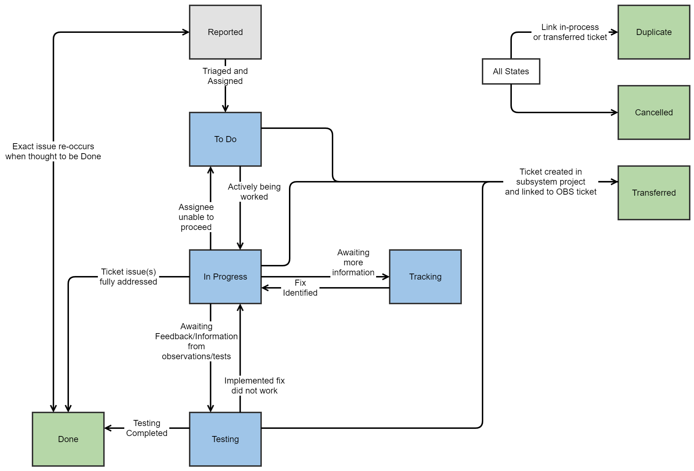

.. This is a template for operational procedures. Each procedure will have its own sub-directory. This comment may be deleted when the template is copied to the destination.

.. Review the README in this procedure's directory on instructions to contribute.
.. Static objects, such as figures, should be stored in the _static directory. Review the _static/README in this procedure's directory on instructions to contribute.
.. Do not remove the comments that describe each section. They are included to provide guidance to contributors.
.. Do not remove other content provided in the templates, such as a section. Instead, comment out the content and include comments to explain the situation. For example:
	- If a section within the template is not needed, comment out the section title and label reference. Include a comment explaining why this is not required.
    - If a file cannot include a title (surrounded by ampersands (#)), comment out the title from the template and include a comment explaining why this is implemented (in addition to applying the ``title`` directive).

.. Include one Primary Author and list of Contributors (comma separated) between the asterisks (*):
.. |author| replace:: *Patrick Ingraham*
.. If there are no contributors, write "none" between the asterisks. Do not remove the substitution.
.. |contributors| replace:: *Erik Dennihy, Alysha Shugart*

.. This is the label that can be used as for cross referencing this procedure.
.. Recommended format is "Directory Name"-"Title Name"  -- Spaces should be replaced by hyphens.
.. Each section should includes a label for cross referencing to a given area.
.. Recommended format for all labels is "Title Name"-"Section Name" -- Spaces should be replaced by hyphens.
.. To reference a label that isn't associated with an reST object such as a title or figure, you must include the link an explicit title using the syntax :ref:`link text <label-name>`.
.. An error will alert you of identical labels during the build process.

.. _Daytime-Nighttime-Interactions-fault-handling-workflow:

#######################
Fault Handling Workflow
#######################

The creation of a ticket, as is described in the :ref:`Daytime-Nighttime-Interactions-fault-reporting` page, is only the first step in a process to get the issue assigned, diagnosed, and ultimately addressed.
This section describes the process of how a created ticket moves through the `Observatory Operations (OBS) Jira project <https://jira.lsstcorp.org/projects/OBS>`__  workflow through to completion. 
It also describes the roles of personnel in the ticket flow process.

Of course, Jira is merely a tool and does not replace the role of a manager or management process.
A description of the active management process that continually reviews, assigns, and prioritizes the work is defined in the `OBS Ticket Management Process`_ section. 

.. note::

  Throughout this section the role of *Triage Manager* is referenced.
  This position is a rotating role that is responsible for managing the assignment of tickets created during the night, as well as following up on the urgent tickets during the day.

OBS Jira Project Description
^^^^^^^^^^^^^^^^^^^^^^^^^^^^
The workflow as executed in Jira passes through several states, beginning with the reported state, where it receives and assignee, through to one of the end (completed) states.

The creation of a ticket can be performed by anyone, but is generally done by whomever is operating the system.
Details on ticket creation on the fields are found in the page on :ref:`Daytime-Nighttime-Interactions-fault-reporting`.

The Jira workflow for the OBS project is shown in the following figure and the various states and transitions are detailed below.

    A block diagram of the workflow contained in the OBS Jira project.
    Note that the transition labels in this diagram describe the process and do not exactly match the names used by the OBS Jira project itself.

End states
------------
The end states are the ultimate destination of a reported ticket.
When a ticket reaches one of these states, is it considered to be resolved and will no longer be actively managed by the Fault Handling Management process.
We start by explaining these states because they are referenced throughout the remainder of the document, specifically when describing state transitions.

- ``Done``: All work required to address the issue has been completed. 

- ``Cancelled``:  The reported issue is no longer valid, was filed by mistake, or has been superseded by another ticket or other events.

- ``Transferred``: The issue has been deemed non-critical to immediate operations and has been moved to a subsystem for consideration and/or implementation.

- ``Duplicate``: This is a repeat reporting of an already in-process ticket. 
  Work on the issue should proceed in the original ticket.

There are multiple ways that tickets reach these states, which are explained in the sections below.
The ``Cancelled`` and ``Duplicate`` states are special because they can be transitioned to from any active state in the workflow.

There is one transition out of these states, which is from the ``Done`` state to the ``Reported`` state.
This transition should be rare. 
It is reserved for cases when a job is in a completed state, but either the exact error occurs again, or someone deems it is not satisfactorily completed. 
The ticket is then transitioned to ``Reported`` so it can be triaged and prioritized accordingly by a Triage manager.

Active states
-------------
This section describes each of the active states as well as any transition from that state to another.

- ``Reported:`` This is the default state that a ticket enters when it is initially filed. 
  Details on ticket creation on the fields are found in the page on :ref:`Daytime-Nighttime-Interactions-fault-reporting`.
  By default, the ticket is left unassigned and will be handled by the Triage Manager on-shift. 
  The ticket reporter should flag the issue as Urgent if the issue has the potential to result in appreciable loss of efficiency of on-sky observations, or could result in a loss of on-sky observing time. 
  The Triage Manager is responsible for the initial assessment of the ticket in this state and for transitioning it out of the Reported state. 
  From this state, the ticket can either be transitioned to ``To Do``, ``Duplicate``, or ``Cancelled``.
  
    - *Transition to* ``To Do``: After review, the Triage Manager should identify and assign the ticket to an appropriate assignee and communicate to them that the ticket has been assigned. 
      This communication should include an assessment of the urgency of the work to be done. 
      Once the ticket has been re-assigned and the new assignee contacted, it can be transitioned to the ``To Do`` state by the Triage Manager. 
      The triage manager can also add or remove the Urgent flag if appropriate. 
     

- ``To Do``: The ticket has been assigned and an assessment of the work to be done is made by the initial assignee. 
  Work has been deemed necessary by the Triage Manager and it is the responsibility of the initial assignee to determine the scope of work and a plan to address the issue. 
  The ticket remains in this state until resources have been allocated and work is initiated.

  At this stage, if the initial assignee determines they are unable to complete the work, they must perform the following:

  - Find the appropriate assignee.
    If they are unable to do so, then the assignee should be the current Triage Manager.
  - Verify that the new assignee is able to work on the ticket
  - Post a comment on the ticket indicating the reason for the re-assignment.

  - *Transition to* ``In Progress``: After initial assignee assessment and once a work plan has been identified and resources allocated to perform the work, the ticket should be transitioned to ``In Progress``. 
    The assignee performs the state change when work starts.

  - *Transition to*  ``Transferred``: After initial assignee assessment if the work is not considered Urgent and the issue resolution will have significant impact beyond summit operations the work can proceed in a different Jira project. 
    Prior to transitioning the issue to ``Transferred``, the assignee must open a new ticket in the new project and the OBS ticket must be linked to the ticket in the new project.
    The assignee should leave a short justification in the ticket as to why the work is being transitioned.

- ``In Progress``: This state is reserved for tickets which are actively being worked on but may not have had a cause or solution fully identified or implemented.
  The transitions from this state are dependent upon if a fix can be identified.

    - *Transition to* ``Tracking``: If the root cause and or solution to the issue cannot be identified with the information provided, it can be transitioned to ``Tracking`` while the initial assignee awaits more occurrences or information.

    - *Transition to* ``Done``: If the work needed to implement a solution can be rapidly completed, it can transition directly to ``Done``. 
      This transition is reserved for minor issues requiring no testing/tracking or urgent tickets requiring rapid response.

    - *Transition to* ``Testing``: Work has been done to address the issue and a potential fix has been identified and implemented. 
      If the fix is deployed and additional data must be collected before deeming success, it can be transitioned to Testing.

- ``Tracking``: This state is reserved for issues which have been considered by the assignee and deemed to have insufficient information to determine the root cause or implement a solution. 
  If a particular data collection procedure must be followed it must be detailed in the comments section and either the Triage Manger or Run Manager should be informed so that the procedure can be communicated to the relevant stakeholders, specifically the night crews.

    - *Transition to* ``In Progress``: Once sufficient information has been collected, the ticket can be transitioned back to ``In Progress`` and the workflow proceeds as usual.

- ``Testing``: This state is reserved for issues which have a potential fix already deployed and which are being monitored for completeness. 
  Data collection on the efficacy of the fix should happen in this state.
  If not obvious, assignees should state what the success criteria is in a comment to transition the ticket to ``Done``.

    - *Transition to* ``In Progress``: If the fix that was deployed is deemed insufficient (e.g. recurrence of a failure is observed), it should be transitioned back to ``In Progress`` and until a new solution can be considered.

    - *Transition to* ``Transferred``: This transition is for when the work is not considered urgent and during testing it is determined that the issue resolution will have significant impact beyond summit operations the work can proceed in a different JIRA project.
      Prior to transitioning the issue to ``Transferred``, the assignee must open a new ticket in the new project and link it to the OBS ticket.
      The assignee must leave a short justification in the ticket as to why the work should be transitioned.

    - *Transition to* ``Done``: If the fix that was deployed is considered successful, upon completion of the work it can be transitioned directly to Done. 
      A short description of the final issue resolution should be included in the comments section of the ticket before transitioning to ``Done``.

Components and Required Fields
------------------------------

OBS Ticket Management Process
^^^^^^^^^^^^^^^^^^^^^^^^^^^^^

There are numerous aspects associated with managing the OBS ticket process.
The processes are still under development but a high-level description is provided here.
From when an ticket gets filed, it proceeds through a process which includes immediate triage, assignment, and prioritization of tasks, as well as a regular review of outstanding tickets and actions that need to be regularly assessed.
Because observations will take place seven nights per week, 365 days a year, a team of "Triage Managers" rotates on-and-off shift.
The rotation cycle is dependent upon the ongoing activities at the observatory.
During active commissioning periods, the rotation period is expected to be 7 calendar days.
When the telescope is not on-sky, or the activities are less dynamic, the shifts may be longer.

The Triage Managers meet collectively once a week to review the outstanding tickets.
The Observing Specialist Manager is also expected to regularly attend; others are invited on an as-needed basis.
The meeting agenda includes discussion of the highest priority items, and a dive into the other unresolved tickets.
During this time they evaluate which tickets need re-prioritizing, have been tested and can now be closed, and/or items which should be transferred.
Although tickets could get stuck in a few areas, it is anticipated that the ``Testing`` and ``Tracking`` states will be most prone to pile-up of tickets that are not getting closed.  
By continually revisiting the tickets, this should help both maintain a clean Jira project, and ensure the issues being reported are being addressed accordingly.
The ultimate goal of the meeting is to ensure issues are being addressed and/or delegated and are not left in an unknown and/or unaddressed state.

The responsibility of the on-shift Triage manager is to ensure each ticket receives an appropriate assignee, the assignee is aware of the ticket, and that the person has the bandwidth to address the issue in the required time frame. 
In the event that the preferred assignee is unavailable, the Triage manager works with the appropriate manager and/or team leads to determine a replacement.
The Triage Manager also works to complete the required metadata and ensure adequate information has been populated in the ticket, as described in the :ref:`Daytime-Nighttime-Interactions-fault-reporting` page.
This includes the information regarding the diagnosis and fix, but also that all field have been populated to enable proper time loss accounting and categorization.
Lastly, the on-shift Triage manager runs the weekly meeting to help ensure that the required knowledge transfer to the next on-shift manager is performed.
The role of Triage manager is then handed off to the next person on rotation.

Contact Personnel
^^^^^^^^^^^^^^^^^

This procedure was last modified |today|.

This procedure was written by |author|. The following are contributors: |contributors|.
