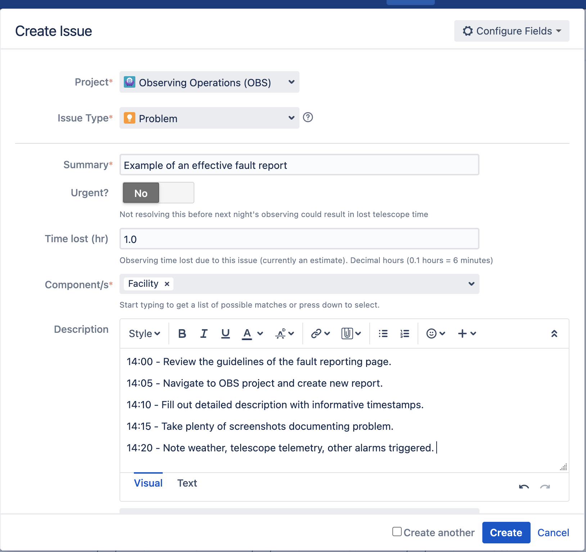
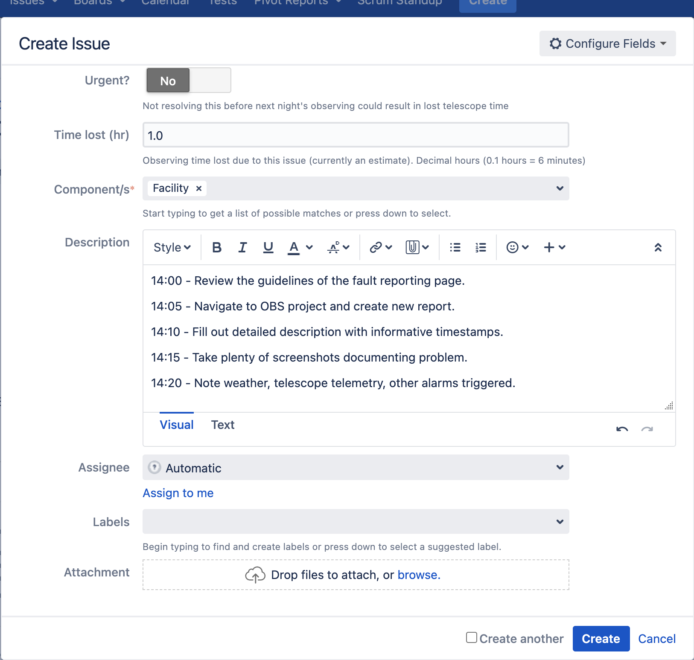
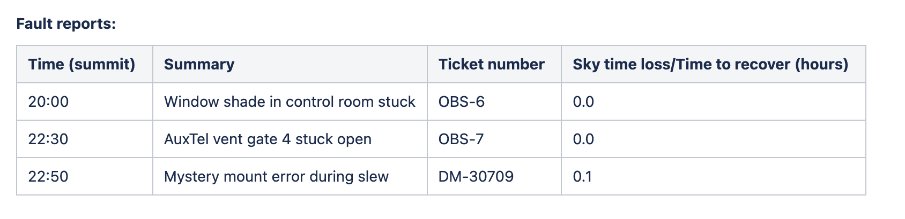

.. This is a template for operational procedures. Each procedure will have its own sub-directory. This comment may be deleted when the template is copied to the destination.

.. Review the README in this procedure's directory on instructions to contribute.
.. Static objects, such as figures, should be stored in the _static directory. Review the _static/README in this procedure's directory on instructions to contribute.
.. Do not remove the comments that describe each section. They are included to provide guidance to contributors.
.. Do not remove other content provided in the templates, such as a section. Instead, comment out the content and include comments to explain the situation. For example:
	- If a section within the template is not needed, comment out the section title and label reference. Include a comment explaining why this is not required.
    - If a file cannot include a title (surrounded by ampersands (#)), comment out the title from the template and include a comment explaining why this is implemented (in addition to applying the ``title`` directive).

.. Include one Primary Author and list of Contributors (comma separated) between the asterisks (*):
.. |author| replace:: *Alysha Shugart*
.. If there are no contributors, write "none" between the asterisks. Do not remove the substitution.
.. |contributors| replace:: *Patrick Ingraham, Erik Dennihy, Tiago Ribeiro*

.. This is the label that can be used as for cross referencing this procedure.
.. Recommended format is "Directory Name"-"Title Name"  -- Spaces should be replaced by hyphens.
.. Each section should includes a label for cross referencing to a given area.
.. Recommended format for all labels is "Title Name"-"Section Name" -- Spaces should be replaced by hyphens.
.. To reference a label that isn't associated with an reST object such as a title or figure, you must include the link an explicit title using the syntax :ref:`link text <label-name>`.
.. An error will alert you of identical labels during the build process.

.. _Daytime-Nighttime-Interactions-fault-reporting:

###############
Fault Reporting
###############

Reporting telescope and observatory faults - whether they are mechanical errors, software bugs, or facilities issues - is a crucial aspect of observatory operations. 
Understanding the observatory and its efficiency begins with robust fault reporting, documenting recovery, and knowledge-sharing. 
This section describes the process to file a fault report for any incident that happens during nighttime operations in the Observing Operations `(OBS) <https://jira.lsstcorp.org/projects/OBS>`__ JIRA project.

The process describing the OBS Jira project workflow and process management is described in the section specific to the :ref:`Daytime-Nighttime-Interactions-fault-handling-workflow`. 

.. _fault-reporting-Guidelines-For-Productive-Reporting:

Guidelines For Productive Reporting
^^^^^^^^^^^^^^^^^^^^^^^^^^^^^^^^^^^

The most important part of fault-reporting is that the team can understand the problem well. 
Some guidelines to keep in mind are:

- Facts first. 
  The author of the fault report should provide as many details as possible, including screenshots, telescope telemetry, and timestamps for future investigation.
- Leave the ticket unassigned, it will be triaged by the traige team, whos membership includes T&S and SIT-Com members. 
  If observers think people need to be aware of the ticket (e.g. prospective assignees), they should be @'d in a comment.
- Ideas are welcome, but let the facts speak first.
- Report a problem, but do not assign blame. 
  No one person needs to be identified unless they have a contribution or may offer a solution. 
  Identifying the problem and reporting it effectively ensures that the Rubin team will move forward with a solution. 
 

.. _fault-reporting-Filing-Fault-Reports:

Filing Fault Reports
^^^^^^^^^^^^^^^^^^^^

Fault reports and resolutions utilize the `OBS Jira project <https://jira.lsstcorp.org/projects/OBS>`_.
In many cases, there is already a Jira ticket associated with a given problem, and the action is primarily to log an instance of re-occurrence. 
This should be done by adding a comment to the ticket and not by editing the ticket description.

When creating a ticket, make sure to fill in the following fields:

    Screenshot of an example fault report.

- **Project:** The reporter should ensure that the OBS project is selected to include all things affecting nighttime operations.

- **Issue type:** If unsure, select "problem."
    - *Problem:* issue type usually refers to a hardware issue. 
    - *Bug:* issue type typically refers to a software issue.
    - *Improvement:*  issue type refers to suggestions for improvements to a procedure, software or else.
    - *Information:* issue type refers to alerting the team of a new behavior. 
      This does not immediately impact operations, but informs of a change noticed. 

- **Summary:** Describe the problem in one phrase. Be as clear and succinct as possible.

- **Urgent:** IMPORTANT. This field is crucial to allocate time to solve a problem. 
  If the issue results in a significant loss of telescope efficiency, then a task should be marked as urgent.
  This includes issues observing at night, data collection, or anything that endangers equipment.
  Toggle this flag and alert the team as soon as possible. 

- **Time lost (hr):** More details about calculating time lost due to a fault are in the :ref:`fault-reporting-Guidelines-For-Calculating-Time-Loss` section. 
  Time loss is reported in the 0.1 decimal hour.

- **Components:** Be as accurate as possible to select the correct component - i.e. facilities: vent gates, AuxTel, etc. 
  If the component does not exist, contact |author| and they will add it to the list.

- **Description:** Provide details and a timeline as accurately as possible to help people more efficiently search telemetry logs for diagnosis. 
  Include a timestamp of the occurrence as well as the salIndex of the script (if applicable). 
  The traceback should be added as well (if applicable).
  Tracebacks are best copy/pasted into the ticket rather than using a screenshot so the error is searchable.

    Continuing fields of an example fault report.

- **Assignee:** The reporter should leave the ticket unassigned.
  In the case you are certain of who is the correct person to follow-up on the fault report, that person should be added as a watcher on the ticket. 
  A team will review the fault reports after the night is over and determine the best person or group for follow-up.

- **Primary Software Component:** This is not a required field, but may provide more information to the components involved. 

- **Primary Hardware Component:** If you are not sure what hardware was affected or the root cause, use "Other".

- **Attachment:** Upload any screenshots, images, or files to support the facts reported or to help the problem-solving effort. 

.. _fault-reporting-Guidelines-For-Calculating-Time-Loss:

Guidelines For Calculating Time Loss
^^^^^^^^^^^^^^^^^^^^^^^^^^^^^^^^^^^^

.. This section should provide a simple overview of conditions or results after executing the procedure; for example, state of equipment or resulting data products.
.. It is preferred to include them as a bulleted or enumerated list.
.. Do not include actions in this section. Any action by the user should be included in the end of the Procedure section below. For example: Do not include "Verify the telescope azimuth is 0 degrees with the appropriate command." Instead, include this statement as the final step of the procedure, and include "Telescope is at 0 degrees." in the Post-condition section.

- If the problem can be troubleshooted while taking images on sky, or proceeding with another engineering task, that time will not count towards a fault loss.
- If a fault occurs while we are closed due to bad weather, or the problem occurs before or after 12 degree twilight, the time lost should be reported as 0.
  When potential on-sky science time begins, the time loss starts accumulating.
- In the event the amount of time lost is not well understood, it is better to provide an overestimate than an underestimate.

.. _fault-reporting-Filling-Out-Night-Logs:

Filling Out Night Logs
^^^^^^^^^^^^^^^^^^^^^^

More details about writing night logs are provided on the :ref:`Daytime-Nighttime-Interactions-nighttime-logging` page. 
Concerning fault reports filed during the night, it is important that the observer lists all the problems that occurred during the night in the fault report section of the night log. 
This will provide higher visibility and allow to calculate total time lost to faults at the end of the observing night.

    List of all the fault reports that happened during the night for the night log. 

.. _fault-reporting-Contact_Personnel:

Contact Personnel
^^^^^^^^^^^^^^^^^

This procedure was last modified |today|.

This procedure was written by |author|. The following are contributors: |contributors|.
