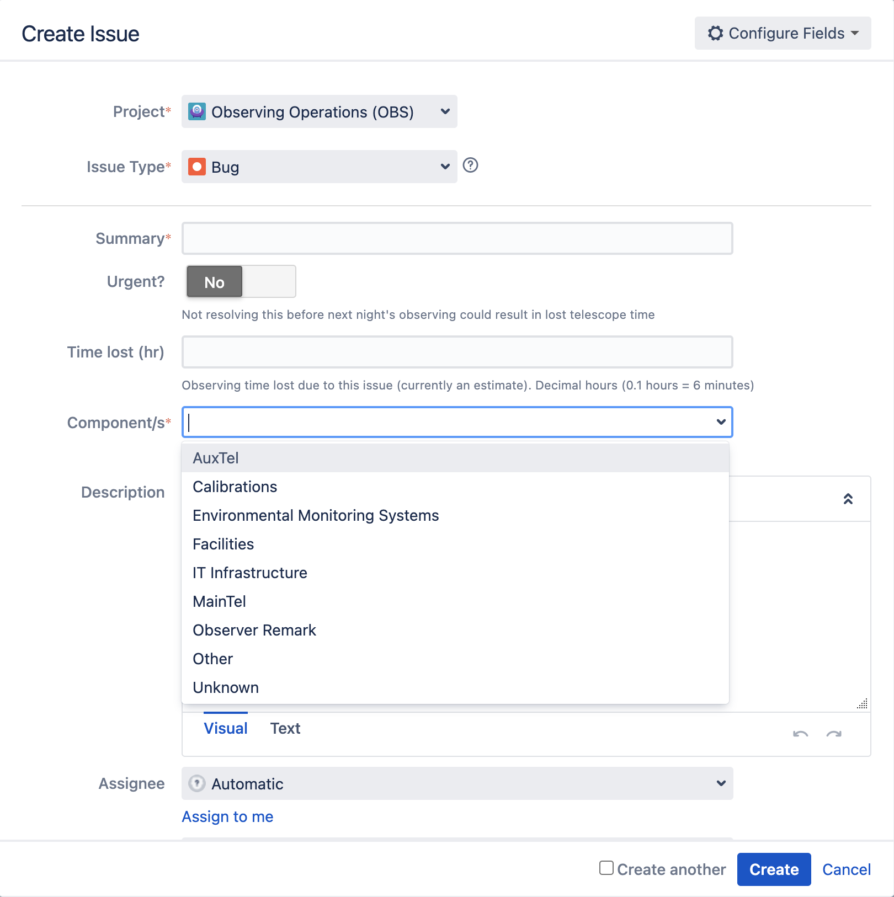
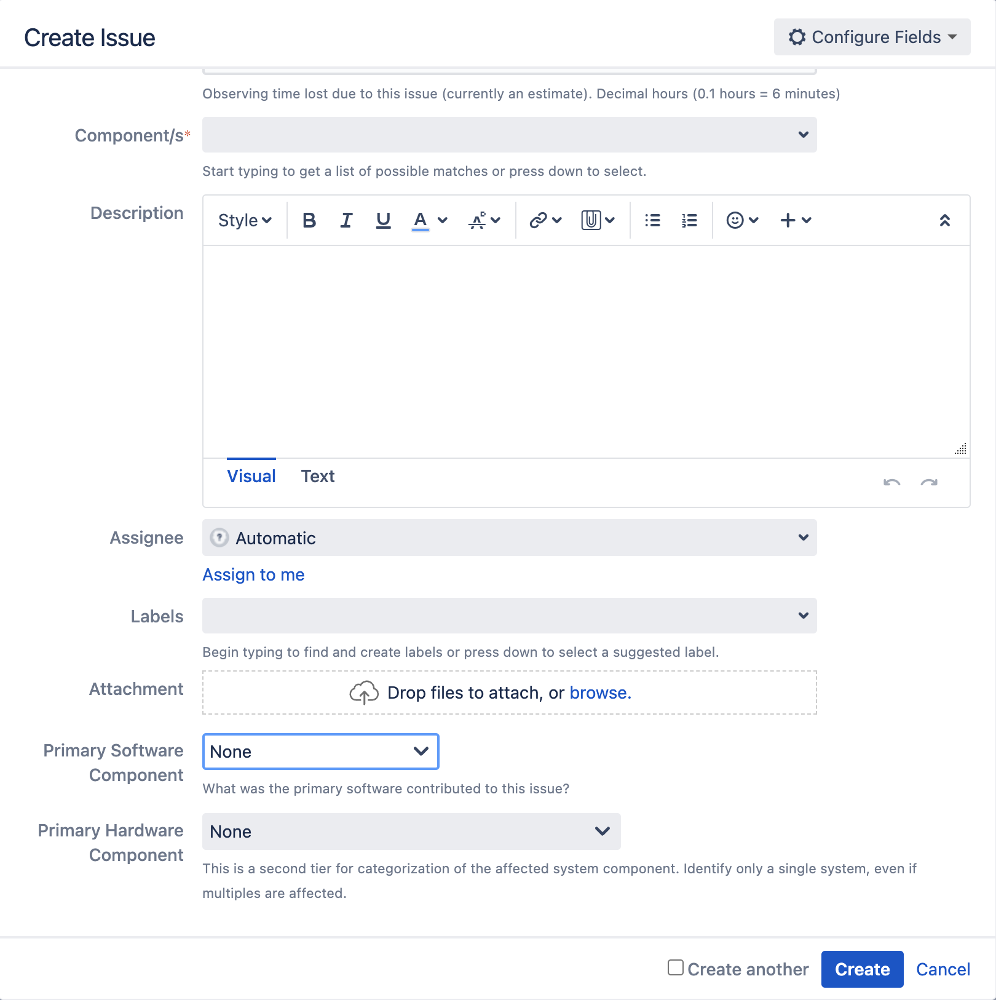

.. This is a template for operational procedures. Each procedure will have its own sub-directory. This comment may be deleted when the template is copied to the destination.

.. Review the README in this procedure's directory on instructions to contribute.
.. Static objects, such as figures, should be stored in the _static directory. Review the _static/README in this procedure's directory on instructions to contribute.
.. Do not remove the comments that describe each section. They are included to provide guidance to contributors.
.. Do not remove other content provided in the templates, such as a section. Instead, comment out the content and include comments to explain the situation. For example:
	- If a section within the template is not needed, comment out the section title and label reference. Include a comment explaining why this is not required.
    - If a file cannot include a title (surrounded by ampersands (#)), comment out the title from the template and include a comment explaining why this is implemented (in addition to applying the ``title`` directive).

.. Include one Primary Author and list of Contributors (comma separated) between the asterisks (*):
.. |author| replace:: *Alysha Shugart*
.. If there are no contributors, write "none" between the asterisks. Do not remove the substitution.
.. |contributors| replace:: *Patrick Ingraham, Tiago Ribeiro*

.. This is the label that can be used as for cross referencing this procedure.
.. Recommended format is "Directory Name"-"Title Name"  -- Spaces should be replaced by hyphens.
.. _Templates-Title-of-Procedure:
.. Each section should includes a label for cross referencing to a given area.
.. Recommended format for all labels is "Title Name"-"Section Name" -- Spaces should be replaced by hyphens.
.. To reference a label that isn't associated with an reST object such as a title or figure, you must include the link an explicit title using the syntax :ref:`link text <label-name>`.
.. An error will alert you of identical labels during the build process.

###############
Fault Reporting
###############

Reporting telescope and observatory faults - whether they are mechanical errors, software bugs, or facilities issues - is a crucial aspect of observatory operations. 
Understanding the observatory and its efficiency begins with robust fault reporting, documenting recovery, and knowledge-sharing. 
This section describes the process to file a fault report for any incident that happens during nighttime operations in the Observing Operations `(OBS) <https://jira.lsstcorp.org/projects/OBS>`__ JIRA project.

.. _fault-reporting-Guidelines-For-Productive-Reporting:

Guidelines For Productive Reporting
^^^^^^^^^^^^^^^^^^^^^^^^^^^^^^^^^^^

The most important part of fault-reporting is that the team can understand the problem well. 
Some guidelines to keep in mind are:

- Facts first. 
  The author of the fault report should provide as many details as possible, including screenshots, telescope telemetry, and timestamps for future investigation.
- If the reporter is unsure of who to assign the ticket to, leave it unassigned and alert the day time staff for further triage.
- Ideas are welcome, but let the facts speak first.
- Report a problem, not a person. Identifying the problem and reporting it effectively ensures that the Rubin team will move forward with a solution. 
  Identifying a person as being "at-fault" for a problem reported in the night is not productive. 
  Learn and grow, not blame and shame.
 

.. _fault-reporting-Filing-Fault-Reports:

Filing Fault Reports
^^^^^^^^^^^^^^^^^^^^

.. This section should provide simple overview of prerequisites before executing the procedure; for example, state of equipment, telescope or seeing conditions or notifications prior to execution.
.. It is preferred to include them as a bulleted or enumerated list.
.. Do not include actions in this section. Any action by the user should be included at the beginning of the Procedure section below. For example: Do not include "Notify specified SLACK channel. Confirmation is not required." Instead, include this statement as the first step of the procedure, and include "Notification to specified SLACK channel." in the Prerequisites section.
.. If there is a different procedure that is critical before execution, carefully consider if it should be linked within this section or as part of the Procedure section below (or both).

Upon navigating to the `(OBS) <https://jira.lsstcorp.org/projects/OBS>`__ project in JIRA, click the "create" option on the right-hand side of the top tool-bar.

When creating a ticket, make sure to fill in the following fields:

    Screenshot of an example fault report. 
- Project: The reporter should ensure that the OBS project is selected to include all things affecting nighttime operations.

- Issue type: If unsure, select "problem."
    - Problem: issue type usually refers to a hardware issue. 
    - Bug: issue type typically refers to a software issue.
    - Improvement:  issue type refers to suggestions for improvements to a procedure, software or else.
    - Information: issue type refers to alerting the team of a new behavior. 
      This does not immediately impact operations, but informs of a change noticed. 

- Summary: Describe the problem in one phrase. Be as clear and succinct as possible.

- Urgent: IMPORTANT. This field is crucial to allocate time to solve a problem. 
  If this fault obstructs observing at night, data collection, or endangers equipment,
  toggle this flag and alert night time staff as soon as possible. 

- Time lost (hr): More details about calculating time lost due to a fault are in the :ref:`fault-reporting-Guidelines-For-Calculating-Time-Loss` section. 
  Time loss is reported in the 0.1 decimal hour.

- Components: Be as accurate as possible to select the correct component - i.e. software, hardware: M2, etc. 
  If the component does not exist, contact |author| and they will add it to the list.

- Description: Provide details and a timeline as accurately as possible to help people more efficiently search telemetry logs for diagnosis. 
  Facts first.

    Continuing fields of an example fault report. 
- Assignee: The reporter should leave the ticket unassgined unless they are absolutely sure of the correct person to follow-up on the fault report. 
  The team will review the fault reports after the night is over and determine the best person or group for follow-up.

- Labels: This is not a required field, but may provide more information to the components involved. 

- Attachment: Upload any screenshots, images, or files to support the facts reported or to help the problem-solving effort. 

.. _fault-reporting-Guidelines-For-Calculating-Time-Loss:

Guidelines For Calculating Time Loss
^^^^^^^^^^^^^^^^^^^^^^^^^^^^^^^^^^^^

.. This section should provide a simple overview of conditions or results after executing the procedure; for example, state of equipment or resulting data products.
.. It is preferred to include them as a bulleted or enumerated list.
.. Do not include actions in this section. Any action by the user should be included in the end of the Procedure section below. For example: Do not include "Verify the telescope azimuth is 0 degrees with the appropriate command." Instead, include this statement as the final step of the procedure, and include "Telescope is at 0 degrees." in the Post-condition section.

- If the problem can be troubleshooted while taking images on sky, or proceeding with another task, that time won’t count to fault loss.
- If the problem happens before or after 12 degree twilight, there is no need to account for fault loss.
    - As soon as science time begins however, the clock starts ticking.
- If the problem happens during bad weather, or no observing is taking place, there is no need to deduct for time loss.
- It is better to overestimate than to underestimate. Sky time is very valuable - emphasize the importance to address problems in this way.

.. _fault-reporting-Filling-Out-Night-Logs:

Filling Out Night Logs
^^^^^^^^^^^^^^^^^^^^^^

More details about writing night logs are provided on the :ref:`Daytime-Nighttime-Interactions-nighttime-logging` page. 
Concerning fault reports filed during the night, it is important that the observer lists all the problems that occurred during the night 
in the fault report section of the night log. This will provide higher visibility and allow to calculate total time lost to faults at the end of the observing night.

.. figure:: ./_static/Night_log_fault_reports_list.png
    :name: Night-log-fault-reports-list

    List of all the fault reports that happened during the night for the night log. 

.. _fault-reporting-Contact-Personnel:

Contact Personnel
^^^^^^^^^^^^^^^^^

This procedure was last modified |today|.

This procedure was written by |author|. The following are contributors: |contributors|.
