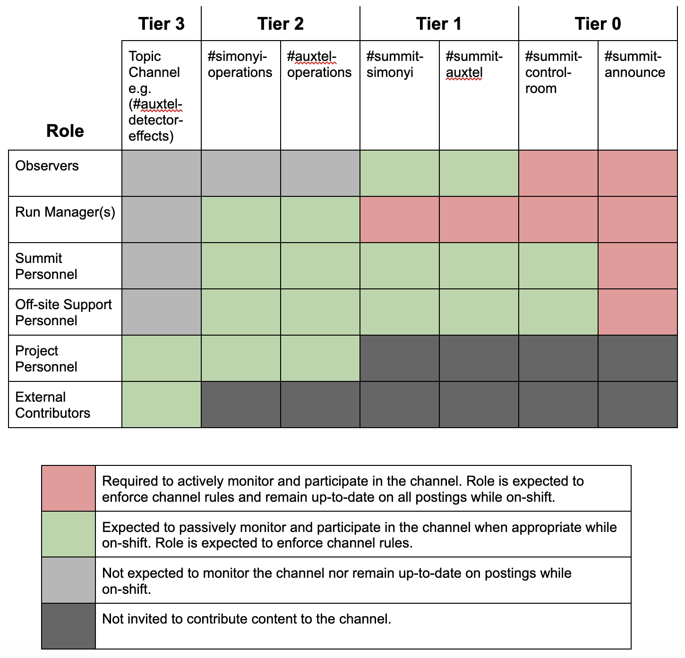
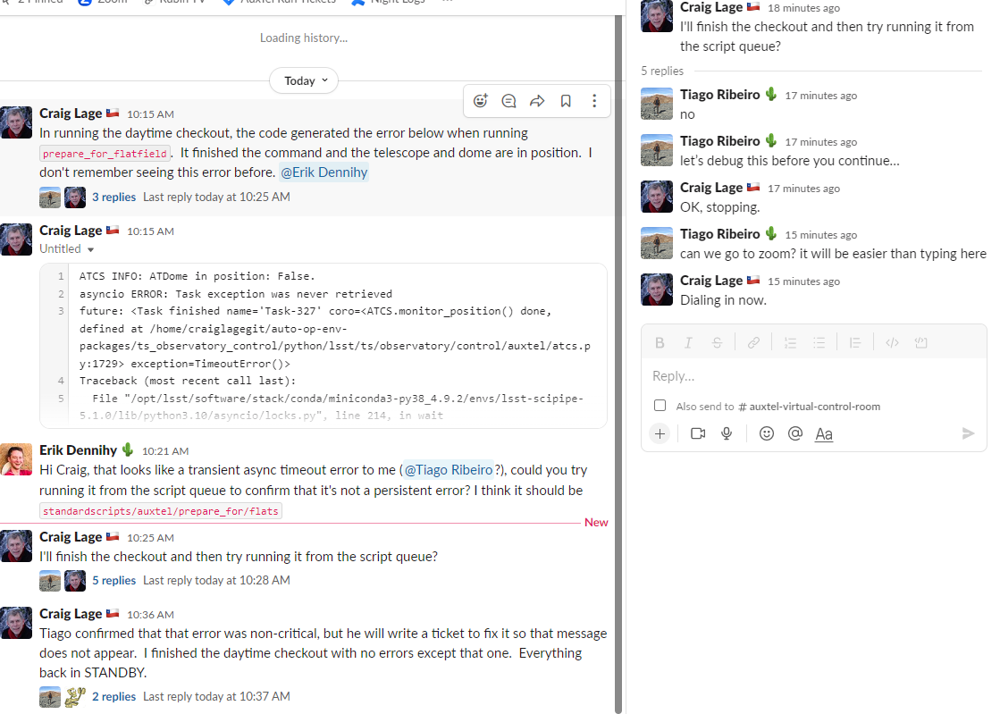

.. This is a template for operational procedures. Each procedure will have its own sub-directory. This comment may be deleted when the template is copied to the destination.

.. Review the README in this procedure's directory on instructions to contribute.
.. Static objects, such as figures, should be stored in the _static directory. Review the _static/README in this procedure's directory on instructions to contribute.
.. Do not remove the comments that describe each section. They are included to provide guidance to contributors.
.. Do not remove other content provided in the templates, such as a section. Instead, comment out the content and include comments to explain the situation. For example:
	- If a section within the template is not needed, comment out the section title and label reference. Include a comment explaining why this is not required.
    - If a file cannot include a title (surrounded by ampersands (#)), comment out the title from the template and include a comment explaining why this is implemented (in addition to applying the ``title`` directive).

.. Include one Primary Author and list of Contributors (comma separated) between the asterisks (*):
.. |author| replace:: *Patrick Ingraham*
.. If there are no contributors, write "none" between the asterisks. Do not remove the substitution.
.. |contributors| replace:: *Patrick Ingraham, Erik Dennihy, Kevin Fanning*

.. This is the label that can be used as for cross referencing this procedure.
.. Recommended format is "Directory Name"-"Title Name"  -- Spaces should be replaced by hyphens.
.. _Daytime-Nighttime-Slack-Channel-Communication-with-Summit-Personnel:
.. Each section should includes a label for cross referencing to a given area.
.. Recommended format for all labels is "Title Name"-"Section Name" -- Spaces should be replaced by hyphens.
.. To reference a label that isn't associated with an reST object such as a title or figure, you must include the link an explicit title using the syntax :ref:`link text <label-name>`.
.. An error will alert you of identical labels during the build process.

#################################################
Slack Channel Communication with Summit Personnel
#################################################

The LSSTC Slack space is used by hundreds of people with varying levels of interest in summit operations. 
The goal of this document is to communicate the acceptable usage of the specific set of channels that are focused on day and nighttime summit operations. 
The document also describes the channels where more informal discussions and contributions from non-summit staff can be communicated to the observing crew(s). 

In operations, all slack channels are expected to be open to everyone on the lsstcorp Slack domain.
However, should people continually violate the rules (and people fail to police them) then we will have to lock the channels. 

.. important::
   Three ground rules for usage - read this if nothing else:

   1. Personnel not present on the summit are generally discoraged from using tier 0 and 1 channels, though many exceptions to this are detailed in this page. If you do not know if you should use the tier 0 or 1 channel, do not use it.

   2. Work with summit systems should use public channels, not direct messages with with individuals.

   3. Zoom in place of slack is encouraged for extensive, time critical support.

For ease of presentation, it was decided to classify the stakeholders by the following roles:

- Observers: The primary operators of observatory systems.
  These are primarily the Observing Specialists, but includes any person actively operating the telescope(s).

- Shift Managers: Organizer(s) of the current observing run that perform coordination of observations, relay information between the day and night crews (beyond what is to be included in the end-of-day report), and provide support during the night and day. 
  They also help to address questions, comments, and filter information between the broader community and summit personnel. Currently filled by the night planner.

- Summit Personnel: These are people that are actively working on the summit. This category includes the Triage Manager (future role), even if they are not physically located on the summit.

- Off-site Summit Support: Personnel that call in to assist or perform summit-based activities but remotely (e.g. from the base or Tucson). These are personnel actively on a shift to support or a subsystem owner working with their system.

- Project Personnel: General project members that have slack accounts. This is the default category for most project members and individuals generally advance to other categories when actively on shift.

- External Contributors: People that share the same slack user-space but do not participate in summit operations (e.g. DESC).

While on-shift, the people in each of these roles will have varying responsibilities regarding which information they need to be paying attention to and/or responding to.
The ultimate goal is to facilitate effective communications to summit personnel by concentrating information into specific places and minimizing distractions.
It is recognized that all project personnel are capable of contributing useful input, however, unless the people are very close to the on-going tasks there exists a significant awareness gap.
Therefore, a flow via which anyone on the project can participate has been developed that passes through the key personnel which can address the project member's concerns and/or questions. 
Additionally, this limits the number of simultaneous lines of communication that summit personnel are expected to monitor during their shifts.

To better communicate the expectations for each of the roles, and demonstrating the information flow, the list of required Slack channels have been categorized into Tiers. 
We use the "summit" prefix for channels that are tightly coupled to summit operations.

- **Tier 0:** Real-time information that the applicable roles are always monitoring and are expected to immediately react to (when on shift and interacting with summit systems). 
  Responding to a message may result in a loss of sky time, which is acceptable. 
  Communication in this area meant to be extremely curt. 
  People providing urgent support are encouraged to do so via Zoom; not via Slack.

- **Tier 1:** Used for asynchronous information communication regarding the state of summit systems. 
  These channels are telescope or subsystem specific, do not require immediate response, and are passively monitored by on-shift observers. These include subsystem topic "worklog" channels.
  It is primarily used for communication between summit personnel and externally **requested** support.

- **Tier 2:** General discussion channels whose information and/or contents are not time critical operation of the observatory at night.
  The shift managers monitor these channels to relay any pertinent information between external support and the summit teams. These channels have much fewer restrictions on who can participate, useful for the braoder team to contribute information they think might be important to summit operations, which can then be filtered to the summit crew.

- **Tier 3:** Channels not directly associated with current summit activities. 
  These are channels for collaborative work, which make up the high majority of Slack channels.

    The expected level of participation by summit personnel to observation-related slack channels.

Individual Channel Descriptions and Guidelines
==============================================

This section provides additional details regarding the use of each channel.
Note that all channels require active monitoring by everyone to ensure the conversation stays inline with the channel's expected content.
The shift managers are the primary disciplinarians but observers and others should police too!

#summit-announce
----------------
This channel is used to announce activities that may impact other summit users, especially in regards to safety.
Announcements in this (or any other) channel does **NOT** grant permission from personnel on the ground regarding whether or not it is safe to perform the test.

Any summit activities and/or testing, including anything utilizing the network, requires **two** announcements: one when starting, the other when finished, to prevent people from stepping on one another.
People who participate in testing or infrastructure support/development are expected to be actively monitoring this channel.

Because work is being coordinated across multiple channels,this channel aims to restrict the need to make announcements multiple places and avoid the scenario of accidentally not informing all impacted parties.

For items having substantial impact, scheduling should first be carried out as part of the `SUMMIT Jira calendar <https://jira.lsstcorp.org/secure/DoItBetterCalendar.jspa>`_ process.

**Announcement Protocol:**

- Announcements are required for all work that may affect the summit control network or its infrastructure.
  This includes hardware testing, CSC updates/deployments, configuration changes, Nublado updates, invasive networking changes and any on-site activities being performed by summit personnel.
- Utilize threads whenever possible to minimize cross-talk and/or interference between simultaneous discussions

**Announcement Guidelines and Procedure:**

- Make an announcement when ready to begin work.
  Be short and concise. If additional information is required, use threads.
  
  - Include an estimate of how long the systems will be in use.
  - Include the names of other channels where conversation on the work will take place (if appropriate).
  - List the systems or CSC(s) you plan on using and a 1 or 2-sentence synopsis of what you are doing.

- Announce when work is completed.
  This should be performed in the thread where the work was announced.
  In the case where the announcement is far from the current channel content, users are encouraged to check the "Also send to group" box when responding on the thread.
  
- This channel is specific to summit related activities.
  Announcements for testing using other test-stands are to be made on test-stand specific channels, following the same rules.
  This includes #rubinobs-tucson-teststand and #rubinobs-base-teststand

- The summit is an active observatory with many teams working on different tasks. Personnel on the summit should never be discourgaged from announcing their work as impacts may be unforseen or unpredictable.

#summit-control-room
--------------------
This room is actively monitored by observers and shift managers. This may be used to bring urgent concerns to observers.

This is a single channel for both telescopes which is actively monitored by telescope specialists and anyone controlling the system.
As observers are expected to actively monitor and reply to this channel, extended conversations may impact efficient work and discussion via zoom is encouraged.
Breakout rooms can be used if multiple simultaneous conversations are required.

This channel may be used as the area where the copying/pasting of code snippets happens while supporting via zoom, therefore context will often not be provided.
Troubleshooting in this area should be either system-wide, or concerning other observatory systems seperate from the telescopes.

An example of troubleshooting belonging to this channel is found in the following figure.

    An example of the type of troubleshooting conversation that should take place in #summit-control-room.

#summit-simonyi and #summit-auxtel
----------------------------------

These rooms are for telescope system specific asynchronous conversation with remote support.
They are passively monitored by on-shift observers with no expectation of an immediate response.
Generally, the content will be read at the start and end of a shift, or during quiet periods.

These channels are actively monitored by shift manager(s), who will directly contact observers if/when required.

Example content:

- Discussion of faults that were already recovered.
  For example, "Experienced issue with shutter again, reported on OBS-12345."

- Announcements such as, “Calibrations completed in filters XYZ” for people may be interested but do not follow #summit-announce. 

- Announcements regarding future status of the system.
  Such as, “TMA expected to be offline Wednesday night.”

- Not required, but used by some observers to give periodic status updates during the night.

#auxtel-operations and #simonyi-operations
------------------------------------------

These channels are also telescope system specific but are dedicated for communication between people providing external support, such as looking at data as it comes in.
The external supporters are not directly tied in to on-site activities and are often not aware of the immediate status of the observatory.

These channels are passively monitored by the shift managers, who elevate concerns/issues when required.
Observers will often be participating as well, but are not required.
On-shift observers should not be @-'d at any time. 
If required, contact the shift manager and they will take the issue to the real-time communication channel(s) if and when appropriate.

Example content:

- The PSF looks fuzzy

- Discussions of detector artifacts and their potential effect on observations

- Suggestions for observing improvements 

- Enhancements and/or curious features with RubinTV 

- New features in system behavior (e.g. mount shake)

This procedure was last modified |today|.
