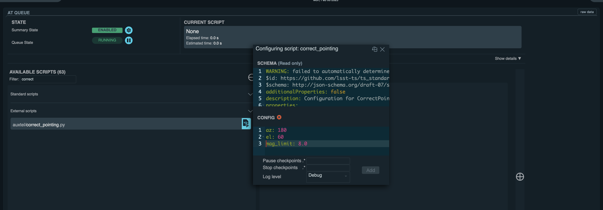

.. |author| replace:: *TDB*
.. If there are no contributors, write "none" between the asterisks. Do not remove the substitution.
.. |contributors| replace:: *none*

.. _AT-On-sky-CWFS:

##################################################################
Beginning of the night: Focus, center and absorb pointing offsets
##################################################################

.. _Beginning_of_the_night-the-Telescope-Overview:

Overview
========

This procedure must be followed by the observers before the beginning of dark time, prior to starting science or engineering activities.
It will focus the telescope, center a target and absorb the pointing offsets. 

.. _Beginning_of_the_night-Prerequisites:

Prerequisites
=============
- The telescope is :ref:`open and ready for on-sky operations <AT-Pre-Open-for-On-Sky-Operations>`: it has been vented (if applicable), mirror cover and dome shutter are open, AOS corrections are enabled. 
- The sky brightness is low enough that a CWFS can converge succesfully. 
  This condition is normally achieved around 10-15 minutes before the end of nautical twilight or dark time. 

.. _Beginning_of_the_night-Post-Conditions:

Post-Condition
===============

- Telescope is focused and pointing offsets have been absorbed. 
  The system is ready to start :ref:`scheduler-driven observations <Nighttime-Scheduler-Scheduler-Operational-Procedures>` or engineering tasks. 

.. _Beginning_of_the_night-Procedure-Steps:

Procedure Steps
===============

- Confirm sky background is dark enough. 

As a general rule, a good time to start executing the following SAL scripts is 10-15 minutes before the end of nautical twilight. 

- Launch a CWFS sequence on an 8th magnitude star. 

From the LOVE ``ATQueue`` panel, under ``AVAILABLE SCRIPTS`` on the left side, find and load the script ``auxtel/latiss_cwfs_align.py`` by clicking on the blue icon. 
It is included under ``External scripts``. 

In the ``configuring Script: latiss_cwfs_align`` window, the script configuration is introduced under ``CONFIG``.
Traditionally, we perform the first CWFS of the night towards the south and at mid-elevations on an 8-mag star. 
With the configuration below, the script will query SIMBAD for a target around the provided ``az`` and ``el`` coordinates and with the specified maximum brightness ``mag_limit``.

.. code-block:: yaml
    
    find_target:
        az: 180
        el: 60
        mag_limit: 8.0
    
Click on ``Add`` and the script will be added to the end of the script queue.

.. figure:: ./_static/CWFS_AuxTel.png
    :name: latiss-cwfs

    Screenshot of LOVE launching a CWFS. 

- Command the telescope to measure and correct for any nightly pointing zero-point offsets using the SAL script ``auxtel/correct_pointing.py``.

The steps the script perform in the background are:
    - Reset the pointing and hexapod x and y offsets.
    - Acquire target. How to select the source is summarized below. 
    - Find the offset between the brightest source in the field and the boresight.
    - Offset the telescope to place the source at the center of the detector. 
    - The telescope will absorb the measured pointing offsets. 

Nominally, the same target the telescope is tracking and focused on will be used to correct the pointing.   
However, this funtionality is not yet implemented and is included in DM-37841 <https://jira.lsstcorp.org/browse/DM-37841>

For now, correct the zero-point offsets in the same area of the sky as the CWFS was done earlier. 
With the same CWFS configuration, add the external script ``auxtel/correct_pointing.py`` to the ``ATQueue``. 

.. code-block:: yaml
    
    az: 180
    el: 60
    mag_limit: 8.0

The script will then find and use a target around the given coordinates ``az`` and ``el`` and magnitude limit ``mag_limit``. 

    LOVE launching the script to correct the pointing using a source at around ``az`` 180 and ``el`` 60 and magnitude limit ``mag_limit`` 8.0.  

If the configuration cell is left empty, the script will automatically find a target around ``az`` 90 deg and ``el`` 60 deg, with a ``mag_limit`` of 8.0. 

Contact Personnel
=================

This procedure was last modified on |today|.

This procedure was written by |author|.
The following are contributors: |contributors|.
