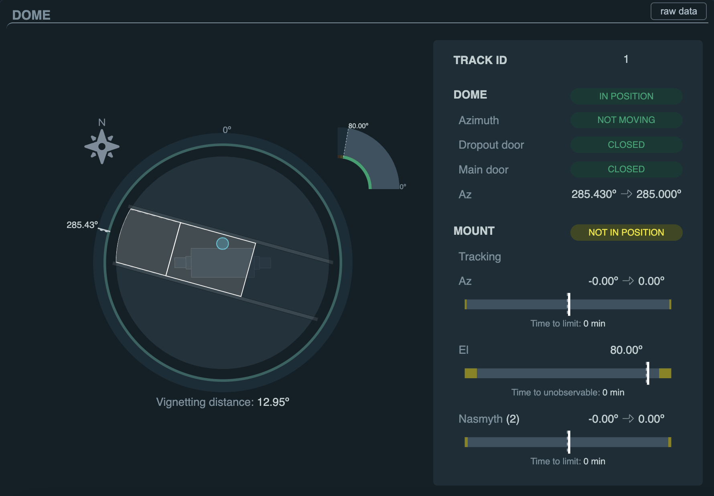
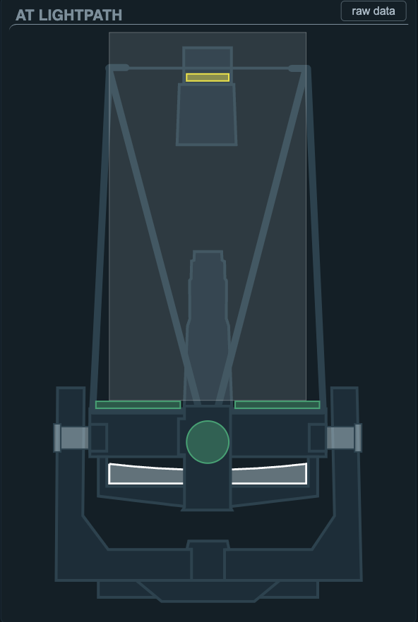
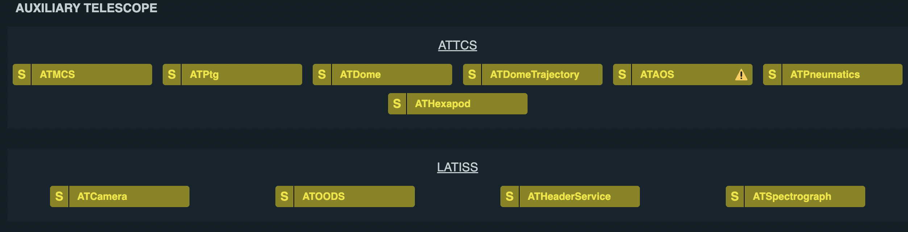
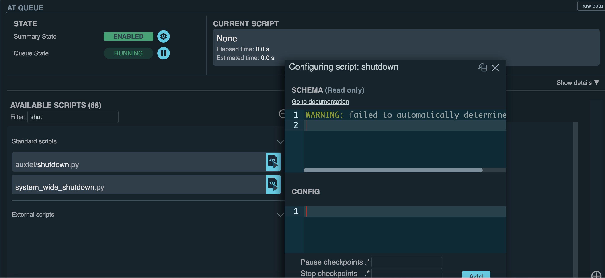

.. |author| replace:: *Yijung Kang*
.. If there are no contributors, write "none" between the asterisks. Do not remove the substitution.
.. |contributors| replace:: *Alysha Shugart, Karla Aubel*

.. _AT-Shutdown-Shutdown:

#######################
Shutdown
#######################

.. _Shutdown-the-Telescope-Overview:

Overview
========
At the end of the night, ATTCS and LATISS CSCs should be set to standby. Telescope and dome should be parked. 
The parking position is for the AuxTel is El = 80 deg, Az = 0.0 deg, rot = 0.0 deg. 
For the dome, it is at Az = 285.0 deg with closed dome slit shutter.
All ATTCS and LATISS CSCs for AuxTel should be set to standby.  

.. _Shutdown-the-Telescope-Prerequisites:

Prerequisites
=============

Stopping Scheduler
------------------

The Scheduler automatically adds new targets to the queue until the start of nautical morning twilight.
If there are no targets, the Scheduler will stop adding new ones.
If you need to stop the Scheduler manually, you can use the ``auxtel/scheduler/stop.py`` script from ScriptQueue without any additional configurations.

See more detailed descriptions on `Scheduler <https://obs-ops.lsst.io/Nighttime-Operations/Scheduler/night-time-operations/index.html>`__.

.. _Shutdown-the-Telescope-Post-Conditions:

Post-Condition
==============

- **Status of Telescope and Dome** 

- **Status of Mirrors and Mirror Covers**

- **Status of CSC components of ATTCS and LATISS** 

.. _Park-the-Telescope-Procedure-Steps:

Procedure Steps
===============

Shutdown AuxTel
---------------

After stopping scheduler, you can shutdown AuxTel using ``auxtel/shutdown.py`` script from ATQueue. 
``shutdown.py`` script does not need any configurations as below. 

This script performs:

**1. Closing the M1 cover**
: First, disable ATAOS corrections. Then, close the M1 cover and vent gates.  
If mirror is opened, ``shutdown`` script will not able to close the dome slit. 

**2. Closing the Dome Shutter**
: Close the dome shutter if it is opened. 
If the dropout door is open, you can close manually via button at the AuxTel or via notebook with the command below.

.. code-block:: yaml

   await atcs.rem.atdome.cmd_closeShutter.set_start() 
    
**3. Parking the Dome** 
: The parking position is Az = 285.0 deg. Then, the dome following is disabled after parking. 

**4. Parking the Telescope**
: The parking position is El = 80 deg, Az = 0.0 deg, rot = 0.0 deg for telescope.
Tracking will then be stopped.  

**5. Putting CSCs in Standby**
: The AT CSC components ``ATMCS``, ``ATAOS``, ``ATPtg``, ``ATDome``, ``ATDomeTrajector``, ``ATOS``, ``ATPneumatics``, ``ATHexapod``  will be changed to Standby. 

After parking and shutdown for Auxillary Telescope are completed, you can check the status of Dome and Telescope on LOVE. 

   
Taking Morning Calibrations
---------------------------

After ``shutdown.py`` script is completed, check CSC Summary on LOVE.
Check the CSCS for LATISS are in enable status, then run ``make_latiss_calibration.py`` with the following configuration.
See more details on :ref:`LATISS-Combined-Calibrations-Procedure-LATISS-Combined-Calibrations-Generation-Procedure`.

.. code-block:: yaml

    script_mode: BIAS_DARK
    generate_calibrations: False

If it is not working, 

1. Run ``make_image_latiss.py`` to take biases with the following configurations:

.. code-block:: yaml

    image_type: BIAS
    nimages: 50
    reason: 'dailyCals' 

2. Run ``make_image_latiss.py`` to take dark images with the following configurations:

.. code-block:: yaml
    
    image_type: DARK
    nimages: 23
    exp_times: [5, 5, 5, 5, 5, 15, 15, 30, 30, 30, 30, 30, 30, 30, 30, 30, 30, 30, 30, 30, 30, 30, 30]
    reason: "dailyCals"

*Standby_latiss*
----------------

After parking the AuxTel and taking daytime calibration, the LATISS CSCs are still in ENABLED state.
Run ``auxtel/standby_latss.py`` on ATQueue to set all CSC for LATISS (``ATCamera``, ``ATOODS``, ``ATHeaderService``, ``ATSpectrograph``) 
 

Ending the Night
----------------

During the shutting down procedures, you can check and complete all logging and administrative tasks including:

- Finish filling out the nightlog, including time loss, weather loss, and gathering fault reports for the night.
- Send the summary and night log link to rubinobs-nightlog mailing list (rubin-night-log [at] lists.lsst.org). 
- Leave the summary of the night on Slack Channels - #rubin_daytime_tasks and #summit-auxtel 

Closing the Vent Gate
---------------------

This step can be proceed any point of this shutdown steps, but it is recommeneded to do it on the way down to the hotel at the end of the night.  
  
Go up to the AuxTel and 

- Turn off extraction fan. 
- Close all vent gates using the remote controller.
- Make sure the Dome shutter was closed, the AuxTel and Dome are on the parking Position. Building should be sealed. 

Contact Personnel
=================

This procedure was last modified on |today|.

This procedure was written by |Author|.
The following are contributors: |contributors|.
