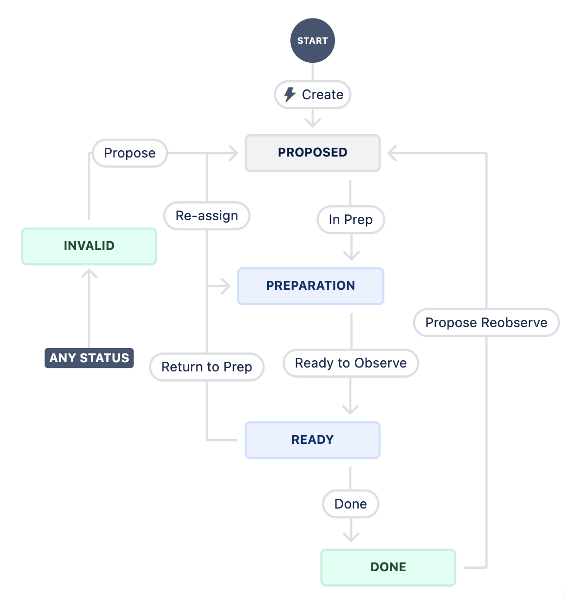

.. This is a template for operational procedures. Each procedure will have its own sub-directory. This comment may be deleted when the template is copied to the destination.

.. Review the README in this procedure's directory on instructions to contribute.
.. Static objects, such as figures, should be stored in the _static directory. Review the _static/README in this procedure's directory on instructions to contribute.
.. Do not remove the comments that describe each section. They are included to provide guidance to contributors.
.. Do not remove other content provided in the templates, such as a section. Instead, comment out the content and include comments to explain the situation. For example:
	- If a section within the template is not needed, comment out the section title and label reference. Include a comment explaining why this is not required.
    - If a file cannot include a title (surrounded by ampersands (#)), comment out the title from the template and include a comment explaining why this is implemented (in addition to applying the ``title`` directive).

.. Include one Primary Author and list of Contributors (comma separated) between the asterisks (*):
.. |author| replace:: *Erik Dennihy*
.. If there are no contributors, write "none" between the asterisks. Do not remove the substitution.
.. |contributors| replace:: *T. Ribeiro, D. Sanmartim*

.. This is the label that can be used as for cross referencing this procedure.
.. Recommended format is "Directory Name"-"Title Name"  -- Spaces should be replaced by hyphens.
.. Each section should includes a label for cross referencing to a given area.
.. Recommended format for all labels is "Title Name"-"Section Name" -- Spaces should be replaced by hyphens.
.. To reference a label that isn't associated with an reST object such as a title or figure, you must include the link an explicit title using the syntax :ref:`link text <label-name>`.
.. An error will alert you of identical labels during the build process.

.. _BLOCK-Jira-Workflow:

###################
BLOCK JIRA Workflow
###################

The Rubin Observatory uses observing blocks to design, plan, execute, and track tasks at the summit which require data taking.
These tasks range from pure engineering (e.g. closed-dome TMA velocity tests) to science-driven surveys. 
In most cases, the planning and execution of such tasks must take place on a much shorter timescale than the analysis of the data that is collected, necessitating a separate JIRA project and workflow. 

To facilitate this workflow, we have created the `BLOCK JIRA Project <https://rubinobs.atlassian.net/jira/software/c/projects/BLOCK/boards/228>`_ , described in detail here. 

    A block diagram of the workflow used by the BLOCK Jira project.

BLOCK Ticket Roles and Workflow
===============================

BLOCK tickets are heavily relied on during both the task planning and task execution phases, and provide a central point of communication between stakeholders and the summit crew. 
Since nearly all groups across the observatory are stakeholders in the tests that are carried out at the summit, clear roles and expectations must be defined for how the JIRA BLOCK tickets are used. 
Here we define the various roles and their expectations, and present a brief overview of the BLOCK Ticket workflow. 

Roles and Responsibilities
--------------------------
In the JIRA issues, there are only two formal roles assigned: Proposer and Assignee. 

**Proposer**
^^^^^^^^^^^^
The Proposer is typically a stakeholder interested in the observing task's outcomes.
Key responsibilities include:

- **Initial Ticket Submission**

  - They are chiefly responsible for the initial ticket submission, providing a detailed description of the observing task.
  - Includes necessary supporting materials, such as links to relevant tickets (e.g., SITCOM, LVV) or documentation on Confluence pages.

- **Collaboration during Preparation**

  - Collaborates with the Assignee during the Preparation phase to ensure all task requirements and completion criteria are clearly understood.

- **Final Verification and Sign-Off**

  - Review the outcomes after task execution to ensure objectives have been met.
  - Verifies and confirms task completion, reviewing any related data or results.
  - Transitions the ticket to "Done" to officially close the issue once satisfied with the task completion.

.. note::
    Anyone can take the role of Proposer as long as they are knowledgeable in the task requirements and completion criteria.

**Assignee**
^^^^^^^^^^^^
The Assignee is a member of the Commissioning Science team, responsible for overseeing the task from preparation through execution.
Responsibilities include:

- **Task Preparation and Planning**

  - Collaborates with the Proposer to understand task requirements during early preparation stages.
  - Prepares the task for execution, including finalizing methodological details and setting up necessary components.

- **Marking as Ready**

  - Marks the ticket as "Ready" once all preparations are complete and validated, indicating it is prepared for execution.

- **Advocacy and Tracking**

  - Advocates for the task in planning meetings to ensure it is prioritized and scheduled.
  - Tracks the task progress through to execution, addressing any issues that may arise.

- **Role during Execution**

  - Ensures everything is in place for successful execution, although the actual execution is typically done by an Observing Specialist.

**Un-assigned Roles**
^^^^^^^^^^^^^^^^^^^^^
In addition, there is the role of planning the tasks for execution once they have been set to READY. 
This is expected to be carried out in accordance with the priority assigned to the task by the Commissioning Science team. 
While awaiting execution, tickets will remain in the READY state and their priority may be updated as needed.
Ticket Assignees are expected to track the status of execution and advocate for planning of tasks as needed. 

And finally, there is the role that is filled by the person responsible for task execution at the summit, in most cases an Observing Specialist. 
Although responsible for execution of the task (arguably the most import step), this person does not have any defined responsibilities in the JIRA Workflow itself. 
However, they do hold the final say of whether a task can be executed on the summit (as a final evaluation is implicit in their role), and have full discretion to transition tickets back to Preparation if they are found to be lacking instruction. 

Overview of Workflow
--------------------
An example workflow of the interactions between the roles could look like

* Stakeholder requires an observing task to be completed at the summit, and describes the task in an LVV ticket, SITCOM ticket, or Confluence page. 
* Stakeholder proposes a new BLOCK Jira ticket, providing links to supporting material and assuming responsibility of Proposer. The stakeholder requiring an observing task does not always need to author the BLOCK Jira ticket, that responsibility can be shared with someone more knowledgeable with JIRA or the workflow processes as long as they are in close collaboration with the stakeholder. 
* New BLOCK Jira ticket is reviewed by Commissioning Science team during one of the regular, weekly planning meetings, and accepted/rejected for scheduling. 
* New BLOCK Jira ticket is given a priority for scheduling and a Commissioning Scientist is Assigned the ticket, taking on the responsibility of Assignee. 
* Proposer and Assignee work together to prepare BLOCK ticket for execution.
* Assignee performs test and validation of observing block instructions using the test stands where appropriate.
* BLOCK ticket is marked as READY by Assignee, and added to the queue of tasks to be executed. 
* BLOCK ticket is planned for execution at the summit by the night planner. 
* BLOCK ticket is executed at the summit by Observing Specialist.
* Data is analyzed by the Proposer and ticket is reported on supporting tickets (e.g. SITCOM). 
* Proposer verifies observing task is completed and transitions ticket to Done to close issue.

BLOCK Ticket Requirements
=========================

In addition to the standard JIRA ticket fields, proposers are also required to supply the following information: 

* Component - either MainTel or AuxTel
* Original Time Estimation - selectable in the More Fields section of the ticket. 
* Links to supporting material either tickets (e.g. SITCOM/LVV) or confluence pages

Time estimation is an important part of the planning process.
Be sure to include both the execution time and any additional time spent configuring or logging the activity in your time estimate. 

Description
-----------

The description section of a BLOCK ticket must be carefully filled in to ensure success of the BLOCK. 
BLOCK descriptions walk a very fine line between having just enough information and not too much. 
They should not read like a novel, too much information is likely to get lost at the pace with which execute at night. 
They must contain the minimum set of instructions needed to carry out the complete observing task. 

At a minimum the description section should contain:

* Description, high-level overview of test
* Preconditions/requirements to run test, including system status
* Environmental Constraints on test (e.g. observing conditions/time)
* Test Execution Instructions
* Brief description of test steps and expectations

Make use of the formatting options to provide separation between sections and make this information easy to find. 

**Description**
Include a brief, 1-2 sentence overview of the test here. 

**Preconditions**
These should be provided as a list or short descriptive section. Examples include

* MTRotator in DISABLED state
* EUI Recording enabled
* TMA Settings set to 40% max

**Environmental Constraints**
This section should include any time or condition constraints e.g. 

* Atmospheric Seeing less that 1.5 arcseconds.
* Photometric conditions required. 
* Test must be executed between 12:00 and 01:00 local time. 

**Test Execution Instructions**
This section should be written to be as direct as possible and contain the minimum necessary instruction to execute the test. 
For example, if a JSON BLOCK has been prepared to execute the test, this should be something like:

* Run the JSON BLOCK using the add_block.py SAL Script with the following configuration - id: BLOCK-123

If the test execution involves a series of SAL Scripts, provide the script names and all required configurations. 
In cases where the user is expected to edit the configuration (e.g. to select a target), a full example configuration and possible list of configurables (e.g. target list) must be provided.

Users are again encouraged to make use of the formatting options here. 
All Script Configuration should be provided by inserting Code Snippets with YAML formatting. 

**Description of Test Steps**
This section should provide some context/expectations of what will happen during the test, including possible outcomes. 
This will allow the users to evaluate the progress and success of the test without having to search and parse the detailed code. 
It is  recommended to provide this as a bulleted list of steps, rather than in paragraph form, to make it easier to read. 

.. note::
    We are in the process of adopting a new standard procedure to include a Test Case in place of the Test Execution Instructions and Description of test steps.
    This document will be updated when the workflow is finalized. 

BLOCK Ticket States and Transitions
===================================

The JIRA workflow for BLOCK Tickets has been designed to facilitate task preparation, planning, and execution. 
BLOCK tickets provide the direct link between an observing task Proposer and the team that will be responsible for executing the task at the summit. 
Here we describe the individual states and their allowed transitions. 
In each section, we identify the work expected to be done in each state and the party responsible. 

Active states
-------------
This section describes each of the active states as well as any transition from that state to another.

**Proposed**
^^^^^^^^^^^^
This is the default state that a ticket enters when it is initially filed. 
By default, the ticket is left unassigned. 
The Commissioning Scientist team is responsible for the initial assessment and assignment of the observing task. 
New ticket in the Proposed state will be reviewed and assigned on a weekly basis (or twice weekly) during one of several planning meetings.
The reporter is not responsible for alerting anyone to new ticket creation, but a message on the #sitcom-observing-blocks slack channel is recommended. 
Once the ticket has been assigned to a member of the Commissioning Science team, it will be transitioned to Preparation.
  
*Transition to Preparation*: An initial assessment of the observing task will be done during the weekly planning meeting by the Commissioning Science team. 
This initial assessment will include a discussion of work needed to prepare the task, a decision on the priority of the task, and an assignment to a member of the Commissioning Science team for preparation.  
Once the ticket has been assigned it can be transitioned to the Preparation state. 
     

**Preparation**
^^^^^^^^^^^^^^^

This state describes a task that is currently being prepared for execution at the summit. 
  
At this stage, the assignee is expected to work with the proposer to prepare the task for execution at the summit. 

The steps expected to be completed in this state include:

* A decision on the best method to execute the observing block (e.g. JSON BLOCK, SAL Script, etc) by the Proposer and Assignee. 
* Preparation of the observing task (e.g. write a new JSON BLOCK) by the Proposer and Assignee.   
* Testing and validation of the observing task to the extent possible on one of the Test Stands by the Assignee.   
* A review of the ticket description for any missing instructions or information (see section below) by the Assignee. 
* Deployment of any necessary components/changes at the Summit (e.g. JSON BLOCK) by the Assignee. 

*Transition to Ready*: Once all of the steps above have been completed, the Assignee is responsible for transitioning the ticket to Ready. 

*Transition to Proposed*: After initial assignee assessment if the work cannot be completed by the assignee in a timely manner in accordance with the observing task priority, it can be returned to Proposed for re-assignment. 

**Ready**
^^^^^^^^^
This state is reserved for observing tasks which have been prepared, tested, reviewed, and deployed at the summit and are ready for execution.

While in the Ready state, a task can be added to the plan at any time. 
Tasks will be planned for observation in accordance with the priority they were assigned in the Proposed state. 
A review of the tasks which are in the Ready state is to be carried out as part of the regular Commissioning Science planning meetings. 

The steps expected to be completed in this state include:

* Planning of the task for execution by the Commissioning Science team. 
* Execution of the task at the Summit.
* Review of the data and assessment of task completion by the Proposer and Assignee. 

*Transition to Preparation*: If an issue is found with the observing task after it has been transitioned to Ready, it may be transitioned back to Preparation.
This transition could be triggered by either the Assignee, the Proposer, or the user responsible for executing the task on the Summit. 

*Transition to Done*: If the task has been executed and the data collected deemed satisfactory by the Proposer and there is no need to repeat the test, 
it can be transitioned to *Done* and removed from further planning consideration. 

End states
----------

The end states are the ultimate destination of a reported ticket.
When a ticket reaches one of these states, is will no longer be considered for scheduling.
We start by explaining these states because they are referenced throughout the remainder of the document, specifically when describing state transitions.

**Done**
^^^^^^^^
All work required to complete the observing block has been Done. There is no current plan to repeat the task. 

**Invalid**
^^^^^^^^^^^
The requested observing block is no longer valid, was filed by mistake, or has been superseded by another block or other events.

There are multiple ways that tickets reach these states, which are explained in the sections below.
The Invalid state is special because it can be transitioned to from any active state in the workflow.

Both Invalid and Done allow transition out of these states, which is to return to the Proposed state and start the workflow over again.
This transition should be rare. 
It is reserved for cases when a job is erroneously transitioned to a completed state, or a later analysis of the observing task deems it was not satisfactorily completed. 
The ticket is then transitioned to Proposed so it can be prepared and prioritized accordingly by a Commissioning Science Team.

BLOCK Ticket Checklist
======================

To summarize all of the above, we provide a checklist focused on the steps needed by each role for reference. 

Proposer Checklist
------------------

Initial Ticket Submission
^^^^^^^^^^^^^^^^^^^^^^^^^

- Identify the need for an observing task.
- Draft a clear description of the observing task, including high-level objectives and specific requirements.
- Gather and attach supporting materials such as relevant tickets (SITCOM, LVV) or documentation on Confluence pages.
- Create and submit the BLOCK Jira ticket.
- Provide an original time estimation for the task execution, including preparation and any additional time for configuration or logging.

Collaboration during Preparation
^^^^^^^^^^^^^^^^^^^^^^^^^^^^^^^^

- Review and discuss the preparation details with the Assignee to ensure all task requirements are clearly understood.
- Provide any additional information or clarifications needed by the Assignee.

Final Verification and Sign-Off
^^^^^^^^^^^^^^^^^^^^^^^^^^^^^^^

- Review the outcomes of the executed task to ensure all objectives have been met.
- Verify the completeness and accuracy of the data or results collected.
- Provide final sign-off and transition the ticket to "Done" if satisfied with the task completion.
- Initiate re-evaluation if the task outcomes do not meet the expected criteria, by transitioning the ticket back to "Proposed."

Assignee Checklist
------------------

Task Preparation and Planning
^^^^^^^^^^^^^^^^^^^^^^^^^^^^^

- Receive and review the BLOCK ticket once assigned by the Commissioning Science team.
- Collaborate with the Proposer to fully understand the task requirements and expectations.
- Plan the detailed preparation of the task, including method selection (e.g., JSON BLOCK, SAL Script) and setup.
- Prepare and configure all necessary components or settings for the task.

Marking as Ready
^^^^^^^^^^^^^^^^

- Conduct a thorough final check to ensure all preparations meet the required standards and are fully operational.
- Validate all configurations and preconditions for the task execution.
- Mark the BLOCK ticket as "Ready" indicating readiness for execution.

Advocacy and Tracking
^^^^^^^^^^^^^^^^^^^^

- Advocate for the task in planning meetings to ensure it is scheduled based on its priority.
- Track the status of the task and update its priority if necessary.
- Ensure the task is added to the execution plan and adequately prepared for execution at the summit.

Role during Execution
^^^^^^^^^^^^^^^^^^^^^

- Provide necessary instructions or clarifications to the Observing Specialist or execution team at the summit.
- Monitor the execution of the task and be available to address any issues that may arise during the execution phase.

Observing Specialist Checklist
------------------------------

- Review the task details and any specific instructions before execution.
- Execute the observing task as planned during the scheduled night.
- Report any issues or deviations during execution to the Assignee. 

Contact Personnel
^^^^^^^^^^^^^^^^^

This procedure was last modified |today|.

This procedure was written by |author|. The following are contributors: |contributors|.
