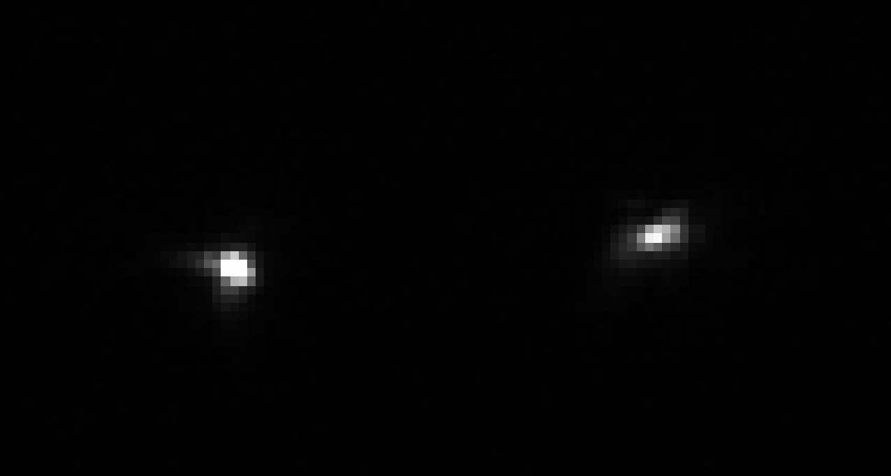
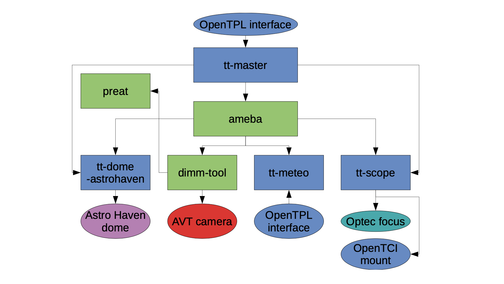

.. |author| replace:: *isotuela*
.. If there are no contributors, write "none" between the asterisks. Do not remove the substitution.
.. |contributors| replace:: *none*

.. _DIMM-DIMM:

####
DIMM
####

The differential image motion monitor (DIMM) is a standard instrument to measure astronomical "seeing", which is a metric for the amount of atmospheric turbulence affecting image quality. 

To operate the DIMM (start up, monitor and shutdown), please follow :ref:`DIMM Startup, Shutdown and Monitoring <DIMM-Ops>`

.. toctree::
   :glob:
   :titlesonly:
   :maxdepth: 5 

   *

The DIMM principle is to produce "twin images" of a bright star by a mask with two apertures at the entrance pupil of the telescope. 
One of the apertures holds a wedge prism that results in the displacement of an image on the sensor, producing a pair of images.

    The "twin images" of a star imaged on the DIMM focal plane.

The fluctuations of the angular distance between the two spots is proportional to the atmospheric optical turbulence, that in turn, 
enables a prediction of the expected FWHM in long exposures.

The main control software is divided into several programs. 
The main services are *ameba* that is in charge of the observation, synchronizing dome, weather service, mount and camera control, 
and the *preat* program that converts the output of the *dimm_tool* into seeing values.

    Structure of the DIMM software

Below is a list of some useful DIMM manuals:

.. _DIMM General Spec: https://github.com/lsst-ts/ts_dimm_app/blob/develop/doc/pdf/dev-dimm-general_spec-en_V1-1.pdf
.. _DIMM Configuration: https://github.com/lsst-ts/ts_dimm_app/blob/develop/doc/pdf/dev-dimm-config_spec-en_V1-2.pdf
.. _tt_master Spec: https://github.com/lsst-ts/ts_dimm_app/blob/develop/doc/pdf/dev-dimm-tt-master_spec-en_V1-4.pdf
.. _tt_meteo Spec: https://github.com/lsst-ts/ts_dimm_app/blob/develop/doc/pdf/dev-dimm-tt-meteo_spec-en_V1-2.pdf
.. _Preat Description: https://curl.sai.msu.ru/mass/download/doc/preat_desc2e.pdf 
.. _DIMM Optical and mechanical design: https://curl.sai.msu.ru/mass/download/doc/description.pdf 
.. _DIMM software description: https://curl.sai.msu.ru/mass/download/doc/dimm_soft_description.pdf
.. _DIMM Confluence Page: https://rubinobs.atlassian.net/wiki/spaces/LTS/pages/50073588/DIMM+Tower+and+Equipment+-+Edison
.. _DIMM Source Code: https://github.com/lsst-ts/ts_dimm_app 

* Overview of the DIMM software: `DIMM General Spec`_

* Configuration files for the DIMM programs, specially *ameba* and **dimm_tool**: `DIMM Configuration`_

* High-level control of the DIMM software, *tt-master* program description: `tt_master Spec`_

* A detailed description of the *preat* program and *preat* output: `Preat Description`_

* Information on the different operating modes that might be useful for maintenance and troubleshooting: `DIMM software description`_

* Rubin's confluence page with information of the individual hardware components, history of Rubin's DIMM, SW installation instructions and other useful links: `DIMM Confluence Page`_

* DIMM source code: `DIMM Source Code`_

This procedure was last modified on |today|.