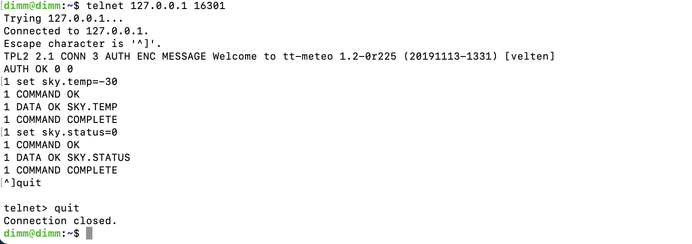

.. |author| replace:: *isotuela*
.. If there are no contributors, write "none" between the asterisks. Do not remove the substitution.
.. |contributors| replace:: *none*

.. _DIMM-Ops:

#####################################
DIMM Startup, Shutdown and Monitoring
#####################################

The DIMM automatically performs seeing measurements from dusk until dawn. 
Limited support from the user is expected. 

The vendor provided DIMM software will open the dome at dusk, start the system, slew the telescope, focus and offset the mount when needed, run the measurements, 
produce seeing values.  
At dawn, the telescope will park itself, and the dome will close. 
This cycle repeats the following evening, unless :ref:`manually shutdown <Dimm-Shutdown>`, when the sun sets.

The *ameba* program is continously checking that the environment conditions are stable and clear, based on the data delivered by *tt-meteo*.
In case of adverse weather, *ameba* will close the dome until conditions clear. 

Currently, there is no incoming Cerro Pachón weather information feeding the *tt-meteo* program. 
Thus prior to starting up the DIMM, there are additional steps outlined in the :ref:`prerequisites section <Dimm_StartUp-Prerequisites>`.

.. _Dimm_StartUp-Prerequisites: 

Prerequisites: Weather Data
===============================

Every time the DIMM is restarted, the weather startup values are set so the operations are disabled for safety reasons. 

To allow operations, mock weather data into the *tt-meteo* weather service must be entered in the following manner:

.. important::
    Ensure the weather conditions are stable and safe before attempting the DIMM startup. 

When connected to the LSST WAP network, open a terminal and connect to the DIMM Server using your IPA credentials:

.. code-block:: bash

        (base) you@Ios ~ % ssh yourIPAusername@dimm.cp.lsst.org

Switch onto the ``dimm`` user account:

.. code-block:: bash

        [yourIPAusername@dimm ~]$ sudo -iu dimm

Connect via telnet to *tt-meteo*. 

.. code-block:: bash
   
        dimm@dimm:~$  telnet 127.0.0.1 16301

The prompt within OpenTPL, a plain-text client-server protocol, is ``AUTH OK 0 0``. 
Commands are prepended with a freely chosen command id (unsigned integer).
More on this communication protocol can be found on the :ref:`DIMM general specs <DIMM-DIMM>`.

The following two commands can be written once the prompt appears. 

The first command will set the corrected sky temperature; the second will fix the sky to clear, confirming both observations are possible and safe. 

.. code-block:: bash
    
        1 set sky.temp=-30
    
        2 set sky.status=0

Quit telnet, pressing simultaneously ``Ctrl + ]``, write ``quit`` and click Enter. 

    *tt-meteo* OpenTPL client with the two commands required to manually configure the service.

Now the DIMM is ready to start operations. 

Follow one of the procedures below, to either start the DIMM up in :ref:`automatic mode <Dimm_StartUp-Automatic>` or in :ref:`manual mode <Dimm_StartUp-Manual>`. 

.. _Dimm_StartUp-Automatic: 

Starting Up the DIMM in Automatic Mode
======================================

Make sure you have run the :ref:`prerequisites <Dimm_StartUp-Prerequisites>` regarding the weather data. 

The automatic mode can be started from any state as the steps below override the current mode. 

In this mode of operations, the DIMM *ameba* will automatically select the targets from the star catalog. 

To start an automatic DIMM observation, connect to *tt-master* where you will set the variable ``ameba.mode`` to 1:

.. code-block:: bash
   
        dimm@dimm:~$  telnet 127.0.0.1 16500

and within the OpenTPL:

.. code-block:: bash
   
        AUTH OK 0 0
        1 set ameba.mode=1
        

Verify the DIMM CSC is enabled and data is appearing in the EFD.

Once this mode is enabled, the DIMM will continue taking data until sunrise, and will run again the following night. 

To manually stop the DIMM, see :ref:`stop the DIMM <Dimm-Shutdown>`

To monitor the status of the DIMM program, see :ref:`monitor the DIMM <Dimm-Monitor>`.

.. _Dimm_StartUp-Manual:

Starting up the DIMM in Manual Mode
====================================

Make sure you have run the :ref:`prerequisites <Dimm_StartUp-Prerequisites>` regarding the weather data. 

The manual mode can be started from any state as the steps below override the current mode. 

In this mode of operations, the user needs to choose the target and run the ``monitor_dimm_2.py`` python script available in the dimm home directory:

.. note:: Keep ``mag`` and ``color`` in 0.0.  Substitute with your target values the parameters in curly braces {}, that is, ``target_name``, ``RA``, ``DEC`` and ``spectral_type``. The format for the sptype is the MK system: the letter followed by a numeric digit (e.g. A8, F0, K5) 

.. code-block:: bash

        dimm@dimm:~$  python3 monitor_dimm_2.py manual --name {target_name} 
        --ra {RA in hours,float} --dec {DEC in degrees, float} --mag 0.0 --color 0.0 --sptype {spectral_type}

Verify the DIMM CSC is enabled and data is appearing in the EFD.

Once this mode is enabled, the DIMM will continue taking data until the target is not observable, but will run again on the following night. 

To manually stop the DIMM, see :ref:`stop the DIMM <Dimm-Shutdown>`

To monitor the status of the DIMM program, see :ref:`monitor the DIMM <Dimm-Monitor>`.

.. _Dimm-Monitor: 

Monitoring the DIMM program
============================

There are two ways to monitor the DIMM hardware, program and outputs. 

1. Run the ``monitor_dimm_2.py`` script in the dimm VM home directory that displays the most relevant information. 

.. code-block:: bash
   
        dimm@dimm:~$  python3 monitor_dimm_2.py monitor

2. Each DIMM service publishes a daily log. The two most relevant ones, *ameba* and *dimm_tool*, along with the *preat* seeing results can be found in:

    - Operational log - ``/mnt/dimm/log/ameba/ameba.log``

    - Camera log - ``/mnt/dimm/log/dimm_tool/dimm.log`` 

    - Seeing and other metrics - ``/mnt/dimm/image/dimm_tool/out/preat.log``

.. _Dimm-Shutdown: 

Shutting down the DIMM 
=======================

At the end of the night, *ameba* program will wrap up the observation, park the telescope and close the dome. 

But there might two situations in which the DIMM needs to be stopped manually:

        - Unsuitable weather conditions 

        - The following night nobody will be monitoring the weather at Cerro Pachon so for safety reasons, the DIMM won't be left operating. 

To gracefully shutdown the DIMM, set ``ameba.mode`` to 0 in the OpenTPL interface of *tt-master*, that is, from the DIMM VM:

.. code-block:: bash
   
        dimm@dimm:~$  telnet 127.0.0.1 16500

and within the OpenTPL:

.. code-block:: bash
   
        AUTH OK 0 0
        1 set ameba.mode=0
        

Confirm in the monitors that the DIMM operations have ceased. 

This procedure was last modified on |today|.
