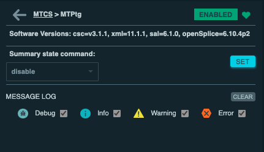
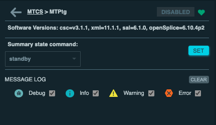
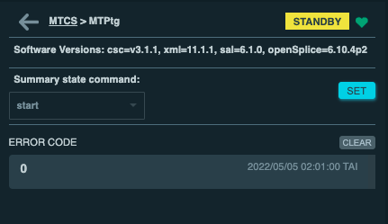
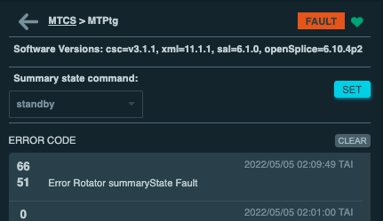
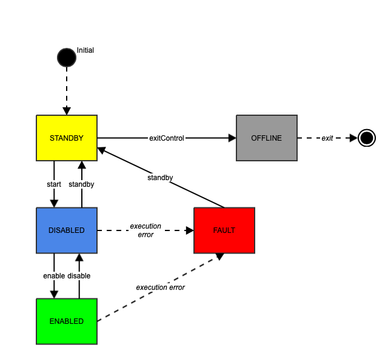

.. |author| replace:: *Tiago Ribeiro*
.. |contributors| replace:: *Michael Reuter, Patrick Ingraham*

.. _troubleshooting-no-historical-data:

##################
No Historical Data
##################

This issue usually manifests by a failure to perform state transitions (send a component to ENABLED or STANDBY state) using the higher level software.

In most cases it will be possible to see the following error message in the traceback:

.. code-block:: text

    Traceback (most recent call last):
    File "/opt/lsst/software/stack/conda/miniconda3-py38_4.9.2/envs/lsst-scipipe-3.0.0/lib/python3.8/site-packages/lsst/ts/salobj/csc_utils.py", line 141, in set_summary_state
        raise RuntimeError(f"Cannot get summaryState from {remote.salinfo.name}")
    RuntimeError: Cannot get summaryState from ...

The problem occurs when there is a network disconnection between systems which causes previously published data to be discarded, preventing the higher level software from determining the state of the components it tries to command.

This issue affects the Rubin Observatory Control System because the way the middleware message system (DDS) works.

For more details see the `observatory control`_ documentation page.

.. _observatory control: https://obs-controls.lsst.io

To resolve this issue we can manually perform the state transition by sending the command directly to the CSC.
The easiest way to do this is using the LOVE Summary state command feature.

The state transition works as follows:

* CSC in ENABLED state: send ``disable``

* CSC in DISABLED state: send ``standby``

* CSC in STANDBY state: send ``start``

* CSC in FAULT state: send ``standby``

The figure :ref:`below <fig-csc-state-machine>` shows a diagram of the state machine and the associated commands.
The dashed lines represent internal behavior that are not controlled by the user.
For example, CSCs will transition to FAULT if some internal error condition occurs.

    CSC State machine showing the associated commands.