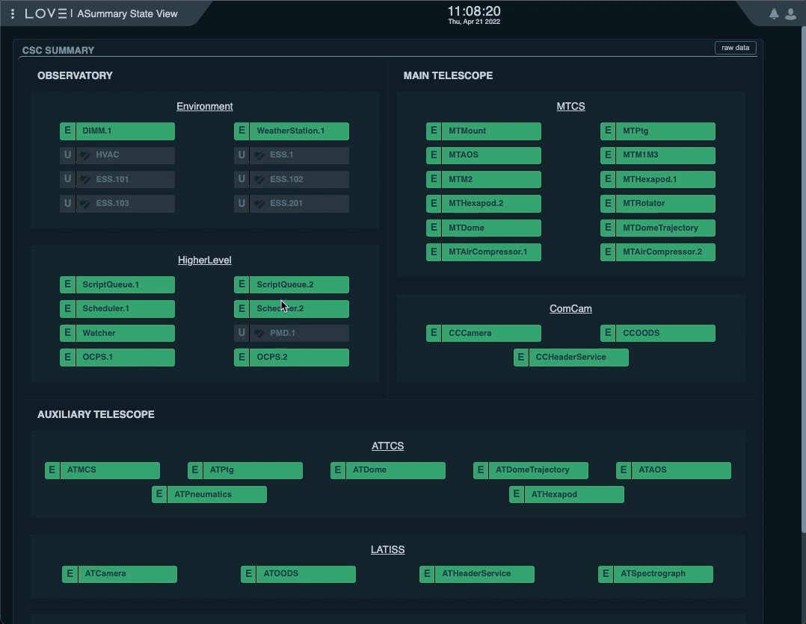
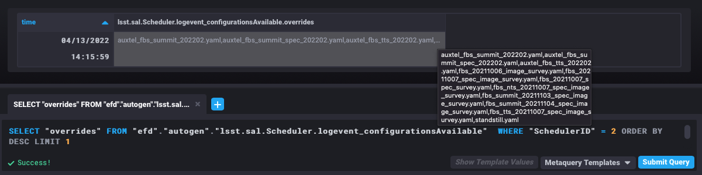
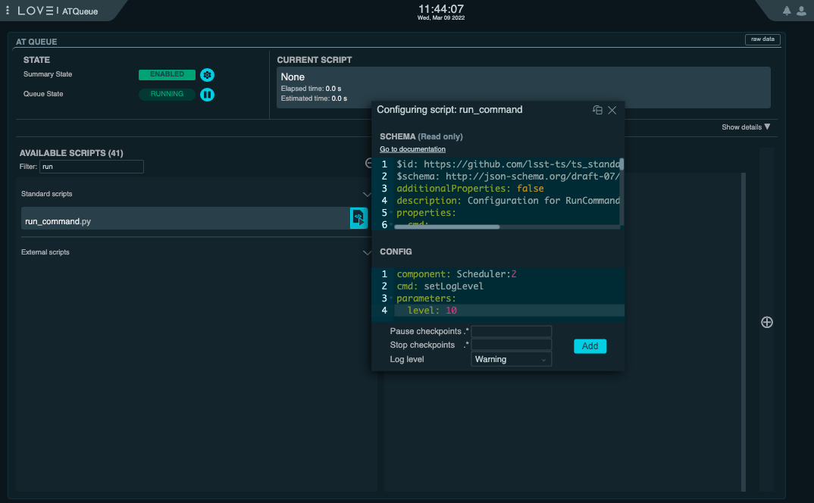
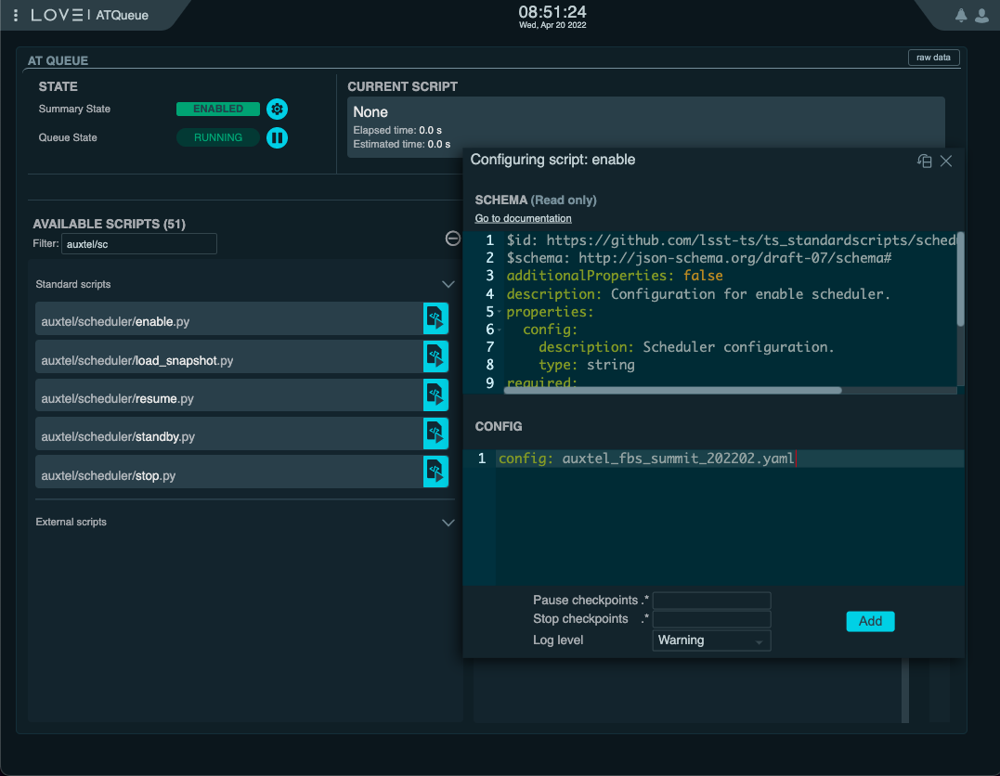
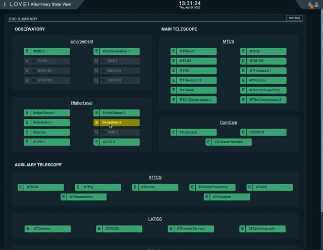

.. _initializing-the-scheduler-csc:

##############################
Initializing the Scheduler CSC
##############################

Most of the startup operations described here are done through LOVE, using the `ATQueue`_, the `ASummary State`_ and the `AT Summary State`_  views (links are only accessible in the internal network, e.g., LSS-WAP, VPN, etc).
The system contains a set of :ref:`custom scripts <scheduler-operational-scripts>` intended to facilitate Scheduler operations.
In the future it is expected that most of these operations will be done through a custom LOVE interface.

These procedures concentrate on the Auxiliary Telescope Scheduler because at the time of this writing, it is the focus of operations.
Nevertheless, as pointed out in :ref:`Nighttime-Scheduler-Scheduler-Operational-Procedures`, the processes are similar for both schedulers.

.. _ATQueue: http://love01.cp.lsst.org/uif/view?id=41
.. _ASummary State: http://love01.cp.lsst.org/uif/view?id=51
.. _AT Summary State: http://love01.cp.lsst.org/uif/view?id=62

As with other CSCs, the Scheduler is configured when transitioning from ``STANDBY`` to ``DISABLED``.
In addition to configuring the *scheduling algorithm*, the CSC also configures a number of ancillary modules and operation modes.
For an overview of the full set of parameters see the `Scheduler CSC configuration documentation`_.

.. _Scheduler CSC configuration documentation: https://ts-scheduler.lsst.io/configuration/configuration.html

.. _initializing-the-scheduler-csc-determining-configuration:

Determining Configuration
=========================

.. important::

    In general, the run manager will agree ahead of time on a set of configurations that will be available during a run.
    These configurations will be written down in the run planning page (currently done on confluence).

    The following procedure shows how to verify the available configurations.

For now, it suffices to say that before enabling the CSC, the user must know in advance which configuration should be used for the night.
During commmissioning it is likely that we will have more than one suitable configurations for every single night, that prioritizes different surveys that can be selected dependending on the conditions.
These will generally be in the form of different configuration names.

The available configurations (and associated configuration files) can be found in the Scheduler configuration directory of the `OCS configuration repository`_.
This information is also published by the CSC in the ``configurationsAvailable`` event, which can be found in LOVE detailed summary state view, inspected via SAL from a notebook in nublado or in the EFD from chronograf.

.. _OCS configuration repository: https://github.com/lsst-ts/ts_config_ocs

From LOVE's `ASummary State`_ view, you can select the Scheduler you want to interact with (Scheduler:1 or Scheduler:2 for the Main Telescope and Auxiliary Telescope, respectively) to see the detailed view.
Then, select the "start" command on the "Summary state command" dropdown menu.
This should immediatelly show the configurations available menu, which can be expanded to show them.
The process is shown :ref:`below <fig-scheduler-configurations>`.

    AT Scheduler configurations available from LOVE's Summary State view

From a notebook you would do something like:

.. code-block:: python

    import logging

    from lsst.ts import salobj
    from lsst.ts.idl.enums.Scheduler import SalIndex

.. code-block:: python

    logging.basicConfig(level=logging.DEBUG)

.. code-block:: python

    domain = salobj.Domain()

Below, note the use of ``index=SalIndex.AUX_TEL``, which means AT Scheduler.
For the MT, you would use ``index=SalIndex.MAIN_TEL``.

.. code-block:: python

    remote = salobj.Remote(domain, "Scheduler", index=SalIndex.AUX_TEL)

.. code-block:: python

    await remote.start_task

.. code-block:: python

    configurations_available = await remote.evt_configurationsAvailable.aget(timeout=5)

.. code-block:: python

    print(configurations_available.overrides)

From chronograf, the following query would also give you the :ref:`latest available configurations <fig-chronograf-scheduler-labels>` (again, note we are explicitly specifying AT Scheduler by selecting ``"SchedulerID" = 2``):

.. code-block:: text

    SELECT "overrides" FROM "efd"."autogen"."lsst.sal.Scheduler.logevent_configurationsAvailable"  WHERE "SchedulerID" = 2 ORDER BY DESC LIMIT 1

    Latest AT Scheduler configurations available from chronograf

.. _initializing-the-scheduler-csc-setting-csc-log-level:

Setting CSC Log Level
=====================

Before starting, it is recommended to set the Scheduler logging level to ``DEBUG``.
This can be done from the the `ATQueue`_ LOVE interface by executing the SAL Script ``run_command.py`` with the following configuration:

.. code-block:: text

    component: Scheduler:2
    cmd: setLogLevel
    parameters:
        level: 10

    Setting log level of the AT Scheduler from the ATQueue view on LOVE.
    The "Log Level" dropdown menu at the bottom of the "Configuration" widget allows you to chose the log level of the Script that will be executed on the Script Queue.
    It is import to keep in mind that this is different than the log level of the Scheduler CSC this is going to be set when running this Script.

It is also possible to do this from nublado with:

.. code-block:: python

    await remote.cmd_setLogLevel.set_start(level=logging.DEBUG, timeout=5)

.. _initializing-the-scheduler-csc-enabling-the-scheduler-csc:

Enabling the Scheduler CSC
==========================

Next you can transition the Scheduler CSC to ``ENABLED`` state.

The easiest way to perform the afternoon "enable" startup step is to run the custom ``auxtel/scheduler/enable.py`` script from the ScriptQueue with the following configuration:

.. code-block:: text

    config: auxtel_fbs_summit_202202.yaml

This script will take care of most conditions, even sending the CSC to ``STANDBY`` before enabling it, in case it is already enabled in advance and we want to reconfigure it.
As you can see, this script takes a single parameter (``config``), which is the scheduler configuration, discussed :ref:`above <initializing-the-scheduler-csc-determining-configuration>`.

    Launch ``auxtel/scheduler/enable.py`` script on ATQueue on LOVE.

As mentioned above, this script will send the CSC to ``STANDBY`` first and then to ``ENABLED``, respectively, thus guaranteeing it is configured with the expected setting.

.. note::

    The configuration selected above is ``auxtel_fbs_summit_202202.yaml``.
    This will likely change depending on the campaign in question, not to mention that it is definitely not suitable for MT.
    As mentioned :ref:`above <initializing-the-scheduler-csc-determining-configuration>`, **make sure you know ahead of time which configuration should be used** for the particular run. 

Alternatively, it is also possible to use LOVE's CSC detailed view to transition the Scheduler to ENABLED.
In this case, you must execute the summary state transition commands indivually, selecting the appropriate configuration when executing the ``start`` command.

The process is as follows:

#.  From the `AT Summary State`_, select the Scheduler you want to interact with; ``Scheduler.1`` for Main Telescope Scheduler, ``Scheduler.2`` for Auxiliary Telescope Scheduler.

#.  Make sure the CSC is in STANDBY state.
    If it is not :ref:`send it to STANDBY <advanced-scheduler-operations-send-scheduler-to-standby>` first.

#.  On the "Summary state command" dropdown menu, select "start".
    The "Configurations available" dropdown menu should appear on the side.

#.  Select the configuration from the dropdown menu.

#.  Click on "SET" button.

#.  Select "enable" in the "Summary state command" dropdown menu.

#.  Click on "SET" button.

    Enabling the AT Scheduler from LOVE's Summary State view

.. _initializing-the-scheduler-csc-final-remarks:

Final Remarks
=============

.. _initializing-the-scheduler-csc-the-scheduler-enabled-state:

The Scheduler ENABLED State
---------------------------

Once the Scheduler CSC transitions to ``ENABLED`` state it is ready to operate but is initially "paused", in the sense that it will not perform any action.

At this point it will continuously monitor the observatory state, updating its internal model and publishing that information through the ``observatoryState`` telemetry.
In this initial state, if the Scheduler can not determine the observatory state, the CSC will send a warning message but will remain in ``ENABLED`` state.

Since initially the CSC will not do anything, it is safe to enable it at any time.

.. _initializing-the-scheduler-csc-the-scheduling-algorithm-initial-state:

The Scheduler Startup Mode
--------------------------

As observations are successfully taken driven by the Scheduler, the *scheduling algorithm* internal state is updated accordingly.
This makes sure observations are not repeated and that the different surveys progress is properly managed.

As you can imagine, maintaining this internal state of the *scheduling algorithm* is crucial for the proper operation of the Scheduler, especially after interruptions, e.g. due to faults, normal nighttime/daytime transitions or else.

During its normal operation, the Scheduler makes sure enough information is stored in different locations that would allow recovery and/or reconstruction of its internal state.
For example, before computing new targets, the Scheduler saves a snapshot of its internal state to the large file annex of the EFD.
Furthermore, after every observation is completed successfully, the scheduler publishes information about the observation to the EFD and stores it to a local database.
All these can later be used independently to restore the state of the *scheduling algorithm*.

The Scheduler CSC provides a couple different mechanisms to rebuild its internal state; through one of its startup modes or by loading a snapshot.

There are three different startup modes: hot-, warm- and cold-start, which run while configuring the CSC when going from STANDBY to DISABLED.
In short, hot-start and warm-start are designed to rapidly recover the state by loading previously saved snapshots.
The main difference is that when performing hot-start, the Scheduler will retain any previously existing state, whereas warm-start will reload the state provided in the configuration (or reset to the initial state if none is provided).

During regular operations, you would start the night by using a configuration with warm-start, loading a pre-existing snapshot, and performing any subsequent restarts using hot-start (assuming that no change in the *scheduling algorithm* configuration is necessary).
If you want to load a new configuration, you should rely again on warm-start.

In summary, in most cases you would:

- Start the night with a warm-start configuration.
- Perform recoveries from FAULT, or similar situations during the night, using a compatible hot-start configuration.

Cold-start is reserved for those cases where there are substantial changes in the *scheduling algorithm* that make it impossible to provide a valid snapshot.
In these cases, you must start from an initial configuration and rebuild the state by performing a "playback" of the observations.
In these cases, the run manager and observer specialists will work with the survey strategy team to develop an appropriate cold-start strategy.
It is outside the scope of this document to go into details of how cold-start works.
For more information, see the `Scheduler CSC configuration documentation`_.

Alternatively, it is also possible to load a snapshot "on-the-fly".
This process is covered in more details in :ref:`scheduler-night-time-operation`.
