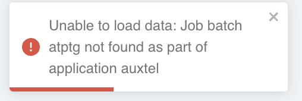
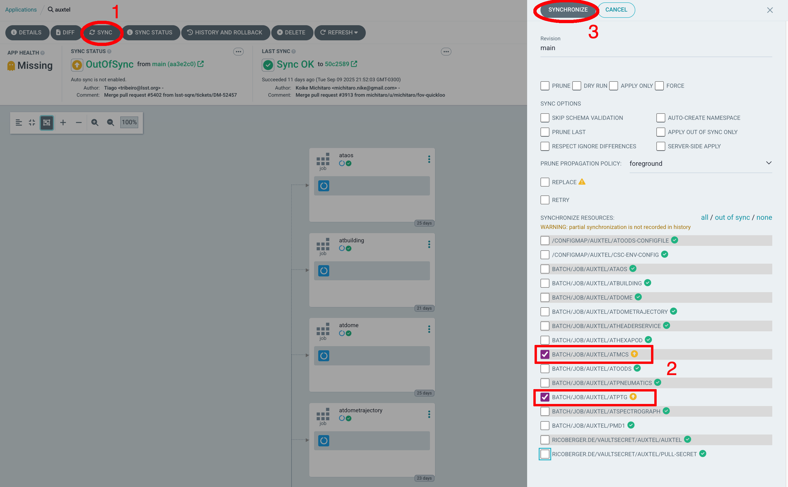

.. |author| replace:: *Tiago Ribeiro*
.. |contributors| replace:: *Michael Reuter, Patrick Ingraham, Kris Mortensen*

.. _`Confluence page`: https://rubinobs.atlassian.net/wiki/spaces/OOD/pages/883752990/Restarting+a+CSC+Component+in+ArgoCD
.. _`#summit-announce`: https://rubin-obs.slack.com/archives/C07QCJ7F962

.. _Restarting-a-CSC-Component-in-ArgoCD:

######################################
Restarting a CSC Component in ArgoCD
######################################

.. warning::

   This procedure contains steps that may affect the system in critical ways.
   If you are unsure about any of the steps described here, contact support personnel.

.. _Restarting-a-CSC-Component-in-ArgoCD-Overview:

Overview
========

Most components on the Rubin system run as containers on a Kubernetes cluster
and have a maximum amount of resources they can use.
If a particular CSC exceeds that limit -- for example, overconsumption of memory --
the Kubernetes cluster terminates the container for that CSC.
Observers at the summit typically notice this on LOVE as a lack of heartbeats
or a failure to connect to subsystems within the CSC,
which can be found in the message logs on the
`ASummary State View <https://summit-lsp.lsst.codes/love/uif/view?id=51>`__.

If there is no communication with the CSC, but lower-level controllers are operational
-- i.e., the cRIOs are working properly --
a reset of the component in ArgoCD is needed to bring the CSC back online.

Some common examples for when a CSC restart is needed:

- Power glitches or outages.
  These incidents may cause CSCs to fault or lose heartbeats
  due to a loss of communication -- e.g., in-dome CSCs like the Calibration Systems.
- Deploying a new version of a CSC -- e.g., ``mtmount`` to ``mtmount-ccw-only``.
- The CSC is ``OFFLINE``.

Before continuing with this procedure, always **contact appropriate personnel**
-- support scientists, engineers, etc. --
to verify whether a CSC restart is needed.
If there is an alternate solution, attempt that first.

.. note::

   This document does not include the procedure to change versions of specific CSCs 
   (e.g., switching ``mtmount`` to ``mtmount-ccw-only`` or ``mtmount-sim``).
   Contact a support scientist for assistance.

.. _Restarting-a-CSC-Component-in-ArgoCD-Error_Diagnosis:

Error Diagnosis
===============

The initial indication that a CSC may need to be restarted
typically presents as one or more of the following symptoms on LOVE:

- Missing heartbeats on the
  `ASummary State View <https://summit-lsp.lsst.codes/love/uif/view?id=51>`__.
- Failure to connect to subsystems within the CSC.
- The CSC appears as ``OFFLINE``.
- Lower-level controllers -- such as cRIOs -- remain operational,
  but the CSC itself is unresponsive.

.. _Restarting-a-CSC-Component-in-ArgoCD-Procedure-Steps:

Procedure Steps
===============

#. Announce on the Slack channel `#summit-announce`_
   that you will be restarting CSCs in ArgoCD.

#. Identify which CSC component needs to be reset and send it to ``OFFLINE``
   with the ``set_summary_state.py`` command:

   .. code-block:: text
      :caption: set_summary_state.py

      data:
        - [MTPtg, OFFLINE]

   Verify that the CSC is offline via the
   `ASummary State View <https://summit-lsp.lsst.codes/love/uif/view?id=51>`__.
   The component should appear similar to the example below with MTPtg.

   .. figure:: ./_static/love-mtptg-offline.png
      :name: love-mtptg-offline

      LOVE Summary State View showing MTPtg in the ``OFFLINE`` state.

#. Log into ArgoCD using your Keycloak credentials.

   **Notify personnel on Slack** that you will be accessing an ArgoCD environment
   to reset a CSC component.
   There are three different environments:

   - **Summit** (use for resetting CSCs):
     `summit-lsp.lsst.codes/argo-cd <https://summit-lsp.lsst.codes/argo-cd>`__.
   - **Base Teststand** (BTS).
   - **Tucson Teststand** (TTS).

#. Once connected to ArgoCD, navigate to the appropriate application
   that houses the CSC that needs to be reset:

   - Simonyi CSCs: **simonyitel**
   - AuxTel CSCs: **auxtel**

   .. note::

      M1M3 and MTCamera CSCs are not in Kubernetes and require different procedures.

#. The application consists of several jobs that connect to the CSC components.
   Locate the job with the same name as the CSC
   and verify that its status is ``OFFLINE``. 
   The table below describes the three possible job status indicators in ArgoCD.

   .. list-table:: ArgoCD Job Statuses
      :widths: 15 45 40
      :header-rows: 1
      :class: center-headers

      * -  Status
        -  Description
        -  Example Status
      * -  **Running**
        -  The normal state of a job running within the application.
           It consists of a blue square with a white spinning wheel.
           Sometimes there is text saying ``Progressing 1 pods``.
        - 
           .. figure:: ./_static/argocd-job-running.png
             :name: argocd-job-running
            
             A job in the ``Running`` state.

      * -  **Offline**
        -  When the CSC is offline, the job indicates that it has completed.
           There is a green checkmark without any errors showing.
        - 
           .. figure:: ./_static/argocd-job-offline.png
             :name: argocd-job-offline
            
             A job in the ``Offline`` state.

      * -  **Failed**
        -  While rare, some jobs may end up in a failed state.
           If this happens, contact appropriate personnel.
           The job has a red square with a white cross in it.
        - 
           .. figure:: ./_static/argocd-job-failed.png
             :name: argocd-job-failed
            
             A job in the ``Failed`` state.

#. To reset the job, it must first be deleted from the application.
   Press the *three vertical dots* on the right-hand side of the job
   and select :guilabel:`Delete`.

   .. figure:: ./_static/argocd-delete-job.png
      :name: argocd-delete-job

   .. warning::

      Under no circumstances should you delete the application.

#. A prompt appears confirming whether you wish to delete the job.
   Type the name of the job on the line provided -- e.g., ``mtptg`` --
   and select :guilabel:`OK`.
   The job is now removed from the application.

   .. figure:: ./_static/argocd-confirm-delete.png
      :name: argocd-confirm-delete

      Delete Resource pop-up window.

#. To reload the job, press the *three vertical dots* on the right-hand side
   of the job and select :guilabel:`SYNC`.

   .. figure:: ./_static/argocd-sync-step.png
      :name: argocd-sync-step

#. Once the sidebar appears, select the :guilabel:`SYNCHRONIZE` button at the top.

   .. figure:: ./_static/argocd-synchronize-sidebar.png
      :name: argocd-synchronize-sidebar

   If the deleted job does not reappear in the application, see
   :ref:`Syncing a Job That is Not Visible <Restarting-a-CSC-Component-in-ArgoCD-Contigency-Sync-Job-Not-Visible>` 
   below.

#. The job should now reappear with its status as ``Running``.
   After waiting a couple of minutes -- some CSCs take longer than others --
   the CSC on LOVE should change from ``OFFLINE`` to ``STANDBY``.
   Re-enable the CSC and the heartbeats should return
   along with proper connections to the lower-level controllers.

   .. figure:: ./_static/love-mtptg-standby.png
      :name: love-mtptg-standby

      LOVE Summary State View showing MTPtg in ``STANDBY``.

.. _Restarting-a-CSC-Component-in-ArgoCD-Post-Condition:

Post-Condition
==============

- The CSC is in ``STANDBY`` or ``ENABLED`` state on the LOVE ASummary State View.
- Heartbeats have returned.
- Connections to the lower-level controllers are restored.

Contingency
===========

If the procedure was not successful, report the issue in `#summit-announce`_
and contact appropriate support personnel. Activate the 
`Out of Hours Support <https://rubin-obs.slack.com/archives/C07QCJ7F962>`__
if needed.

.. _Restarting-a-CSC-Component-in-ArgoCD-Contigency-Sync-Job-Not-Visible:

Syncing a Job That is Not Visible
---------------------------------

If the job you deleted does not show up in the application:

   The application view when the deleted job is not visible.

#. Go to the :guilabel:`SYNC` button at the top left of the application view.
#. Select the jobs you want to sync.
#. Press :guilabel:`SYNCHRONIZE`.

   Using the general :guilabel:`SYNC` button when the job is not listed within the application.

