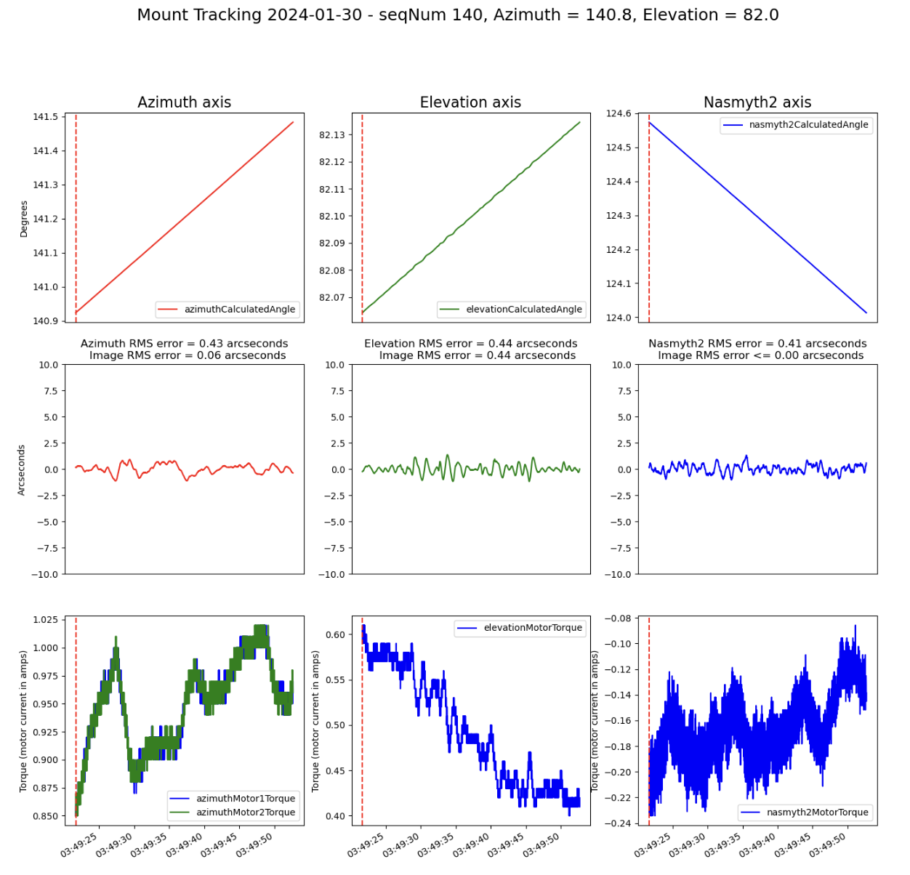
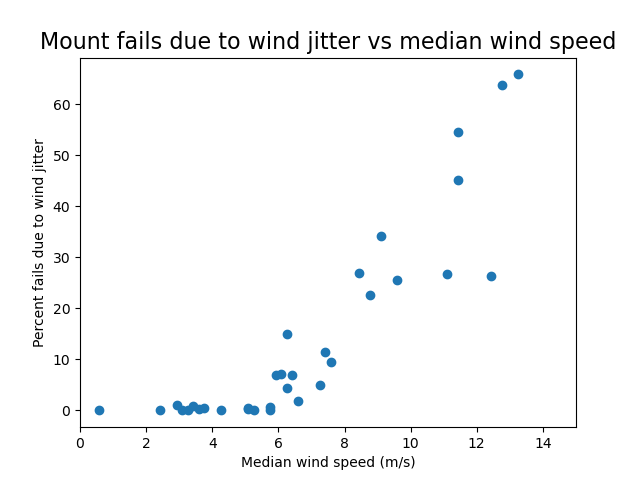

.. Review the README in this directory on instructions to contribute.
.. Static objects, such as figures, should be stored in the _static directory. Review the _static/README in this file's directory on instructions to contribute.
.. Do not remove the comments that describe each section. They are included to provide guidance to contributors.
.. Do not remove other content provided in the templates, such as a section. Instead, comment out the content and include comments to explain the situation. For example:
	- If a section within the template is not needed, comment out the section title and label reference. Do not delete the expected section title, reference or related comments provided from the template.
    - If a file cannot include a title (surrounded by ampersands (#)), comment out the title from the template and include a comment explaining why this is implemented (in addition to applying the ``title`` directive).
.. |author| replace:: *Alysha Shugart*
.. This is the label that can be used as for cross referencing this file.
.. |contributors| replace:: *Kris Mortensen*
.. Recommended format is "Directory Name"-"Title Name"  -- Spaces should be replaced by hyphens.
.. _Observing-Constraints-AuxTel-Weather-Constraints:
.. Each section should includes a label for cross referencing to a given area.
.. Recommended format for all labels is "Title Name"-"Section Name" -- Spaces should be replaced by hyphens.
.. To reference a label that isn't associated with an reST object such as a title or figure, you must include the link an explicit title using the syntax :ref:`link text <label-name>`.
.. An error will alert you of identical labels during the build process.
.. _`site webcams`: https://noirlab.edu/science/observing-noirlab/weather-webcams
.. _`SOAR weather station`: https://noirlab.edu/science/observing-noirlab/weather-webcams/cerro-pachon/environmental-conditions
.. _`RubinTV`: https://summit-lsp.lsst.codes/rubintv/summit/auxtel 
.. _`RubinTV All Sky`: https://summit-lsp.lsst.codes/rubintv/summit/allsky 
.. _`TN-126`: https://sitcomtn-126.lsst.io/#auxtel-image-quality-wind-study
.. _`online tool`: https://www.calculator.net/dew-point-calculator.html 
.. _`Gemini South`: https://www.gemini.edu/observing/telescopes-and-sites/sites/cloud-cameras/gemini-south-all-sky-camera 

##########################
AuxTel Weather Constraints
##########################

.. This section should provide a brief, top-level description of the page.

This page defines the different types of operational constraints due to weather.

For a full study of wind on image quality, refer to SIT-Com `TN-126`_.

Operating conditions used to define the Rubin construction project are found 
in `LTS-54 <https://ls.st/lts-54>`__. 

As commissioning gets underway, the operating conditions will be better constrained, 
and different situations will apply to the Main telescope and Auxiliary Telescope.

.. toctree::
    :maxdepth: 2
    :titlesonly:
    :glob:

..    *

.. _auxtel-weather-constraints-deciding-to-open:

Deciding to open
================
Before opening the dome to take on-sky data or for cooling, observers must take care to inspect the weather conditions.
Humidity (especially the dew point difference), cloud cover, and wind speed are the three largest determining factors for safety of the telescope and equipment. 

Observers should inspect the forecast for the night, and review the weather trends on the Rubin weather station and weather forecast CSC in LOVE or Chronograph.
The Rubin weather data is updated every 0.5 seconds. 
The Rubin weather data is viewed in LOVE, in the "Weather Station Component" view.
The wind is displayed both as an integer and plotted on a vector graph. 

NOIRLab also hosts additional links to Cerro Pachón weather, including `site webcams`_, and the `SOAR weather station`_. 

If the humidity is above 70%, go outside and look for incoming cloud fronts, and inspect the buildings and cars for condensation.
Be more cautious to open if there will not be someone in the control room to monitor changing weather conditions, 
e.g. opening before going to dinner, or leaving the control room to complete another task.

.. warning::
    Vent gates:
        The vent gates on the first floor of the AuxTel dome can add turbulence if winds are high. 
        Close the vent gates if wind speeds are above 10 m/s.
        This value is less than they can physically stand, but this avoids cross talk in the dome. 

.. note::
    Extraction fan use:
        The extraction fan on vent gate 3 can operate at 50-100% power for initial cooling, while running the vent.py script. 
        During on-sky operations, the extraction fan must be run at 20% power.
        If winds are over 10 m/s, the extraction fan should be turned off.
        If humidity is rising quickly, or >= 65%, (to be revised) the extraction fan should be turned off to avoid drawing in more moisture through the dome. 

.. _auxtel-weather-constraints-wind:

Wind
====
The predominant wind direction at the summit is from the northwest or ~300 degrees.  
The majority of the time, the wind comes up from the coast and blows through the Elqui River valley, 
arriving to the summit. 
If the direction changes frequently, or has completely changed direction from 300 degrees, 
use caution as this likely indicates a frontal system and unstable atmospheric conditions.

Mount jitter becomes much more frequent in cases of gusty wind. 
High mount error is characterized as error over 0.25, which calculated and displayed in `RubinTV`_.
as *mount motion image degradation*.
The figure below shows an example of the mount moving erratically in wind speeds over 10 m/s.

Over the year of 2023, the median wind speed is plotted against the number of mount failures due to wind. 
When the wind velocity averages higher than 8 m/s, winds begin to noticeably impact mount performance 
and image quality. 

Using this information, the following guidelines are imposed:

Wind speeds less than 8 m/s (measured over the last 10 data points):
    - This is safe operation range for AuxTel. 
        No restrictions in observing are needed. 
        
Wind speeds between 8 and 15 m/s (measured over the last 10 data points):
    - Closely monitor the system for ATMCS failing to arrive in position due to excessive wind shake.
        The Scheduler configuration will sometimes choose to observe targets directly pointed into the wind; this is known and often times intentional.
        However, if ATMCS goes to fault and the wind speed is below 15m/s, **be ready to close AuxTel**.
    - **Close the vent gate(s) at winds over 10 m/s.**

.. note::
    Opposite rule:
        The optimum place for the Scheduler to point AuxTel when there are winds over 8 m/s is 180 degrees offset from the dominant wind direction. 

Wind speeds greater than 15 m/s (measured over the last 10 data points):
    - Observers should close once wind gusts have become greater than 15 m/s. 
        If mount jitter is occurring frequently in all parts of the sky, close the dome. 
        Before deciding to open again, ensure that sustained winds have dropped below the closure limits for more than 15 minutes. 
        Reset the timer if the wind jumps over 15 m/s again. 

.. warning:: 
    Dome Drop-Down Shutter:
        The drop down shutter begins to vignette incoming light from targets at 27 degrees elevation, so it does not open automatically 
        and remains closed during normal operations. Additionally, because of its design, the drop-down shutter is more susceptible to 
        wind gusts and has a lower operational limit than the rest of the facility. The drop-down shutter must should be closed if gusts 
        reach over 8 m/s.

.. _auxtel-weather-constraints-humidity-and-dew-point:

Humidity and dew point
======================

Higher relative humidity is not an absolute determination of closure, but observers must pay close attention when humidity is over 70%, 
or if it begins to suddenly trend upward.

Humidity above 65%:
    - Turn off the extraction fan and close vent gates.

Humidity above 70%:
    - Observers must treat this range with extra caution. 
        Take time to go outside and inspect vehicles, buildings, and look for falling drops from the roof. 
        Be mindful of local humidity changes between AuxTel and the main telescope building.
        Because AuxTel is more exposed, there is more air mixing which creates a small buffer against condensation compared to the Rubin building.
        If the ambient temperature is cooler, especially during winter time, the condensation risk on metal surfaces is higher. 

The quantity that is MORE IMPORTANT than relative humidity is the **dew point temperature** and the **dew point difference**. 
The dew point temperature is the ambient air temperature at which relative humidity will reach 100% - the air is completely saturated with water vapor.
You can calculate the **dew point temperature** using this `online tool`_.
The **dew point difference** is the difference between the dew point temperature and the coldest structure in the telescope dome. 

Example:
    Dew point temperature = 4 degrees C.

    AuxTel M1 temperature = 11 degrees C.
    
    Truss temperature = 8 degrees C.

    AuxTel In-Dome temperature = 10 degrees C.
    
    **Dew point difference = +4 degrees C.**

In the example, the dew point difference is 4 degrees C, which is in safe operational range. 
For any object or structure that is above the dew point temperature, there is less condensation risk.
Water condenses on the coldest surface. 

Dew point difference is > 2.5 degrees C:
    - Normal operations may continue.

Dew point difference is between 2 degrees and 2.5 degrees C:
    - Observers must consider closing. 
        Go outside and check condensation on buildings and vehicles. 
        If wet, advise to close.

Dew point difference is 2 degrees C or less:
    - Close immediately. 

Observers must wait for the dew point temperature or humidity to recover from the closure limits for at least 30 minutes before opening again. 

.. note::
    If humidity has dropped during the night, before opening the dome slit, consider performing a quick dome drain procedure. 
    Rotate the closed dome several times in both directions, exercising large slews. 
    This can remove some of the water droplets that might have accumulated on the metal surface. 

.. _auxtel-weather-constraints-cloud-cover:

Cloud cover
===========

AuxTel has continued observing happily in 2.5 magnitudes of extinction, given that most targets are typically :math:`\leq 8\,mag`.

The biggest threat of cloud cover is lower-atmosphere condensation, or virga, which is rain and moisture that falls from a cloud, but evaporates before it hits ground level.
Virga appears like streaks of rain or whips on the bottom of different types of cumulus clouds. 
Winds can bring this moisture into the dome, or it can condense on the dome roof and fall through the slit. 

If clouds are present in the all-sky camera displayed on `RubinTV All Sky`_ - which is mounted next to Earthcam on Piñon - be mindful of further cloud accumulation and the direction they are coming from. 

Aggregate data by going outside and looking around the sky. 
During bright time, look along the glowing cloud edges for wisps or "cloud tails".
This is virga. 

.. note::
    Take the opportunity to go outside and compare the all sky cameras to real life. 
    Look east and verify that the clouds are not covering the mountain peaks. 
    If clouds are at this low elevation, these is a moisture risk.
    Take caution before opening the telescope, or consider closing the dome.

`Gemini South`_ also has an all-sky camera. 
Use it to further verify cloud coverage over the mountains to the east. 
This camera only exposes at night - each exposure is 30 seconds.

.. _auxtel-weather-constraints-moon-avoidance:

Moon avoidance
==============

If the scheduler is choosing targets that point directly into the direction of the moon, alert support staff or change the scheduler program.
If engineering tasks are being run that are not measuring sky brightness, choose targets out of the direction of the moon. 
Be mindful of scattered moonlight during heavy cloud cover. 
Data may be degraded. 

Shutdown And Resume
===============================
When the weather conditions approach the constraints during observation, shut down observations and close the dome. 
See :ref:`Auxtel Shutdown <AuxTel-Nighttime-Operations-Shutdown>` for the shutdow procedure.
If the weather turns good later and the resumption of observation is decided, 
follow :ref:`Resume from a Shutdown <Resume-from-Temporary-Shutdown>` for extra pointing and focus correction. 

This procedure was last modified |today|.