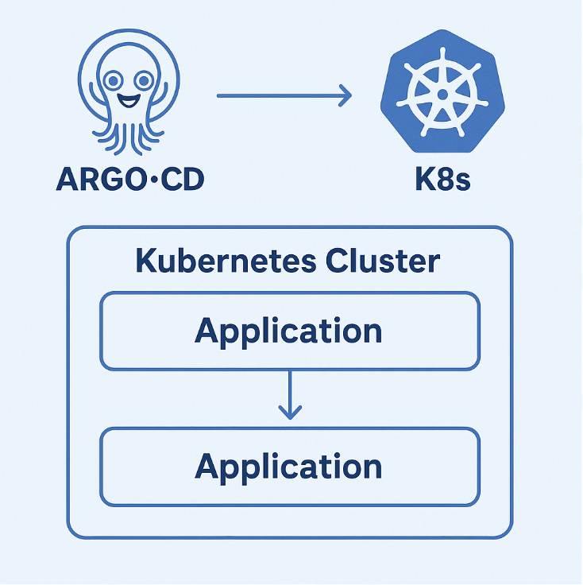
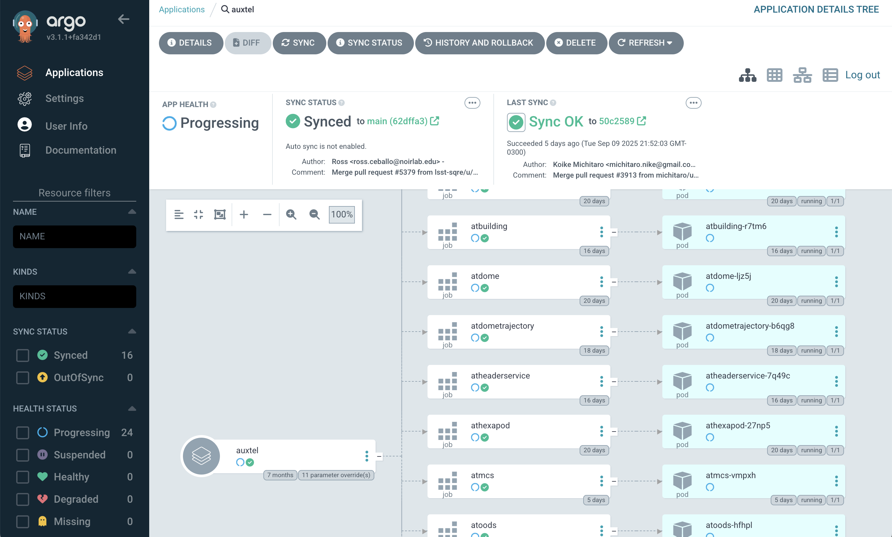

.. Review the README in this procedure's directory on instructions to contribute.
.. Static objects, such as figures, should be stored in the _static directory. Review the _static/README in this procedure's directory on instructions to contribute.
.. Do not remove the comments that describe each section. They are included to provide guidance to contributors.
.. Do not remove other content provided in the templates, such as a section. Instead, comment out the content and include comments to explain the situation. For example:
	- If a section within the template is not needed, comment out the section title and label reference. Include a comment explaining why this is not required.
    - If a file cannot include a title (surrounded by ampersands (#)), comment out the title from the template and include a comment explaining why this is implemented (in addition to applying the ``title`` directive).

.. Include one Primary Author and list of Contributors (comma separated) between the asterisks (*):
.. |author| replace:: *Tiago Ribeiro*
.. If there are no contributors, write "none" between the asterisks. Do not remove the substitution.
.. |contributors| replace:: *Michael Reuter, Patrick Ingraham*

.. This is the label that can be used as for cross referencing this procedure.
.. Recommended format is "Directory Name"-"Title Name"  -- Spaces should be replaced by hyphens.
.. _Observing-Interface-Getting-Started-ArgoCD:

############################
Getting Started With Argo CD
############################

.. _Observing-Interface-Getting-Started-ArgoCD-Overview:

Overview
========

.. This section should provide a brief, top-level description of the procedure's purpose and utilization. Consider including the expected user and when the procedure will be performed.

Argo CD is used to manage deployment configurations on Kubernetes (k8s) clusters. 
The majority of our components (e.g., most of CSCs, LOVE, Nublado, etc.) are deployed on Kubernetes, making ArgoCD a key tool for controlling and updating these systems.
This procedure is intended for users of the Rubin Observatory to get started with Argo CD.

    Argo CD and k8s cluster.

Resources are organized into **Apps** which represent a set of Kubernetes resources to manage. 
Apps, such as *simonyitel* or *auxtel*, include **Jobs** for each CSC for the Simonyi Telescope, or AuxTel respectively.
Argo CD ensures that these resources exist and remain up-to-date, so the cluster always matches the configuration in Git without requiring manual intervention.

With Argo CD, users can monitor if a CSC has crashed, restart it if necessary, or deploy new CSC versions quickly and reliably.

    AuxTel app in Argo CD showing some of the jobs/CSCs.

.. Need a list of what components are available in each namespace. 

.. note::
  
  M1M3, ATCamera and LSSTCam CSCs are not in Argo CD. 

To get a list of the different environments see :ref:`Observing-Interface-Operational-Environments`

.. _Observing-Interface-Getting-Started-ArgoCD-Precondition:

Precondition
=============

.. This section should provide simple overview of Precondition before executing the procedure; for example, state of equipment, telescope or seeing conditions or notifications prior to execution.
.. It is preferred to include them as a bulleted or enumerated list.
.. Do not include actions in this section. Any action by the user should be included at the beginning of the Procedure section below. For example: Do not include "Notify specified SLACK channel. Confirmation is not required." Instead, include this statement as the first step of the procedure, and include "Notification to specified SLACK channel." in the Precondition section.
.. If there is a different procedure that is critical before execution, carefully consider if it should be linked within this section or as part of the Procedure section below (or both).

- Make sure you read and understand the :ref:`environments procedure <Observing-Interface-Operational-Environments>`.

  - Once you have identified which environment you want to interact with, you must be able to load the link to the Argo  CD instance to that environment.

.. _Observing-Interface-Getting-Started-ArgoCD-Post-Conditions:

Post-Condition
==============

.. This section should provide a simple overview of conditions or results after executing the procedure; for example, state of equipment or resulting data products.
.. It is preferred to include them as a bulleted or enumerated list.
.. Do not include actions in this section. Any action by the user should be included in the end of the Procedure section below. For example: Do not include "Verify the telescope azimuth is 0 degrees with the appropriate command." Instead, include this statement as the final step of the procedure, and include "Telescope is at 0 degrees." in the Post-condition section.

- Successfully access Argo CD.

.. _Observing-Interface-Getting-Started-ArgoCD-Procedure-Steps:

Procedure Steps
===============

.. This section should include the procedure. There is no strict formatting or structure required for procedures. It is left to the authors to decide which format and structure is most relevant.
.. In the case of more complicated procedures, more sophisticated methodologies may be appropriate, such as multiple section headings or a list of linked procedures to be performed in the specified order.
.. For highly complicated procedures, consider breaking them into separate procedure. Some options are a high-level procedure with links, separating into smaller procedures or utilizing the reST ``include`` directive <https://docutils.sourceforge.io/docs/ref/rst/directives.html#include>.

- Request access to the `IT 1Password <https://lsstit.1password.com/home>`_ system.
- Request access to the *Argo CD Admin* vault.
- Log into the site specific Argo CD instance using the credentials found in the vault.

.. _Observing-Interface-Getting-Started-ArgoCD-Troubleshooting:

Troubleshooting
===============

.. This section should include troubleshooting information. Information in this section should be strictly related to this procedure.

.. If there is no content for this section, remove the indentation on the following line instead of deleting this sub-section.

If you are having trouble accessing an Argo CD site, please use the site specific Slack channel for further assistance.

This procedure was last modified |today|.