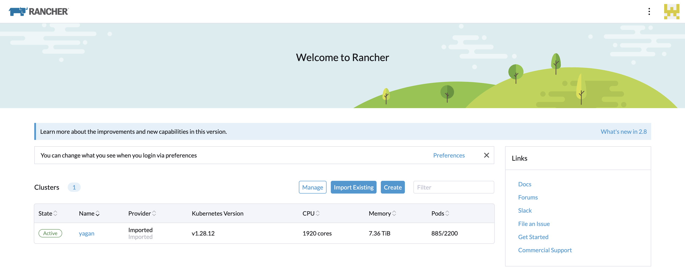
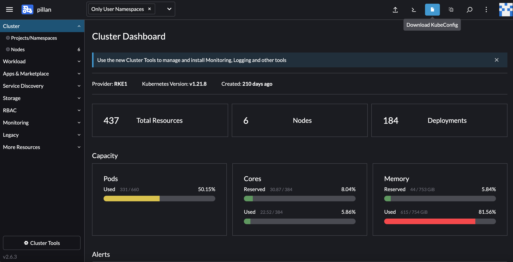

.. Review the README in this procedure's directory on instructions to contribute.
.. Static objects, such as figures, should be stored in the _static directory. Review the _static/README in this procedure's directory on instructions to contribute.
.. Do not remove the comments that describe each section. They are included to provide guidance to contributors.
.. Do not remove other content provided in the templates, such as a section. Instead, comment out the content and include comments to explain the situation. For example:
	- If a section within the template is not needed, comment out the section title and label reference. Include a comment explaining why this is not required.
    - If a file cannot include a title (surrounded by ampersands (#)), comment out the title from the template and include a comment explaining why this is implemented (in addition to applying the ``title`` directive).

.. Include one Primary Author and list of Contributors (comma separated) between the asterisks (*):
.. |author| replace:: *Michael Reuter*
.. If there are no contributors, write "none" between the asterisks. Do not remove the substitution.
.. |contributors| replace:: *Tiago Ribeiro, Patrick Ingraham*

.. This is the label that can be used as for cross referencing this procedure.
.. Recommended format is "Directory Name"-"Title Name"  -- Spaces should be replaced by hyphens.
.. _Observing-Interface-Getting-Started-Kubernetes:

###############################
Getting Started With Kubernetes
###############################

.. _Observing-Interface-Getting-Started-Kubernetes-Overview:

Overview
========

.. This section should provide a brief, top-level description of the procedure's purpose and utilization. Consider including the expected user and when the procedure will be performed.

This procedure is intended for users of the Rubin Observatory that are interested in interacting with the Observatory Control System using Kubernetes.
It contains basic procedures on how to get started with the Kubernetes.
Kubernetes is the platform used to run many of the control system components and summit services.

To get a list of the different environments see :ref:`Observing-Interface-Operational-Environments`

.. _Observing-Interface-Getting-Started-Kubernetes-Prerequisites:

Prerequisites
=============

.. This section should provide simple overview of prerequisites before executing the procedure; for example, state of equipment, telescope or seeing conditions or notifications prior to execution.
.. It is preferred to include them as a bulleted or enumerated list.
.. Do not include actions in this section. Any action by the user should be included at the beginning of the Procedure section below. For example: Do not include "Notify specified SLACK channel. Confirmation is not required." Instead, include this statement as the first step of the procedure, and include "Notification to specified SLACK channel." in the Prerequisites section.
.. If there is a different procedure that is critical before execution, carefully consider if it should be linked within this section or as part of the Procedure section below (or both).

- Have a FreeIPA account
- Make sure you read and understand the :ref:`environments procedure <Observing-Interface-Operational-Environments>`.

  - Once you have identified which environment you want to interact with, you must be able to load the link to the Rancher instance to that environment.

.. _Observing-Interface-Getting-Started-Kubernetes-Post-Conditions:

Post-Condition
==============

.. This section should provide a simple overview of conditions or results after executing the procedure; for example, state of equipment or resulting data products.
.. It is preferred to include them as a bulleted or enumerated list.
.. Do not include actions in this section. Any action by the user should be included in the end of the Procedure section below. For example: Do not include "Verify the telescope azimuth is 0 degrees with the appropriate command." Instead, include this statement as the final step of the procedure, and include "Telescope is at 0 degrees." in the Post-condition section.

- Successfully access the site specific Kubernetes resources.

.. _Observing-Interface-Getting-Started-Kubernetes-Procedure-Steps:

Procedure Steps
===============

.. This section should include the procedure. There is no strict formatting or structure required for procedures. It is left to the authors to decide which format and structure is most relevant.
.. In the case of more complicated procedures, more sophisticated methodologies may be appropriate, such as multiple section headings or a list of linked procedures to be performed in the specified order.
.. For highly complicated procedures, consider breaking them into separate procedure. Some options are a high-level procedure with links, separating into smaller procedures or utilizing the reST ``include`` directive <https://docutils.sourceforge.io/docs/ref/rst/directives.html#include>.

- File an `IHS JIRA <https://jira.lsstcorp.org/projects/IHS>`_ ticket to request access to the site specific Rancher.
    - Set the *Component/s* to *AAA* and set the *Responsible Organization* to the appropriate site.
- Log into the site specific Rancher instance using your FreeIPA account.
- Once logged in, select the site specific Kubernetes cluster.

    Screenshot of selecting a Kubernetes cluster.

- With the cluster selected, click the `Download KubeConfig` button to get a *kubeconfig* file.

    Screenshot of hovering over the Download KubeConfig button.

- Using the *kubeconfig* file requires the *kubectl* executable.
    - See the `kubectl installation <https://kubernetes.io/docs/tasks/tools/>`_ instructions for OS specific details.
    - The `LENS <https://k8slens.dev/>`_ platform can be used in conjunction with a *kubectl* installation to access Kubernetes resources
- The *kubeconfig* file should be copied to your home directory's *.kube* directory once *kubectl* is installed.
- How to use the *kubectl* command accessing and manipulating Kubernetes resources is out of scope for this section.

.. _Observing-Interface-Getting-Started-Kubernetes-Troubleshooting:

Troubleshooting
===============

.. This section should include troubleshooting information. Information in this section should be strictly related to this procedure.

.. If there is no content for this section, remove the indentation on the following line instead of deleting this sub-section.

If you are having trouble accessing the *kubeconfig* file from Rancher or accessing the site specific Kubernetes resources, please file an `IHS JIRA <https://jira.lsstcorp.org/projects/IHS>`_ ticket and assign it to the approriate site.

.. _Observing-Interface-Getting-Started-Kubernetes-Personnel:

Contact Personnel
=================

This procedure was last modified |today|.

This procedure was written by |author|. The following are contributors: |contributors|.
