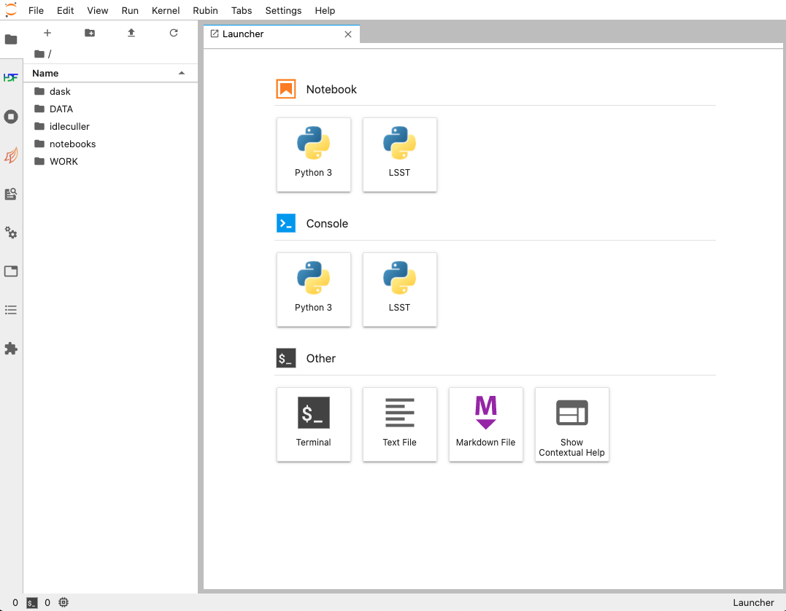

.. Review the README in this procedure's directory on instructions to contribute.
.. Static objects, such as figures, should be stored in the _static directory. Review the _static/README in this procedure's directory on instructions to contribute.
.. Do not remove the comments that describe each section. They are included to provide guidance to contributors.
.. Do not remove other content provided in the templates, such as a section. Instead, comment out the content and include comments to explain the situation. For example:
	- If a section within the template is not needed, comment out the section title and label reference. Include a comment explaining why this is not required.
    - If a file cannot include a title (surrounded by ampersands (#)), comment out the title from the template and include a comment explaining why this is implemented (in addition to applying the ``title`` directive).

.. Include one Primary Author and list of Contributors (comma separated) between the asterisks (*):
.. |author| replace:: *Tiago Ribeiro*
.. If there are no contributors, write "none" between the asterisks. Do not remove the substitution.
.. |contributors| replace:: *Michael Reuter, Patrick Ingraham*

.. This is the label that can be used as for cross referencing this procedure.
.. Recommended format is "Directory Name"-"Title Name"  -- Spaces should be replaced by hyphens.
.. _Observing-Interface-Getting-Started-Nublado:
.. Each section should includes a label for cross referencing to a given area.
.. Recommended format for all labels is "Title Name"-"Section Name" -- Spaces should be replaced by hyphens.
.. To reference a label that isn't associated with an reST object such as a title or figure, you must include the link an explicit title using the syntax :ref:`link text <label-name>`.
.. An error will alert you of identical labels during the build process.

############################
Getting Started With Nublado
############################

.. _Observing-Interface-Getting-Started-Nublado-Overview:

Overview
========

.. This section should provide a brief, top-level description of the procedure's purpose and utilization. Consider including the expected user and when the procedure will be performed.

This procedure is intended for users of the Rubin Observatory that are interested in interacting with the  Observatory Control System using Nublado.
It contains basic procedures on how to get started with the Nublado observing tools.

To get a list of the different environments see :ref:`Observing-Interface-Environments`

.. _Observing-Interface-Getting-Started-Nublado-Prerequisites:

Prerequisites
=============

.. This section should provide simple overview of prerequisites before executing the procedure; for example, state of equipment, telescope or seeing conditions or notifications prior to execution.
.. It is preferred to include them as a bulleted or enumerated list.
.. Do not include actions in this section. Any action by the user should be included at the beginning of the Procedure section below. For example: Do not include "Notify specified SLACK channel. Confirmation is not required." Instead, include this statement as the first step of the procedure, and include "Notification to specified SLACK channel." in the Prerequisites section.
.. If there is a different procedure that is critical before execution, carefully consider if it should be linked within this section or as part of the Procedure section below (or both).

- Make sure you read and understand the :ref:`environments procedure <Observing-Interface-Environments>`.

  - Once you have identified which environment you want to interact with, you must be able to load the link to the Nublado instance to that environment.

.. _Observing-Interface-Getting-Started-Nublado-Post-Conditions:

Post-Condition
==============

.. This section should provide a simple overview of conditions or results after executing the procedure; for example, state of equipment or resulting data products.
.. It is preferred to include them as a bulleted or enumerated list.
.. Do not include actions in this section. Any action by the user should be included in the end of the Procedure section below. For example: Do not include "Verify the telescope azimuth is 0 degrees with the appropriate command." Instead, include this statement as the final step of the procedure, and include "Telescope is at 0 degrees." in the Post-condition section.

- Successfully access Nublado.

.. _Observing-Interface-Getting-Started-Nublado-Procedure-Steps:

Procedure Steps
===============

.. This section should include the procedure. There is no strict formatting or structure required for procedures. It is left to the authors to decide which format and structure is most relevant.
.. In the case of more complicated procedures, more sophisticated methodologies may be appropriate, such as multiple section headings or a list of linked procedures to be performed in the specified order.
.. For highly complicated procedures, consider breaking them into separate procedure. Some options are a high-level procedure with links, separating into smaller procedures or utilizing the reST ``include`` directive <https://docutils.sourceforge.io/docs/ref/rst/directives.html#include>.

.. important::

    If you are planning on interacting with the control system in any of the observatory :ref:`environments <Observing-Interface-Environments>`, you must first announce your intention in the assigned Slack channel.
    These are shared resources and, as such, require coordination to avoid interference with other activities.

.. important::

    In the case of the :ref:`Summit <Observing-Interface-Environments-Summit>` it is required to have personnel present at the site prior to any activity that involves moving hardware.
    You may also be required to issue a jira ticket in the `summit activity project <https://jira.lsstcorp.org/projects/SUMMIT>`__.

Once you announced your intention to operate one of the environments in the appropriate Slack channel and, if appropriate, coordinated the activities for the :ref:`Summit <Observing-Interface-Environments-Summit>`, you are ready to open Nublado on your browser.

Once you open the link on your browser, you should see the :ref:`Nublado welcome page <Observing-Interface-Getting-Started-Nublado-Welcome>`.
To start your Nublado instance, click in the icon below "Notebook Aspect".

    Screenshot of Nublado welcome page.

This should take you to the :ref:`Nublado launch page <Observing-Interface-Getting-Started-Nublado-Launch>`, if this is the first time you login or if you are logged off.

    Screenshot of Nublado launch page.

If you now click the "Launch Server" button, you will be taken to the :ref:`Server Options <Observing-Interface-Getting-Started-Nublado-Server-Options>` page.

    Screenshot of Nublado server options page.

In this page, you can now select the image and the resources you need for your work.

  - The "image" selection specify which version of the science pipelines to load (the observatory control packages are always the same).

  - The "size" option specify the amount of computing resources that will be made available for your jupyter-lab instance.

In most cases, you will want to select the "Recommended" image.

For anyone performing tasks involving image data analysis and/or control operations, a "Large" container should be used as these can require significant resources.
"Small" or "Medium" container should only be used when performing simple tasks, such as updating notebooks, or files, or performing simple EFD queries.

Once you selected your "Image" and "Size" you can click in the big orange "Start" button.
You will be redirected to a :ref:`loading page <Observing-Interface-Getting-Started-Nublado-Loading>`.

    Screenshot of Nublado loading page.

In general, sections will load pretty quickly, though they may take longer if the "Image" you selected is still not available in the server.

Once loading is completed you will be redirected to a :ref:`jupyter-lab section <Observing-Interface-Getting-Started-Nublado-JupyterLab>`.

    Screenshot of jupyter-lab section after successful login.

To start a new notebook for data analysis and/or interaction with the observatory control system, click in the "LSST" icon in the "Notebook" section.
If you select "Python 3", it will create a bare python 3 kernel which does not have access to the science pipelines or the observatory control algorithms.

Alternatively, you can clone the `ts_notebooks`_ repository, which contains a collection of notebooks from users as well as examples and procedures.
To do that, open a terminal by clicking in the "Terminal" icon in the "Other" section.
This will open a linux terminal on your browser, that is running on the remote server in the environment you choose to operate.
From here you can execute regular linux terminal commands.

.. _ts_notebooks: https://github.com/lsst-ts/ts_notebooks

To clone the `ts_notebooks`_ repository do;

  .. prompt:: bash

      cd ~/notebooks
      git clone https://github.com/lsst-ts/ts_notebooks.git

You can than navigate to the location where the repository was cloned using the file browser on the left hand side of the screen, clicking on "notebooks" and than "ts_notebooks".
There are useful notebooks to start with in the "examples" and "procedures" folders.
You may also be interested in looking at the :ref:`Observing-Interface-Update-Notebook-Environment-in-Nublado` to see how you can customize your environment.

.. _Observing-Interface-Getting-Started-Nublado-Troubleshooting:

Troubleshooting
===============

.. This section should include troubleshooting information. Information in this section should be strictly related to this procedure.

.. If there is no content for this section, remove the indentation on the following line instead of deleting this sub-section.

TBD

.. _Observing-Interface-Getting-Started-Nublado-Personnel:

Contact Personnel
=================

This procedure was last modified |today|.

This procedure was written by |author|. The following are contributors: |contributors|.
