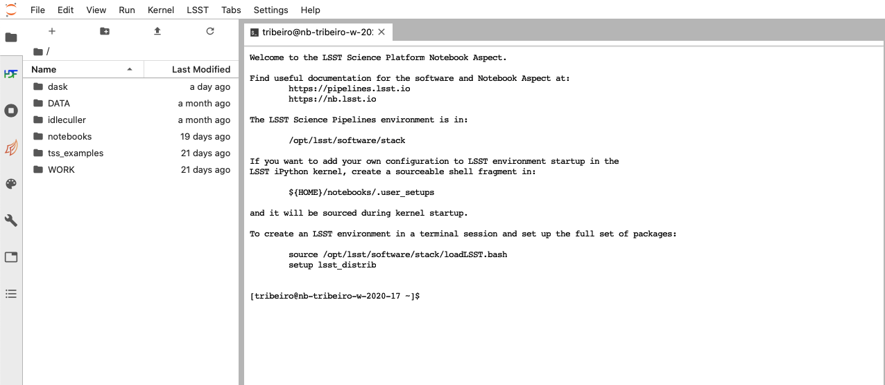

.. Review the README in this procedure's directory on instructions to contribute.
.. Static objects, such as figures, should be stored in the _static directory. Review the _static/README in this procedure's directory on instructions to contribute.
.. Do not remove the comments that describe each section. They are included to provide guidance to contributors.
.. Do not remove other content provided in the templates, such as a section. Instead, comment out the content and include comments to explain the situation. For example:
	- If a section within the template is not needed, comment out the section title and label reference. Include a comment explaining why this is not required.
    - If a file cannot include a title (surrounded by ampersands (#)), comment out the title from the template and include a comment explaining why this is implemented (in addition to applying the ``title`` directive).

.. Include one Primary Author and list of Contributors (comma separated) between the asterisks (*):
.. |author| replace:: *Tiago Ribeiro*
.. If there are no contributors, write "none" between the asterisks. Do not remove the substitution.
.. |contributors| replace:: *none*

.. This is the label that can be used as for cross referencing this procedure.
.. Recommended format is "Directory Name"-"Title Name"  -- Spaces should be replaced by hyphens.
.. _Observing-Interface-Update-Notebook-Environment-in-Nublado:
.. Each section should includes a label for cross referencing to a given area.
.. Recommended format for all labels is "Title Name"-"Section Name" -- Spaces should be replaced by hyphens.
.. To reference a label that isn't associated with an reST object such as a title or figure, you must include the link an explicit title using the syntax :ref:`link text <label-name>`.
.. An error will alert you of identical labels during the build process.

.. _Update-Notebook-Environment-in-Nublado:

######################################
Update Notebook Environment in Nublado
######################################

.. _Update-Notebook-Environment-in-Nublado-Overview:

Overview
========

.. This section should provide a brief, top-level description of the procedure's purpose and utilization. Consider including the expected user and when the procedure will be performed.

This procedure describes how to change/customize software versions in the jupyter-lab environment on the nublado platform.
Version changes will (temporarily) override versions available on the servers.
This can be performed locally or remotely.

.. _Update-Notebook-Environment-in-Nublado-What-is-the-Nublado-Platform:

The Nublado Platform
--------------------

The nublado platform is the initial entry point for users to interact with the Rubin Observatory control system.
It is highly flexible, allowing you to work on one or more components to accomplish both, high and low level operations.

A jupyter-lab environment is provided for users to launch notebooks.
By default, the platform provides a set of environments with released software versions and tools, including:

- the `LSST stack <https://pipelines.lsst.io>`__,
- interfaces (*e.g.*, `xml <https://ts-xml.lsst.io/>`__, `IDL <https://github.com/lsst-ts/ts_idl>`__, `SAL <https://ts-sal.lsst.io/>`__, `Salobj <https://ts-salobj.lsst.io/>`__), and
- high-level control algorithms (*e.g.*, `ATCS <https://ts-observatory-control.lsst.io/>`__, LATISS, MTCS, ComCam).

.. _Update-Notebook-Environment-in-Nublado-Precondition:

Precondition
============

.. This section should provide simple overview of Precondition before executing the procedure; for example, state of equipment, telescope or seeing conditions or notifications prior to execution.
.. It is preferred to include them as a bulleted or enumerated list.
.. Do not include actions in this section. Any action by the user should be included at the beginning of the Procedure section below. For example: Do not include "Notify specified SLACK channel. Confirmation is not required." Instead, include this statement as the first step of the procedure, and include "Notification to specified SLACK channel." in the Precondition section.
.. If there is a different procedure that is critical before execution, carefully consider if it should be linked within this section or as part of the Procedure section below (or both).

- You must be logged into the nublado system.

    Screenshot of nublado interface after successful login.

.. _Update-Notebook-Environment-in-Nublado-Post-Conditions:

Post-Condition
==============

.. This section should provide a simple overview of conditions or results after executing the procedure; for example, state of equipment or resulting data products.
.. It is preferred to include them as a bulleted or enumerated list.
.. Do not include actions in this section. Any action by the user should be included in the end of the Procedure section below. For example: Do not include "Verify the telescope azimuth is 0 degrees with the appropriate command." Instead, include this statement as the final step of the procedure, and include "Telescope is at 0 degrees." in the Post-condition section.

- The requested software version(s) is deployed for use in the jupyter-lab notebook.
  This will overwrite the versions available on the server.

.. _Update-Notebook-Environment-in-Nublado-Procedure-Steps:

Procedure Steps
===============

.. This section should include the procedure. There is no strict formatting or structure required for procedures. It is left to the authors to decide which format and structure is most relevant.
.. In the case of more complicated procedures, more sophisticated methodologies may be appropriate, such as multiple section headings or a list of linked procedures to be performed in the specified order.
.. For highly complicated procedures, consider breaking them into separate procedure. Some options are a high-level procedure with links, separating into smaller procedures or utilizing the reST ``include`` directive <https://docutils.sourceforge.io/docs/ref/rst/directives.html#include>.

The procedure is separated into different sections depending on the software you want to update in the nublado platform.

- :ref:`Update-Notebook-Environment-in-Nublado-High-Level-Control-Algorithms`
- :ref:`Update-Notebook-Environment-in-Nublado-Updating-Interface-Versions`
- :ref:`Update-Notebook-Environment-in-Nublado-Updating-the-Stack`
- :ref:`Update-Notebook-Environment-in-Nublado-User-Defined-Environments`

Additionally, :ref:`updates using ScriptQueue <Update-Notebook-Environment-in-Nublado-ScriptQueue>` can allow you to update software versions without the need to restart or recycle the state of `ScriptQueue CSC <https://ts-scriptqueue.lsst.io>`__.

.. _Update-Notebook-Environment-in-Nublado-High-Level-Control-Algorithms:

Updating High-level Control Algorithms
--------------------------------------

This sections provides instructions to update a high-level control algorithm from the console in nublado.
This task is easily supported natively on the nublado platform.

Skip down to the :ref:`summary section <Update-Notebook-Environment-in-Nublado-Summary-of-Update-High-Level-Control-Algorithms>` for a condensed list of command inputs.

.. important::
   Because these changes are local, applied changes will persist even if the notebook server is restarted.

   To revert changes, you must comment out the added line in the :ref:`user setups script <Update-Notebook-Environment-in-Nublado-User-Setups-Script-Step>`.

.. note::

    This procedure uses the `ts_observatory_control <https://github.com/lsst-ts/ts_observatory_control>`__ package as an example.
    Replace this with the package name you want to update.
    Some other examples are `ts_standardscript <https://github.com/lsst-ts/ts_standardscripts>`__ and `ts_externalscripts <https://github.com/lsst-ts/ts_externalscripts>`__.

#. Load the LSST stack.

   .. code-block:: bash

      $ source /opt/lsst/software/stack/loadLSST.bash

#. Clone the high-level control algorithm package.

   .. code-block:: bash

      $ git clone https://github.com/lsst-ts/ts_observatory_control.git

#. Check out the branch you want to change.

   .. code-block:: bash

      $ git checkout <branch-name>

   .. _Update-Notebook-Environment-in-Nublado-User-Setups-Script-Step:

#. Use ``eups`` to declare/setup the package.

   .. code-block:: bash

      $ cd ts_observatory_control
      $ eups declare -r . -t $(whoami)

#. Open the user setups script (``.user_setups``) to setup the declared package at run time.
   vim or emacs are available.

   .. code-block:: bash

      $ vim ${HOME}/notebooks/.user_setups

#. Include the following line at the bottom of the file.

   ``setup ts_observatory_control -t $(whoami)``

#. The new version of the package that is in the ``ts_observatory_control`` directory will be loaded instead of the one available on the server.
   You must restart the current notebook kernel for the update to apply.

#. Ensure the desired version of the package is loaded when starting the notebook servers.

.. _Update-Notebook-Environment-in-Nublado-Summary-of-Update-High-Level-Control-Algorithms:

- Summary

Here is a summary of the user's command inputs described in the procedure above:

.. code-block:: bash

   $ source /opt/lsst/software/stack/loadLSST.bash
   $ git clone <package-github-location>
   $ cd <package>
   $ git checkout <branch-name>
   $ eups declare -r . -t $(whoami)
   $ vim ${HOME}/notebooks/.user_setups
   # Include ``setup PACKAGE -t $(whoami)`` at the end of file
   # Restart notebook kernel
   # Verify package version

.. note::
   It is possible to setup different environments that co-exists with different versions of software. This is a more advanced feature.

   See the :ref:`User-defined Environments section <Update-Notebook-Environment-in-Nublado-User-Defined-Environments>`

.. _Update-Notebook-Environment-in-Nublado-Updating-Interface-Versions:

Updating Interface Versions
---------------------------

.. caution::
   This is a risky procedure because...

This section requires input.

.. _Update-Notebook-Environment-in-Nublado-Updating-the-Stack:

Updating the Stack
------------------

This section requires input from other groups.

.. _Update-Notebook-Environment-in-Nublado-User-Defined-Environments:

Updating User-defined Environments
----------------------------------

This section requires input from Data Management.

.. _Update-Notebook-Environment-in-Nublado-ScriptQueue:

Updating using ScriptQueue
--------------------------

Another common user interaction tool is the ScriptQueue. It allows you to implement changes seamlessly without the need to restart or recycle the state of `ScriptQueue CSC <https://ts-scriptqueue.lsst.io>`__.
This includes a wide range of possibilities included small fixes to scripts, control packages, libraries or adding new scripts.

Use the following steps to update software versions with ScriptQueue.

#. Run ScriptQueue.

#. Login to the ScriptQueue CSC by following `Step 3 in Section 3.1 of TSTN-020 <https://tstn-020.lsst.io/#on-the-fly-configuration-changes>`__.

#. Go to the package you want to update, then update the repository.

   .. code-block:: bash

      $ cd repos/<package>
      $ git fetch --all

#. Check out the branch you want to change.

   .. code-block:: bash

      $ git checkout <branch-name>

#. Any new script you launch with the ScriptQueue will use the package version defined in checked out branch.

#. Changes can be pushed to the branch.

   .. caution::
       Although possible, editing code and pushing changes from inside the container is **strongly** discouraged.

   .. code-block:: bash

      $ git pull

.. _Update-Notebook-Environment-in-Nublado-Troubleshooting:

Troubleshooting
===============

.. This section should include troubleshooting information. Information in this section should be strictly related to this procedure.

.. If there is no content for this section, remove the indentation on the following line instead of deleting this sub-section.

No troubleshooting information is applicable to this procedure.

This procedure was last modified |today|.

This procedure was written by |author|. The following are contributors: |contributors|.
