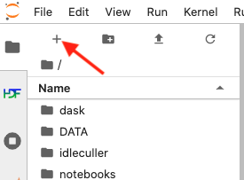

.. |author| replace:: *E. Dennihy*
.. If there are no contributors, write "none" between the asterisks. Do not remove the substitution.
.. |contributors| replace:: *none*

.. _Observing-Interface-Setup-Common-Observing-Environment-in-Nublado:

#############################################
Setup Common Observing Environment in Nublado
#############################################

.. _Setup-Common-Observing-Environment-in-Nublado-Overview:

Overview
========

When operating in nublado on one of the :ref:`operational environments <Observing-Interface-Operational-Environments>`, 
users are required to source a specific bash script for use with notebooks in order to use the packages defined in the Common Observing Environnment.  

.. _Setup-Common-Observing-Environment-in-Nublado-Precondition:

Precondition
=============

- You must be logged in to the nublado system in one of the :ref:`operational environments <Observing-Interface-Operational-Environments>`.
- See :ref:`Observing-Interface-Getting-Started-Nublado`, if you need help getting started.

.. _Setup-Common-Observing-Environment-in-Nublado-Post-Conditions:

Post-Condition
==============

User notebooks will source packages directly from the common environment.

.. _Setup-Common-Observing-Environment-in-Nublado-Procedure-Steps:

Procedure Steps
===============

Once you are logged to nublado, open a "terminal tab".
If you are in the :ref:`Launcher <Observing-Interface-Getting-Started-Nublado-JupyterLab>` view, click on the "Terminal" icon in the "Other" tab at the bottom.

If you don't see the :ref:`Launcher <Observing-Interface-Getting-Started-Nublado-JupyterLab>` view, click on the plus sign at the top-left hand side of the view, as indicated in the :ref:`figure below <Setup-Common-Observing-Environment-in-Nublado-New-Launcher>`.

    Screenshot of jupyter-lab section highlighting the "New Launcher" button.

The procedure is divided in two steps; :ref:`Setup-Common-Observing-Environment-Automatically-Using-Bash-Script` and :ref:`Setup-Common-Observing-Environment-Manually`.

.. _Setup-Common-Observing-Environment-Automatically-Using-Bash-Script:

Setup Common Observing Environment Automatically Using Bash Script
------------------------------------------------------------------

.. note::

	This step only needs to be performed once.

In the terminal, check to see if you already have either of the following directories installed in your home space:

.. code-block:: shell-session

  auxtel_obsruns_env_setups
  auto-op-env-packages

If they already exist, remove both directories. 

In the terminal, enter the following sequence of commands to clone the package containing the automatic setup script;

.. prompt:: bash

  git clone https://github.com/lsst-sitcom/auxtel_obsruns_env_setups.git 

Enter the following sequence of commands to run the automatic setup script. 

.. warning::
    
    This step will create a new .user_setups file and overwrite and backup your current .user_setups file. 
    The backup copy will be tagged with a timestamp version in the same directory.  
    If you have any custom environment setup commands in your current .user_setups file, you will need to manually add them to the new .user_setups file that will be created. 

.. code-block:: shell-session

  $ cd auxtel_obsruns_env_setups
  $ bash bash/lsst/sitcom/user_setups_mod.sh
    Moving .user_setups file to /home/edennihy/notebooks/user_setups-2023-05-03T04:44:40.bak 
    Creating a new ~/notebooks/.user_setups file 

    New .user_setup file created 

The above message shows where the users previous ``.user_setups`` file can be found, e.g.; ``/home/edennihy/notebooks/user_setups-2023-05-03T04:44:40.bak``.

Suggested edit:

Note that the new ``.user_setup`` file only contains the minimum commands necessary to setup the Common Observing Environment.

The setup is now complete. 

Restart all running notebooks. 

.. _Setup-Common-Observing-Environment-Manually:

Nublado User Setup
------------------

.. note::
    
    This step is intended for advanced users who are comfortable directly modifying their .user_setup script. 
    If you have already completed the steps in :ref:`Setup-Common-Observing-Environment-Automatically-Using-Bash-Script`, it is not necessary.

From a terminal, open the user setup file using your preferred text editor.
Nublado ships with both ``vim`` and ``emacs``, e.g.;

.. prompt:: bash

  emacs ~/notebooks/.user_setups

Add the following line at the top of the file::

  source /net/obs-env/auto_base_packages/auto_env_setup.sh

Ensure that you are not sourcing any other environment setup scripts or setting up any local versions of the packages ``/opt/obs-env/auto_base_packages``.

The setup is now complete. 

Restart all running notebooks.  

.. _Setup-Common-Observing-Environment-in-Nublado-Troubleshooting:

Troubleshooting
===============

No troubleshooting information is currently available.

This procedure was last modified on |today|.
