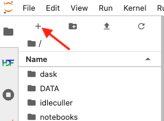

.. |author| replace:: *Tiago Ribeiro*
.. If there are no contributors, write "none" between the asterisks. Do not remove the substitution.
.. |contributors| replace:: *Michael Reuter*

.. _Observing-Interface-Setup-DDS-Daemon-in-Nublado:

###########################
Setup DDS Daemon in Nublado
###########################

.. _Setup-DDS-Daemon-in-Nublado-Overview:

Overview
========

When operating in nublado on one of the :ref:`operational environments <Observing-Interface-Operational-Environments>`, users are required to start a DDS daemon.
The DDS daemon is in charge of handling most of the DDS communication and considerably alleviates the load on users notebooks and processes in general.

.. _Setup-DDS-Daemon-in-Nublado-Precondition:

Precondition
=============

- You must be logged in to the nublado system in one of the :ref:`operational environments <Observing-Interface-Operational-Environments>`.
- See :ref:`Observing-Interface-Getting-Started-Nublado`, if you need help getting started.

.. _Setup-DDS-Daemon-in-Nublado-Post-Conditions:

Post-Condition
==============

- Users can reliably communicate with the observatory system using DDS daemon.

.. _Setup-DDS-Daemon-in-Nublado-Procedure-Steps:

Procedure Steps
===============

Once you are logged to nublado, open a "terminal tab".
If you are in the :ref:`Launcher <Observing-Interface-Getting-Started-Nublado-JupyterLab>` view, click on the "Terminal" icon in the "Other" tab at the bottom.

If you don't see the :ref:`Launcher <Observing-Interface-Getting-Started-Nublado-JupyterLab>` view, click on the plus sign at the top-left hand side of the view, as indicated in the :ref:`figure below <Setup-DDS-Daemon-in-Nublado-New-Launcher>`.

    Screenshot of jupyter-lab section highlighting the "New Launcher" button.

The procedure is divided in two steps; :ref:`Setup-DDS-Daemon-in-Nublado-Procedure-Steps-Setup-and-Start-DDS-Daemon` and :ref:`Setup-DDS-Daemon-in-Nublado-Procedure-Steps-Nublado-User-Setup`.

.. _Setup-DDS-Daemon-in-Nublado-Procedure-Steps-Setup-and-Start-DDS-Daemon:

Setup and Start DDS Daemon
--------------------------

.. note::

	This step needs to be performed every time the user Nublado instance is restarted, or if the user shuts down the daemon.

In the terminal enter the following sequence of commands to setup your environment;

.. prompt:: bash

  source ${LOADSTACK}
  source $OSPL_HOME/release.com
  export OSPL_URI=$(python -c "from lsst.ts import ddsconfig; print( (ddsconfig.get_config_dir() / 'ospl-shmem.xml').as_uri())")

Before starting the daemon, make sure to check if it is already running or not;

.. code-block:: shell-session

  $ ospl status
  Vortex OpenSplice System with domain name "ospl_sp_ddsi" is non existent

If instead of the message above (that domain name is "non existent") you get ("is operational"), your daemons is already running.
You can either skip to the :ref:`next step <Setup-DDS-Daemon-in-Nublado-Procedure-Steps-Nublado-User-Setup>` or, most likely, resume working with the system.

Then start the daemon;

.. code-block:: shell-session

  $ ospl start

  Starting up domain "ospl_sp_ddsi" with ID 0

  Info  log : ./ospl-info.log
  Error log : ./ospl-error.log

And check that it is running:

.. code-block:: shell-session

  $ ospl status
  Vortex OpenSplice System with domain name "ospl_sp_ddsi" is operational

.. _Setup-DDS-Daemon-in-Nublado-Procedure-Steps-Nublado-User-Setup:

Nublado User Setup
------------------

.. note::

	This step need to be done only once per environment. Once this step is performed it will survive any restart of the nublado instance.

.. warning::

	If the OpenSpliceDDS library is updated you may need to redo this step to update the library locally. 

On the terminal used in the :ref:`previous step <Setup-DDS-Daemon-in-Nublado-Procedure-Steps-Setup-and-Start-DDS-Daemon>` open the user setup file using your preferred text editor.
Nublado ships with both ``vim`` and ``emacs``, e.g.;

.. prompt:: bash

  emacs ~/notebooks/.user_setups

Add the following lines at the top of the file::

  source $OSPL_HOME/release.com
  export OSPL_URI=$(python -c "from lsst.ts import ddsconfig; print( (ddsconfig.get_config_dir() / 'ospl-shmem.xml').as_uri())")

Once you are done, save and exit (if using emacs, press ``Control+x Control+s`` to save and ``Control+x Control+c`` to exit).
Your nublado instance is ready to use a DDS daemon.

.. _Setup-DDS-Daemon-in-Nublado-Procedure-Steps-Stop-DDS-Daemon:

Stop DDS Daemon
---------------

Once you are done working and do not anticipate operating the system for a while (a week or so), it is best (but not mandatory) to stop your DDS Daemon.
To do that, go back to the terminal we started :ref:`initially <Setup-DDS-Daemon-in-Nublado-Procedure-Steps-Setup-and-Start-DDS-Daemon>`, or start/setup a new terminal, and type the commands bellow:

.. prompt:: bash

  ospl stop

.. _Setup-DDS-Daemon-in-Nublado-Troubleshooting:

Troubleshooting
===============

No troubleshooting information is currently available.

This procedure was last modified on |today|.
