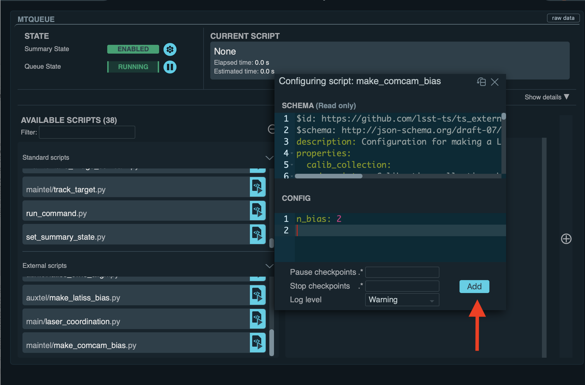

.. |author| replace:: *Andrés A. Plazas Malagón*
.. If there are no contributors, write "none" between the asterisks. Do not remove the substitution.
.. |contributors| replace:: *none*

.. _Latiss-Master-Bias-Procedure:

###########################
Latiss Master Bias Generation Procedure
###########################

.. _Latiss-Master-Bias-Procedure-Overview:

Overview
========

This procedure describes how to call scripts to produce a master bias for LATISS from the LSST Operations and Visualization Enviroment (LOVE) at the Summit :ref:`operational environment <Observing-Interface-Operational-Environments>`. 

The script will: 

- command LATISS to take a number of bias frames,
- call the Rubin Science Pipelines bias generation pipetask via the OCS-Controlled Pipeline System (OCPS),
- certify the resulting bias with a given range of validity dates.

Future versions of the code will also:

- verify the resulting bias (see the package `cp_verify`_ and `DMTN-101`_), between bias generation and certification.

For more information about calibrations production (including verification and certification), please consult the `Constructing Calibrations documentation`_.

.. _cp_verify: https://github.com/lsst/cp_verify
.. _DMTN-101: https://dmtn-101.lsst.io/
.. _Constructing Calibrations documentation: https://lsst.ncsa.illinois.edu/~czw/pipelines_lsst_io/_build/html/modules/lsst.cp.pipe/constructing-calibrations.html 

.. _Latiss-Master-Bias-Procedure-Prerequisites:

Prerequisites
=============

- You should be logged into the LSST Operations and Visualization Enviroment (LOVE) at the Summit :ref:`operational environment <Observing-Interface-Operational-Environments>`.
- The script assumes (and checks) that ``LATISS`` and ``OCPS`` components are all ``ENABLED``, and that latter has been ``ENABLED`` with the configuration of ``LATISS``. The instrument and the ``OCPS`` can be enabled, for example, from a notebook: 

.. code-block:: python

    import asyncio
    from lsst.ts import salobj
    from lsst.ts.observatory.control.maintel.latiss import Latiss

    do_enable_camera = True
    do_enable_ocps = True

    domain = salobj.Domain()
    latiss = Latiss(domain)
    ocps = salobj.Remote(domain, "OCPS")
    await asyncio.gather(latiss.start_task, ocps.start_task)

    if do_enable_camera:
       await latiss.enable()

    if do_enable_ocps:
        instrument="LATISS"
        ack = await ocps.cmd_start.set_start(settingsToApply=instrument)
        if ack.ack != salobj.SalRetCode.CMD_COMPLETE:
            ack.print_vars()

        ack = await ocps.cmd_enable.set_start()
        if ack.ack != salobj.SalRetCode.CMD_COMPLETE:
            ack.print_vars()

.. _butler: https://pipelines.lsst.io/v/daily/modules/lsst.daf.butler/index.html

.. _Latiss-Master-Bias-Procedure-Post-Conditions:

Post-Condition
==============

- A (daily) master bias image per detector will be certified in butler ``CALIBRATION`` `collection`_.

.. _collection: https://pipelines.lsst.io/v/daily/modules/lsst.daf.butler/organizing.html

.. _Latiss-Master-Bias-Procedure-Steps:

Procedure Steps
===============

Once you are logged into LOVE, click on the ``MTQueue`` panel, as circled on the right side of the figure below (for completeness, ``ATQueue`` to lauch ``LSSTComCam`` scripts is circled on the right):

.. figure:: ./_static/love-mtqueue-atqueue-panel.png
    :name: MTQueue-love

     Screenshot of LOVE interface with the "MTQueue" pannel.

Load the Script
---------------

After clicking on the ``MTQueue`` panel, search for the script ``maintel/make_latiss_bias.py`` under ``AVAILABLE SCRIPTS`` on the left, as shown in the figure below:

      Screenshot of LOVE interface with the "AVAILABEL SCRIPTS" list.
      
Load the script by clicking on the button in front of the name of the script that has a triangle.

Enter configuration parameters
------------------------------

After loading the script, a window that contains two sections, ``SCHEMA`` (top) and ``CONFIG`` (bottom), will appear. The former will show the configuration options (and the default values of some of them) available that should be entered in the latter. The configuration options are as follows:

- ``n_bias``: number of bias frames to be taken.
- ``detectors``: Detector IDs, e.g., (0,1,2,3,4,5,6,7,8) for all LATISS CCDs.
- ``input_collections_bias``: List of additional (the ``OCPS`` already adds ``LATISS/raw/all`` as a default) comma-separated input collections for the bias pipetask. The pipetask is called via the ``OCPS`` after enabling it with the ``LATISS`` configuration.
- ``calib_collection``: ``CALIBRATION`` collection where the calibrations will be certified into, for example, ``LATISS/calib/u/plazas/YYYYMMMDD.test``.
- ``repo``: Butler repository. For example, ``/repo/LATISS``.
- ``n_processes``: Number of processes that the pipetasks will use.
- ``certify_calib_begin_date``: The beginning date for the validity range of the certified calibration. For example, ``2021-07-15``.
- ``certify_calib_end_date``: The end date for the validity range of the certified calibration. For example, ``2021-07-16``.
- ``max_counter_archiver_check``: After the camera takes images, this is the maxmimum number of loops to wait for confirmation that the images taken are archived and available.
- ``oods_timeout``: Timeout value, in seconds, for the Observatory Operations Data Service (``OODS``).

An example set of configuration parameters is as follows:

.. code-block:: text

    n_bias: 5
    detectors: (0,1,2,3,4,5,6,7,8)
    input_collections_bias: LATISS/calib
    calib_collection: LATISS/calib/daily
    certify_calib_begin_date: 2021-07-15
    certify_calib_end_date: 2021-07-16    
    repo: /repo/LATISS

Launch the script
-----------------
When the configuration options have been entered and the script is ready to be launched, click on the ``ADD`` button in the lower right of tthe screen (refer to image above).

The certified master bias will be available in the ``calib_collection`` collection. It could be retrieved from a notebook for visualization: 

.. code-block:: python
    
    import lsst.daf.butler as dB

    butler = dB.Butler("/repo/LATISS", collections=["LATISS/calib/daily"])
    detector = (0, 1, 2, 3, 4, 5, 6, 7, 8)
    exposure = [bias1ID, bias2ID] # e.g., [2021071500001, 2021071500002]
    
    bias = butler.get('bias', detector=detector[0], exposure=exposure[0], instrument='LATISS')

Troubleshooting
===============

    After checking the configuration options and the ``LOVE`` error messages, the file ``/scratch/uws/${jobId}/outs/ocps.log`` might contain additional technical information on which pipetask failed, if any. ``{jobId}`` is returned by the OCPS and can be retrieved from the ``LOVE`` output messages.

.. _Latiss-Master-Bias-Procedure-Conditions-Contact-Personnel:

Contact Personnel
=================

This procedure was last modified on |today|.

This procedure was written by |author|.
The following are contributors: |contributors|.
