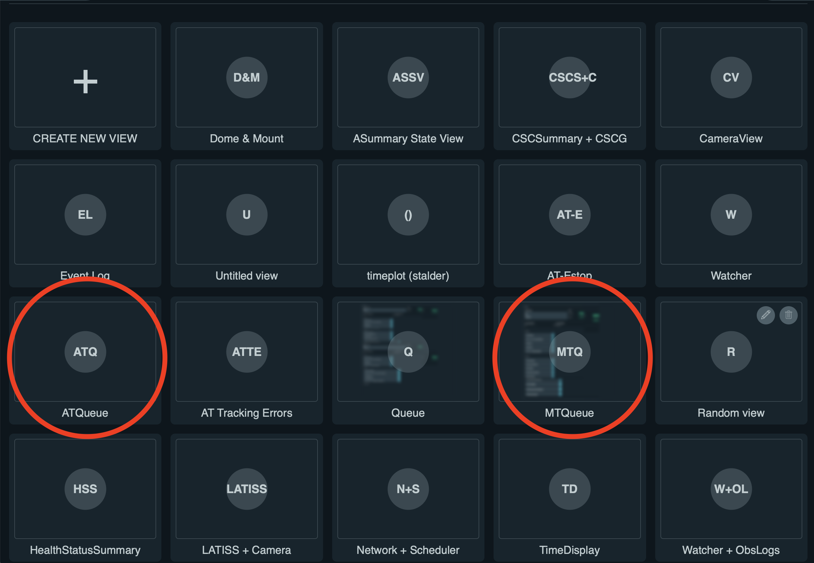

.. |author| replace:: *Andrés A. Plazas Malagón*
.. If there are no contributors, write "none" between the asterisks. Do not remove the substitution.
.. |contributors| replace:: *none*

.. _ComCam-Master-Bias-Procedure:

###########################
ComCam Master Bias Generation Procedure
###########################

.. _ComCam-Master-Bias-Procedure-Overview:

Overview
========

This procedure describes how to call scripts to produce a master bias for LSSTComCam from the LSST Operations and Visualization Enviroment (LOVE) at the Summit :ref:`operational environment <Observing-Interface-Operational-Environments>`. 

The script will: 

- command LSSTComCam to take a number of bias frames,
- call the Rubin Science Pipelines bias generation pipetask via the OCS-Controlled Pipeline System (OCPS),
- verify the resulting bias (see the package `cp_verify`_ and `DMTN-101`_)
- certify the resulting bias with a given range of validity dates.
  
For more information about calibrations production (including verification and certification), please consult the `Constructing Calibrations documentation`_.

.. _cp_verify: https://github.com/lsst/cp_verify
.. _DMTN-101: https://dmtn-101.lsst.io/
.. _Constructing Calibrations documentation: https://lsst.ncsa.illinois.edu/~czw/pipelines_lsst_io/_build/html/modules/lsst.cp.pipe/constructing-calibrations.html 

.. _ComCam-Master-Bias-Procedure-Prerequisites:

Prerequisites
=============

- You should be logged into the LSST Operations and Visualization Enviroment (LOVE) at the Summit :ref:`operational environment <Observing-Interface-Operational-Environments>`.
- The script assumes (and checks) that ``LSSTComCam`` and ``OCPS`` components are all ``ENABLED``, and that latter has been ``ENABLED`` with the configuration of ``LSSTComCam``.

.. _butler: https://pipelines.lsst.io/v/daily/modules/lsst.daf.butler/index.html

.. _ComCam-Master-Bias-Procedure-Post-Conditions:

Post-Condition
==============

- A master bias image per detector will be certified in an individual butler CALIBRATION `collection`_ that can be grouped into a butler CHAINED collection to connect all of the various calibrations into a single collection.

.. _collection: https://pipelines.lsst.io/v/daily/modules/lsst.daf.butler/organizing.html

.. _ComCam-Master-Bias-Procedure-Steps:

Procedure Steps
===============

Once you are logged into LOVE, click on the ``MTQueue`` panel, as circled on the right side of the figure below (for completeness, ``ATQueue`` to lauch ``LATISS`` scripts is circled on the left):

     Screenshot of LOVE interface with the "MTQueue" pannel.

Load the Script
---------------

After clicking on the ``MTQueue`` panel, search for the script ``maintel/make_comcam_bias.py`` under ``AVAILABLE SCRIPTS`` on the left, as shown in the figure below:

.. figure:: ./_static/love-available-scripts.png
    :name: available-scripts-love

      Screenshot of LOVE interface with the "AVAILABEL SCRIPTS" list.
      
Load the script by clicking on the button in front of the name of the script that has a triangle.

Enter configuration parameters
------------------------------

After loading the script, a window that contains two sections, ``SCHEMA`` (top) and ``CONFIG`` (bottom), will appear. The former will show the configuration options (and the default values of some of them) available that should be entered in the latter. The configuration options are as follows:

- ``n_bias``: number of bias frames that shoudl be taken.
- ``detectors``: Detector IDs, e.g., (0,1,2,3,4,5,6,7,8) for all LSSTComCam CCDs.
- ``input_collections_bias``: This is a list of comma-separated input collections for the bias pipetask. The pipetask is called via the OCPS, and it adds as default ``-i LSSTComCam/raw/all`` as input collection aftering enabling the OCPS with the ``LSSTComCam`` configuration.
- ``input_collections_verify``: This is a list of comma-separated input collections for the cpVerify pipetask.
- ``calib_collection``: This is the CALIBRATION collection where the calibrations will be certified into, for example, ``LSSTComCam/calib/u/plazas/YYYYMMMDD.test``.
- ``repo``: Butler repository. For example, ``/repo/LSSTComCam``.
- ``n_processes``: Number of processes that the pipetasks will use.
- ``certify_calib_begin_date``: The beginning date for the validity range of the certified calibration. For example, ``2021-07-15``.
- ``certify_calib_end_date``: The end date for the validity range of the certified calibration. For example, ``2021-07-16``.
- ``max_counter_archiver_check``: After the camera takes images, this is the maxmimum number of loops to wait for confirmation that the images taken are archived and available.
- ``oods_timeout``: Timeout value, in seconds, for the Observatory Operations Data Service (OODS).

Launch the script
-----------------
When the configuration options have been entered and the script is ready to be launched, click on ``ADD`` in the lower right.

Troubleshooting
===============

No troubleshooting information is currently available.

.. _ComCam-Master-Bias-Procedure-Conditions-Contact-Personnel:

Contact Personnel
=================

This procedure was last modified on |today|.

This procedure was written by |author|.
The following are contributors: |contributors|.
