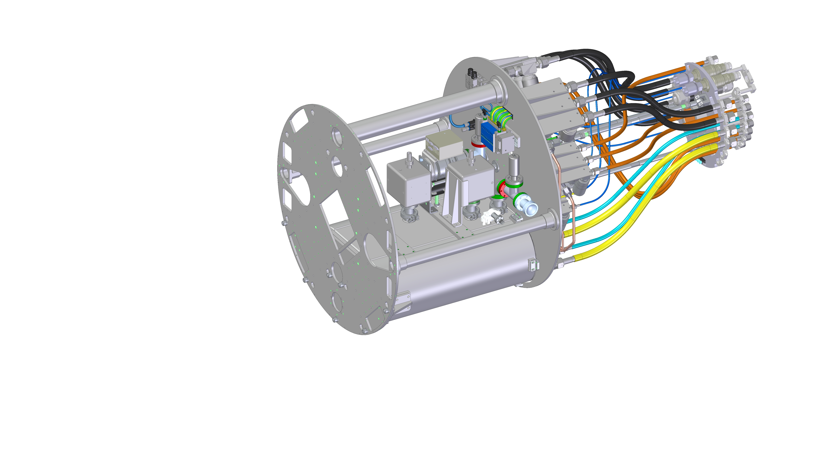

.. |author| replace:: *Johnny H. Esteves*
.. If there are no contributors, write "none" between the asterisks. Do not remove the substitution.
.. |contributors| replace:: *Bruno Quint, Kevin Reil*

.. _ComCam-Master-Calibrations-Procedure:

###############################################
Refrigeration System - Pathfinder
###############################################

.. _Refigeration-System-Pathfinder-Overview:

Overview
========

In this page you find information about the design, reviews and procedures of the refrigeration system, pathfinder.

.. _Refigeration-System-Pathfinder-Procedures:

Procedures
=============

Here you find some of the start up procedures of pathfinder. 
The information is constantly being updated. 
The safest way of find the procedures is to search on the docushare. 

- `Maintenance Procedures - note: it might be outdated <https://confluence.slac.stanford.edu/display/LSSTCAM/Integrated+Camera+Maintenance>`__
- `Startup and Shut Down Procedure for Cryo Refrigeration System <https://jira.lsstcorp.org/browse/SUMMIT-5882>`__ 

How To Search For A Procedure
---------------
- In `Jira <https://jira.lsstcorp.org/browse/DM-33431?jql=text%20~%20Pathfinder%20ORDER%20BY%20created%20DESC>`__ you find the most recent tests perfomed on the summit. Usually the followed procedure is linked in the description of the test. The reviewed procedure is a document with names LCA-#####.
- In `Docushare <https://docushare.lsst.org/docushare/dsweb/HomePage>`__ you can find all the procedures that have been reviewed. "Search entire site" or "Search this collection". It'll work best if it's searching the entire site, which it should do if you're on the main page. Type in LCA-##### and it should give you the document.

.. _Refigeration-System-Pathfinder-Design:

Design And Reviews
=============

    Caption: Pathfinder delivered desing by SLAC on 2018.

- `Pathfinder Reviews: <https://confluence.slac.stanford.edu/display/LSSTCAM/Refrigeration+Pathfinder>`__ the preliminary and final design review (PDR) have a good summary of the Pathfinder design plan and project progress prior to the instrument arrival in Chile (2018).

- ComCam Processes Reviews: a collection of reports on the ComCam systems, including pathfinder. 

  - `2017 <https://confluence.slac.stanford.edu/display/LSSTCAMREV/ComCam+TDR%2C+May+10%2C+2017>`__
  - `2018 <https://confluence.slac.stanford.edu/pages/viewpage.action?pageId=229017558>`__
  - `2019 <https://confluence.slac.stanford.edu/pages/viewpage.action?pageId=243094116>`__

.. _Refigeration-System-Pathfinder-Arrival:

Arrival On The Summit
=============
The log of pathfinder installation and first tests up to the end of 2020 can be found on the conluence page `https://confluence.lsstcorp.org/display/LSSTCOM/Pathfinder+Refrigeration+Activities+in+Chile <https://confluence.lsstcorp.org/display/LSSTCOM/Pathfinder+Refrigeration+Activities+in+Chile>`__. 
After 2021 the activites on pathfinder were logged on Jira. 

Contact Personnel
=================

This procedure was last modified on |today|.

This procedure was written by |author|.
The following are contributors: |contributors|.
