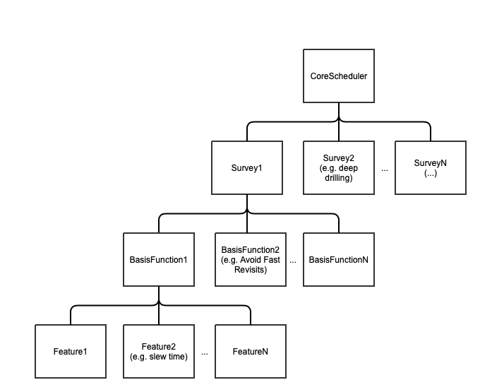

.. _scheduler-operational-procedures:

################################
Scheduler Operational Procedures
################################

The Scheduler CSC is in charge of computing an observing queue for the observatory.
There are two instances of the CSC running at all times, one dedicated to the Main Telescope and another to the Auxiliary Telescope, with indexes 1 and 2 respectively.

Both CSCs share the exact same code-base, which means both operating and troubleshooting share several commonalities.

This page focuses on the general operational aspects of the Scheduler CSC.
Any difference between the operation of MT and AT Scheduler are appropriately highlighted. 

For more details about the CSC, see the `Scheduler CSC documentation`_.

.. _Scheduler CSC documentation: https://ts-scheduler.lsst.io

If you are interested in the official scheduling algorithm, that is used to compute the observing queue, see the `Feature Based Scheduler documentation`_.

.. _Feature Based Scheduler documentation: https://rubin-sim.lsst.io

.. _scheduler-operational-procedures-procedures:

Procedures
==========

.. toctree::
    :maxdepth: 2
    :titlesonly:
    :glob:

    scripts/index
    startup/index
    night-time-operations/index
    troubleshooting-the-scheduling-algorithm/index
    misc/index

.. _scheduler-operational-procedures-overview:

Overview
========

Before diving in the operational procedures, let's have a quick overview of how the Scheduler CSC operates.

Internally, the Scheduler CSC is subdived into two main components; an *observatory interaction* component and a *scheduling algorithm* component.

The *observatory interaction* part of the CSC is responsible for the business logic of the component.
Its main tasks are:

* configuring the component with a user-provided set of parameters,
* interacting with the observatory control to update the observatory state,
* gathering telemetry from the EFD, 
* executing the scheduling algorithm to obtain a list of targets,
* sending the targets to the ScriptQueue.

The CSC defines an Application Programming Interface (API) for *scheduling algorithm*, providing a highly flexible architecture allowing for a range of applications to be designed and used.

The official *scheduling algorithm* adopted by the project is the so-called "**Feature Based Scheduler**".
The most relevant aspects of this application are:

* scheduling routines are expressed in terms of *Features*, which are basically some kind of "information"; weather data, telescope position, number of observations of a particular field, and any other kind of data that the underlying algorithm may use.
* *Basis functions* computes rewards from a collection of *Features*.
* *Surveys* linearly combine a collection of *Basis functions* to compute a final reward.
* A collection of *Surveys* can be combined and, at any time, the survey with the highest reward value is selected to produce a target.

This is illustred in :ref:`fig-fbs-architecture`.
It is important for users to understand this hierarchical structure for throubleshooting the scheduler operation later.

    Feature Based Scheduler architecture diagram.
    For more information see the `Feature Based Scheduler documentation`_.

For the most part, users will be monitoring what is happening at the *observatory interaction* level, occasionally glimpsing at the *scheduling algorithm* level for troubleshooting.
