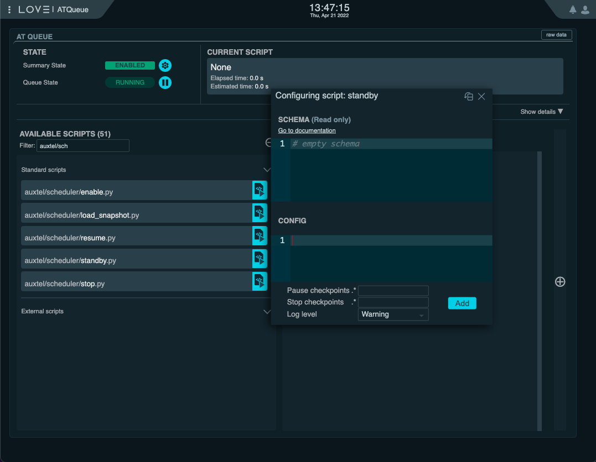
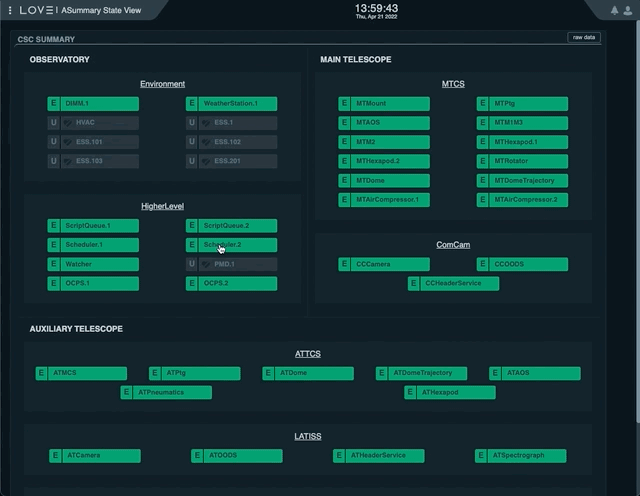
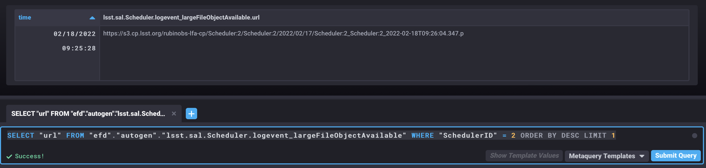

.. _advanced-scheduler-operations:

###############################
Additional Scheduler Operations
###############################

Here is a collection of operations that one should not expect to perform regularly but that are supported by the Scheduler.

.. _advanced-scheduler-operations-send-scheduler-to-standby:

Send Scheduler to STANDBY
=========================

This operation is normaly done at the end of each night.
It is exectly the same as done on any other CSC, though there is a helper script that can be used to rapidly send the CSC to STANDBY from the ScriptQueue.

In general, the quickest way is to execute the ``scheduler/standby.py`` script from the ScriptQueue.
This script does not require any additional configuration.

    Execute ``auxtel/scheduler/standby.py`` script

It is also possible to perform this action from the LOVE CSC detailed view.
In this case, the process is as follows:

#.  From the `ASummary State`_, select the Scheduler you want to interact with; ``Scheduler.1`` for Main Telescope Scheduler, ``Scheduler.2`` for Auxiliary Telescope Scheduler.

#.  If the CSC is in ENABLED state, select "disable" in the "Summary state command" dropdown menu.

#.  Click on "SET" button.

#.  With the CSC in DISABLED state, select "standby" in the "Summary state command" dropdown menu.

#.  Click on "SET" button.

.. _ASummary State: http://love01.cp.lsst.org/uif/view?id=51

    Sending the AT Scheduler to STANDBY from LOVE's Summary State view

.. _advanced-scheduler-operations-find-last-scheduler-snapshot:

Find Last Scheduler Snapshot
============================

.. note::

    This procedure was used early on during Scheduler operations to recover from FAULT states.
    It is left here as a reference in case users still want to find and take note of snapshots published by the Scheduler.

    It is no longer required to load the most recent snapshot when recovering from a FAULT state.
    Instead, make sure you are configuring the Scheduler using an appropriate hot-start configuration.

Finding the most recent _`snapshot` can be done from nublado with the following command:

.. code-block:: python

    large_file_object = await remote.evt_largeFileObjectAvailable.aget(timeout=5)

    print(large_file_object.url)

or from chronograf with the following query:

.. code-block:: text

    SELECT "url" FROM "efd"."autogen"."lsst.sal.Scheduler.logevent_largeFileObjectAvailable" WHERE "SchedulerID" = 2 ORDER BY DESC LIMIT 1

    Chronograf window showing the latest value of the attribute ``url`` of the ``largeFileObjectAvailable`` event from the AT Scheduler (``index=2``).

.. _advanced-scheduler-operations-load-snapshot:

Load Snapshot
=============

Loading a snapshot allows users to modify the *scheduling algorithm* configuration on-the-fly, without the need to change the state of the Scheduler.

.. note::

    With the implementation of warm-start and hot-start capabilities on the Scheduler it is no longer necessary to load a snapshot at the start of the night or when recovering from a FAULT state, respectively.

    Therefore, loading snapshots now should be reserved for those cases where users want to load a modified version of the *scheduling algorithm*, probably following some tweak to its properties.

The prodecure to load a snapshot is as follows:

#. Stop the scheduler using the ``auxtel/scheduler/stop.py`` script (see :ref:`scheduler-night-time-operation-troubleshooting-stopping-the-scheduler`).

#. Run the ``auxtel/scheduler/load_snapshot.py`` script:

    This script takes a single ``snapshot`` parameter, which can be the ``uri`` of a snapshot or the word "latest", which will automatically load the last snapshot published by the Scheduler. 

    The configuration will be something like:

    .. code-block:: text

        snapshot: https://s3.cp.lsst.org/rubinobs-lfa-cp/Scheduler:2/Scheduler:2/2022/04/07/Scheduler:2_Scheduler:2_2022-04-08T09:56:57.726.p

    .. figure:: ./_static/atqueue-run-load-snapshot.png
        :name: fig-atqueue-run-load-snapshot

        Loading snapshot using the ``auxtel/scheduler/load_snapshot.py`` script.

#. Resume the Scheduler using the ``auxtel/scheduler/resume.py`` script (see :ref:`scheduler-night-time-operation-starting-scheduler`).

In order to do that, we send the ``load`` command to the Scheduler, providing the ``url`` of the `snapshot`_ we determined above.

From nublado one could do:

.. code-block:: python

    await remote.cmd_load.set_start(uri=large_file_object.url, timeout=60.0)

The command above may take some time to execute, hence the large timeout.

.. note::

    The payload for the ``load`` command is ``uri`` and not ``url``.
    An ``uri`` or "universal resource identifier" is a more general representation of a resource location, which is supported by the Scheduler CSC.

Once the snapshot is loaded by the Scheduler CSC, we are ready to resume scheduler operation.
For that, simply follow the :ref:`scheduler-night-time-operation-starting-scheduler` procedure.
