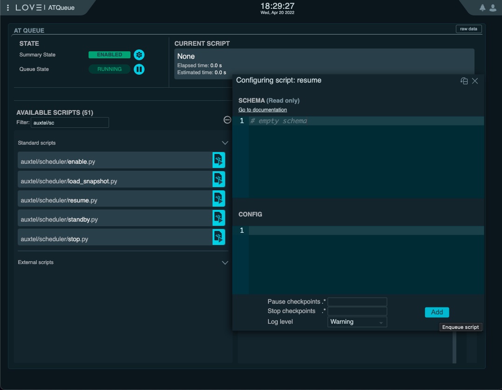

.. _scheduler-night-time-operation:

##############################
Scheduler Night-time Operation
##############################

.. _scheduler-night-time-operation-initial-optical-alignment:

Initial Optical Alignment
==========================

When the Scheduler is initialized at the beginning of the night, the first thing it will perform is an optical alignment.
In the case of the Auxiliary Telescope, this means running the curvature wavefront sensing script.
This is a special setup done on the *scheduling algorithm* side alonside the survey operation.

Nevertheless, because at the beginning of the night the optics may be far from the optimum position, it is recommended that a initial alignment is done before starting the Scheduler.

The best way to accomplish this is to execute the same SAL Script used by the Scheduler on the ScriptQueue.
For the AT, this is ``auxtel/latiss_cwfs_align.py``.
This SAL Script accepts as inputs an az/el position on the sky and the magnitude limit for a source finding algorithm.
It will then query Simbad to find a suitable target around the specified position with the specified magnitude limit and perform wavefront sensing.
An example configuration is as follows:

.. code-block:: text

    find_target:
      az: 100.0
      el: 60.0
      mag_limit: 8

.. _scheduler-night-time-operation-starting-scheduler:

Starting the Scheduler
======================

After the initial optical alignment is completed successfully, it is safe to start the Scheduler.
For that, we simply need to send the ``resume`` command to the CSC.
This command has no parameters and can be executed directly from the ScriptQueue, using the ``auxtel/scheduler/resume.py`` or the ``maintel/scheduler/resume.py`` script, for the Auxiliary and Main Telescopes, respectively.
Note that the script also does not have any parameter, so it is simply a matter of "adding" it to the queue.

    Resume the AT Scheduler from the ATQueue view on LOVE

or from nublado:

.. code-block:: python

    await remote.cmd_resume.set_start(timeout=5)

Once the Scheduler CSC starts, it will gather telemetry and compute a set of targets to send to the ScriptQueue.
At this point, it is important to keep and eye on the Scheduler logging output to follow up the different steps it takes during the process.

For the Auxiliary Telescope, the `AT Summary State`_ view provides a good overview of the system.
A screen shot of this view, taken whith most of the AT components in ``STANDBY`` state is shown :ref:`below <fig-at-summary-state-view>`.

It is also highly recommended to have the `ATQueue`_ view opened at all times.
The Scheduler will queue 2 observations ahead of time, so you should expect to have one observation executing and another 2 waiting to be executed.
As the scripts finishes executing, the Scheduler will continue to add targets to the queue.

.. _AT Summary State: http://love01.cp.lsst.org/uif/view?id=62
.. _ATQueue: http://love01.cp.lsst.org/uif/view?id=41

    AT Summary State view from LOVE at the summit.
    At the top the view contains the summary state of the most relevant components. 
    On the bottom right, the dome and telescope position are shown.
    The left-hand side shows the logging output from the Scheduler.

.. _scheduler-night-time-operation-troubleshooting:

Troubleshooting
===============

The following are a collection of documented occurrences and how to resolve them.

.. _scheduler-night-time-operation-troubleshooting-no-target:

No Target
---------

Multiple factors dictate not only which target the Scheduler will provide next but if *there is a suitable target for observing*.

One of the most common occurrences at the beginning of the night is that the Scheduler is initialized early enough that it has no suitable targets for observing.
In general, that happens because the most common Scheduler configurations only produces valid targets between nautical down and dusk (sun elevation below 12 degrees).
Nevertheless, this condition may also occurr during the night, if there are gaps in the scheduling configuration.
In general, users can be aware of these ahead of time by simulating the observing night.

Regardless of when this happen during the night, the user should expect the same response from the Scheduler.

By looking at the log messages commming out from the Scheduler, the user will see the following warning message:

.. code-block:: text

    Handling no targets on queue condition.
    This consist of queuing a stop tracking script and estimating the time until the next target.

As the message suggests, the Scheduler was unble to determine a suitable target for observing and is going to take actions to handle this condition.
The message also explains what the Scheduler is going to do now, which consists of:

* Sending the ``stop_tracking`` Script to the ScriptQueue.

  This makes sure the telescope will stop while the Scheduler continues to search for new targets.

* Estimate how long it takes for the next target to be available.

  * If it _`can not determine a target` in the next hour, the Scheduler will go to ``FAULT`` with error code 402.

    .. code-block:: text

            Unable to find target in the next 1 hours.

  * If a target is found in the next hour window, the Scheduler will log the following info message:

    .. code-block:: text

            Next target will be observable in {time-to-target}s...

    In the message from the Scheduler, the ``{time-to-target}`` above is replaced by how long it will take for the next target to be available, in seconds.

    At this point, the Scheduler is going to wait for half that time and try to obtain a target again.
    This operation will continue until the Scheduler is close enough such that it can queue the target in the ScriptQueue.

If for any reason you expect the Scheduler should be able to provide a target and it is not, there might be something wrong with the telemetry stream or the *scheduling algorithm* configuration.
To throubleshoot these conditions, see :ref:`troubleshooting-the-scheduling-algorithm`.

.. _scheduler-night-time-operation-troubleshooting-recovering-from-a-script-execution-failure:

Recovering From a Script Execution Failure
------------------------------------------

When a Script execution fails the ScriptQueue pauses, and the Scheduler will also pause.
The Scripts that were queued by the Scheduler will still be waiting to execute when the ScriptQueue resumes and the Scheduler will continue to monitor the state of the ScriptQueue and the Scripts.

There are several different levels of Script failures that we may encounter during the night, they all need different levels of attention from the users on the console.

In the most simple case, a Script may fail because of a transient condition that does not require any corrective measurement.

For instance, the ``latiss_cwfs_align`` Script, which performs curvature wavefront sensing to align the telescope optics, may fail because it could not find a suitable target for the wavefront estimation pipeline, or some other non-critical reason.
In these cases, users can recover by simply :ref:`resuming the ScriptQueue on LOVE <fig-atqueue-resume>`.

    ATQueue view on LOVE with the ScriptQueue paused, indicating the "resume" button.

In some cases, a Script might fail because one or more components involved in its execution went to ``FAULT``.
This happens, for instance, when the ATMCS goes to ``FAULT`` due to motor slippage, which also causes the ATPtg to go to ``FAULT``.
When recovering issues like this with the Scheduler running, it is import to recover the CSCs before resuming the ScriptQueue.

In this case, one would send all the CSCs that are in ``FAULT`` to ``ENABLED`` and then :ref:`resume the ScriptQueue on LOVE <fig-atqueue-resume>`.

.. important::

    Before resuming the ScriptQueue, make sure you corrected the condition that caused the Script to failure.

One thing to keep an eye on is when the Scheduler starts to experience a series of Script failures.
In some occasions it may happen that the parameters specified by the *scheduling algorithm* for the Scripts turn out to be invalid (like rotator out of range).
This can happen for multiple reasons, the most common being a mis-configuration of the *scheduling algorithm*.
Debuging and fixing these issues will require :ref:`troubleshooting-the-scheduling-algorithm`.

.. _scheduler-night-time-operation-troubleshooting-recovering-from-a-scheduler-fault:

Recovering From a Scheduler FAULT
---------------------------------

There are some known conditions that will cause the Scheduler CSC to go to ``FAULT``.
As mentioned in :ref:`initializing-the-scheduler-csc-the-scheduler-enabled-state`, one of the most common is when the Scheduler cannot determine the observatory state (error code 500), because one or more of the CSCs required to do so have stopped publishing telemetry.

Furthermore, as mentioned above, the Scheduler CSC will also transition to ``FAULT`` if it `can not determine a target`_ to observe in an one-hour window.
This is a common occurence at the end of the night, when the next suitable target will be at the beginning of the following night.

The Scheduler may also go to ``FAULT`` if there is an error generating the list of targets (error code 401).
In this case, you may need to :ref:`troubleshoot the scheduling algorithm <troubleshooting-the-scheduling-algorithm>` before resuming operation.

In principle, recovering the Scheduler from a ``FAULT`` is no different from any other CSC, albeit some additional steps should be taken beforehand.

* The first action to take when realizing the Scheduler is in ``FAULT``, is to pause the ScriptQueue.

    .. figure:: ./_static/atqueue-pause.png
        :name: fig-atqueue-pause

        ATQueue view on LOVE indicating the "pause" button.

* If there is a Script executing it is best to leave it running until completion.
* If there are Scripts in the queue waiting to be executed, :ref:`stop them using LOVE <fig-atqueue-stop-script>`.

    .. figure:: ./_static/atqueue-stop-script.png
        :name: fig-atqueue-stop-script

        A Script is shown in the queue, waiting to be executed, while the ScriptQueue is paused with the "Stop Script" button is highlighted.
        If the button is pressed, the Script will exit the queue without executing.

* Finally, :ref:`resume the ScriptQueue <fig-atqueue-resume>`.

.. _scheduler-night-time-operation-troubleshooting-recovering-from-a-scheduler-fault-enable-scheduler-csc:

Enable Scheduler CSC
^^^^^^^^^^^^^^^^^^^^

At this point the Scheduler CSC can be safely transitioned back to ``ENABLED`` state, using the ``auxtel/scheduler/enable.py`` or ``maintel/scheduler/enabled.py``, for the Auxiliary and Main Telescope Scheduler respectively (see :ref:`initializing-the-scheduler-csc-enabling-the-scheduler-csc`).

.. important::

    When recovering the Scheduler CSC from a ``FAULT`` state make sure you enable it using the hot-start equivalent version of the configuration that was last used.

When enabled with hot-start the scheduler preserves the internal state before it went to ``FAULT``, therefore it should be ready to :ref:`resume operations <fig-atqueue-run-cmd-scheduler-resume>`.

.. _scheduler-night-time-operation-troubleshooting-pausing-scheduler:

Pausing Scheduler
=================

In some conditions users may want to pause the Scheduler to execute some operations through nublado.

There are two ways of pausing the Scheduler execution; pausing the ScriptQueue or stopping the Scheduler.

.. _scheduler-night-time-operation-troubleshooting-pausing-the-scriptqueue:

Pausing the ScriptQueue
-----------------------

When the ScriptQueue is paused using the :ref:`pause button on LOVE <fig-atqueue-pause>` any currently executing Script will continue until completed.
Nevertheless, once that Script is done, any waiting Script will be left in the waiting list and won't start executing until the ScriptQueue :ref:`resumes <fig-atqueue-resume>`.

In this situation the Scheduler, which is monitoring the state of the queue, will pause while the ScriptQueue is paused, and will resume automatically when the ScriptQueue resumes.

If the planned interruption is short (less than 5 minutes or so), there is nothing that needs to be done to resume, besides :ref:`resuming the ScriptQueue <fig-atqueue-resume>`.

If the interruption is going to take longer than that, make sure you :ref:`stop <fig-atqueue-stop-script>` the Scripts launched by the Scheduler to the ScriptQueue (that are in the waiting queue), before resuming.

.. _scheduler-night-time-operation-troubleshooting-stopping-the-scheduler:

Stopping the Scheduler
----------------------
    
If you want to switch configurations, (which will required recycling the state of the CSC), load a new snapshot, or you are having issues with the *scheduling algorithm* (which may require some :ref:`troubleshooting <troubleshooting-the-scheduling-algorithm>`), you may want to stop the Scheduler CSC.

From the ScriptQueue, you can use the ``auxtel/scheduler/stop.py`` or ``maintel/scheduler/stop.py`` scripts for the Auxiliary and Main Telescope, respectively.
These scripts require no configuration to execute.

    Stopping the AT Scheduler using the ``auxtel/scheduler/stop.py`` script without any configuration.
    The Scheduler will leave currently queued scripts on the ScriptQueue and take them into account as they execute.

Nevertheless, you could provide the following:

.. code-block:: text

    stop: true

.. figure:: ./_static/atqueue-run-cmd-scheduler-stop.png
    :name: fig-atqueue-run-cmd-scheduler-stop

    Stopping the AT Scheduler using the ``auxtel/scheduler/stop.py`` script using the ``stop=true`` option.
    This will make the Scheduler cleanup all queued scripts from the ScriptQueue.

This would cause the Scheduler to clean up any remaining Script in the ScriptQueue.
If you rather interrupt the Scripts yourself simply run the script with no configuration.

It is possible to add the Script while the Scheduler is running and, once it appears in the ScriptQueue, you can move it up the queue by pressing the Move script up buttom, as shown below.

    ScriptQueue view highlighting the "move script up" buttom.

By default, the Scheduler will stop and leave any scheduled observations in the ScriptQueue.

.. important::

    After stopping the Scheduler, and before doing anything else with it, make sure you store the latest snapshot (preferrably in the night log), using the :ref:`advanced-scheduler-operations-find-last-scheduler-snapshot` procedure.
