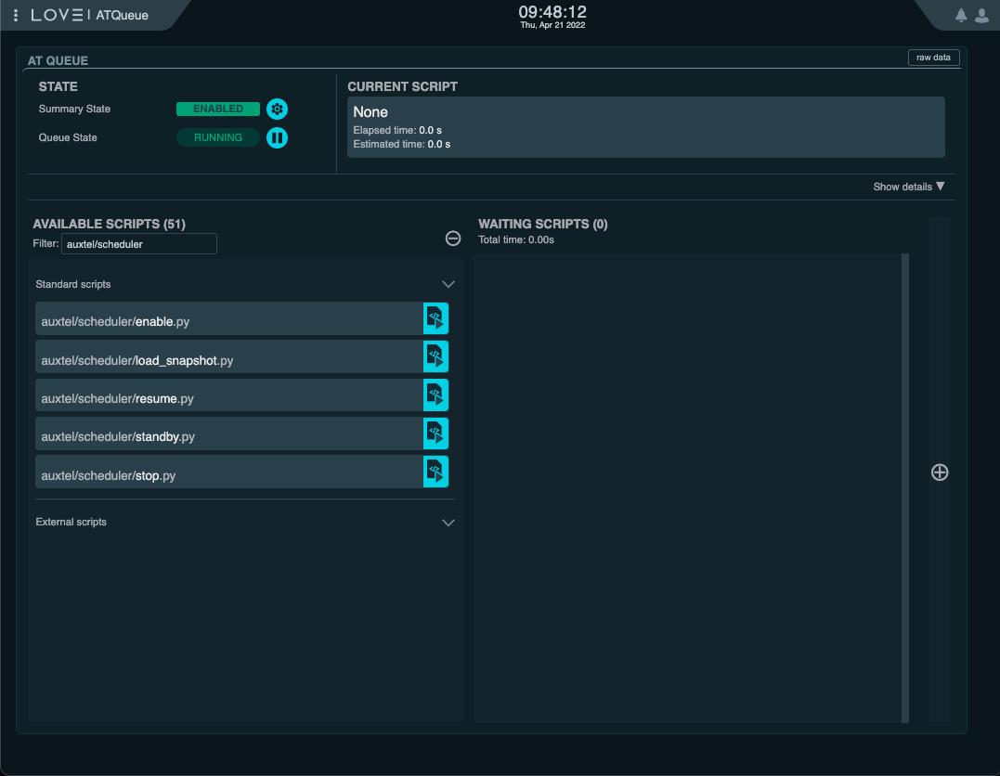

.. _scheduler-operational-scripts:

#############################
Scheduler Operational Scripts
#############################

The ScriptQueue has a set of scripts specifically designed to facilitate Scheduler operations.
Throughout the operatinoal procedures we will be constantly referring to these scripts.
Here we will give a quick overview of each one of those.

To begin with, you can find these scripts in the LOVE queue interface by typing "auxtel/scheduler" or "maintel/scheduler" in the "Filter" field.

    Auxiliary Telescope Scheduler operatinoal scripts

The available scripts are:

``scheduler/enable.py``
    Enable the Scheduler.
    The script accepts a single configuration parameter, ``config``, which must contain a valid configuration for the Scheduler CSC.

    If the CSC is not in STANDBY, the script will send it first to STANDBY before sending it to ENABLED, making sure the provided configuration is loaded in the process.

``scheduler/load_snapshot.py``
    Load a scheduler snapshot.

    This script takes a single parameter, ``snapshot``, which can either be the word "latest" or a snapshot uri.
    If "latest" is provided, the script will determine what was the last snapshot published by the Scheduler and load that one.

``scheduler/resume.py``
    Resume scheduler operations.
    This script does not require any configuration parameter.

``scheduler/standby.py``
    Send the Scheduler to STANDBY.

``scheduler/stop.py``
    Stop the scheduler.

    This script takes a single parameter, "stop", which, if set to "true", will cause the Scheduler to stop any script it previously sent to the ScriptQueue.
