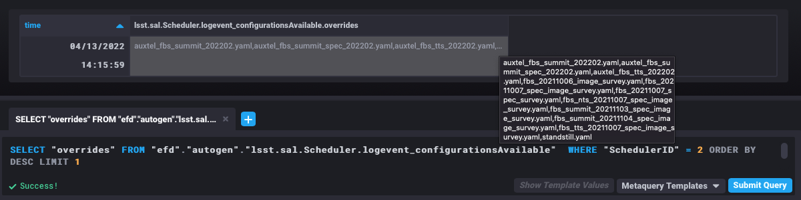
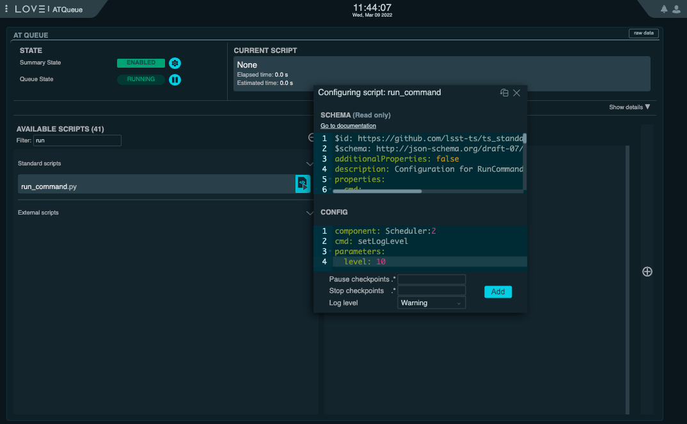
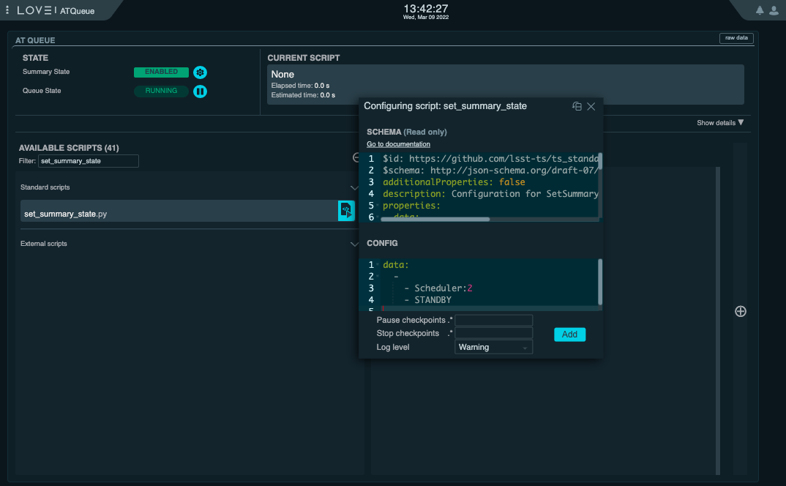
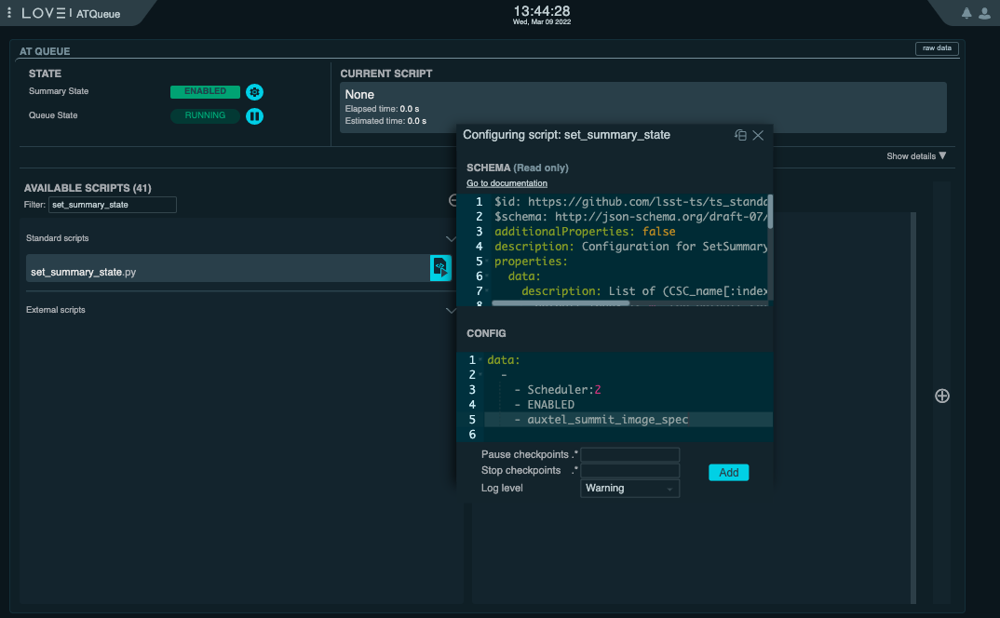
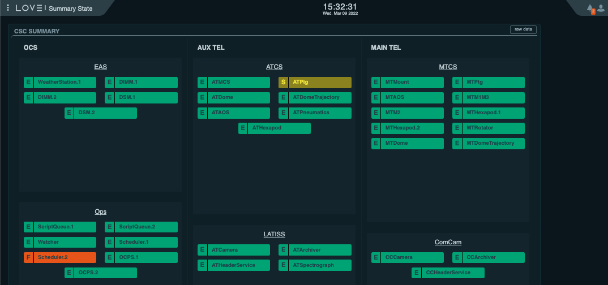
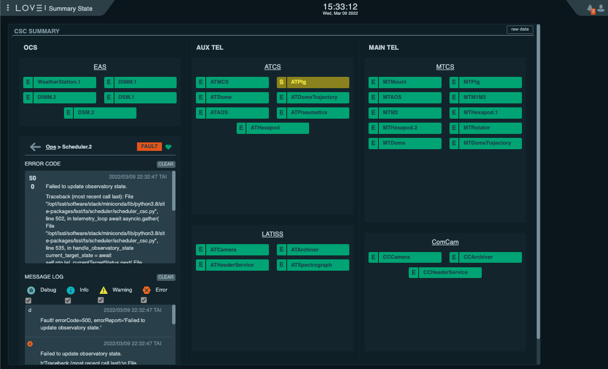

.. _initializing-the-scheduler-csc:

##############################
Initializing the Scheduler CSC
##############################

Most of the startup operations described here are done through LOVE, using the `ATQueue`_, the `ASummary State`_ and the `AT Summary State`_  views (links are only accessible internal network, e.g., LSS-WAP, VPN, etc).
We concetrate on the Auxiliary Telescope Scheduler for now because, at the time of this writting, it is the focus of operations.
Nevertheless, as pointed out in :ref:`scheduler-operational-procedures`, the processes are similar for both schedulers.

.. _ATQueue: http://amor01.cp.lsst.org/uif/view?id=41
.. _ASummary State: http://amor01.cp.lsst.org/uif/view?id=51
.. _AT Summary State: http://amor01.cp.lsst.org/uif/view?id=62

As with other CSCs, the Scheduler is configured when transitioning from ``STANDBY`` to ``DISABLED``.
In addition to configuring the *scheduling algorithm*, the CSC also configures a number of ancillary modules and operation modes.
For an overview of the full set of parameters see the `Scheduler CSC configuration documentation`_.

.. _Scheduler CSC configuration documentation: https://ts-scheduler.lsst.io/configuration/configuration.html

.. _initializing-the-scheduler-csc-determining-configuration:

Determining configuration
=========================

For now it suffices to say that, before enabling the CSC, the user must know in advance which configuration should be used for the night.
During commmissioning it is likely that we will have more than one suitable configurations for every single night, that prioritizes different surveys that can be selected dependending on the conditions.
These will, in general, be in the form of a configuration label.

The available labels (and associated configuration files) can be found in the Scheduler configuration directory of the `OCS configuration repository`_.
This information is also published by the CSC in the ``settingVersions`` event, which can be inspected via SAL from a notebook in nublado or in the EFD from chronograf.

.. _OCS configuration repository: https://github.com/lsst-ts/ts_config_ocs

From a notebook one would do something like:

.. code:: ipython3

    import logging

    from lsst.ts import salobj

.. code:: ipython3

    logging.basicConfig(level=logging.DEBUG)

.. code:: ipython3

    domain = salobj.Domain()

Below, note the use of ``index=2``, which means AT Scheduler.
For MT we would use ``index=1``.

.. code:: ipython3

    remote = salobj.Remote(domain, "Scheduler", index=2)

.. code:: ipython3

    await remote.start_task

.. code:: ipython3

    setting_versions = await remote.evt_settingVersions.aget(timeout=5)

.. code:: ipython3

    print(setting_versions.recommendedSettingsLabels)

From chronograf, the following query would also give you the :ref:`latest available labels <fig-chronograf-scheduler-labels>` (again, note we are explicitly specifying AT Scheduler by selecting ``"SchedulerID" = 2``):

.. code-block:: text

    SELECT "recommendedSettingsLabels" FROM "efd"."autogen"."lsst.sal.Scheduler.logevent_settingVersions"  WHERE "SchedulerID" = 2 ORDER BY DESC LIMIT 1

    Latest AT Scheduler setting versions labels from chronograf

.. _initializing-the-scheduler-csc-setting-csc-log-level:

Setting CSC Log Level
=====================

Before starting, it is recommended to set the Scheduler logging level to ``DEBUG``.
This can be done from the using the `ATQueue`_ LOVE interface by executing the SAL Script ``run_command.py`` with the following configuration:

.. code-block:: text

    component: Scheduler:2
    cmd: setLogLevel
    parameters:
        level: 10

    Setting log level of the AT Scheduler from the ATQueue view on LOVE

It is also possible to do this from nublado with:

.. code:: ipython3

    await remote.cmd_setLogLevel.set_start(level=logging.DEBUG, timeout=5)

.. _initializing-the-scheduler-csc-enabling-the-scheduler-csc:

Enabling the Scheduler CSC
==========================

Next we can transition the Scheduler CSC to ``ENABLED`` state.
If the CSC is already in ``ENABLED`` state, you may want to send it back to ``STANDBY`` to make sure it will be configured with the set of parameters we want.
From the `ATQueue`_, this can done using the ``set_summary_state.py`` SAL Script with the following configurations:

.. code-block:: text

    data: 
      -
        - Scheduler:2
        - STANDBY

    Setting log level of the AT Scheduler from the ATQueue view on LOVE

.. code-block:: text

    data: 
      -
        - Scheduler:2
        - ENABLED
        - auxtel_summit_image_spec

    Setting log level of the AT Scheduler from the ATQueue view on LOVE

From nublado, one would do:

.. code:: ipython3

    await salobj.set_summary_state(remote, salobj.State.STANDBY)

    await salobj.set_summary_state(remote, salobj.State.ENABLED, settingsToApply="auxtel_summit_image_spec")

As mentioned above, these will send the CSC to ``STANDBY`` first and then to ``ENABLED``, respectively, thus guaranteeing it is configured with the expected setting.

.. note::

    The configuration selected above is ``auxtel_summit_image_spec``.
    This will likely change depending on the campain in question, not to mention that it is definitely not suitable for MT.
    As mentioned before, **make sure you know ahead of time which configuration should be used** for the particular run. 

.. _initializing-the-scheduler-csc-final-remarks:

Final Remarks
=============

.. _initializing-the-scheduler-csc-the-scheduler-enabled-state:

The Scheduler ENABLED State
---------------------------

Once the CSC is in ``ENABLED`` state it will continuously monitor the observatory state, updating its internal model and publishing that information through ``observatoryState`` telemetry.

If, for any reason, the Scheduler can not determine the observatory state, the CSC transitions to ``FAULT`` with error code ``500``.
Below we show an example :ref:`Summary State view <fig-summary-state-atscheduler-in-fault-01>` where the AT Scheduler went to ``FAULT`` because the ``ATPtg`` is in ``STANDBY``.
The same view with the :ref:`expanded Scheduler components <fig-summary-state-atscheduler-in-fault-02>` is also shown, displaying the associated error message.

    Summary State view showing the Scheduler in ``FAULT`` with the ``ATPtg`` in ``STANDBY``

    Summary State view showing the Scheduler in ``FAULT`` with the ``ATPtg`` in ``STANDBY``.
    In this case the Scheduler component was expanded to show the error code and log information.

Initially the CSC will not do anything else, so it is safe to enable it at any time, so long as the componentes required to determine the observatory state are also enabled.
Those are the ``MTCS`` and ``ATCS`` componentes for the MT and AT Scheduler, respectively.

.. _initializing-the-scheduler-csc-the-scheduling-algorithm-initial-state:

The *scheduling algorithm* initial state
----------------------------------------

During the startup procedure, the CSC configures the *scheduling algorithm* with an empty initial state.
That means, the algorithm has no knowledge of previous observations taken with this or any other configuration.

The Scheduler CSC provides a couple different mechanism to rebuild the desired state of *scheduling algorithm*; "warm start" and "hot start".

When performing a warm start, the CSC will read a database with previous observations and will register these observations on the *scheduling algorithm*, essentially replaying the observations.
This will be, most likely, the mode userd at the beginning of the night during commmissioning and operations.
Unfortunately, at the time of this writting this mode is still not implemented.

In hot start, the Scheduler CSC replaces the currently *scheduling algorithm* by a snapshot provided by the users.
This snapshot can be either one previously generated by the Scheduler CSC or one that the user manually craft and customizes locally.
For now hot start is the only additional initialization mode available, besides the default initialization.

How to execute a hot start will be covered in more details in :ref:`scheduler-night-time-operation`.
