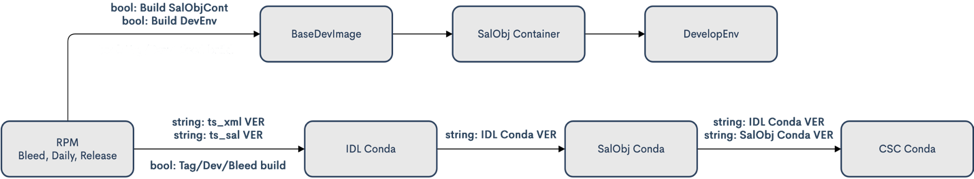

.. Review the README in this procedure's directory on instructions to contribute.
.. Static objects, such as figures, should be stored in the _static directory. Review the _static/README in this procedure's directory on instructions to contribute.
.. Do not remove the comments that describe each section. They are included to provide guidance to contributors.
.. Do not remove other content provided in the templates, such as a section. Instead, comment out the content and include comments to explain the situation. For example:
	- If a section within the template is not needed, comment out the section title and label reference. Include a comment explaining why this is not required.
    - If a file cannot include a title (surrounded by ampersands (#)), comment out the title from the template and include a comment explaining why this is implemented (in addition to applying the ``title`` directive).

.. Include one Primary Author and list of Contributors (comma separated) between the asterisks (*):
.. |author| replace:: *Rob Bovill*
.. If there are no contributors, write "none" between the asterisks. Do not remove the substitution.
.. |contributors| replace:: *List-of-contributors*

.. This is the label that can be used as for cross referencing this procedure.
.. Recommended format is "Directory Name"-"Title Name"  -- Spaces should be replaced by hyphens.
.. _Build-TSSW-Build-System:
.. Each section should includes a label for cross referencing to a given area.
.. Recommended format for all labels is "Title Name"-"Section Name" -- Spaces should be replaced by hyphens.
.. To reference a label that isn't associated with an reST object such as a title or figure, you must include the link an explicit title using the syntax :ref:`link text<label-name>`.
.. An error will alert you of identical labels during the build process.

#################
TSSW Build System
#################

.. _TSSW-Build-System-Introduction:

Introduction
=============

This document will detail the setup, configuration and usage of the Telescope & Site Software (TSSW) Build System.
The build system is used to take the source code for an application and “build” it into a deployable artifact.
The build process can be very simple or very complex; it takes source code and any additional dependencies, especially software libraries, and then runs processes to transform the code into a deployable artifact.  This might be an RPM, a Conda package, an executable file, or some other packaging protocol.
A key piece of the build process is to run through the unit tests, before creating the package that will be deployed into a test or production environment.
If the unit tests fail, or fall below some tolerance threshold, then the build should terminate and not produce a package.

The :ref:`first section<Build System>` of this document will describe the TSSW build environment; which services and applications are used; what packaging methods were selected; and how the builds are coordinated.
The :ref:`second section<Development and Release Build Processes>` will define the build process and go into detail on how the build system integrates into the TSSW build and release process.
The :ref:`third section<Jenkins Infrastructure and Configuration>` will describe in detail the setup and configuration of the TSSW build environment.
This section will contain enough detail to replicate the build environment, if necessary.

Glossary
========

.. glossary::

   AT
     Auxiliary Telescope

   AWS
     Amazon Web Services

   CI/CD
     Continuous Integration/Continuous Deployment

   CSC
     Commandable SAL Component

   DDS
     Data Distribution Service

   Job
     Deprecated Jenkins term for a Project.

   MT
     Main Telescope

   Node
     Jenkins term, “a machine which is part of the Jenkins environment and capable of executing `Pipelines <https://www.jenkins.io/doc/book/glossary/#pipeline>`_ or `Projects <https://www.jenkins.io/doc/book/glossary/#project>`_.
     Both the `Controller <https://www.jenkins.io/doc/book/glossary/#controller>`_ and `Agents <https://www.jenkins.io/doc/book/glossary/#agent>`_ are considered to be Nodes.”
     See `Jenkins Glossary <https://www.jenkins.io/doc/book/glossary/>`_.

   Project
     Jenkins term, “a user-configured description of work which Jenkins should perform, such as building a piece of software, etc.”  
     See `Jenkins Glossary <https://www.jenkins.io/doc/book/glossary/>`_.

   SAL
     Service Abstraction Layer

   T&S
     Telescope and Site

   TSSW
     Telescope and Site Software

   XML
     eXtensible Markup Language

.. _Build System:

Build System
============

Infrastructure
--------------

The Rubin Observatory software control system is broken down into separate applications called Commandable SAL Components (CSCs).
Examples are the MT/ATDome, MTMount, Guider and WeatherStation.
Some control hardware, some do not, some are active, sending commands to other CSCs and some are passive, only transmitting data.
This is a simplified explanation but provides some context for the complexity involved in the software that operates the telescope.
These CSCs communicate over a Data Distribution Service (DDS) that sends messages asynchronously.
To accomplish this, each CSC defines all the messages it sends and the payload each message contains.
Then the TSSW middleware application, called the Service Abstraction Layer (SAL) takes those definitions and creates DDS libraries that will be imported into the CSC applications during the build process.

The TSSW build process starts with the source code repositories, which are stored in the cloud-based `GitHub <https://github.com/>`_ service.
GitHub allows code to be stored in both public and private repositories, and since Rubin Observatory does make use of proprietary code, some from external vendors, private repositories are necessary to ensure accessibility only to RubinObs staff and applications.
The XML definitions files are stored in a repository, as is the SAL Middleware code, the source code for all the CSCs and additional libraries needed by multiple entities.

The build process is executed in the `TSSW Jenkins <https://tssw-ci.lsst.org/>`_ environment.
`Jenkins <https://www.jenkins.io/>`_ is a software build, deployment and automation service that provides Continuous Integration and Continuous Deployment (CI/CD) services.
This process involves downloading, or checking out, these repositories, running through a scripted set of steps to import and install any software dependencies, transform all the code into the application and produce a packaged artifact.
The last step in the build process is to upload the build artifacts to a build-products repository.
Similar to GitHub, which is a code repository service, RubinObs uses an in-house hosted `Nexus <https://www.sonatype.com/products/repository-oss>`_ repository to store the various build artifacts.
It is from the `RubinObs Nexus <https://repo-nexus.lsst.org/nexus/>`_ service that the deployment system pulls the deployable artifacts.

Build Artifacts
---------------

There are four major build artifacts produced from TSSW code; RPMs, Conda packages and Docker images, plus the Java JARs produced for the Camera Team.
The XML interface definition files are built into IDL, C++, Python, Java and LabVIEW libraries that are stored as `RPMs <https://www.redhat.com/sysadmin/how-manage-packages>`_ in a yum repository on the Nexus server.
Additionally, RubinObs has chosen the `Vortex OpenSplice <https://www.adlinktech.com/en/vortex-opensplice-data-distribution-service>`_ implementation of DDS, and a customized version is built into an RPM and stored in a private yum repository on the Nexus server.

The CSCs and various support libraries are built into `Conda <https://docs.conda.io/en/latest/>`_ packages.
These packages are currently stored in the `Anaconda Cloud <https://anaconda.org/>`_ service.
There are plans to migrate to a Conda package repository hosted on the `RubinObs Nexus <https://repo-nexus.lsst.org/nexus/>`_ server.

Lastly, the Conda packages will be installed into Docker images.
It is these images that will be deployed to the production and test stand environments.
The Docker images are stored in a Docker registry on the `RubinObs Nexus <https://repo-nexus.lsst.org/nexus/>`_ server.

Service Account
---------------

Since the TSSW build process involves several services, GitHub, Jenkins, Anaconda and Nexus, each requiring authentication, it is best practice to setup Service Accounts.
A Service Account is a common account across services configured with the necessary permissions to accomplish all the tasks.
This is necessary to avoid using personal accounts for authentication; if the personal account becomes unavailable for any reason, there is a great risk of breaking the build process.
TSSW created an account in the Rubin Observatory authentication system and configured it such that emails sent to that account are forwarded to the Build Engineer, TSSW Manager and the IT Manager.
This account was then used to create a GitHub account and add it the TSSW GitHub organization.
It has the necessary permissions to access all the repositories, but NOT with full admin privileges.
Similarly, the Nexus server and Anaconda Cloud services each have service accounts used to access the build-products repositories.
These credentials are stored in Jenkins and used by the jobs to access the source (GitHub) and destination (Nexus, Anaconda) repositories.
Details regarding these accounts are omitted from this document for security reasons.
For more information on these accounts, please contact the TSSW Build Engineer, Software Architect or Software Manager.

Jenkinsfiles
------------

TSSW makes extensive use of Jenkins for building and testing almost all of the software applications.
There are a few vendor-supplied applications that are not currently in the automated build system.
The build jobs are primarily executed using `Jenkinsfiles <https://www.jenkins.io/doc/book/pipeline/jenkinsfile/>`_.
In addition to scripting the build process, Jenkinsfiles are source-controlled by storing them in the same repository as the application it is building and testing.
TSSW has opted to write Jenkinsfiles using the `Declarative Syntax <https://www.jenkins.io/doc/book/pipeline/syntax/>`_.
Additionally, there is a GitHub Organization job in Jenkins that automatically detects a repository (new or existing) that has a Jenkinsfile, creates a job and begins building it.
Other jobs are created by using an extension on a Jenkinsfile; TSSW does this for Conda-packaged CSCs, using a Jenkinsfile.conda file.
In fact, these builds all use a common `Jenkins Shared Library <https://www.jenkins.io/doc/book/pipeline/shared-libraries/>`_ to ensure consistency across the Conda jobs.

.. _Development and Release Build Processes:

Development and Release Build Processes
=======================================

There are two types of builds that the Jenkins environment executes.
The first, and most common, is the development build.
These builds can take many forms and have many sub-types, but basically, they build from active development sources (e.g. branches).
As TSSW follows the `GitFlow Workflow <https://tssw-developer.lsst.io/>`_ development process, each code repository has a master and a develop branch.
Work branches are created from the develop branch and when complete are merged back into develop.
The work branches and develop branch are the sources for development builds.
Jobs that run from the develop branch or the work branches are designed to regularly build the software application and run the unit tests, in order to catch issues during the development process, before they make it to a release or a production environment.
Development builds, if successful, do create artifacts and upload them to the appropriate build-products repository.
This is useful as the development artifacts can be deployed to a test environment in order to run more complex tests.
RPM builds of this type go to a yum development repository on Nexus.
Conda packages go the Anaconda Cloud repository and have the dev label.
Currently, there are no development Docker images; they are used as release artifacts only.

The second is the Release build.
These builds occur exclusively from the master branch and occur only when the application is ready to release a new version.
The criteria for initiating a release build are defined in the `TSSW Developers Guide <https://tssw-developer.lsst.io/>`_.
The master branch is stable at all times, meaning the application can be successfully built from the code on the master branch.

The only significant difference between the Release and Development build processes is the storage location for the build products.
In the case of the RPM builds, those artifacts go to a release repository.
Conda packages are stored in the same location, but have the main label.
Docker images are stored in the Docker repository on the Nexus server, with the *c####* label; see the `Cycle Build <https://ts-cycle-build.lsst.io/>`_ document.

Build Workflows
---------------

In order to leverage the power of the Jenkins CI/CD service, the build process is executed in automated pipelines and workflows.
`Pipeline <https://www.jenkins.io/doc/book/pipeline/>`_ is the Jenkins term for a multi-stage build project and the majority of TSSW jobs are defined as such.
TSSW goes a step further and connects multiple pipeline jobs into a larger workflow.
There are two major build workflows executed by the build system, one that produces the Development Environment image and one that produces all the Conda packages.
These build workflows are coordinated by configuring several standalone jobs to trigger the next job in the workflow.
Each job in the workflow has a configuration option that allows the build to skip triggering the next job, so it may be executed standalone.
This is more complex than a pipeline that would execute the entire workflow as part of a single job and Jenkinsfile, but offers greater flexibility.
Figure 1 is a diagram of the two workflows.

    Figure 1: Diagram of the Build Workflows.

Each workflow starts with a job that takes the XML files and uses the SAL to build the DDS messaging libraries and creates the RPM packages.
The `Jenkinsfile <https://github.com/lsst-ts/robotframework_salgenerator/blob/develop/Jenkinsfile.salxml>`_ for this job is stored in `robotframework_salgenerator <https://github.com/lsst-ts/robotframework_salgenerator>`_ repository.
`RobotFramework <https://robotframework.org/>`_ is a test and robotic processes automation framework.
This tool is used by TSSW for software testing, however the scripts now play double-duty by also being the build scripts for the SAL library generation jobs.
It is from here that the two workflows diverge.

The Develop Environment workflow is shown in the top track of Fig. 1.
The arrow labels show the variables that are passed to the next job.
Three Boolean variables are passed to the "BaseDevImage" job.
The variables *BuildSalobjContainer* and *BuildDevEnv* instruct the jobs to execute the next build in the workflow; they allow the individual jobs to be executed standalone and not trigger downstream jobs.
The workflow continues from the XML/SAL job to the “BaseDevImage” job.
This creates the *lsstts/base-sqre* image and contains the Data Management scientific pipelines and the minimal set of dependencies needed to run SAL and SalObj.
The next step is the “SalObj Container” job, that packages SalObj and all the configuration repositories into the *lsstts/salobj* Docker image.
Lastly, the “DevelopEnv” job creates the *lsstts/develop-env* image that anyone can use for CSC development, as it contains all the SAL, IDL, and SalObj libraries and other required dependencies.
This gives developers a common environment from which to develop, build and test a CSC.
All of these images are stored in the `lsstts organization <https://hub.docker.com/orgs/lsstts>`_ on DockerHub.
For more details, please see the documentation in the `ts_cycle_build <https://github.com/lsst-ts/ts_cycle_build>`_ repository.

The Conda packaging workflow is shown as the bottom track in Fig. 1.
The string variables define the versions of the just-built packages that the downstream jobs should use during the builds.
The checkbox variables define the type of build being executed; Release (Tag), Daily (Dev) or Bleed.
The workflow continues to the “IDL_Conda_package” job, which creates the Conda metapackage containing all the IDL libraries.
From there, the next step in the workflow is the “SalObj_Conda_package” job, which creates the Conda package for the SalObj library.
Last is the CSC Conda jobs.
This step is broken down into the “CSC_Conda_Broker” job (not pictured) and the individual CSC Conda jobs, of which there are currently 32.
The Broker is an intermediate job that is solely responsible for triggering all the individual CSC Conda jobs, which build the CSC Conda packages, run the unit tests and upload the artifacts to the Anaconda Cloud repository.

.. note::
    The CSC Broker job was created because it prevents the SalObj Conda job from becoming unwieldy if it had to execute all the CSC Conda jobs.
    It would also require a SalObj release to make any change to what jobs are triggered.

Build Execution
---------------

TSSW contains four core packages; XML, SAL, IDL and SalObj and are treated as fully releasable products.
Each CSC is also a releasable application.
This creates a highly coupled environment requiring strict version management.
As such, each of the build workflows is executed in three different configurations; Release, Daily and Bleed.
As already stated, Release builds are executed solely from the master branches of any and all applications and dependencies.
While the individual builds are automated, each build is executed manually and does not trigger downstream jobs, as they most likely need to be updated to accommodate the changes in the upstream applications.
Daily workflow builds, called that because they are run daily, start with the latest released version of the core packages, except XML, which uses the develop branch.
Bleed builds, called that because they use the develop branches of all core packages, aka the bleeding edge, also run daily, at a minimum, but can be used more frequently depending on the pace of development.
These builds are fully automated, triggering the next job in the workflow.

The Daily and Bleed workflows are designed to test the changes in the system to ensure consistent functionality.
Neither are expected to be stable, in fact, they are designed to fail regularly, so as to catch issues as early in the development process as possible.
The jobs that build the core packages run unit tests to ensure they contain the necessary functionality for the whole of the TSSW system.
The CSC Conda packaging jobs run through a series of unit tests that will fail if required communication interfaces with other CSCs are broken.

The artifacts from Daily and Bleed workflows can be installed to test environments to perform functional and integration testing, but should never be used in a production environment.
Additionally, the release process should not begin until the Daily build workflow is completing successfully.

.. _Jenkins Infrastructure and Configuration:

Jenkins Infrastructure and Configuration
========================================

The TSSW Jenkins environment runs entirely on `Amazon Web Services <https://docs.aws.amazon.com/ec2/index.html>`_ (AWS) hosts.
:ref:`Appendix 1<Appendix 1>` contains the AWS setup for the instances currently operating in the TSSW Jenkins environment.
The master node is responsible for assigning jobs to the build nodes and hosts the web UI.
The build nodes do all the work of running the jobs and reporting status to the master node.
As such, the master node is a minimalist machine, with only 2 CPUs and 4GB of memory.
The build nodes range in processing power, memory and even software architecture, in order to handle a variety of job demands.
AWS offers many images, called instances, from which to choose; :ref:`Appendix 1<Appendix 1>` lists the specifics for the TSSW Jenkins environment.
The use of AWS to host the Jenkins environment allows for quick setup of additional, or replacement, nodes if/when the need arises.
Simply spin up a new instance, install Jenkins to it and start the service.
The master node will find the new build node automatically and begin assigning jobs to it.

Host configuration
------------------

Each AWS instance uses a CentOS 7 Operating System (OS).
Only Jenkins, Java and git are installed onto all the machines.
The nginx application is installed to the master node in order to host the GUI.
Docker is installed to all the build nodes (but not the master node), as all jobs run in Docker containers or use simple OS capabilities.
Limiting the installed software keeps the host machines lightweight and simple, which minimizes maintenance and reduces security risks.

The choice of instance is determined by the desired workload for the node.
:ref:`Appendix 1<Appendix 1>` shows the configurations for each node and the Instance Types chosen for the current TSSW setup.
The number of CPUs and amount of memory are locked by the instance type, but the disk size is configurable, even after the node is created.
AWS instances currently use dynamic IPs and therefore shutdowns will set a new IP for the node and the swarm configuration will need to be updated, as a result.
This is not the case for node restarts, for example, after updating the OS.

Every node will be configured with a \`jenkins\` user and group and a \`docker\` group.
The TSSW policy is the users inside the Docker containers that run on the nodes should have the exact same UID as the \`jenkins\` user.
This allows the jobs to write to the filesystem on the host machine without experiencing permissions issues.
Since each job will run a cleanup routine, to prevent filling the disk on the host machine, the container users will need write access in order to cleanup build files.

.. note::
    Helpful Tip: DO NOT run automated operations as the \`root\` user.
    This is bad.

Additionally, every node will have user accounts for the IT staff, Build Engineer and other members of the build team, with appropriate personnel assigned admin privileges.
These users are responsible for OS and software maintenance on the nodes.

The Jenkins and Docker services on all machines are configured as `systemd services <https://access.redhat.com/documentation/en-us/red_hat_enterprise_linux/7/html/system_administrators_guide/chap-managing_services_with_systemd>`_.
Jenkins is run as the \`jenkins\` user, Docker is run as the \`root\` user.
Running these as system services is important for two key reasons.
First, the services on each build node will not terminate if they lose communication with the master and will continue to process any assigned jobs.
Second, it allows for more efficient maintenance periods that may require a host restart (for example, Linux kernel updates), as the services will automatically restart when the machine starts up.

Host maintenance
----------------

The TSSW Build Engineer is responsible for maintaining the Jenkins environment.
This entails periodically (once a month, at least) logging into each node and applying OS updates.
Having configured Jenkins as a service, the machines or the Jenkins service itself, can be restarted, if necessary, with no noticeable downtime.
Simply wait for the node to be idle before restarting.
If the master node needs restarting, it is best to wait for the entire Jenkins environment to be idle.

.. note::
    Helpful Tip: Prior to any Jenkins downtime, the Build Engineer will make an announcement to all affected parties and stakeholders.

More significant is the update process for Jenkins itself.
Jenkins relies heavily on plugins to expand capabilities.
Jenkins and these plugins are updated regularly, but it is NOT necessary to apply those updates immediately.
About once a quarter, at most, the TSSW Build Engineer will schedule a Jenkins downtime to apply these sorts of updates.
This is to reduce overall downtime and reduce system outages due to broken or incompatible updates.
Best practice is for the Build Engineer to use a local replica of the TSSW Jenkins environment to install the system updates and test compatibility before scheduling the downtime in the active environment.

Jenkins configuration
---------------------

The Jenkins services all connect using the Swarm plugin.
Once the host machines are setup and the Jenkins service is running, the Swarm plugin must be installed and configured.
For the master node, create a file in the \`jenkins\` user home directory (/home/jenkins) called \`Jenkins.sh\`.
A template for the contents is located in :ref:`Appendix 2<Appendix 2>`.
Next, setup the master as a systemd service; a template for the contents is located in :ref:`Appendix 3<Appendix 3>`.
For the build nodes, following a similar procedure as for the master node, create a file named \`launch_swarm.sh\` in /home/jenkins; see :ref:`Appendix 4<Appendix 4>` for a template.
Finally, setup the build nodes as a systemd service using the template in :ref:`Appendix 5<Appendix 5>`.

.. note::
    Helpful Tip: Jenkins will be configured the same on each build node.
    As such, simply clone an existing host when creating a new a build node.
 
Appendices
==========

.. _Appendix 1:

Appendix 1: AWS Host descriptions
---------------------------------

.. list-table:: AWS Host descriptions
   :widths: 25 25 25 25 25 25 25 
   :header-rows: 1

   * - AWS Name
     - jenkins-master
     - node1-little
     - node2-big
     - node3-little
     - CSC_Conda_Node
     - Arm64_2CPU
   * - **Instance type**
     - t2.medium
     - t3.xlarge
     - t3.2xlarge
     - t3.xlarge
     - t3.2xlarge
     - t4g.large
   * - **Node Name**
     - Master
     - Node1_4CPU
     - Node2_8CPU
     - Node3_4CPU
     - CSC_Conda_Node
     - Arm64_Node_2CPU
   * - **CPUs**
     - 2
     - 4
     - 8
     - 4
     - 8
     - 2
   * - **Memory**
     - 4Gb
     - 16Gb
     - 32Gb
     - 16Gb
     - 32Gb
     - 8GB
   * - **Disk Size**
     - 200Gb
     - 200Gb
     - 200Gb
     - 200Gb
     - 200Gb
     - 200Gb
   * - **Installed software**
     - Jenkins, Java, Git, nginx
     - Jenkins, Java, Git, Docker
     - Jenkins, Java, Git, Docker
     - Jenkins, Java, Git, Docker
     - Jenkins, Java, Git, Docker
     - Jenkins, Java, Git, Docker
   * - **User Accounts**
     - jenkins, docker, <IT_staff>, <build_team>
     - jenkins, docker, <IT_staff>, <build_team>
     - jenkins, docker, <IT_staff>, <build_team>
     - jenkins, docker, <IT_staff>, <build_team>
     - jenkins, docker, <IT_staff>, <build_team>
     - jenkins, docker, <IT_staff>, <build_team>

.. _Appendix 2:

Appendix 2: Jenkins.sh
----------------------

.. code-block:: RST

 #!/bin/sh
 SERVICE_NAME=jenkins
 PATH_TO_JAR=/home/jenkins/JENKINS/jenkins.war
 PID_PATH_NAME=/tmp/jenkins-pid
 case $1 in
 start)
      echo "Starting $SERVICE_NAME ..."
    if [ ! -f $PID_PATH_NAME ]; then
       nohup java -jar $PATH_TO_JAR --sessionTimeout=720 --sessionEviction=43200 /tmp 2>> /dev/null >>/dev/null &
                   echo $! > $PID_PATH_NAME
       echo "$SERVICE_NAME started ..."         
    else
       echo "$SERVICE_NAME is already running ..."
    fi
 ;;
 stop)
    if [ -f $PID_PATH_NAME ]; then
         PID=$(cat $PID_PATH_NAME);
         echo "$SERVICE_NAME stoping ..." 
         kill $PID;
         echo "$SERVICE_NAME stopped ..." 
         rm $PID_PATH_NAME
    else
         echo "$SERVICE_NAME is not running ..."   
    fi
 ;;
 restart)
    if [ -f $PID_PATH_NAME ]; then
      PID=$(cat $PID_PATH_NAME);
      echo "$SERVICE_NAME stopping ...";
      kill $PID;
      echo "$SERVICE_NAME stopped ...";
      rm $PID_PATH_NAME
      echo "$SERVICE_NAME starting ..."  
      nohup java -jar $PATH_TO_JAR /tmp 2>> /dev/null >> /dev/null &
      echo $! > $PID_PATH_NAME
      echo "$SERVICE_NAME started ..."    
    else
      echo "$SERVICE_NAME is not running ..."    
    fi
 ;;
 esac

.. _Appendix 3:

Appendix 3: jenkins.service
---------------------------

.. code-block:: RST

 [Unit]
 Description=Jenkins Service
 
 [Service]
 Type=forking
 User=jenkins
 Group=jenkins
 ExecStart=/home/jenkins/Jenkins.sh start
 ExecReload=/home/jenkins/Jenkins.sh restart
 ExecStop=/home/jenkins/Jenkins.sh stop
 
 [Install]
 WantedBy=multi-user.target

.. _Appendix 4:

Appendix 4: launch_swarm.sh
---------------------------

.. code-block:: RST

 #!/bin/bash
 echo $SWARM_HOME
 CLASSPATCH=${SWARM_HOME}/slf4j-nop.jar
 echo ${CLASSPATCH}
 java -classpath ${CLASSPATCH} -jar ${SWARM_HOME}/swarm-client-3.9.jar \
    -master <master node URL> \
    -deleteExistingClients \
    -name "<name>" \
    -description "<description>" \
    -executors <#> \
    -labels "Linux CentOS <label>" \
    -mode '<normal|exclusive>' \
    -retry 3 \
    --showHostName \
    -tunnel <master_node_ip:port> \
    -disableClientsUniqueId

.. _Appendix 5:

Appendix 5: jenkins-agent.service
---------------------------------

.. code-block:: RST

 [Unit]
 Description=Jenkins swarm agent
 After=syslog.target network.target
 
 [Service]
 Type=simple
 WorkingDirectory=/home/jenkins
 User=jenkins
 Group=jenkins
 Environment=SWARM_HOME=/home/jenkins/SWARM
 ExecStart=/home/jenkins/launch_swarm.sh
 TimeoutStartSec=10
 Restart=always
 RestartSec=10
 
 [Install]
 WantedBy=multi-user.target

