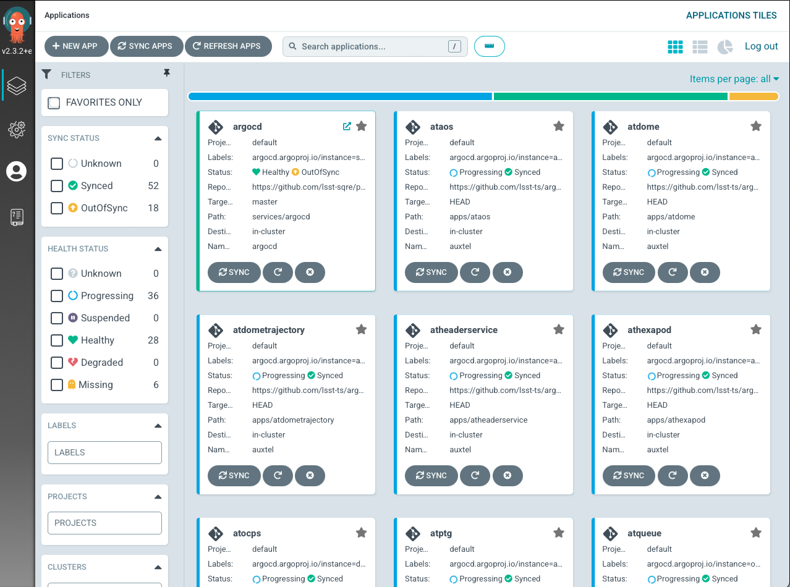
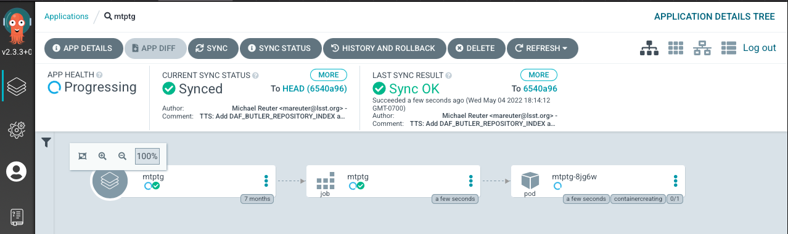

.. |author| replace:: *Tiago Ribeiro*
.. |contributors| replace:: *Michael Reuter, Patrick Ingraham*

.. _troubleshooting-component-offline:

#################
Component Offline
#################

.. warning::

    This procedure contains steps that may affect the system in crical ways.

    If you are unsure about any of the steps described here, contact support personnel.

* Most (but not all) components in the Rubin Observatory Control System, when sent to OFFLINE will terminate its execution process and will no longer be available in the system.

* This condition only happens if someone sends the ``exitControl`` command to the CSC.

  Sending the ``exitControl`` command to a CSC is regularly done when one wants to update a version of the CSC or needs to restart the process to recover from some fault conditions.

* A reduced number of CSCs will continue to run after receiving ``exitControl``.

  At the time of this writting, only the camera systems have this behavior.

Restoring a CSC that exited after responding to ``exitControl`` requires one to restart the process that runs it.

This condition manifests by the CSC appearing in OFFLINE state with no heartbeats, and can be seen in the figure :ref:`below <fig-love-mtptg-offline>`.

.. note::

    A CSC may stop sending heartbeats for a number of different reasons while still executing (not in OFFLINE).

    These cases are different from the one described here and may require different approaches.

    If in doubt contact support personnel.

    LOVE Summary State view showing the MTPtg in OFFLINE state with no heartbeats, indicating the CSC is no longer running.

For more details about what is behind this behavior see the `observatory control`_ documentation page.

.. _observatory control: https://obs-controls.lsst.io

Most components on Rubin system runs as containers on a Kubernetes cluster.
Therefore, most-likely, when restoring a component after it was sent to OFFLINE state, requires restarting the process on the Kubernetes cluster.

This can be done via the argo-cd application and works similarly regardless of the environment; Summit, TTS or BTS.

The first step in the process is finding the argo-cd application link for the environment you are working on.
For that see :ref:`Observing-Interface-Operational-Environments`.

The credentials are in the 1Password ArgoCD Admin vault.
If you do not have access to the vault and feel like you should, contact |author| or |contributors|.

Once in :ref:`argo-cd <fig-argo-cd>` you will see a page showing several boxes with a component name on top and some service information at the bottom.

Use the search bar to find the component you want to restore.
The services usually have the same as the component, whith some small variations.
Once you find the one you are looking for click on the box to see details about the deployment.

If you do not see the component you are looking for, it might be that it is not deployed in the Kubernetes container.
Examples of components that are not deployed in argo-cd are:

* Camera systems; ATCamera, CCCamera, LSSTCamera.
* OODS.
* M1M3 hardware mode.
* ATMCS
* ATPneumatics

Components not in argo-cd will have custom startup procedures that should be described elsewere.

For this example, let us take a look at the MTPtg component.
The :ref:`detailed page <fig-argo-cd-mtptg>` for this component can be seen below.

From left-hand to right-hand the rectangles shown in the detailed view above are:

* Application
* Job
* Pod

Note in the :ref:`mtptg view <fig-argo-cd-mtptg>` that the pod status says "running".
In this situation the CSC is most likely **NOT** in OFFLINE state, but should still be running.

If the CSC happens to be OFFLINE the pod status would show "completed", like in the :ref:`following figure <fig-argo-cd-mtptg-offline>`.

To restart the CSC we need to restart the "job".
For that we will;

#.  Delete the **Job**.

    #.  Click on the three horizontal dots in the **Job** rectangle.

    #.  Select "Delete".

        .. figure:: ./_static/argo-cd-delete-app.png
            :name: fig-argo-cd-mtptg-delete-app

    #.  Verify you want to delete by typing the name of the Application in the dialog box.

        .. figure:: ./_static/argo-cd-delete-app-verify.png
            :name: fig-argo-cd-mtptg-delete-app-verify

    .. warning::

        Under no circumstances you should delete the Application!

    Deleting the pod **when it is completed** has no effect for the purpose of this procedure. 

#.  Synchronize the Application.

    #.  Select "Sync" in the top menu.

        .. figure:: ./_static/argo-cd-deleted.png
            :name: fig-argo-cd-mtptg-deleted

    #.  Click in "Synchronize" in the pop-up tab.

        .. figure:: ./_static/argo-cd-synchronize.png
            :name: fig-argo-cd-mtptg-synchronize

After you synchronize, a new pod will start.
It may be in an intermediate :ref:`container creating <fig-argo-cd-mtptg-creating>` state, which can take some time depending on the application.

But, after some time you should see the component appearing in STANDBY state and publishing heartbeats.

    LOVE Summary State view showing the MTPtg in STANDBY state after being restarted.
